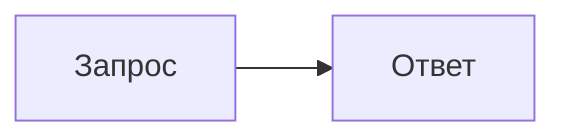

# Вопросы для .NET Middle разработчика — учебник

Статический учебный сайт для подготовки к собеседованию на позицию .NET Middle: **141 вопрос в 11 разделах**, у каждого вопроса — отдельная страница с подробным разбором, диаграммами, примерами кода на C#, типичными ошибками и вопросами «на засыпку».

Откройте `index.html` в браузере — сайт работает без сервера (в том числе с `file://`) и без внешних зависимостей.

## Возможности

- **Отдельная страница на каждый вопрос** со структурой: «Коротко» (ответ на 30 секунд) → подробный разбор → подводные камни → вопросы на засыпку → итог.
- **Диаграммы Mermaid**, заранее отрисованные в SVG (светлая и тёмная темы), — страницы не грузят Mermaid в браузере.
- **Поиск** по всем вопросам и тегам (клавиша `/`).
- **Прогресс изучения**: отметки «изучено» по вопросам и разделам (хранятся в `localStorage` браузера).
- **Тренажёр-карточки** (`trainer.html`): случайный вопрос → вспомнить ответ → проверить себя.
- Светлая и тёмная темы, оглавление страницы, навигация «предыдущий / следующий», адаптивная вёрстка для телефона.

## Разделы

| № | Раздел | Вопросов |
|---|---|---|
| 1 | C# и .NET Runtime | 23 |
| 2 | ASP.NET Core | 18 |
| 3 | Entity Framework Core | 13 |
| 4 | Базы данных и SQL | 16 |
| 5 | Архитектура и паттерны | 17 |
| 6 | Тестирование | 10 |
| 7 | Очереди и асинхронная обработка | 9 |
| 8 | Производительность и диагностика | 10 |
| 9 | DevOps и инфраструктура | 10 |
| 10 | Безопасность | 8 |
| 11 | Работа в команде и процессы | 7 |

## Структура репозитория

```text
content/                 исходники в Markdown (редактировать здесь)
  01-csharp-dotnet/
    _category.md         название, иконка, цвет и описание раздела
    01-...md             вопрос: front matter + текст
assets/                  стили, скрипты, индекс поиска
scripts/build.mjs        генератор сайта
scripts/check.mjs        проверка собранных страниц в браузере
index.html, trainer.html, topics/   собранный сайт (генерируется)
```

## Сборка

Нужны Node.js 20+ и Chromium для Playwright (используется для отрисовки диаграмм в SVG).

```bash
npm install
npx playwright install chromium   # если браузер ещё не установлен
npm run build                     # content/ → index.html, trainer.html, topics/
npm run check                     # ошибки в консоли и горизонтальная прокрутка на 390px и 1280px
npm run serve                     # локальный сервер на http://localhost:8080 (необязательно)
```

Отрисованные диаграммы кэшируются в `.cache/mermaid`, поэтому повторная сборка занимает секунды. Сборка завершается с ошибкой при синтаксической ошибке в диаграмме или битой внутренней ссылке и предупреждает о слишком широких диаграммах.

## Как добавить вопрос

Создайте файл `content/<раздел>/NN-slug.md` (номер задаёт порядок, `slug` — адрес страницы):

````markdown
---
title: "Чем Task отличается от ValueTask?"
level: middle            # base | middle | advanced
tags: [async, task, valuetask]
---

:::tldr
- Краткий ответ в 3–5 пунктах (обязательный блок).
:::

## Подробный разбор



```csharp Подпись к примеру кода
var x = await GetAsync();
```

:::warning Подводный камень
Текст предупреждения.
:::

## Вопросы на засыпку

:::qa Вопрос интервьюера?
Скрытый ответ, раскрывается по клику.
:::

## Итог

Резюме в одном абзаце.
````

Доступные блоки: `:::tldr`, `:::tip`, `:::note`, `:::warning`, `:::example`, `:::qa`, `:::compare`. В диаграммах flowchart доступны классы оформления `good`, `bad`, `warn`, `accent`, `muted`.
