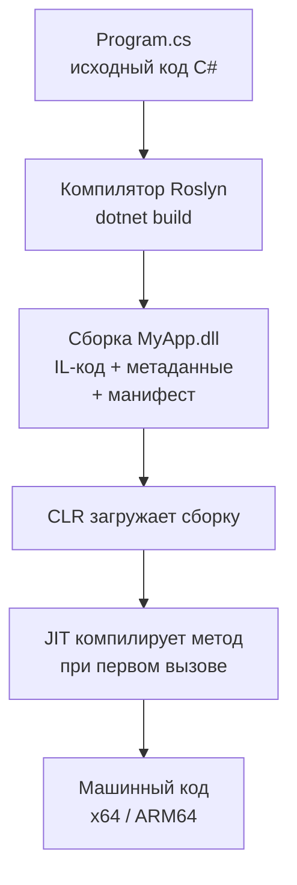
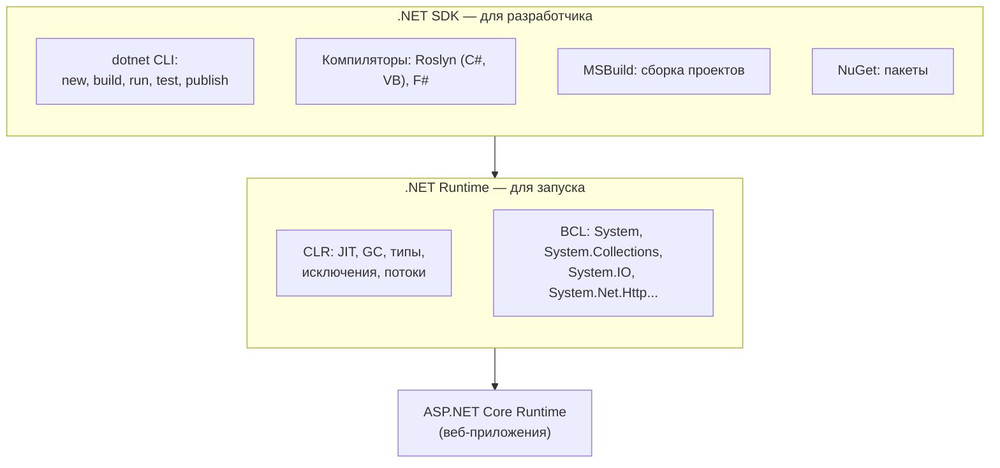
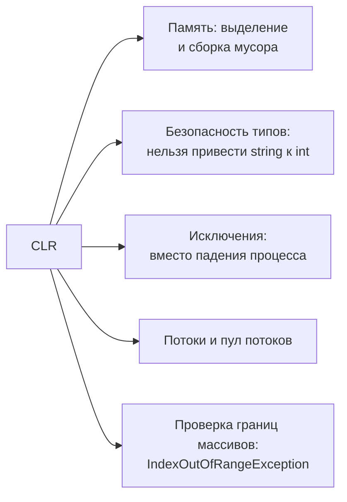

:::tldr
- **.NET** — платформа для разработки: языки (C#, F#, VB), **среда выполнения** (CLR), **библиотеки** (BCL) и **инструменты** (SDK, `dotnet` CLI). Кроссплатформенна: Windows, Linux, macOS.
- Компилятор C# (**Roslyn**) превращает исходный код не в машинный код, а в **CIL** (Common Intermediate Language, он же IL/MSIL) и упаковывает его в **сборку** (`.dll` / `.exe`) вместе с **метаданными** о типах.
- При запуске **CLR** (Common Language Runtime) загружает сборку, а **JIT-компилятор** переводит IL в машинный код процессора **при первом вызове** каждого метода. CLR также управляет памятью (**сборщик мусора**), проверяет типы, обрабатывает исключения, управляет потоками.
- **BCL** (Base Class Library) — стандартная библиотека: `string`, `List<T>`, `File`, `HttpClient`, `Task` и тысячи других типов.
- **SDK** — для разработки (компилятор, `dotnet build`, шаблоны); **Runtime** — только для запуска готовых приложений. Версии: **LTS** (чётные: .NET 8, 10 — 3 года поддержки) и **STS** (нечётные — 2 года).
:::

## От исходного кода до выполнения



Почему не сразу машинный код? Промежуточный язык даёт:
- **Переносимость**: одна и та же `.dll` работает на Windows x64, Linux ARM64 и macOS — JIT компилирует под конкретный процессор на месте.
- **Межъязыковую совместимость**: библиотеку на F# можно использовать из C# — оба компилируются в один и тот же IL.
- **Оптимизации под конкретную машину**: JIT знает, какой процессор и какие инструкции (AVX2, AVX-512) доступны.
- **Безопасность типов**: перед выполнением CLR проверяет, что IL корректен.

## Как выглядит IL

```csharp Исходный код
static int Add(int a, int b) => a + b;
```

```text IL после компиляции (можно посмотреть в ILSpy, dnSpy, sharplab.io)
.method private hidebysig static int32 Add(int32 a, int32 b) cil managed
{
    IL_0000: ldarg.0      // положить a на стек вычислений
    IL_0001: ldarg.1      // положить b на стек
    IL_0002: add          // сложить два верхних значения
    IL_0003: ret          // вернуть результат
}
```

IL — это стековая машина: команды кладут значения на стек и снимают их. JIT превращает это в 1–2 инструкции процессора.

## Что входит в платформу



| Компонент | Что делает |
|---|---|
| **CLR** | Загружает сборки, JIT-компиляция, сборка мусора, проверка типов, исключения, потоки, безопасность |
| **BCL** | Базовые типы и библиотеки: коллекции, файлы, сеть, текст, даты, async |
| **SDK** | Всё для разработки: компилятор, MSBuild, шаблоны проектов, `dotnet` CLI |
| **Runtime** | Минимум для запуска: CLR + BCL. Ставится на сервер, если приложение не self-contained |
| **ASP.NET Core Runtime** | Дополнительно для веб-приложений |

## Сборка (assembly)

Сборка — единица развёртывания и версионирования в .NET: файл `.dll` или `.exe`, внутри которого:
- **IL-код** методов;
- **метаданные** — описание всех типов, методов, полей, атрибутов (на них работает Reflection и IntelliSense);
- **манифест** — имя, версия, культура, список зависимостей от других сборок.

```bash
dotnet new console -n Hello      # создать проект
cd Hello
dotnet run                       # собрать и запустить
dotnet build -c Release          # bin/Release/net8.0/Hello.dll
dotnet bin/Release/net8.0/Hello.dll   # запуск сборки через хост dotnet
```

## Managed code и CLR как «менеджер»

Код, выполняемый под управлением CLR, называется **управляемым** (managed). Что берёт на себя CLR:



В C/C++ разработчик сам выделяет и освобождает память — ошибки ведут к утечкам и уязвимостям. В .NET память освобождается автоматически, а выход за границы массива — исключение, а не порча памяти.

## JIT, Tiered compilation и AOT

- **JIT** компилирует метод при первом вызове → первый запуск медленнее (прогрев).
- **Tiered compilation**: сначала метод компилируется быстро и без оптимизаций (Tier 0), а «горячие» методы потом перекомпилируются с полными оптимизациями (Tier 1).
- **ReadyToRun** — часть кода компилируется заранее при публикации, ускоряя старт.
- **Native AOT** — всё приложение компилируется в машинный код заранее: быстрый старт и маленький размер, но ограничения (нет динамической генерации кода, ограниченная рефлексия). Подробнее — в разделе для Middle/Senior.

## Версии .NET


| Версия | Тип | Поддержка |
|---|---|---|
| .NET 8 | LTS | 3 года (до ноября 2026) |
| .NET 9 | STS | 2 года (до ноября 2026) |
| .NET 10 | LTS | 3 года (до ноября 2028) |

Для новых проектов в продакшене обычно выбирают актуальную **LTS**-версию.

## Типичные ошибки новичков

:::warning Частые заблуждения
- «C# компилируется в машинный код» — нет, в IL; машинный код создаёт JIT во время выполнения (или AOT при публикации).
- «.NET работает только на Windows» — это про старый .NET Framework. Современный .NET кроссплатформенный, большинство серверов на нём работают на Linux в Docker.
- Путать **SDK** и **Runtime**: на сервер для запуска нужен только Runtime (или вообще ничего при self-contained публикации).
- Путать версию **языка C#** и версию **.NET**: C# 12 идёт с .NET 8, C# 13 — с .NET 9, C# 14 — с .NET 10.
:::

## Вопросы на засыпку

:::qa Что такое CTS и CLS?
**CTS** (Common Type System) — общая система типов .NET: правила, как объявляются и используются типы, чтобы языки понимали друг друга (`int` в C# и `Integer` в VB — один и тот же `System.Int32`). **CLS** (Common Language Specification) — подмножество правил, которым должна следовать публичная часть библиотеки, чтобы её можно было использовать из любого .NET-языка (например, не полагаться на беззнаковые типы в публичном API).
:::

:::qa Чем .dll отличается от .exe в .NET?
Обе — сборки с IL. В `.exe` есть точка входа (`Main`), и его можно запустить. В современном .NET приложение компилируется в `MyApp.dll`, а `MyApp.exe` (на Windows) — это небольшой нативный «хост», запускающий runtime и загружающий `.dll`. Запустить можно и командой `dotnet MyApp.dll`.
:::

:::qa Почему первый запрос к приложению медленнее остальных?
JIT компилирует методы при первом вызове, загружаются сборки, инициализируются статические данные, прогреваются пулы соединений и кэши. Последующие вызовы используют уже скомпилированный код. Помогают ReadyToRun, Native AOT и «прогревочные» запросы при старте.
:::

:::qa Что такое self-contained публикация?
`dotnet publish --self-contained -r linux-x64` включает в результат сам runtime. Приложению не нужен установленный .NET на сервере, но размер больше. Framework-dependent публикация (по умолчанию) — только ваш код, runtime должен быть установлен.
:::

## Итог

.NET — платформа из среды выполнения (CLR), стандартной библиотеки (BCL) и инструментов (SDK). Код C# компилируется в промежуточный язык IL внутри сборки, а CLR при выполнении JIT-компилирует его в машинный код, управляет памятью через сборщик мусора и следит за безопасностью типов. Современный .NET кроссплатформенный, выходит каждый год, LTS-версии — чётные.
