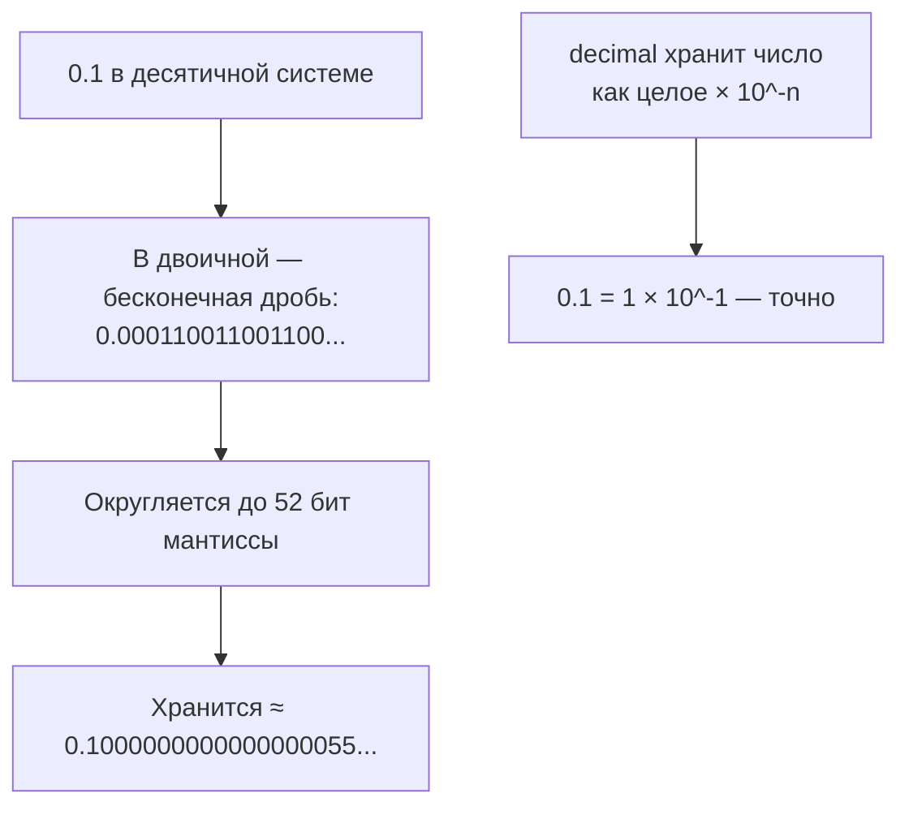
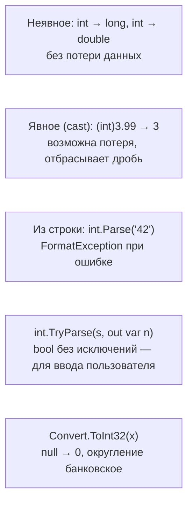

:::tldr
- C# — **статически типизированный** язык: тип каждой переменной известен при компиляции. Встроенные типы — псевдонимы типов .NET: `int` = `System.Int32`, `string` = `System.String`.
- Целые: `byte` (8 бит), `short` (16), **`int`** (32), **`long`** (64) + беззнаковые (`uint`, `ulong`). Вещественные: `float` (32), **`double`** (64) — двоичные, **неточные** для десятичных дробей (`0.1 + 0.2 != 0.3`); **`decimal`** (128) — десятичный, точный — **для денег**.
- **Переполнение** целых по умолчанию **молча** «заворачивается» (`int.MaxValue + 1 == int.MinValue`); `checked` — бросает `OverflowException`.
- **`var`** — тип выводится компилятором, переменная всё равно строго типизирована. **`const`** — значение подставляется при компиляции (только примитивы и строки). **`readonly`** — поле задаётся один раз в конструкторе, вычисляется во время выполнения.
- Приведение: **неявное** — без потери данных (`int` → `long`), **явное** `(int)x` — с возможной потерей; для строк — `int.Parse` / **`int.TryParse`** / `Convert`.
:::

## Встроенные типы

| Псевдоним C# | Тип .NET | Размер | Диапазон / точность | Пример |
|---|---|---|---|---|
| `bool` | `System.Boolean` | 1 байт | `true` / `false` | `bool isActive = true;` |
| `byte` | `System.Byte` | 1 байт | 0…255 | `byte b = 200;` |
| `short` | `System.Int16` | 2 байта | ±32 тыс. | `short s = 1000;` |
| `int` | `System.Int32` | 4 байта | ±2,1 млрд | `int count = 42;` |
| `long` | `System.Int64` | 8 байт | ±9,2·10¹⁸ | `long id = 9_000_000_000L;` |
| `float` | `System.Single` | 4 байта | ~7 значащих цифр | `float f = 1.5f;` |
| `double` | `System.Double` | 8 байт | ~15–16 значащих цифр | `double d = 3.14;` |
| `decimal` | `System.Decimal` | 16 байт | 28–29 цифр, десятичный | `decimal price = 19.99m;` |
| `char` | `System.Char` | 2 байта | Символ UTF-16 | `char c = 'A';` |
| `string` | `System.String` | Ссылка | Неизменяемая строка | `string name = "Ann";` |
| `object` | `System.Object` | Ссылка | Базовый тип для всех | `object o = 1;` |

Суффиксы литералов: `L` — long, `f` — float, `m` — decimal, `u` — unsigned. Разделитель разрядов `_` для читаемости: `1_000_000`.

## double против decimal

```csharp Классическая ловушка
Console.WriteLine(0.1 + 0.2 == 0.3);        // False!
Console.WriteLine(0.1 + 0.2);               // 0.30000000000000004

Console.WriteLine(0.1m + 0.2m == 0.3m);     // True
```



| | `double` | `decimal` |
|---|---|---|
| Основание | 2 (двоичное) | 10 (десятичное) |
| Точность для 0.1, 0.01 | Приблизительная | Точная |
| Скорость | Быстро (аппаратно) | В разы медленнее (программно) |
| Диапазон | Огромный (10³⁰⁸) | Меньше (7,9·10²⁸) |
| Когда | Физика, графика, статистика, ML | **Деньги**, бухгалтерия, проценты, налоги |

:::warning Сравнение double
Никогда не сравнивайте вещественные числа через `==`. Используйте допуск: `Math.Abs(a - b) < 1e-9`. И никогда не храните деньги в `double` или `float`.
:::

## Переполнение

```csharp
int max = int.MaxValue;          // 2 147 483 647
int overflow = max + 1;          // -2 147 483 648 — без ошибки!

checked
{
    int boom = max + 1;          // OverflowException
}
int safe = checked(max + 1);     // то же в выражении

long big = (long)max + 1;        // 2 147 483 648 — расширили тип ДО сложения
long wrong = max + 1;            // -2 147 483 648 — сложение в int, потом расширение
```

Проверку переполнения для всего проекта можно включить в `.csproj`: `<CheckForOverflowUnderflow>true</CheckForOverflowUnderflow>` (обычно для Debug).

## var, const, readonly

```csharp
var count = 10;                 // int — тип выведен из правой части
var names = new List<string>(); // List<string>
// count = "text";              // ошибка компиляции: тип int фиксирован

const double Pi = 3.14159;      // константа времени компиляции
const string AppName = "Shop";

public class Order
{
    private readonly DateTime _createdAt;       // задаётся один раз
    public static readonly TimeSpan Timeout = TimeSpan.FromSeconds(30);   // нельзя const: не примитив

    public Order() => _createdAt = DateTime.UtcNow;   // вычисляется при выполнении
}
```

| | `const` | `readonly` | `static readonly` |
|---|---|---|---|
| Когда задаётся | При компиляции | В объявлении или конструкторе | В объявлении или статическом конструкторе |
| Какие типы | Примитивы, `string`, `enum`, `null` | Любые | Любые |
| Уровень | Всегда статический | На экземпляр | На тип |
| Значение | Подставляется в код вызывающих сборок | Читается из поля | Читается из поля |

:::warning Ловушка const в библиотеках
Значение `const` **вшивается** в сборку, которая его использует. Если библиотека изменит `const int MaxSize = 10` на `20`, а использующее приложение не перекомпилируют, оно продолжит видеть `10`. Для публичных значений, которые могут меняться, используйте `static readonly`.
:::

Когда использовать `var`: когда тип очевиден из правой части (`var list = new List<int>()`) или длинный. Когда нет: когда тип неочевиден (`var x = GetData();` — что вернулось?).

## Приведение и преобразование типов



```csharp
int i = 100;
long l = i;                    // неявно
double d = 3.99;
int t = (int)d;                // 3 — дробная часть отброшена, не округлена
int r = (int)Math.Round(d);    // 4

if (int.TryParse(input, out var age))   // безопасный разбор пользовательского ввода
    Console.WriteLine($"Возраст: {age}");
else
    Console.WriteLine("Введите число");

decimal price = decimal.Parse("19.99", CultureInfo.InvariantCulture);   // культура важна: в ru-RU разделитель — запятая
```

## Значения по умолчанию и nullable

```csharp
int a = default;      // 0
bool b = default;     // false
string? s = default;  // null

int? maybe = null;    // Nullable<int>: значение или null (например, необязательное поле из БД)
int value = maybe ?? 0;            // 0, если null
if (maybe.HasValue) Console.WriteLine(maybe.Value);
```

## Вопросы на засыпку

:::qa Чем string отличается от String?
Ничем: `string` — псевдоним (ключевое слово C#) для `System.String`. То же для `int`/`Int32`, `bool`/`Boolean`. По соглашению используют псевдонимы в коде, а имена типов .NET — при вызове статических методов допустимы оба варианта (`string.IsNullOrEmpty`, `String.Join`).
:::

:::qa Какой тип выбрать для денег и почему?
`decimal`: он хранит десятичные дроби точно, а `double` — приближённо, что даёт ошибки округления в копейках при суммировании. Альтернатива — хранить сумму в минимальных единицах (тийины, центы) в `long`.
:::

:::qa Что выведет (int)2.9 и (int)-2.9?
`2` и `-2`: явное приведение отбрасывает дробную часть (округление к нулю). Для математического округления — `Math.Round` (по умолчанию банковское: 2.5 → 2, 3.5 → 4), `Math.Floor`, `Math.Ceiling`.
:::

:::qa Почему var не делает C# динамическим языком?
`var` — только сокращение записи: компилятор выводит конкретный тип из инициализатора, и дальше переменная строго типизирована. Динамическая типизация в C# — это `dynamic`, где проверки переносятся на время выполнения.
:::

## Итог

Выбирайте `int` и `long` для целых, `double` для научных расчётов и `decimal` для денег; помните о молчаливом переполнении и неточности `double`. `var` — вывод типа, а не динамическая типизация. `const` — для настоящих констант времени компиляции, `readonly` — для значений, вычисляемых один раз при создании. Пользовательский ввод разбирайте через `TryParse` с учётом культуры.
