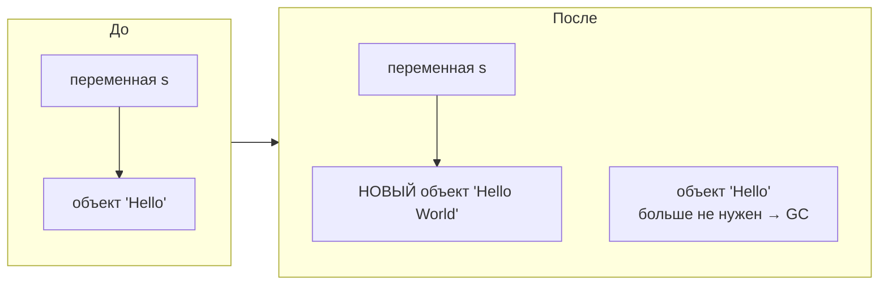
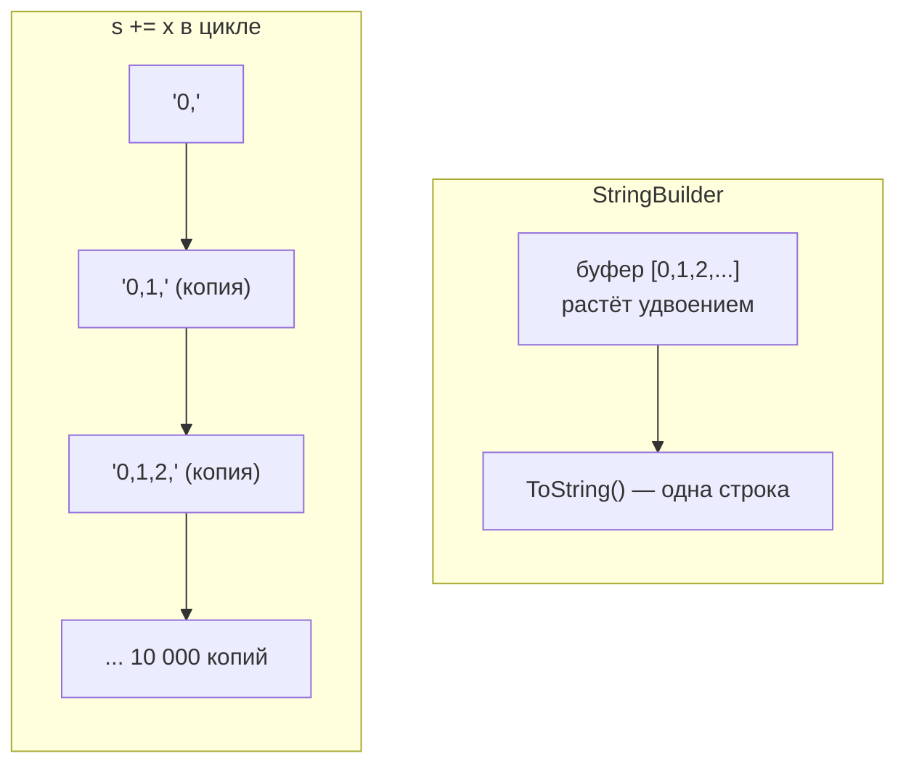

:::tldr
- `string` — **ссылочный** тип, но ведёт себя как значение: он **неизменяем** (immutable). Любая «модификация» (`+`, `Replace`, `ToUpper`) создаёт **новую** строку, исходная не меняется.
- Конкатенация в цикле (`s += x`) создаёт N промежуточных строк → O(n²) копирования и нагрузка на GC. Для сборки строки из многих частей — **`StringBuilder`** (изменяемый буфер) или `string.Join` / `string.Concat`.
- `==` для строк сравнивает **содержимое** (оператор перегружен), а не ссылки. Для сравнения без учёта регистра — `string.Equals(a, b, StringComparison.OrdinalIgnoreCase)`, а не `a.ToLower() == b.ToLower()`.
- **Интернирование**: строковые литералы с одинаковым текстом — один объект в памяти (пул строк).
- Удобные возможности: интерполяция `$"Привет, {name}"`, verbatim `@"C:\path"`, raw-строки `"""..."""` (C# 11), `string.IsNullOrWhiteSpace`.
:::

## Неизменяемость

```csharp
string s = "Hello";
s.ToUpper();               // результат выброшен — s не изменилась!
Console.WriteLine(s);      // Hello

s = s.ToUpper();           // присвоили НОВУЮ строку той же переменной
Console.WriteLine(s);      // HELLO
```



Зачем неизменяемость:
- **Безопасность**: строку, переданную в метод, нельзя испортить изнутри; можно безопасно использовать как ключ словаря.
- **Потокобезопасность**: несколько потоков читают одну строку без блокировок.
- **Интернирование и кэширование хэш-кода** возможны только для неизменяемых объектов.

## StringBuilder

```csharp Медленно: каждая итерация копирует всю строку заново
string result = "";
for (int i = 0; i < 10_000; i++)
    result += i + ",";          // 10 000 новых строк, растущих по длине → O(n²)
```

```csharp Быстро: один изменяемый буфер
var sb = new StringBuilder();
for (int i = 0; i < 10_000; i++)
    sb.Append(i).Append(',');
string result = sb.ToString();  // одна итоговая строка

// Ещё проще для коллекций:
string joined = string.Join(",", Enumerable.Range(0, 10_000));
```



Когда `+` нормально: при склейке **фиксированного** небольшого числа частей (`a + b + c`) компилятор сам превращает это в один вызов `string.Concat`. `StringBuilder` нужен для **циклов** и большого числа частей.

## Создание и форматирование

```csharp
string name = "Ann";
int age = 30;

string a = "Имя: " + name + ", возраст: " + age;          // конкатенация
string b = string.Format("Имя: {0}, возраст: {1}", name, age);
string c = $"Имя: {name}, возраст: {age}";                // интерполяция — предпочтительно
string d = $"Цена: {price:N2} сум, дата: {date:yyyy-MM-dd}";   // форматирование внутри
string path = @"C:\Users\ann\file.txt";                   // verbatim: \ не экранируется
string json = """
    { "name": "Ann", "age": 30 }
    """;                                                  // raw string literal (C# 11)
string interpolatedJson = $$"""{ "name": "{{name}}" }""";  // raw + интерполяция
```

## Сравнение строк

```csharp
string a = "hello";
string b = "HELLO".ToLower();

Console.WriteLine(a == b);                         // True — сравнивается содержимое
Console.WriteLine(ReferenceEquals(a, b));          // False — разные объекты

// Без учёта регистра — правильно:
bool eq = string.Equals(a, "HeLLo", StringComparison.OrdinalIgnoreCase);

// Неправильно: создаёт лишние строки и зависит от культуры
bool bad = a.ToLower() == "HeLLo".ToLower();
```

| `StringComparison` | Когда |
|---|---|
| `Ordinal` | Идентификаторы, ключи, пути, протоколы — побайтовое сравнение, быстро |
| `OrdinalIgnoreCase` | То же без учёта регистра: email, имена заголовков HTTP |
| `CurrentCulture` | Текст для пользователя: сортировка списка имён в UI |
| `InvariantCulture` | Культурно-независимое «человеческое» сравнение |

:::warning Турецкая проблема
`"title".ToUpper()` в турецкой культуре даёт `"TİTLE"` (буква İ с точкой). Код вида `if (cmd.ToUpper() == "TITLE")` ломается у пользователей с турецкой локалью. Поэтому для технических строк — `Ordinal`/`OrdinalIgnoreCase` и `ToUpperInvariant()`.
:::

## Интернирование

```csharp
string x = "dotnet";
string y = "dotnet";
Console.WriteLine(ReferenceEquals(x, y));     // True — литералы интернированы, один объект

string z = new string("dotnet".ToCharArray());
Console.WriteLine(ReferenceEquals(x, z));     // False — создана во время выполнения
Console.WriteLine(ReferenceEquals(x, string.Intern(z)));   // True — взяли из пула
```

Компилятор помещает все строковые литералы в **пул интернирования**: одинаковые литералы — одна ссылка. Строки, созданные во время выполнения, в пул не попадают (их можно добавить через `string.Intern`, но это редко нужно).

## Полезные методы

```csharp
string.IsNullOrEmpty(s);           // null или ""
string.IsNullOrWhiteSpace(s);      // null, "" или только пробелы — для проверки ввода
s.Trim(); s.TrimStart(); s.TrimEnd();
s.Contains("net", StringComparison.OrdinalIgnoreCase);
s.StartsWith("http"); s.EndsWith(".cs");
s.Split(',', StringSplitOptions.RemoveEmptyEntries | StringSplitOptions.TrimEntries);
s.Substring(0, 5); s[..5]; s[^3..];   // диапазоны C# 8
s.Replace("a", "b");
s.PadLeft(10, '0');                   // "0000000042"
string.Join(", ", names);
```

## Строка и null

```csharp
string? s = null;
int len = s.Length;              // NullReferenceException
int len2 = s?.Length ?? 0;       // безопасно: 0
string text = s ?? "по умолчанию";
string empty = string.Empty;     // то же, что ""
```

## Вопросы на засыпку

:::qa Почему string — ссылочный тип, если ведёт себя как значение?
Размер строки заранее неизвестен и может быть большим, поэтому она хранится в куче, а переменная содержит ссылку. Но благодаря неизменяемости и перегруженному `==` строки ведут себя как значения: их нельзя изменить через другую ссылку, а сравнение идёт по содержимому.
:::

:::qa Сколько объектов создаст выражение "a" + "b" + "c"?
Ни одного во время выполнения: компилятор склеит константы и создаст один литерал `"abc"`. Для переменных `a + b + c` компилятор вызовет один `string.Concat(a, b, c)` — одна новая строка, без промежуточных.
:::

:::qa Когда StringBuilder не нужен?
Когда частей мало и их число фиксировано (`$"{a} {b}"`), или когда есть готовая коллекция (`string.Join`). `StringBuilder` сам по себе — объект с буфером, для 2–3 частей он медленнее простой конкатенации.
:::

:::qa Чем string.Empty отличается от ""?
Практически ничем: оба — одна и та же пустая строка (литерал `""` интернирован). `string.Empty` — статическое поле, `""` — константа, которую можно использовать в `switch` и значениях по умолчанию параметров. Выбор — дело стиля.
:::

## Итог

Строки в C# неизменяемы: каждая операция создаёт новую строку, поэтому в циклах используют `StringBuilder` или `string.Join`. `==` сравнивает содержимое; для сравнения без учёта регистра и технических строк используйте `StringComparison.Ordinal(IgnoreCase)`, а не `ToLower()`. Литералы интернируются, а для удобного форматирования есть интерполяция, verbatim- и raw-строки.
