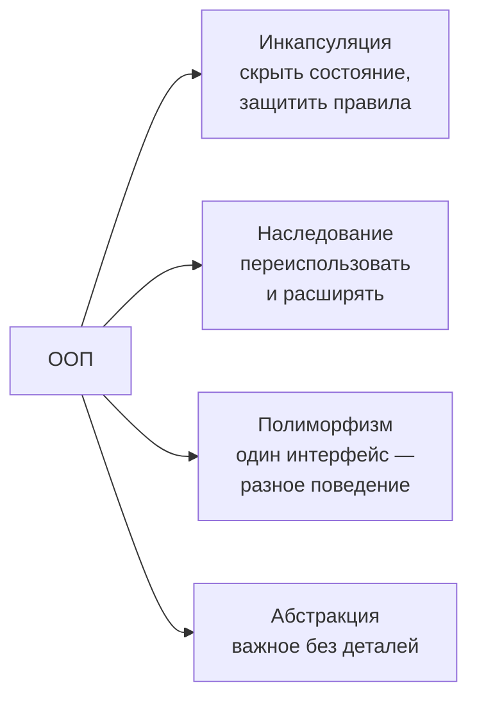
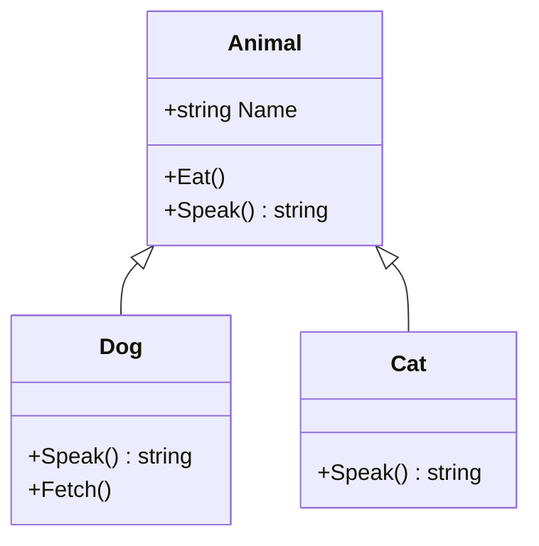
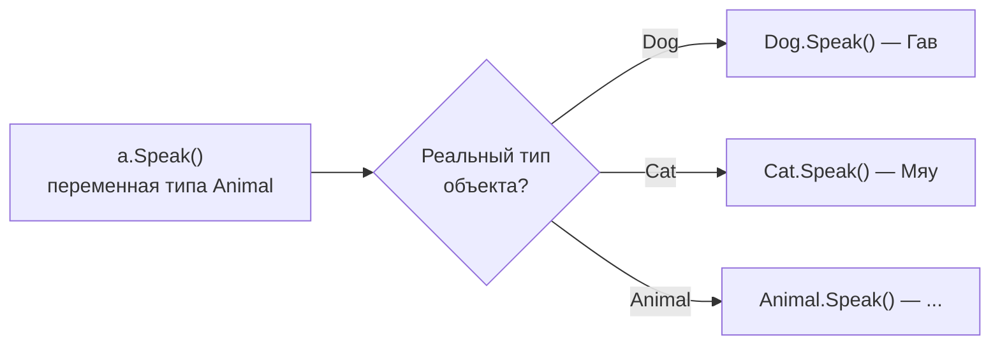
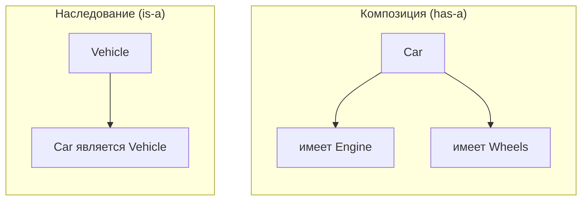

:::tldr
- **Инкапсуляция** — объект скрывает своё внутреннее состояние и даёт менять его только через методы, которые **сохраняют правила** (инварианты). В C#: `private` поля, публичные методы и свойства с проверками.
- **Наследование** — класс-наследник получает данные и поведение базового класса и может их расширять (`class Dog : Animal`). В C# — одиночное наследование классов и множественная реализация интерфейсов.
- **Полиморфизм** — один и тот же код работает с объектами разных типов через общий интерфейс или базовый класс; конкретное поведение выбирается **во время выполнения** (`virtual`/`override`, интерфейсы).
- **Абстракция** — работа с понятием на нужном уровне детализации, без деталей реализации: интерфейс `IPaymentGateway` вместо знания, как устроен банк.
- Современное правило: **композиция предпочтительнее наследования** — наследование создаёт жёсткую связь; используйте его для настоящих отношений «является» (is-a).
:::

## Обзор



## Инкапсуляция

```csharp Плохо: состояние открыто, правила не защищены
public class BankAccount
{
    public decimal Balance;            // кто угодно напишет account.Balance = -1_000_000
}
```

```csharp Хорошо: состояние меняется только через методы с проверками
public class BankAccount
{
    private readonly List<string> _history = new();
    public decimal Balance { get; private set; }            // читать можно, менять — только внутри
    public IReadOnlyList<string> History => _history;       // наружу — только чтение

    public void Deposit(decimal amount)
    {
        if (amount <= 0) throw new ArgumentOutOfRangeException(nameof(amount), "Сумма должна быть положительной");
        Balance += amount;
        _history.Add($"+{amount}");
    }

    public void Withdraw(decimal amount)
    {
        if (amount <= 0) throw new ArgumentOutOfRangeException(nameof(amount));
        if (amount > Balance) throw new InvalidOperationException("Недостаточно средств");
        Balance -= amount;
        _history.Add($"-{amount}");
    }
}
```

Инварианты («баланс не отрицательный», «каждая операция записана в историю») теперь невозможно нарушить снаружи. Инкапсуляция — это не просто «поля private + геттеры/сеттеры на всё», а защита правил объекта.

## Наследование

```csharp
public class Animal
{
    public string Name { get; }
    public Animal(string name) => Name = name;
    public void Eat() => Console.WriteLine($"{Name} ест");
    public virtual string Speak() => "...";
}

public class Dog : Animal
{
    public Dog(string name) : base(name) { }        // вызов конструктора базового класса
    public override string Speak() => "Гав";       // переопределение поведения
    public void Fetch() => Console.WriteLine($"{Name} приносит мяч");   // расширение
}

var dog = new Dog("Шарик");
dog.Eat();      // унаследовано
dog.Fetch();    // своё
```



Особенности C#:
- Класс наследует **только один** класс; интерфейсов можно реализовать сколько угодно.
- Все типы неявно наследуют `System.Object` (методы `ToString`, `Equals`, `GetHashCode`).
- `sealed` запрещает наследование от класса; `abstract` — требует наследования.

## Полиморфизм

```csharp
List<Animal> animals = [new Dog("Шарик"), new Cat("Мурка"), new Animal("Кто-то")];
foreach (var a in animals)
    Console.WriteLine($"{a.Name}: {a.Speak()}");
// Шарик: Гав
// Мурка: Мяу
// Кто-то: ...
```

Цикл не знает конкретных типов — он работает с `Animal`, а нужная версия `Speak()` выбирается во время выполнения по реальному типу объекта (**динамическая диспетчеризация** через таблицу виртуальных методов).



Виды полиморфизма в C#:
- **Подтипов** (runtime): `virtual`/`override`, интерфейсы — основной смысл слова в ООП.
- **Ad-hoc** (compile time): перегрузка методов `Print(int)`, `Print(string)`.
- **Параметрический**: дженерики `List<T>`.

## Абстракция

```csharp
public interface IPaymentGateway
{
    Task<PaymentResult> ChargeAsync(decimal amount, string cardToken, CancellationToken ct);
}

public class CheckoutService(IPaymentGateway payments)
{
    public async Task PayAsync(Order order, CancellationToken ct)
    {
        var result = await payments.ChargeAsync(order.Total, order.CardToken, ct);
        // сервис не знает, Payme это, Click или заглушка в тестах
    }
}
```

Абстракция позволяет думать о задаче на своём уровне: оформление заказа не зависит от деталей HTTP-протокола конкретного банка. Её инструменты в C# — интерфейсы и абстрактные классы.

## Композиция против наследования



```csharp Ловушка наследования ради переиспользования кода
public class EmailNotifier : SmtpClient { }      // «уведомитель является SMTP-клиентом»? Нет.

// Композиция: уведомитель ИСПОЛЬЗУЕТ отправителя и легко меняет его
public class EmailNotifier(IEmailSender sender)
{
    public Task NotifyAsync(string to, string text) => sender.SendAsync(to, "Уведомление", text);
}
```

Проблемы глубокого наследования: изменения базового класса ломают наследников («хрупкий базовый класс»), наследник получает всё, даже ненужное, иерархию трудно менять. Композиция гибче: поведение собирается из небольших объектов и подменяется (в том числе в тестах).

## Типичные ошибки

:::warning Частые ошибки
- Публичные поля и сеттеры на всё — инкапсуляции нет, правила размазаны по коду.
- Наследование ради повторного использования пары методов вместо композиции.
- Нарушение принципа подстановки Лисков: наследник `Square : Rectangle`, ломающий поведение базового класса.
- Проверки типа `if (animal is Dog) ... else if (animal is Cat)` вместо полиморфного метода — при добавлении типа нужно менять все такие места.
:::

## Вопросы на засыпку

:::qa Чем абстракция отличается от инкапсуляции?
Абстракция — про **что** объект делает (выделение существенного, интерфейс), инкапсуляция — про **как** скрыта реализация и защищено состояние. Абстракция отвечает на вопрос «какой контракт показать», инкапсуляция — «что спрятать и как защитить».
:::

:::qa Почему в C# нет множественного наследования классов?
Чтобы избежать «ромбовидной» проблемы: если два базовых класса реализуют один и тот же метод по-разному, неясно, какой унаследовать. Вместо этого — множественная реализация интерфейсов (с C# 8 у интерфейсов могут быть реализации по умолчанию, но без состояния).
:::

:::qa Что такое принцип подстановки Лисков на простом примере?
Объект наследника должен работать везде, где ожидается базовый класс, без сюрпризов. Если `ReadOnlyList : List` бросает исключение в `Add`, код, принимающий `List`, сломается — это нарушение. Подробнее — в вопросе про SOLID.
:::

:::qa Является ли перегрузка методов полиморфизмом?
Это «ad-hoc» полиморфизм времени компиляции: компилятор выбирает метод по типам аргументов. Когда на собеседовании говорят о полиморфизме в ООП, обычно имеют в виду полиморфизм подтипов — выбор реализации во время выполнения через `virtual`/`override` и интерфейсы.
:::

## Итог

Инкапсуляция защищает состояние и правила объекта, наследование позволяет расширять базовые типы, полиморфизм даёт единый интерфейс с разным поведением, абстракция скрывает детали за контрактом. В C# это `private`-поля и методы с проверками, одиночное наследование классов, `virtual`/`override` и интерфейсы. Наследование — для отношений «является», в остальных случаях предпочитайте композицию.
