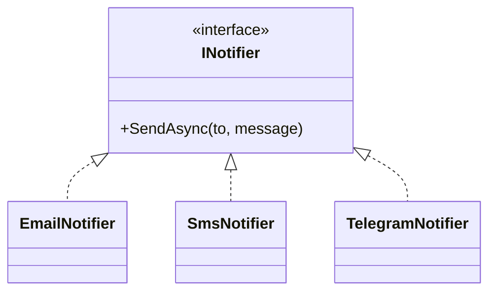
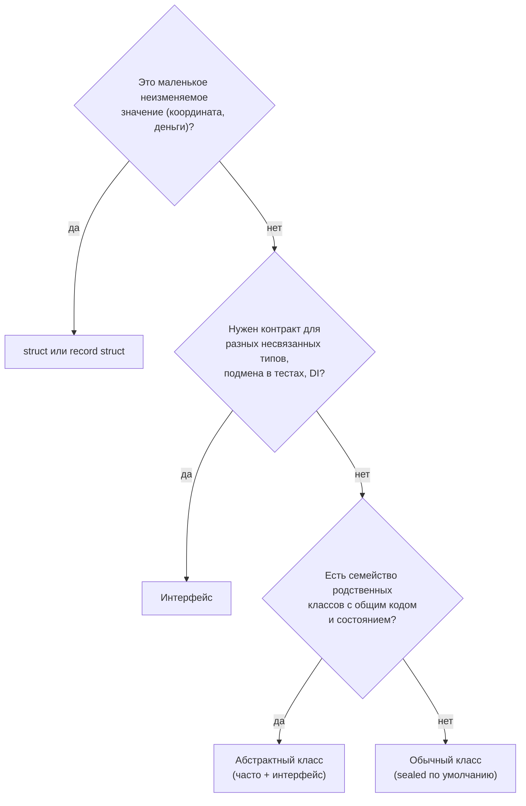

:::tldr
- **Класс** — шаблон объекта с данными и поведением. Можно создать экземпляр (`new`), наследовать (один базовый класс).
- **Абстрактный класс** (`abstract`) — **незавершённый** базовый класс: нельзя создать экземпляр; может содержать **состояние** (поля), конструкторы, готовые методы и **абстрактные** методы без реализации, которые обязан реализовать наследник. Отношение «является» с общим кодом.
- **Интерфейс** — **контракт**: набор членов, которые обязан реализовать тип. Нет полей экземпляра и конструкторов. Класс может реализовать **много** интерфейсов. С C# 8 — реализации по умолчанию, статические члены.
- **Struct** — значимый тип: копируется по значению, не наследуется (но реализует интерфейсы), подходит для маленьких неизменяемых значений (`Point`, `Money`).
- Правило выбора: нужен **контракт** для разных несвязанных типов и подмены в тестах → интерфейс; нужен **общий код и состояние** для семейства родственных классов → абстрактный класс; часто — оба (интерфейс + абстрактная базовая реализация).
:::

## Сравнение

| | Класс | Абстрактный класс | Интерфейс | Struct |
|---|---|---|---|---|
| Создать экземпляр | Да | **Нет** | **Нет** | Да |
| Поля (состояние) | Да | Да | Нет (только статические) | Да |
| Конструкторы | Да | Да (вызываются наследниками) | Нет | Да |
| Методы с реализацией | Да | Да | С C# 8 — по умолчанию | Да |
| Абстрактные члены | Нет | Да | Все члены по сути абстрактны | Нет |
| Наследование | Один базовый класс | Один базовый класс | Много интерфейсов | Нельзя наследовать, можно реализовать интерфейсы |
| Модификаторы доступа членов | Любые | Любые | По умолчанию `public` | Любые |
| Тип | Ссылочный | Ссылочный | — | Значимый |

## Абстрактный класс

```csharp
public abstract class Shape
{
    public string Name { get; }
    protected Shape(string name) => Name = name;        // конструктор для наследников

    public abstract double Area();                       // обязаны реализовать
    public virtual string Describe() => $"{Name}: площадь {Area():F2}";   // можно переопределить
}

public sealed class Circle(double r) : Shape("Круг")
{
    public override double Area() => Math.PI * r * r;
}

public sealed class Rectangle(double w, double h) : Shape("Прямоугольник")
{
    public override double Area() => w * h;
}

// var s = new Shape("?");   // ошибка: нельзя создать экземпляр абстрактного класса
Shape[] shapes = [new Circle(1), new Rectangle(2, 3)];
foreach (var s in shapes) Console.WriteLine(s.Describe());
```

Абстрактный класс — паттерн **Template Method**: общий алгоритм (`Describe`) в базовом классе, переменные шаги (`Area`) — в наследниках.

## Интерфейс

```csharp
public interface INotifier
{
    Task SendAsync(string to, string message, CancellationToken ct = default);
}

public sealed class EmailNotifier : INotifier { public Task SendAsync(string to, string m, CancellationToken ct = default) => /* SMTP */ Task.CompletedTask; }
public sealed class SmsNotifier : INotifier { public Task SendAsync(string to, string m, CancellationToken ct = default) => /* SMS API */ Task.CompletedTask; }
public sealed class TelegramNotifier : INotifier { public Task SendAsync(string to, string m, CancellationToken ct = default) => /* Bot API */ Task.CompletedTask; }

// Класс может реализовать несколько интерфейсов
public sealed class FileLogger : ILogger, IDisposable, IAsyncDisposable { /* ... */ }
```



Интерфейсы — основа **внедрения зависимостей** и тестирования: сервис зависит от `INotifier`, а в тесте подставляется заглушка.

### Реализации по умолчанию (C# 8+)

```csharp
public interface ILogger
{
    void Log(string level, string message);
    void Info(string message) => Log("INFO", message);      // реализация по умолчанию
    void Error(string message) => Log("ERROR", message);
}
```

Нужны прежде всего для **эволюции** публичных интерфейсов: можно добавить метод, не ломая все существующие реализации. Состояния (полей экземпляра) у интерфейса по-прежнему нет.

## Как выбрать



Частый комбинированный подход:

```csharp
public interface IRepository<T> { Task<T?> GetAsync(Guid id); Task AddAsync(T item); }

public abstract class EfRepository<T>(AppDbContext db) : IRepository<T> where T : class
{
    protected readonly AppDbContext Db = db;
    public virtual Task<T?> GetAsync(Guid id) => Db.Set<T>().FindAsync(id).AsTask();
    public Task AddAsync(T item) { Db.Add(item); return Task.CompletedTask; }
}

public sealed class OrderRepository(AppDbContext db) : EfRepository<Order>(db) { /* особые запросы */ }
```

Потребители зависят от интерфейса, а общий код живёт в абстрактной базе.

## Struct кратко

```csharp
public readonly record struct Point(double X, double Y);   // неизменяемый значимый тип с Equals/ToString

var a = new Point(1, 2);
var b = a;            // КОПИЯ значения
// изменения b не влияют на a
```

Подробно о значимых и ссылочных типах — в разделе «C# и .NET углублённо».

## Типичные ошибки

:::warning Частые ошибки
- «Интерфейс на каждый класс» без нужды: интерфейс оправдан, если есть несколько реализаций, подмена в тестах или граница модуля.
- Абстрактный базовый класс `BaseService` со свалкой общих методов для всех сервисов — превращается в God-класс; лучше композиция.
- Изменяемый `struct`: копии ведут к «потерянным» изменениям.
- Забыть `sealed` у классов, которые не предназначены для наследования (это и документация, и небольшая оптимизация).
:::

## Вопросы на засыпку

:::qa Может ли абстрактный класс не иметь абстрактных методов?
Да. Тогда `abstract` просто запрещает создавать экземпляры: класс задуман только как база. Например, общий базовый класс для контроллеров с готовыми вспомогательными методами.
:::

:::qa Что будет, если класс реализует два интерфейса с одинаковым методом?
Одна публичная реализация подойдёт обоим. Если нужны разные реализации — **явная реализация интерфейса**: `void IFirst.Do() { }` и `void ISecond.Do() { }`; такие методы вызываются только через ссылку соответствующего интерфейса.
:::

:::qa Чем интерфейс с методами по умолчанию отличается от абстрактного класса?
У интерфейса нет состояния экземпляра (полей) и конструкторов, класс может реализовать много интерфейсов, а методы по умолчанию доступны только через ссылку интерфейса. Абстрактный класс хранит состояние, но наследовать можно только один.
:::

:::qa Может ли struct реализовать интерфейс?
Да. Но при приведении struct к интерфейсу (`IComparable c = point`) происходит **упаковка** (boxing) — значение копируется в кучу. В дженериках с ограничением `where T : IComparable<T>` упаковки нет.
:::

## Итог

Класс — полноценный тип с состоянием и поведением; абстрактный класс — незавершённая база с общим кодом и обязательными для реализации членами; интерфейс — контракт без состояния, который могут реализовать любые типы, в том числе несколько сразу; struct — небольшое значение, копируемое целиком. Для контрактов и DI выбирайте интерфейсы, для общего кода семейства классов — абстрактный класс, часто их комбинируя.
