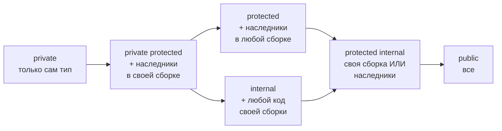
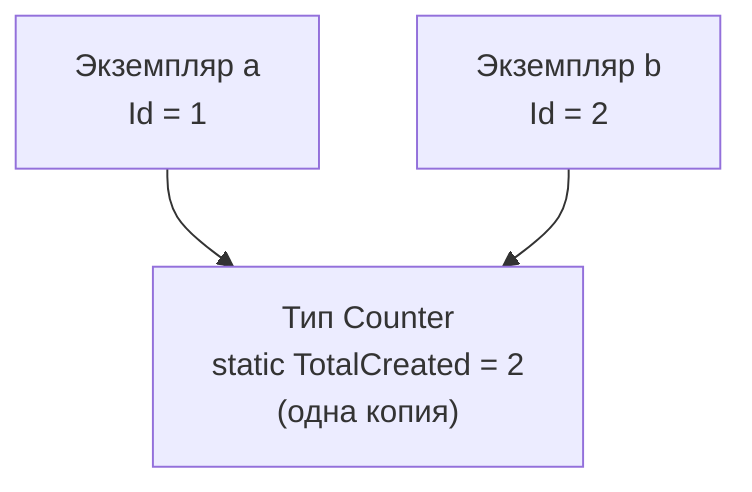

:::tldr
- **Модификаторы доступа** определяют, кто видит член или тип: `public` (все), `private` (только этот тип — **по умолчанию для членов**), `protected` (тип и наследники), `internal` (вся сборка — **по умолчанию для типов**), `protected internal` (сборка **или** наследники), `private protected` (наследники **внутри** сборки).
- Правило: **минимально необходимая видимость**. Чем меньше открыто, тем меньше точек, которые ломаются при изменениях.
- **`static`** — член принадлежит **типу**, а не экземпляру: один на всё приложение. **Статический класс** — только статические члены, нельзя создать экземпляр (утилиты, методы расширения).
- **`sealed`** — запрещает наследование от класса (или дальнейшее переопределение метода). Хорошая практика по умолчанию для классов, не предназначенных для наследования.
- **`partial`** — определение типа разделено на несколько файлов (сгенерированный код + ручной код).
:::

## Модификаторы доступа



| Модификатор | Тот же класс | Наследник (та же сборка) | Другой класс (та же сборка) | Наследник (другая сборка) | Другой класс (другая сборка) |
|---|---|---|---|---|---|
| `public` | ✓ | ✓ | ✓ | ✓ | ✓ |
| `protected internal` | ✓ | ✓ | ✓ | ✓ | — |
| `internal` | ✓ | ✓ | ✓ | — | — |
| `protected` | ✓ | ✓ | — | ✓ | — |
| `private protected` | ✓ | ✓ | — | — | — |
| `private` | ✓ | — | — | — | — |

Значения по умолчанию:
- Члены класса и struct (поля, методы, свойства) — `private`.
- Типы верхнего уровня (классы, интерфейсы) — `internal`.
- Члены интерфейса — `public`.

```csharp
public class Order                        // виден всем
{
    private readonly List<OrderLine> _lines = new();   // только внутри Order
    protected decimal Discount;                        // Order и наследники
    internal string? DebugInfo;                        // вся сборка Shop.Core
    public Guid Id { get; } = Guid.NewGuid();          // все

    public decimal Total => _lines.Sum(l => l.Price * l.Quantity) - Discount;
}

internal class PriceCalculator { }        // не виден за пределами сборки
```

:::tip internal и тесты
Чтобы тестовый проект видел `internal`-типы, добавьте в `.csproj` основного проекта: `<InternalsVisibleTo Include="Shop.Core.Tests" />`. Это лучше, чем делать всё `public` ради тестов.
:::

## static

```csharp
public class Counter
{
    public static int TotalCreated;      // один на весь тип
    public int Id { get; }               // у каждого экземпляра свой

    public Counter() => Id = ++TotalCreated;
    public static void Reset() => TotalCreated = 0;   // статический метод: нет доступа к this
}

var a = new Counter();   // Id = 1
var b = new Counter();   // Id = 2
Console.WriteLine(Counter.TotalCreated);   // 2 — обращение через имя типа
```



Статический класс:

```csharp
public static class StringExtensions
{
    public static bool IsBlank(this string? s) => string.IsNullOrWhiteSpace(s);   // метод расширения
}

public static class MathHelper
{
    public const double GoldenRatio = 1.618;
    public static double Clamp(double v, double min, double max) => Math.Max(min, Math.Min(max, v));
}
// new MathHelper();   // ошибка: нельзя создать экземпляр статического класса
```

Статический конструктор выполняется **один раз** перед первым обращением к типу:

```csharp
public class Config
{
    public static readonly IReadOnlyDictionary<string, string> Defaults;
    static Config() => Defaults = LoadDefaults();      // потокобезопасно, гарантирует CLR
}
```

:::warning Изменяемое статическое состояние
Статические изменяемые поля — фактически **глобальные переменные**: общие для всех потоков и запросов веб-приложения. Это источник гонок, утечек памяти (статические коллекции растут бесконечно) и проблем с тестами. В ASP.NET Core вместо статики используйте сервисы с временем жизни Singleton через DI.
:::

## sealed

```csharp
public sealed class Money { /* ... */ }        // от Money нельзя наследоваться
// class FakeMoney : Money { }                 // ошибка компиляции

public class Base { public virtual void Run() { } }
public class Middle : Base { public sealed override void Run() { } }   // дальше переопределять нельзя
public class Last : Middle { /* public override void Run() — ошибка */ }
```

Зачем `sealed`:
- **Документирует намерение**: класс не проектировался для расширения.
- **Безопасность изменений**: можно менять внутреннюю реализацию, не боясь сломать наследников.
- **Производительность**: JIT может заменять виртуальные вызовы прямыми (devirtualization), проверки типов быстрее.

Многие команды делают все классы `sealed` по умолчанию (есть анализаторы, предлагающие это).

## partial

```csharp Form1.Designer.cs (сгенерировано дизайнером)
public partial class Form1
{
    private Button _saveButton;
    private void InitializeComponent() { /* ... */ }
}
```

```csharp Form1.cs (пишет разработчик)
public partial class Form1
{
    public Form1() => InitializeComponent();
    private void OnSave(object sender, EventArgs e) { /* ... */ }
}
```

Компилятор объединяет части в один класс. Применение: код от генераторов (WinForms, EF scaffolding, **source generators** — `[GeneratedRegex]`, `[LoggerMessage]`), разделение очень больших классов (хотя чаще это сигнал к рефакторингу). **Partial-методы**: объявление в одной части, реализация — в другой.

## Другие модификаторы

| Модификатор | Значение |
|---|---|
| `readonly` | Поле задаётся только при объявлении или в конструкторе |
| `const` | Константа времени компиляции |
| `abstract` | Класс без экземпляров / член без реализации |
| `virtual` | Член можно переопределить в наследнике |
| `override` | Переопределение виртуального члена |
| `new` | Скрытие члена базового класса |
| `required` | Свойство обязано быть задано при создании объекта (C# 11) |
| `file` | Тип виден только в своём файле (C# 11, для генераторов) |

## Вопросы на засыпку

:::qa Какой модификатор у класса, если ничего не указать?
`internal` для типа верхнего уровня (виден в пределах сборки) и `private` для вложенного типа. У членов класса по умолчанию `private`.
:::

:::qa Может ли статический метод обращаться к нестатическим полям?
Нет напрямую: у статического метода нет `this` — он не привязан к экземпляру. Нужно передать экземпляр параметром. Обратное возможно: экземплярный метод видит статические члены.
:::

:::qa Чем protected internal отличается от private protected?
`protected internal` — объединение: доступ имеет любой код из той же сборки **или** наследник из любой сборки. `private protected` — пересечение: доступ только у наследников, находящихся **в той же** сборке.
:::

:::qa Когда статический класс — плохая идея?
Когда у него есть зависимости (БД, HTTP, время, конфигурация) или изменяемое состояние: такой код невозможно подменить в тестах и трудно настраивать. Статические классы хороши для чистых функций без побочных эффектов и методов расширения.
:::

## Итог

Модификаторы доступа ограничивают видимость: по умолчанию члены `private`, типы `internal`, а открывать стоит только необходимое. `static` делает член общим для типа (подходит для чистых утилит, опасен для изменяемого состояния), `sealed` запрещает наследование и делает намерения явными, `partial` позволяет разделять тип между файлами — прежде всего для сгенерированного кода.
