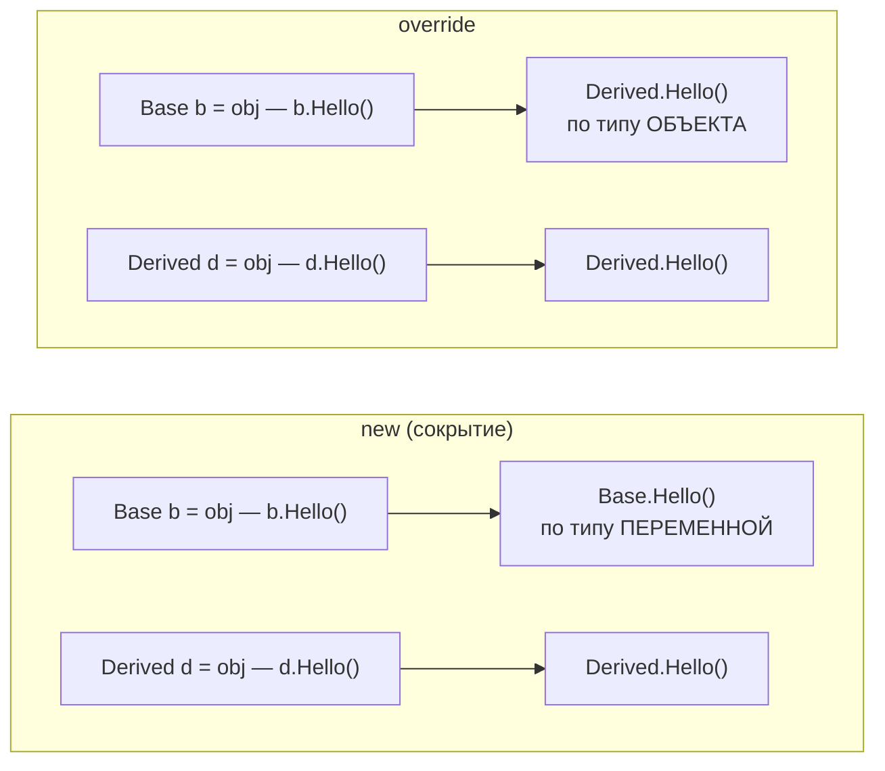

:::tldr
- **Перегрузка** (overload) — несколько методов с **одним именем и разными параметрами** в одном типе. Выбор делает **компилятор** по типам аргументов.
- **Переопределение** (`virtual` + `override`) — наследник заменяет реализацию метода базового класса. Выбор делается **во время выполнения** по **реальному типу объекта** — это полиморфизм.
- **Сокрытие** (`new`) — наследник объявляет **новый** метод с тем же именем, не связанный с базовым. Какой вызовется, зависит от **типа переменной**, а не объекта — источник неожиданных ошибок.
- `base.Method()` — вызвать реализацию базового класса из переопределения. `abstract` — метод без реализации, наследник **обязан** переопределить.
- По умолчанию методы в C# **не виртуальные** (в отличие от Java): переопределять можно только то, что явно разрешено `virtual`/`abstract`.
:::

## Перегрузка

```csharp
public class Printer
{
    public void Print(int value) => Console.WriteLine($"int: {value}");
    public void Print(double value) => Console.WriteLine($"double: {value}");
    public void Print(string value) => Console.WriteLine($"string: {value}");
    public void Print(string value, int times) { for (var i = 0; i < times; i++) Print(value); }
}

var p = new Printer();
p.Print(5);          // int: 5
p.Print(5.0);        // double: 5
p.Print("hi", 2);    // string: hi ×2
```

Сигнатура для перегрузки — это имя + **количество, типы и порядок параметров** (и модификаторы `ref`/`out`/`in`). **Тип возвращаемого значения не учитывается**: нельзя иметь `int Get()` и `string Get()`.

## Переопределение: virtual и override

```csharp
public class Notification
{
    public virtual string Format(string text) => text;                 // можно переопределить
}

public class UrgentNotification : Notification
{
    public override string Format(string text) => "⚠ " + base.Format(text).ToUpper();   // вызов базовой версии
}

Notification n = new UrgentNotification();     // переменная базового типа, объект — наследника
Console.WriteLine(n.Format("сервер упал"));    // ⚠ СЕРВЕР УПАЛ — вызвана версия наследника
```

## Сокрытие: new

```csharp
public class Base
{
    public void Hello() => Console.WriteLine("Base");          // НЕ virtual
}

public class Derived : Base
{
    public new void Hello() => Console.WriteLine("Derived");   // скрывает, а не переопределяет
}

Derived d = new Derived();
Base b = d;                    // тот же самый объект!

d.Hello();     // Derived — выбор по типу переменной Derived
b.Hello();     // Base    — выбор по типу переменной Base
```



Без ключевого слова `new` компилятор выдаст **предупреждение** CS0108 («член скрывает унаследованный член»), но код скомпилируется. `new` просто говорит «я знаю, что скрываю». На практике сокрытие почти всегда признак проблемы в дизайне; оно оправдано редко — например, когда базовый класс из чужой библиотеки позже добавил метод с таким же именем.

## Сравнение

| | Перегрузка | Переопределение (`override`) | Сокрытие (`new`) |
|---|---|---|---|
| Где | В одном типе (или иерархии) | В наследнике | В наследнике |
| Сигнатура | **Разные** параметры | **Такая же** | Такая же (или любая) |
| Требование к базовому методу | — | `virtual`, `abstract` или `override` | Нет |
| Когда выбирается | При компиляции | **Во время выполнения** | При компиляции |
| Критерий выбора | Типы аргументов | Реальный тип объекта | Тип переменной |
| Полиморфизм | Ad-hoc (статический) | Да (динамический) | Нет |

## abstract и запрет дальнейшего переопределения

```csharp
public abstract class Report
{
    public string Build() => Header() + Body();          // шаблонный метод
    protected virtual string Header() => "Отчёт\n";      // можно переопределить
    protected abstract string Body();                    // обязаны реализовать
}

public class SalesReport : Report
{
    protected sealed override string Body() => "Продажи: ...";   // наследники SalesReport не смогут переопределить
}
```

## Как работает виртуальный вызов


Каждый объект хранит ссылку на таблицу методов своего **реального** типа. Вызов виртуального метода — это переход по адресу из соответствующего слота. Невиртуальный метод вызывается напрямую по адресу, известному при компиляции — поэтому `new` не работает полиморфно.

## Типичные ошибки

:::warning Частые ошибки
- Забыли `virtual` в базовом классе и написали метод с тем же именем в наследнике — получили сокрытие и предупреждение вместо переопределения.
- Вызов виртуального метода в **конструкторе** базового класса: выполнится версия наследника, когда его поля ещё не инициализированы.
- Перегрузки с `null`-аргументом: `Print(null)` неоднозначен между `Print(string)` и `Print(object?)`.
- Перегрузки, отличающиеся только `params` или необязательными параметрами, — запутывают вызов.
:::

## Вопросы на засыпку

:::qa Можно ли переопределить статический метод?
Нет. Статические методы принадлежат типу и не участвуют в виртуальной диспетчеризации. В наследнике можно объявить статический метод с тем же именем — это будет сокрытие. (Исключение — `static abstract` члены интерфейсов в C# 11, используемые в дженериках, это другой механизм.)
:::

:::qa Можно ли при переопределении изменить модификатор доступа?
Нет, `override` должен сохранять доступность базового метода (`protected` остаётся `protected`). Тип возвращаемого значения с C# 9 можно сузить — ковариантный возврат (`override Dog Clone()` вместо `Animal Clone()`).
:::

:::qa Почему в C# методы по умолчанию не виртуальные?
Осознанное решение дизайна языка: виртуальный метод — точка расширения, которую нужно проектировать и поддерживать (контракт для наследников). Невиртуальные методы безопаснее для эволюции библиотек и немного быстрее. В Java наоборот — все методы виртуальные, пока не помечены `final`.
:::

:::qa Чем override отличается от реализации метода интерфейса?
Реализация интерфейса не требует `override` — это выполнение контракта, а не замена реализации базового класса. Если наследник должен иметь возможность изменить реализацию интерфейсного метода класса-родителя, метод в родителе нужно объявить `virtual`.
:::

## Итог

Перегрузка — разные параметры, выбор при компиляции; переопределение (`virtual`/`override`) — замена реализации, выбор во время выполнения по реальному типу объекта (это и есть полиморфизм); сокрытие (`new`) — независимый метод с тем же именем, выбор по типу переменной, используется редко. Помните, что в C# методы по умолчанию невиртуальные, и не вызывайте виртуальные методы из конструктора.
