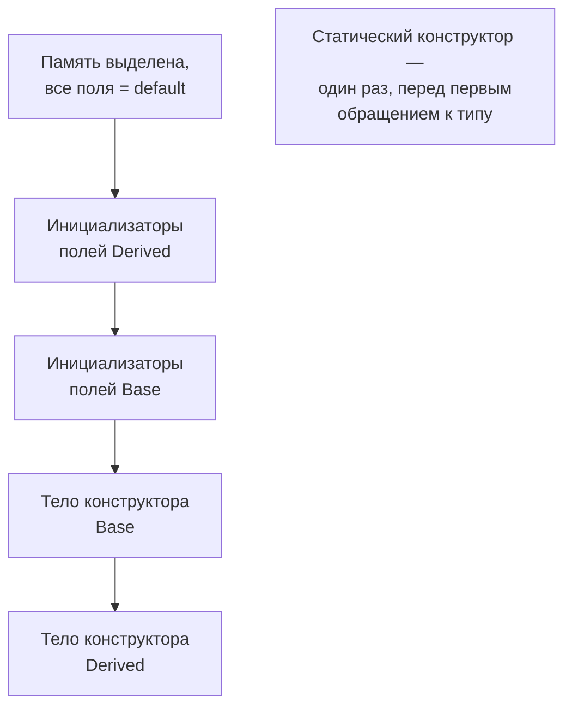
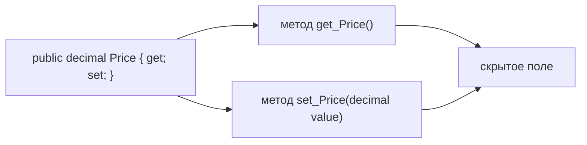

:::tldr
- **Конструктор** создаёт объект в корректном состоянии. Можно иметь несколько (перегрузка), вызывать друг друга через `: this(...)` и конструктор базового класса через `: base(...)`. Если не объявить ни одного — компилятор добавит пустой.
- **Порядок инициализации** при `new Derived()`: инициализаторы полей наследника → инициализаторы полей базового → **тело конструктора базового** → **тело конструктора наследника**. Статические конструкторы — один раз, до первого использования типа.
- **Свойство** — пара методов `get`/`set`, выглядящая как поле. Автосвойство `public string Name { get; set; }` создаёт скрытое поле. Свойства позволяют добавить проверку, вычисление, ограничить запись (`private set`).
- **`init`** — значение задаётся только при создании (в инициализаторе объекта), потом — только чтение. **`required`** (C# 11) — компилятор требует задать свойство при создании.
- **Primary constructors** (C# 12): `class Service(ILogger logger)` — параметры доступны во всём теле класса; удобно для внедрения зависимостей.
:::

## Конструкторы

```csharp
public class User
{
    public string Email { get; }
    public string Name { get; }
    public DateTime CreatedAt { get; }

    public User(string email, string name)
    {
        if (string.IsNullOrWhiteSpace(email)) throw new ArgumentException("Email обязателен", nameof(email));
        Email = email.Trim().ToLowerInvariant();
        Name = name;
        CreatedAt = DateTime.UtcNow;
    }

    public User(string email) : this(email, name: email.Split('@')[0]) { }   // цепочка конструкторов
}
```

Главная задача конструктора — гарантировать **корректное состояние** объекта сразу после создания: не должно существовать `User` без email.

## Порядок инициализации

```csharp
public class Base
{
    private readonly string _a = Log("1. поле Base");
    public Base() => Log("3. конструктор Base");
}

public class Derived : Base
{
    private readonly string _b = Log("0. поле Derived");
    public Derived() : base() => Log("4. конструктор Derived");
}
// new Derived() выведет: 0 → 1 → 3 → 4
```



:::warning Виртуальный вызов в конструкторе
Если конструктор `Base` вызывает виртуальный метод, переопределённый в `Derived`, выполнится версия `Derived` — до того, как отработало тело конструктора `Derived`. Поля, заданные в его теле, ещё не установлены → `NullReferenceException` или неверные данные. Не вызывайте виртуальные методы из конструкторов.
:::

## Свойства

```csharp
public class Product
{
    private decimal _price;                      // поле-хранилище (backing field)

    public string Name { get; set; } = "";       // автосвойство с инициализатором
    public Guid Id { get; } = Guid.NewGuid();    // только чтение, задаётся при создании
    public int Stock { get; private set; }       // читать — все, менять — только класс

    public decimal Price                          // полное свойство с проверкой
    {
        get => _price;
        set
        {
            if (value < 0) throw new ArgumentOutOfRangeException(nameof(value), "Цена не может быть отрицательной");
            _price = value;
        }
    }

    public bool InStock => Stock > 0;            // вычисляемое свойство

    public string Sku { get; set => field = value.ToUpperInvariant(); }   // C# 14: ключевое слово field
}
```



Почему свойства, а не публичные поля:
- Можно добавить **проверку** или логику, не меняя публичный API.
- Можно ограничить запись (`private set`, `init`, только `get`).
- Привязка данных, сериализация, ORM работают со свойствами.
- Изменение поля на свойство — **ломающее** изменение для скомпилированных клиентов (другие IL-инструкции).

## Инициализатор объекта, init, required

```csharp
public class OrderDto
{
    public required Guid CustomerId { get; init; }    // обязательно и неизменяемо после создания
    public required string Address { get; init; }
    public string? Comment { get; init; }             // необязательно
}

var dto = new OrderDto { CustomerId = id, Address = "Ташкент, ул. Навои 1" };   // инициализатор объекта
// dto.Address = "другой";          // ошибка: init-only
// var bad = new OrderDto { Address = "..." };   // ошибка: не задан required CustomerId
```

| Вариант | Когда задаётся | Потом |
|---|---|---|
| `{ get; set; }` | Когда угодно | Можно менять |
| `{ get; private set; }` | Внутри класса | Только класс |
| `{ get; init; }` | В конструкторе или инициализаторе объекта | Только чтение |
| `{ get; }` | В конструкторе или инициализаторе свойства | Только чтение |
| `required ... { get; init; }` | **Обязательно** при создании | Только чтение |

## Primary constructors (C# 12)

```csharp Внедрение зависимостей без шаблонного кода
public class OrderService(IOrderRepository repo, ILogger<OrderService> logger)
{
    public async Task<Order?> GetAsync(Guid id)
    {
        logger.LogInformation("Загрузка заказа {OrderId}", id);
        return await repo.GetAsync(id);
    }
}

// эквивалентно «старому» варианту:
public class OrderServiceOld
{
    private readonly IOrderRepository _repo;
    private readonly ILogger<OrderServiceOld> _logger;
    public OrderServiceOld(IOrderRepository repo, ILogger<OrderServiceOld> logger) { _repo = repo; _logger = logger; }
}
```

Нюанс: параметры primary constructor — **не** `readonly`-поля; их можно случайно переприсвоить внутри класса. Для `record` primary constructor создаёт публичные свойства, для `class`/`struct` — нет.

## Деконструктор и финализатор

- **Финализатор** `~MyClass()` — вызывается сборщиком мусора перед удалением объекта; нужен только для освобождения неуправляемых ресурсов, почти всегда вместо него используют `IDisposable` + `SafeHandle`.
- **Deconstruct** — не «деструктор», а метод для деконструкции: `var (x, y) = point;`.

## Вопросы на засыпку

:::qa Когда компилятор создаёт конструктор по умолчанию?
Только если в классе не объявлено ни одного конструктора. Как только вы объявили `User(string email)`, конструктор без параметров исчезает, и `new User()` не скомпилируется (это важно для сериализаторов и ORM, которым иногда нужен пустой конструктор).
:::

:::qa Чем init отличается от readonly-поля?
По смыслу похожи: значение задаётся только при создании. `readonly` — поле, задаётся в объявлении или конструкторе. `init` — свойство, которое дополнительно можно задать в **инициализаторе объекта** (`new X { Prop = ... }`) и при `with`-копировании record-ов.
:::

:::qa Может ли конструктор быть private? Зачем?
Да. Так запрещают создание экземпляров снаружи: паттерн Singleton, фабричные методы (`Money.FromSum(...)` с проверками), классы только со статическими членами (до появления `static class`), EF Core-сущности (приватный конструктор для ORM + публичный с параметрами для кода).
:::

:::qa Что такое статический конструктор и когда он вызывается?
Конструктор без параметров с модификатором `static`, инициализирующий статические данные. Вызывается CLR автоматически ровно один раз — перед созданием первого экземпляра или первым обращением к статическому члену; потокобезопасен. Исключение в нём делает тип непригодным (`TypeInitializationException`) до конца жизни процесса.
:::

## Итог

Конструктор отвечает за корректное начальное состояние объекта; цепочки `this(...)`/`base(...)` убирают дублирование, а порядок инициализации идёт от полей к телу конструкторов «сначала база, потом наследник». Свойства — методы доступа с возможностью проверки и ограничения записи; `init` и `required` позволяют делать неизменяемые объекты с обязательными полями, а primary constructors сокращают код внедрения зависимостей.
