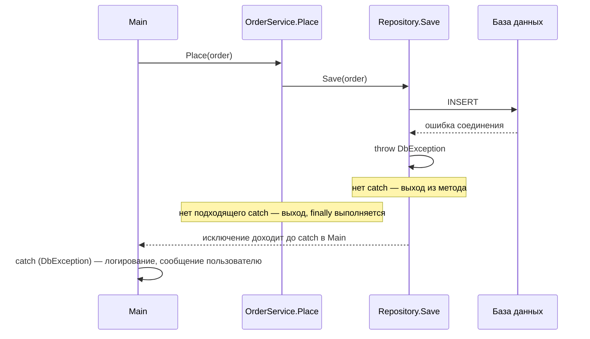
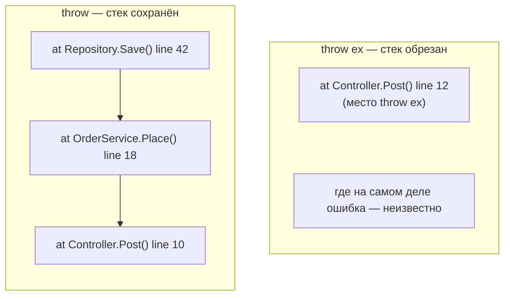
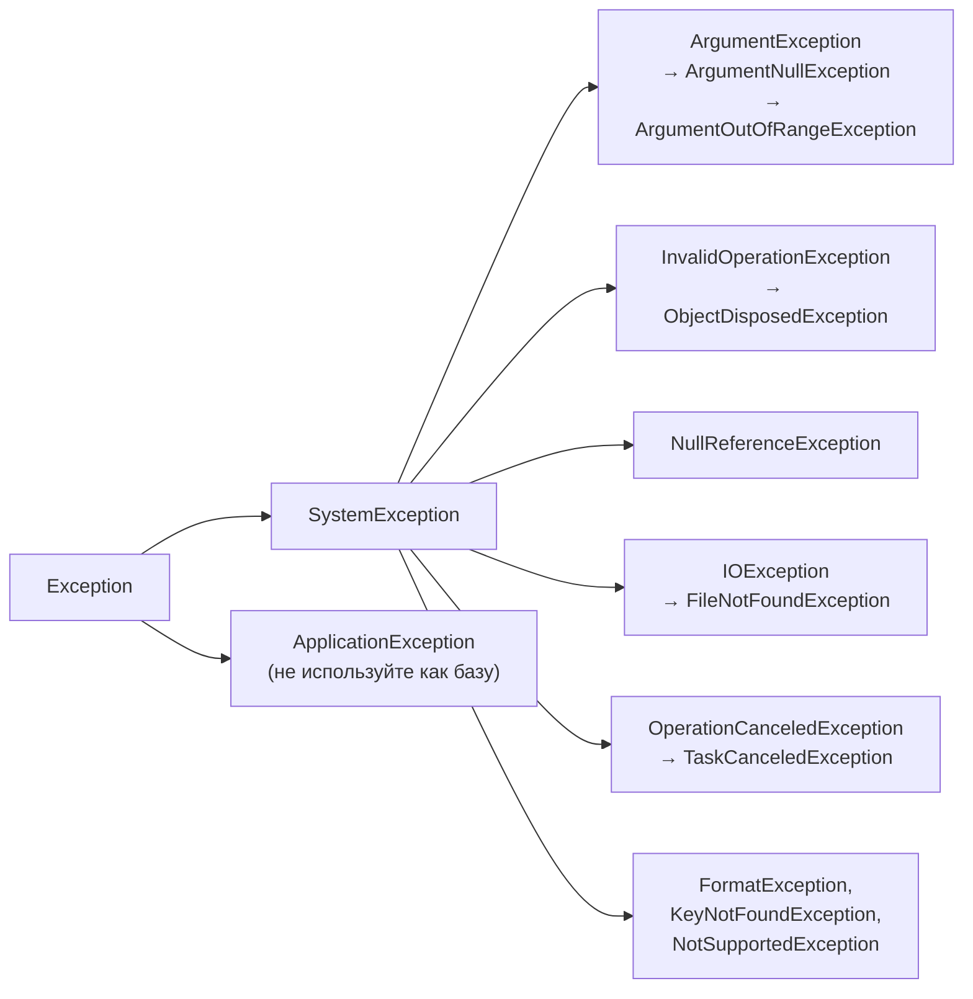

:::tldr
- **Исключение** — объект, описывающий ошибку, которую код не может обработать на месте. Выброс (`throw`) прерывает выполнение и раскручивает стек вызовов до ближайшего подходящего `catch`; если его нет — процесс (или запрос) падает.
- `try` — защищаемый код, `catch (ТипИсключения ex)` — обработка (от **частного к общему**), `finally` — выполняется **всегда** (освобождение ресурсов). `using` — короткая запись `try/finally` с `Dispose()`.
- **`throw;`** — перебросить исключение, **сохранив стек вызовов**. **`throw ex;`** — сбрасывает стек на текущее место → теряется информация, где ошибка возникла. Правильно — `throw;` или обернуть: `throw new XException("...", ex)`.
- Ловите только то, что можете **обработать** (повторить, показать сообщение, вернуть значение по умолчанию). Не глотайте исключения пустым `catch {}`.
- Исключения — для **исключительных** ситуаций, а не для обычного управления потоком: для ожидаемых ошибок (неверный ввод) — `TryParse`, проверки, `Result`-объекты.
:::

## Как работает выброс исключения



## try / catch / finally

```csharp
FileStream? file = null;
try
{
    file = File.OpenRead(path);
    var data = Parse(file);
    Console.WriteLine($"Прочитано {data.Count} записей");
}
catch (FileNotFoundException ex)              // частные — первыми
{
    Console.WriteLine($"Файл не найден: {ex.FileName}");
}
catch (UnauthorizedAccessException)
{
    Console.WriteLine("Нет доступа к файлу");
}
catch (Exception ex)                          // общий — последним (или не ловить вовсе)
{
    logger.LogError(ex, "Неожиданная ошибка при чтении {Path}", path);
    throw;                                    // не можем обработать — пробрасываем дальше
}
finally
{
    file?.Dispose();                          // выполнится при любом исходе
}
```

Тот же код с `using` — ресурс освободится автоматически:

```csharp
using var file = File.OpenRead(path);        // Dispose в конце области видимости, даже при исключении
var data = Parse(file);
```

## throw против throw ex

```csharp
try { ProcessOrder(order); }
catch (Exception ex)
{
    logger.LogError(ex, "Ошибка");
    throw ex;      // ПЛОХО: стек вызовов начнётся с этой строки
}

catch (Exception ex)
{
    logger.LogError(ex, "Ошибка");
    throw;         // ХОРОШО: исходный стек сохранён
}

catch (SqlException ex)
{
    throw new OrderSaveException($"Не удалось сохранить заказ {order.Id}", ex);   // ХОРОШО: обёртка с InnerException
}
```



## Иерархия исключений



| Исключение | Когда бросать / когда возникает |
|---|---|
| `ArgumentNullException` | Обязательный аргумент равен `null` (`ArgumentNullException.ThrowIfNull(x)`) |
| `ArgumentOutOfRangeException` | Аргумент вне допустимого диапазона |
| `ArgumentException` | Аргумент некорректен по другой причине |
| `InvalidOperationException` | Операция недопустима в текущем состоянии объекта (заказ уже оплачен) |
| `NotSupportedException` | Операция не поддерживается (запись в read-only коллекцию) |
| `KeyNotFoundException` | Ключа нет в словаре (`dict[key]`) |
| `NullReferenceException` | Обращение к члену `null` — **ошибка программиста**, не бросайте вручную |
| `OperationCanceledException` | Операция отменена через `CancellationToken` |

## Свои исключения

```csharp
public sealed class InsufficientFundsException : Exception
{
    public decimal Requested { get; }
    public decimal Available { get; }

    public InsufficientFundsException(decimal requested, decimal available)
        : base($"Недостаточно средств: запрошено {requested}, доступно {available}")
    {
        Requested = requested;
        Available = available;
    }
}
```

Правила: имя оканчивается на `Exception`, наследуется от `Exception` (или подходящего стандартного), передаёт сообщение и при необходимости `innerException`, содержит полезные данные для обработки. Не создавайте свой тип, если подходит стандартный.

## Фильтры исключений (when)

```csharp
try { await http.GetAsync(url, ct); }
catch (HttpRequestException ex) when (ex.StatusCode == HttpStatusCode.NotFound)
{
    return null;                         // 404 — ожидаемо, возвращаем null
}
catch (OperationCanceledException) when (ct.IsCancellationRequested)
{
    throw;                               // отмена пользователем — пробрасываем
}
```

Фильтр проверяется **до** раскрутки стека: если условие ложно, `catch` не срабатывает, и стек остаётся нетронутым для отладчика и дампов.

## Глобальная обработка

В ASP.NET Core не нужно оборачивать каждый контроллер в `try/catch`: необработанные исключения ловит middleware (`UseExceptionHandler`) и возвращает `ProblemDetails`. Подробнее — в разделе ASP.NET Core. В консольных приложениях — `AppDomain.CurrentDomain.UnhandledException` для логирования перед падением.

## Типичные ошибки

:::warning Анти-паттерны
- **Пустой catch** `catch { }` — ошибка исчезает бесследно, а программа продолжает работать в неверном состоянии.
- `catch (Exception)` на каждом уровне с логированием и `throw` — одна ошибка пишется в лог 5 раз.
- `throw ex;` вместо `throw;` — потерян стек.
- Исключения для управления потоком: `try { int.Parse(s) } catch { ... }` вместо `int.TryParse`. Исключения дорогие (сбор стека).
- Ловить `NullReferenceException` вместо того, чтобы исправить код.
- Бросать исключения из `finally` и `Dispose` — они подменяют исходное исключение.
:::

## Вопросы на засыпку

:::qa Выполнится ли finally, если в try есть return?
Да. `finally` выполняется после вычисления возвращаемого значения, но до фактического выхода из метода. Не выполнится он только при аварийном завершении процесса (`Environment.FailFast`, `StackOverflowException`, убийство процесса).
:::

:::qa Можно ли поймать StackOverflowException?
Нет, в .NET Core и новее переполнение стека завершает процесс без возможности обработки. Причина почти всегда — бесконечная рекурсия, исправлять нужно код.
:::

:::qa Почему исключения дорогие?
При выбросе собирается стек вызовов, ищутся обработчики, раскручиваются кадры стека, выполняются `finally`. Это в сотни–тысячи раз дороже обычного возврата значения. Для редких ошибок это неважно, но в горячем цикле или для ожидаемых ситуаций (валидация ввода) лучше `TryXxx` и возврат результата.
:::

:::qa Что такое AggregateException?
Контейнер для нескольких исключений: например, `Task.WaitAll` или `Parallel.ForEach`, где упали несколько задач. Внутренние исключения — в `InnerExceptions`. При `await` на задаче пробрасывается первое внутреннее исключение, а не обёртка.
:::

## Итог

Исключения сообщают об ошибках, которые нельзя обработать на месте: `try` защищает код, `catch` обрабатывает конкретные типы от частного к общему, `finally` и `using` гарантируют освобождение ресурсов. Перебрасывайте через `throw;`, оборачивайте с `innerException`, используйте фильтры `when`, ловите только то, что можете обработать, и не используйте исключения для обычной логики.
