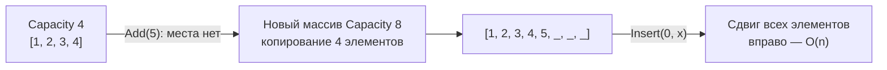
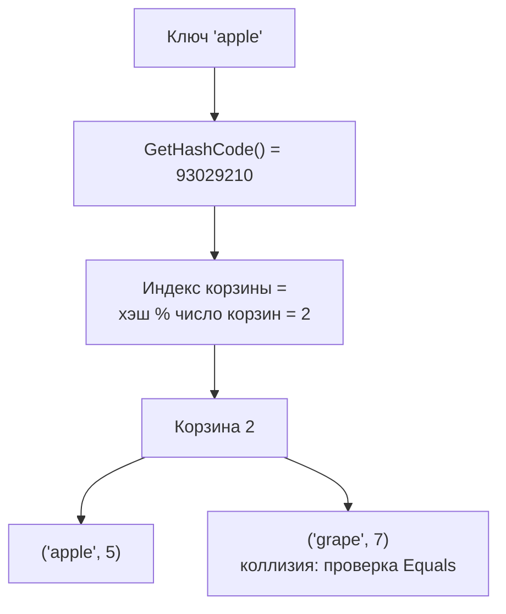
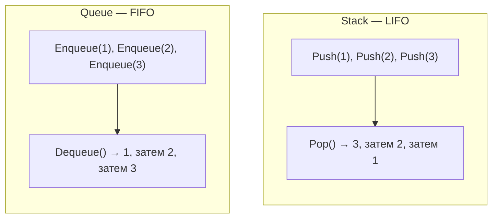
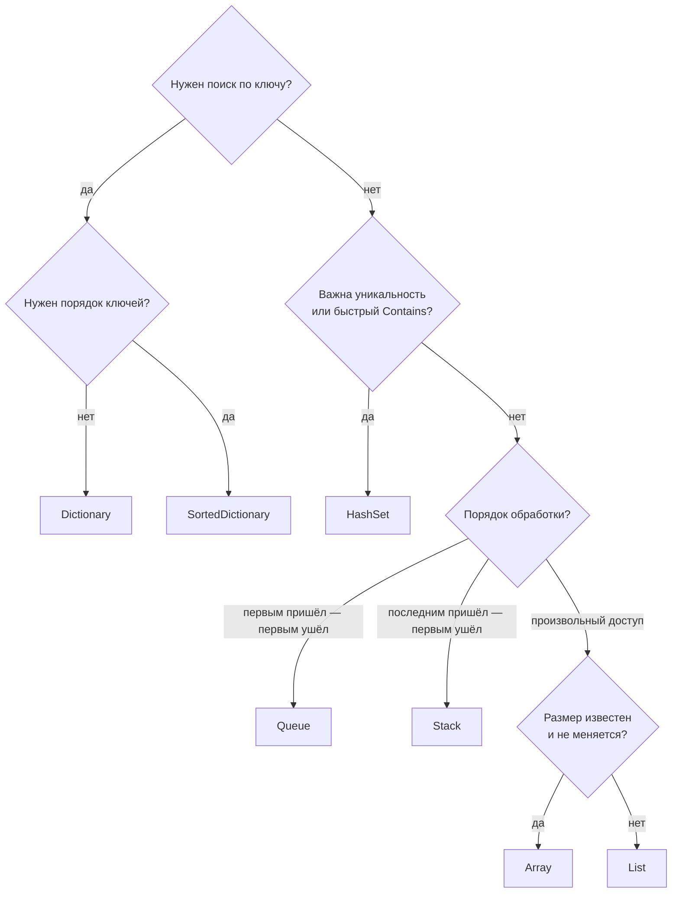

:::tldr
- **Array** `T[]` — фиксированный размер, быстрый доступ по индексу O(1). **`List<T>`** — динамический массив: добавление в конец амортизированно O(1), вставка/удаление в середине O(n), поиск по значению O(n).
- **`Dictionary<TKey, TValue>`** — хэш-таблица: поиск, добавление, удаление по ключу **O(1)** в среднем. **`HashSet<T>`** — множество уникальных значений с проверкой `Contains` за O(1).
- **`Queue<T>`** — FIFO (первым пришёл — первым ушёл), **`Stack<T>`** — LIFO; операции O(1). **`LinkedList<T>`** — вставка/удаление по узлу O(1), но нет доступа по индексу; на практике нужен редко.
- Отсортированные: `SortedDictionary` / `SortedSet` (дерево, O(log n)), `SortedList` (массив). Для потоков — `Concurrent*`, для неизменяемости — `Immutable*` и `IReadOnlyList`/`FrozenDictionary`.
- Выбор: «нужен доступ по индексу и порядок» → `List`; «поиск по ключу» → `Dictionary`; «уникальность / быстрый Contains» → `HashSet`; «обработка по очереди» → `Queue`.
:::

## Сложность операций

| Коллекция | Доступ по индексу | Поиск значения | Добавить в конец | Вставка/удаление в середине | По ключу |
|---|---|---|---|---|---|
| `T[]` | **O(1)** | O(n) | — (фиксированный размер) | — | — |
| `List<T>` | **O(1)** | O(n) | **O(1)** амортизированно | O(n) | — |
| `LinkedList<T>` | O(n) | O(n) | O(1) | O(1) при известном узле | — |
| `Dictionary<K,V>` | — | O(n) по значению | **O(1)** | — | **O(1)** |
| `HashSet<T>` | — | **O(1)** `Contains` | **O(1)** | — | — |
| `SortedDictionary<K,V>` | — | — | O(log n) | — | O(log n) |
| `Queue<T>` / `Stack<T>` | — | O(n) | **O(1)** Enqueue/Push | — | — |

## Как устроен List



```csharp
var list = new List<int>(capacity: 1000);   // задайте ёмкость, если размер известен — меньше копирований
list.Add(1);
list.AddRange([2, 3, 4]);
int first = list[0];                          // O(1)
bool has = list.Contains(3);                  // O(n) — перебор
list.Remove(3);                               // O(n): поиск + сдвиг
list.RemoveAt(list.Count - 1);                // O(1) с конца
list.Sort();                                  // O(n log n)
```

## Как устроен Dictionary



```csharp
var stock = new Dictionary<string, int>(StringComparer.OrdinalIgnoreCase)
{
    ["apple"] = 5,
    ["pear"] = 3,
};

stock["banana"] = 10;                        // добавить или заменить
stock.Add("kiwi", 1);                        // ArgumentException, если ключ уже есть
int n = stock["apple"];                      // KeyNotFoundException, если ключа нет!

if (stock.TryGetValue("mango", out var count))   // безопасное чтение — одна операция поиска
    Console.WriteLine(count);

stock.TryAdd("pear", 100);                   // false — уже есть, значение не меняется
stock.Remove("pear");
foreach (var (fruit, qty) in stock) Console.WriteLine($"{fruit}: {qty}");   // порядок не гарантирован
```

:::warning Требования к ключу
Ключ должен корректно реализовывать `GetHashCode` и `Equals`, а его хэш **не должен меняться**, пока объект лежит в словаре. Изменяемый объект в качестве ключа, у которого поменяли поле, участвующее в хэше, «потеряется» в словаре. Подробнее — в вопросе про `Equals` и `GetHashCode`.
:::

## HashSet

```csharp
var seen = new HashSet<string>();
foreach (var email in emails)
    if (!seen.Add(email))                    // Add возвращает false для дубликата
        Console.WriteLine($"Дубликат: {email}");

var a = new HashSet<int> { 1, 2, 3 };
var b = new HashSet<int> { 2, 3, 4 };
a.IntersectWith(b);   // {2, 3} — также UnionWith, ExceptWith, IsSubsetOf
```

Классическая оптимизация: проверка `list.Contains(x)` внутри цикла — O(n²); замена списка на `HashSet` даёт O(n).

## Queue и Stack



```csharp
var tasks = new Queue<string>();
tasks.Enqueue("письмо 1"); tasks.Enqueue("письмо 2");
while (tasks.TryDequeue(out var t)) Send(t);       // обработка в порядке поступления

var undo = new Stack<string>();
undo.Push("ввёл текст"); undo.Push("удалил строку");
var last = undo.Pop();                              // "удалил строку" — отмена последнего действия

var pq = new PriorityQueue<string, int>();          // очередь с приоритетом (.NET 6+)
pq.Enqueue("обычный", 5); pq.Enqueue("срочный", 1);
pq.Dequeue();                                       // "срочный"
```

## Как выбрать



## Интерфейсы коллекций

| Интерфейс | Что даёт | Когда принимать/возвращать |
|---|---|---|
| `IEnumerable<T>` | Только перебор `foreach` | Параметр метода, если нужно лишь перебрать |
| `IReadOnlyCollection<T>` | + `Count` | Возврат готовой коллекции без права изменения |
| `IReadOnlyList<T>` | + доступ по индексу | Возврат списка «только для чтения» |
| `ICollection<T>` | + `Add`, `Remove`, `Contains` | Редко в публичных API |
| `IList<T>` | + индекс, `Insert` | Когда нужен изменяемый список с индексом |
| `IDictionary` / `IReadOnlyDictionary` | Доступ по ключу | Аналогично для словарей |

```csharp
public IReadOnlyList<OrderLine> Lines => _lines;      // наружу — без права изменения
public decimal Sum(IEnumerable<decimal> values) => values.Sum();   // принимаем минимально необходимое
```

## Вопросы на засыпку

:::qa Почему нельзя изменять List внутри foreach по нему?
Перечислитель хранит «версию» коллекции; `Add`/`Remove` её меняют, и следующий шаг `foreach` бросает `InvalidOperationException: Collection was modified`. Решения: перебор по индексу с конца (`for (i = Count - 1; i >= 0; i--)`), `RemoveAll(predicate)`, или сбор изменений в отдельный список.
:::

:::qa Почему Dictionary в среднем O(1), а в худшем O(n)?
Если много ключей попадает в одну корзину (плохая `GetHashCode`, например всегда возвращающая 0), поиск превращается в перебор цепочки. Хорошая хэш-функция распределяет ключи равномерно, и в корзине в среднем 0–1 элемент.
:::

:::qa Чем Array отличается от List на практике?
Массив фиксированного размера и чуть быстрее; `List` растёт и имеет удобные методы. В бизнес-коде обычно используют `List<T>`, массивы — для фиксированных данных, низкоуровневого кода и API, которые их требуют (`Span<T>`, `params`).
:::

:::qa Сохраняет ли Dictionary порядок добавления?
Не гарантирует. В текущей реализации без удалений порядок часто совпадает с порядком добавления, но полагаться на это нельзя. Для гарантированного порядка — `SortedDictionary` (по ключу) или `OrderedDictionary<TKey, TValue>` (.NET 9, по добавлению).
:::

## Итог

`List<T>` — универсальный выбор для упорядоченных данных с доступом по индексу, `Dictionary` — для быстрого поиска по ключу, `HashSet` — для уникальности и быстрого `Contains`, `Queue` и `Stack` — для обработки в порядке FIFO/LIFO. Знайте сложность операций: `Contains` у списка — O(n), у множества — O(1). Наружу отдавайте read-only интерфейсы, а принимайте минимально необходимый (`IEnumerable<T>`).
