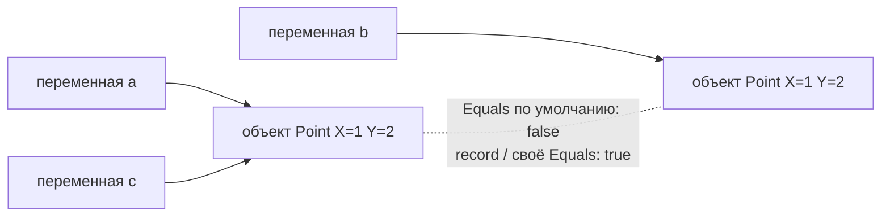
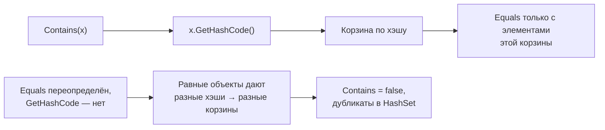

:::tldr
- Два вида равенства: **ссылочное** (это один и тот же объект в памяти) и **по значению** (объекты содержат одинаковые данные).
- Для **классов** по умолчанию `==` и `Equals` сравнивают **ссылки**. Для **struct** `Equals` сравнивает поля (медленно, через рефлексию), а `==` не определён, пока его не объявить. Для **string** и **record** — сравнение по значению.
- `ReferenceEquals(a, b)` — всегда только ссылки. `Equals` — виртуальный метод (можно переопределить), `==` — статический оператор (выбирается по типу переменной при компиляции).
- **Контракт**: если `a.Equals(b)`, то `a.GetHashCode() == b.GetHashCode()`. Переопределили `Equals` — **обязательно** переопределите `GetHashCode`, иначе `Dictionary` и `HashSet` сломаются.
- Проще всего получить равенство по значению — **`record`**: компилятор сгенерирует `Equals`, `GetHashCode`, `==`, `!=` и `ToString`.
:::

## Ссылочное равенство и равенство по значению

```csharp
public class Point { public int X; public int Y; }

var a = new Point { X = 1, Y = 2 };
var b = new Point { X = 1, Y = 2 };
var c = a;

Console.WriteLine(a == b);                 // False — разные объекты
Console.WriteLine(a.Equals(b));            // False — Equals по умолчанию тоже сравнивает ссылки
Console.WriteLine(a == c);                 // True — одна и та же ссылка
Console.WriteLine(ReferenceEquals(a, c));  // True
```



## Поведение по умолчанию

| Тип | `==` | `Equals` |
|---|---|---|
| `class` | Ссылки | Ссылки |
| `struct` | Не определён (ошибка компиляции) | Все поля (через рефлексию — медленно) |
| `string` | Содержимое | Содержимое |
| `record` / `record struct` | Значения свойств | Значения свойств |
| Примитивы (`int`, `double`) | Значение | Значение |

## Equals против ==

```csharp
object s1 = "hello";
object s2 = new string("hello".ToCharArray());

Console.WriteLine(s1 == s2);        // False! оператор выбран по типу переменной object — сравнение ссылок
Console.WriteLine(s1.Equals(s2));   // True — виртуальный string.Equals по реальному типу
```

`==` — статический оператор, компилятор выбирает его по **объявленному** типу переменных. `Equals` — виртуальный метод, вызывается по **реальному** типу объекта. Поэтому при работе через `object` или дженерики результат может различаться.

## Как правильно реализовать равенство

```csharp Вариант 1: record — всё генерируется
public sealed record Money(decimal Amount, string Currency);

new Money(100, "UZS") == new Money(100, "UZS");   // True
```

```csharp Вариант 2: вручную для класса
public sealed class Email : IEquatable<Email>
{
    public string Value { get; }
    public Email(string value) => Value = value.Trim().ToLowerInvariant();

    public bool Equals(Email? other) => other is not null && Value == other.Value;
    public override bool Equals(object? obj) => Equals(obj as Email);
    public override int GetHashCode() => Value.GetHashCode();

    public static bool operator ==(Email? a, Email? b) => a is null ? b is null : a.Equals(b);
    public static bool operator !=(Email? a, Email? b) => !(a == b);
}
```

Свойства корректного `Equals`:
- **Рефлексивность**: `a.Equals(a)` — `true`.
- **Симметричность**: `a.Equals(b) == b.Equals(a)`.
- **Транзитивность**: если `a == b` и `b == c`, то `a == c`.
- **Согласованность**: результат не меняется, пока объекты не меняются.
- `a.Equals(null)` — `false`, без исключения.

## Зачем GetHashCode



```csharp
public override int GetHashCode() => HashCode.Combine(X, Y);    // для нескольких полей
```

Правила `GetHashCode`:
- Равные объекты — **равные** хэши (обратное не обязательно: коллизии допустимы).
- Использовать те же поля, что и `Equals`.
- Хэш не должен меняться, пока объект в словаре или множестве → используйте **неизменяемые** поля.
- Быстрый и с хорошим распределением — `HashCode.Combine`.

:::warning Изменяемый ключ
```csharp
var p = new MutablePoint { X = 1 };
var set = new HashSet<MutablePoint> { p };
p.X = 2;                        // хэш изменился
set.Contains(p);                // False — объект «потерялся» в своей старой корзине
```
Ключи словарей и элементы множеств должны быть неизменяемыми (record, readonly struct, строки, Guid).
:::

## Сравнение для сортировки

Равенство отвечает на «одинаковы ли?», а сортировка — на «кто больше?»: интерфейсы `IComparable<T>` (метод `CompareTo`) и `IComparer<T>`.

```csharp
var sorted = people.OrderBy(p => p.LastName).ThenBy(p => p.FirstName).ToList();
var comparer = Comparer<Person>.Create((a, b) => a.Age.CompareTo(b.Age));
```

## Вопросы на засыпку

:::qa Почему у двух разных объектов может быть одинаковый GetHashCode?
Хэш — `int` (около 4 млрд значений), а различных объектов может быть бесконечно много — коллизии неизбежны. Поэтому хэш-таблицы после совпадения хэша дополнительно проверяют `Equals`. Требуется только, чтобы равные объекты давали равные хэши.
:::

:::qa Зачем реализовывать IEquatable<T>, если есть Equals(object)?
`Equals(object)` требует приведения типа, а для struct — упаковки (boxing) аргумента. `IEquatable<T>.Equals(T)` строго типизирован и без упаковки; его используют `List.Contains`, `Dictionary`, LINQ `Distinct` через `EqualityComparer<T>.Default`.
:::

:::qa Как сравнить сущности EF Core на равенство?
Сущности (Entity) сравнивают по **идентификатору**, а не по всем полям: два объекта `Order` с одним `Id` — один и тот же заказ, даже если данные в памяти разные. Value Object (Money, Address) сравнивают по всем значениям — это хорошо ложится на `record`.
:::

:::qa Что вернёт new object().Equals(new object())?
`false`: базовый `Object.Equals` сравнивает ссылки, а это два разных объекта.
:::

## Итог

По умолчанию классы сравниваются по ссылке, `string` и `record` — по значению. `==` выбирается компилятором по типу переменной, `Equals` — по реальному типу объекта. Для равенства по значению используйте `record` или реализуйте `IEquatable<T>`, `Equals`, `GetHashCode` и операторы вместе, на основе неизменяемых полей, иначе словари и множества будут работать неверно.
