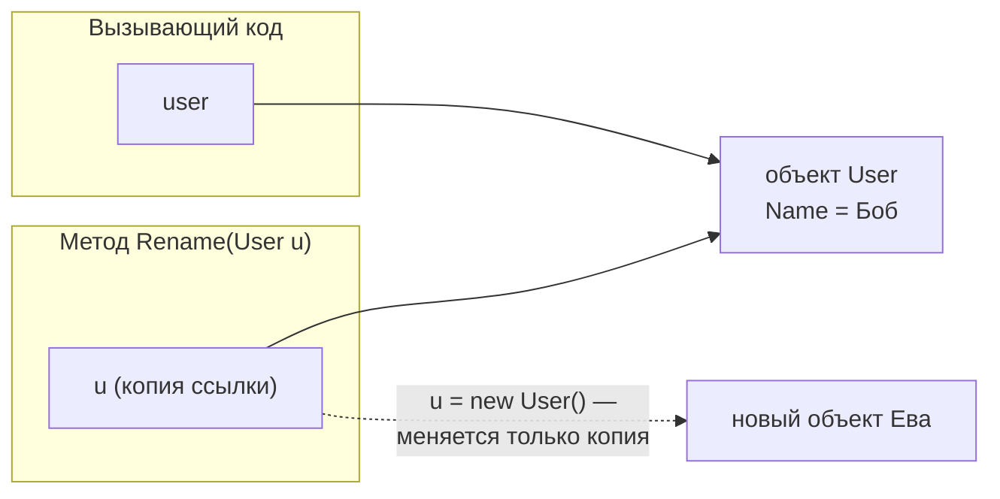

:::tldr
- В C# **всё передаётся по значению** по умолчанию: метод получает **копию** аргумента. Для значимых типов копируется само значение, для ссылочных — **копия ссылки** (на тот же объект). Поэтому метод может изменить **содержимое** объекта, но не может заменить объект у вызывающего.
- **`ref`** — передача по ссылке: метод работает с **самой переменной** вызывающего, может её прочитать и переприсвоить. Переменная должна быть инициализирована.
- **`out`** — выходной параметр: метод **обязан** присвоить значение, вызывающему не нужно инициализировать переменную (`int.TryParse(s, out var n)`).
- **`in`** — передача по ссылке **только для чтения** (оптимизация для больших struct). **`params`** — переменное число аргументов (`Sum(1, 2, 3)`).
- **Необязательные** параметры имеют значения по умолчанию; **именованные** аргументы повышают читаемость: `Send(to: email, retry: false)`.
:::

## Передача по значению

```csharp
void Increment(int x) { x++; }                 // копия значения

void Rename(User u) { u.Name = "Боб"; }        // копия ССЫЛКИ — меняем общий объект
void Replace(User u) { u = new User("Ева"); }  // переприсвоили копию ссылки — снаружи ничего не изменилось

int n = 5;
Increment(n);
Console.WriteLine(n);          // 5

var user = new User("Анна");
Rename(user);
Console.WriteLine(user.Name);  // Боб — объект изменён
Replace(user);
Console.WriteLine(user.Name);  // Боб — замена не видна вызывающему
```



## ref

```csharp
void Swap(ref int a, ref int b) { (a, b) = (b, a); }

int x = 1, y = 2;
Swap(ref x, ref y);               // ref обязателен и при вызове — видно, что переменная изменится
Console.WriteLine($"{x} {y}");    // 2 1

void Reset(ref User u) { u = new User("Новый"); }
Reset(ref user);                  // теперь переменная user указывает на новый объект
```

## out

```csharp
if (int.TryParse("42", out int number))          // переменную можно объявить прямо в вызове
    Console.WriteLine(number * 2);

bool TryGetDiscount(string code, out decimal percent)
{
    if (code == "SALE10") { percent = 10; return true; }
    percent = 0;                                  // обязан присвоить на всех путях
    return false;
}

_ = int.TryParse(input, out _);                   // discard — значение не нужно
```

Паттерн **TryXxx**: возвращает `bool` об успехе, а результат — через `out`. Позволяет обойтись без исключений для ожидаемых неудач.

Для возврата нескольких значений в современном коде чаще используют **кортежи** или record:

```csharp
(decimal min, decimal max) GetRange(IEnumerable<decimal> values) => (values.Min(), values.Max());
var (min, max) = GetRange(prices);
```

## in

```csharp
public readonly struct Matrix4x4Big { /* 64 байта данных */ }

double Determinant(in Matrix4x4Big m) => /* читаем m без копирования 64 байт */ 0;
// m = default;   // ошибка: in-параметр только для чтения
```

`in` нужен для производительности при передаче **больших** `readonly struct`. Для маленьких типов (`int`, `Guid`) выигрыша нет.

## Сравнение

| Модификатор | Направление | Инициализация до вызова | Метод обязан присвоить | Может изменить переменную вызывающего |
|---|---|---|---|---|
| (нет) | В метод (копия) | Да | Нет | Нет |
| `ref` | В обе стороны | **Да** | Нет | **Да** |
| `out` | Из метода | Нет | **Да** | Да |
| `in` | В метод (по ссылке) | Да | Нет | Нет (только чтение) |

## params

```csharp
int Sum(params int[] numbers) => numbers.Sum();

Sum();              // 0 — пустой массив
Sum(1, 2, 3);       // 6
Sum([4, 5]);        // можно передать массив

void Log(string format, params object?[] args) => Console.WriteLine(format, args);

int SumFast(params ReadOnlySpan<int> numbers) { /* C# 13: без выделения массива в куче */ return 0; }
```

`params` должен быть **последним** параметром, и он может быть только один.

## Необязательные и именованные аргументы

```csharp
void SendEmail(string to, string subject = "Без темы", bool highPriority = false, int retries = 3) { }

SendEmail("a@mail.uz");
SendEmail("a@mail.uz", "Счёт");
SendEmail("a@mail.uz", highPriority: true);              // пропустили subject по имени
SendEmail(to: "a@mail.uz", retries: 0, subject: "Отчёт"); // любой порядок именованных
```

Значение по умолчанию должно быть константой времени компиляции (`null`, литерал, `default`). Нельзя: `DateTime.Now`, `new List<int>()` — для таких случаев используют `null` и присваивание внутри.

:::warning Ловушка необязательных параметров в библиотеках
Значение по умолчанию **подставляется в код вызывающего** при компиляции. Если библиотека изменит `retries = 3` на `5`, уже скомпилированные клиенты продолжат передавать `3`. Для публичных API безопаснее перегрузки.
:::

## Вопросы на засыпку

:::qa Передаются ли объекты в C# по ссылке?
Нет — по значению передаётся **ссылка**. Метод может изменить содержимое объекта через эту копию ссылки, но присваивание параметру нового объекта не повлияет на переменную вызывающего. Настоящая передача по ссылке — только с `ref`/`out`/`in`.
:::

:::qa Чем ref отличается от out?
`ref` требует, чтобы переменная была инициализирована до вызова, и метод может её прочитать; присваивать не обязан. `out` не требует инициализации, метод не может читать значение до присваивания и обязан присвоить его на всех путях выполнения.
:::

:::qa Можно ли использовать ref и out в async-методах?
Нет: async-метод может приостановиться, и ссылка на переменную в стеке вызывающего стала бы недействительной. Вместо `out` в асинхронном коде возвращают кортеж или объект-результат: `Task<(bool ok, Order? order)>`.
:::

:::qa Что выведет код со string, переданной в метод и изменённой там?
Ничего не изменится у вызывающего: строки неизменяемы, а `s = s + "x"` внутри метода создаёт новую строку и меняет лишь локальную копию ссылки. Нужно вернуть результат или использовать `ref`.
:::

## Итог

По умолчанию аргументы передаются по значению: для ссылочных типов это копия ссылки на общий объект. `ref` даёт методу доступ к самой переменной вызывающего, `out` — способ вернуть дополнительный результат (паттерн TryXxx), `in` — передача больших struct без копирования, `params` — переменное число аргументов. Необязательные и именованные аргументы делают вызовы короче и читаемее.
