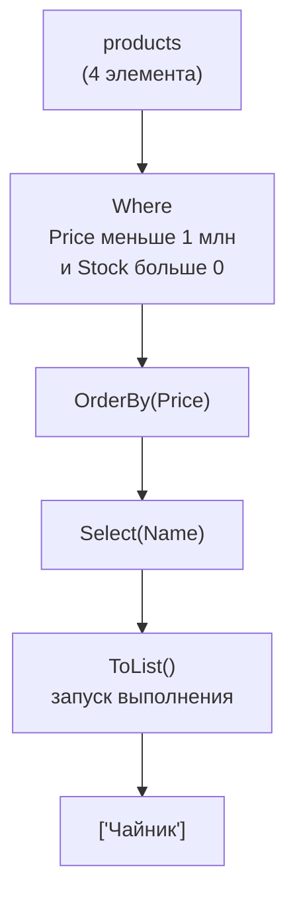
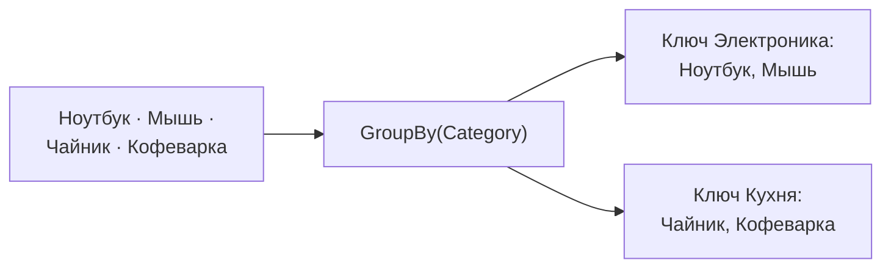

:::tldr
- **LINQ** (Language Integrated Query) — единый набор операторов для запросов к коллекциям, БД (EF Core), XML. Работает с любым `IEnumerable<T>`.
- Основные операторы: **`Where`** (фильтр), **`Select`** (преобразование), **`OrderBy`/`ThenBy`** (сортировка), **`GroupBy`** (группировка), **`Join`**, агрегаты `Count`, `Sum`, `Min`, `Max`, `Average`, `Distinct`, `Skip`/`Take` (пагинация).
- **`First`** — первый элемент, **исключение** если пусто; **`FirstOrDefault`** — `default`/`null` если пусто; **`Single`** — ровно один элемент, иначе исключение (проверяет уникальность).
- **`Any()`** быстрее **`Count() > 0`**: останавливается на первом элементе.
- LINQ-запросы **ленивые**: выполняются при переборе (`foreach`, `ToList`, `Count`). Повторный перебор выполняет запрос **заново**. Материализуйте через `ToList()`, если результат используется несколько раз.
:::

## Два синтаксиса

```csharp
var products = new List<Product>
{
    new("Ноутбук", "Электроника", 9_500_000m, 3),
    new("Мышь", "Электроника", 150_000m, 0),
    new("Чайник", "Кухня", 420_000m, 12),
    new("Кофеварка", "Кухня", 2_300_000m, 5),
};

// Method syntax (используется чаще)
var cheap = products
    .Where(p => p.Price < 1_000_000m && p.Stock > 0)
    .OrderBy(p => p.Price)
    .Select(p => p.Name)
    .ToList();                                    // ["Чайник"]

// Query syntax (похож на SQL)
var cheap2 = (from p in products
              where p.Price < 1_000_000m && p.Stock > 0
              orderby p.Price
              select p.Name).ToList();
```

Оба варианта компилируются в одно и то же. Query syntax удобнее для `join` и `let`, method syntax — для всего остального и единственный, где доступны `Count`, `Take`, `Any` и др.

## Конвейер операторов



## Основные операторы

| Оператор | Что делает | Пример |
|---|---|---|
| `Where` | Фильтрация | `.Where(o => o.Total > 100)` |
| `Select` | Преобразование каждого элемента | `.Select(o => new { o.Id, o.Total })` |
| `SelectMany` | «Разворачивает» вложенные коллекции | `orders.SelectMany(o => o.Lines)` |
| `OrderBy` / `OrderByDescending` / `ThenBy` | Сортировка | `.OrderBy(u => u.LastName).ThenBy(u => u.FirstName)` |
| `GroupBy` | Группировка по ключу | `.GroupBy(p => p.Category)` |
| `Join` | Соединение двух последовательностей | см. ниже |
| `Distinct` / `DistinctBy` | Уникальные элементы | `.DistinctBy(u => u.Email)` |
| `Skip` / `Take` | Пропустить / взять N | `.Skip(20).Take(10)` — 3-я страница |
| `Count`, `Sum`, `Min`, `Max`, `Average` | Агрегаты | `.Sum(l => l.Price * l.Qty)` |
| `Any` / `All` | Есть ли хоть один / все ли | `.Any(o => o.IsPaid)` |
| `Contains` | Есть ли значение | `ids.Contains(x.Id)` |
| `ToList`, `ToArray`, `ToDictionary` | Материализация | `.ToDictionary(p => p.Id)` |

## GroupBy

```csharp
var byCategory = products
    .GroupBy(p => p.Category)
    .Select(g => new
    {
        Category = g.Key,
        Count = g.Count(),
        TotalStock = g.Sum(p => p.Stock),
        MostExpensive = g.MaxBy(p => p.Price)!.Name
    })
    .ToList();
// Электроника: 2 товара, остаток 3, самый дорогой — Ноутбук
// Кухня: 2 товара, остаток 17, самый дорогой — Кофеварка
```



## Join

```csharp
var result = orders.Join(customers,
        o => o.CustomerId,          // ключ из заказа
        c => c.Id,                  // ключ из клиента
        (o, c) => new { o.Id, c.Name, o.Total })
    .ToList();

// Query syntax читается проще:
var result2 = from o in orders
              join c in customers on o.CustomerId equals c.Id
              select new { o.Id, c.Name, o.Total };
```

## First, FirstOrDefault, Single, SingleOrDefault

| Метод | 0 элементов | 1 элемент | 2 и более |
|---|---|---|---|
| `First()` | **Исключение** | Элемент | Первый |
| `FirstOrDefault()` | `default` (`null`) | Элемент | Первый |
| `Single()` | **Исключение** | Элемент | **Исключение** |
| `SingleOrDefault()` | `default` (`null`) | Элемент | **Исключение** |

```csharp
var user = users.FirstOrDefault(u => u.Email == email);   // null, если не нашли
if (user is null) return NotFound();

var config = settings.Single(s => s.Key == "Theme");       // гарантирует, что такая настройка ровно одна
var top = orders.OrderByDescending(o => o.Total).First();  // исключение, если заказов нет
```

Когда что: `FirstOrDefault` — «найти, может не быть»; `First` — элемент точно должен быть (иначе это ошибка); `Single` — когда дубликат означает испорченные данные. `Single` дороже: проверяет, что второго совпадения нет.

## Any против Count

```csharp
if (orders.Count() > 0) { }          // для IEnumerable перебирает ВСЁ
if (orders.Any()) { }                 // останавливается на первом элементе
if (orders.Any(o => o.IsOverdue)) { } // есть ли хоть один просроченный

if (list.Count > 0) { }               // у List свойство Count — O(1), тоже нормально
```

## Ленивое выполнение

```csharp
var expensive = products.Where(p => p.Price > 1_000_000m);   // запрос ещё НЕ выполнен

products.Add(new("Телефон", "Электроника", 5_000_000m, 7));
Console.WriteLine(expensive.Count());    // 3 — включает Телефон: выполнилось сейчас

var snapshot = expensive.ToList();       // выполнено и сохранено
```

:::warning Повторное выполнение
```csharp
var query = orders.Where(o => ExpensiveCheck(o));   // ленивый
var count = query.Count();                           // выполнение №1
foreach (var o in query) { }                         // выполнение №2 — ExpensiveCheck снова для всех
```
Если результат нужен несколько раз — материализуйте: `var list = query.ToList();`. В EF Core каждый перебор `IQueryable` — новый SQL-запрос к базе.
:::

## Вопросы на засыпку

:::qa Чем Select отличается от SelectMany?
`Select` преобразует каждый элемент в один результат: из списка заказов получится список списков строк. `SelectMany` «расплющивает»: из заказов с их строками получится один общий список всех строк.
:::

:::qa Что быстрее: Where(...).First() или First(...)?
По сути одинаково: оба ленивы и останавливаются на первом совпадении. `First(predicate)` чуть короче и без лишнего промежуточного итератора; это вопрос стиля.
:::

:::qa Почему OrderBy(...).OrderBy(...) — ошибка?
Второй `OrderBy` полностью пересортирует последовательность, отбросив первую сортировку. Для сортировки по нескольким полям используют `OrderBy(...).ThenBy(...)`.
:::

:::qa Как сделать пагинацию через LINQ?
`.OrderBy(x => x.Id).Skip((page - 1) * size).Take(size)`. Сортировка обязательна: без неё порядок не определён, и страницы могут повторять или пропускать элементы (особенно в SQL). Для больших таблиц лучше «keyset»-пагинация по последнему Id.
:::

## Итог

LINQ даёт декларативные операторы для работы с коллекциями: `Where` фильтрует, `Select` преобразует, `OrderBy`/`ThenBy` сортируют, `GroupBy` группирует, агрегаты считают. Выбирайте `FirstOrDefault`, `First` и `Single` по смыслу, проверяйте наличие через `Any()`, помните о ленивом выполнении и материализуйте результат через `ToList()`, если он нужен несколько раз.
