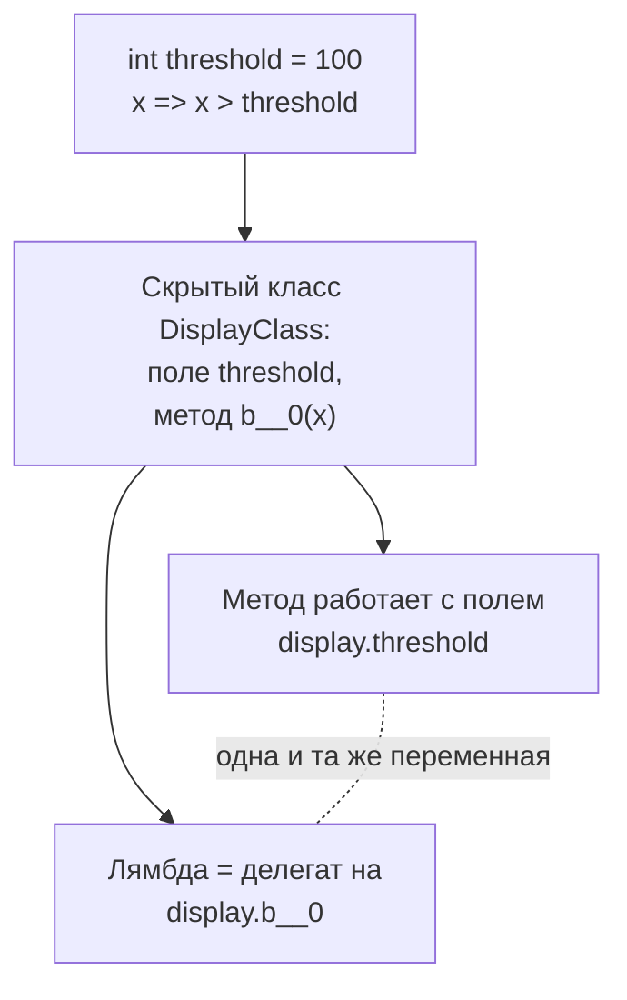
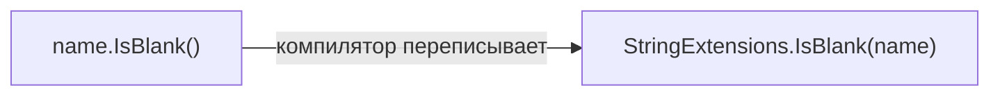

:::tldr
- **Лямбда** — анонимная функция, записанная кратко: `x => x * 2`, `(a, b) => a + b`, `() => Console.WriteLine("Hi")`. Присваивается делегату (`Func<int, int>`, `Action`) или дереву выражений (`Expression<Func<...>>`, для EF Core).
- **Замыкание** (closure) — лямбда, использующая переменные внешнего метода. Она захватывает **саму переменную**, а не её значение в момент создания: если переменная изменится, лямбда увидит новое значение. Компилятор переносит захваченные переменные в скрытый класс.
- Ловушка: захват переменной цикла `for` — все лямбды видят **последнее** значение. `foreach` с C# 5 создаёт новую переменную на каждой итерации.
- **Метод расширения** — статический метод в статическом классе с `this` перед первым параметром: вызывается как метод экземпляра (`text.IsBlank()`). Так устроен весь LINQ.
- Методы расширения не имеют доступа к `private`-членам и не переопределяют существующие методы: собственный метод экземпляра всегда имеет приоритет.
:::

## Синтаксис лямбд

```csharp
Func<int, int> square = x => x * x;                     // один параметр
Func<int, int, int> add = (a, b) => a + b;              // несколько
Func<string, bool> isLong = s => s.Length > 10;
Action hello = () => Console.WriteLine("Привет");        // без параметров и результата
Action<string> greet = name => Console.WriteLine($"Привет, {name}");

Func<int, int> clamp = x =>                             // тело из нескольких операторов
{
    if (x < 0) return 0;
    return x > 100 ? 100 : x;
};

var parse = (string s) => int.Parse(s);                 // C# 10: тип выводится — Func<string, int>
Func<int, int> addOne = static x => x + 1;              // static: запрещает захват переменных

var adults = users.Where(u => u.Age >= 18);             // самый частый случай — аргумент LINQ
```

| Делегат | Сигнатура | Пример |
|---|---|---|
| `Action` | Без параметров, ничего не возвращает | `() => Save()` |
| `Action<T>` | Принимает `T`, ничего не возвращает | `msg => log.Add(msg)` |
| `Func<TResult>` | Без параметров, возвращает результат | `() => DateTime.UtcNow` |
| `Func<T, TResult>` | Принимает `T`, возвращает `TResult` | `x => x.ToString()` |
| `Predicate<T>` | Принимает `T`, возвращает `bool` | `x => x > 0` |

## Замыкания

```csharp
int threshold = 100;
Func<int, bool> isBig = x => x > threshold;     // захватили переменную threshold

Console.WriteLine(isBig(150));   // True
threshold = 200;
Console.WriteLine(isBig(150));   // False — лямбда видит ТЕКУЩЕЕ значение
```



Последствия:
- Захваченная переменная живёт, пока жива лямбда (может удерживать большие объекты в памяти).
- Каждое создание замыкания — выделение объекта в куче; в горячем коде используйте `static`-лямбды или передавайте состояние параметром.

## Ловушка: захват переменной цикла

```csharp
var actions = new List<Action>();
for (int i = 0; i < 3; i++)
    actions.Add(() => Console.Write(i));      // захвачена одна переменная i на весь цикл

foreach (var a in actions) a();               // 333 — а не 012!

for (int i = 0; i < 3; i++)
{
    int copy = i;                             // новая переменная на каждой итерации
    actions.Add(() => Console.Write(copy));   // 012
}

foreach (var n in new[] { 0, 1, 2 })
    actions.Add(() => Console.Write(n));      // 012 — foreach создаёт переменную на итерацию
```

## Методы расширения

```csharp
public static class StringExtensions
{
    public static bool IsBlank(this string? value) => string.IsNullOrWhiteSpace(value);

    public static string Truncate(this string value, int max) =>
        value.Length <= max ? value : value[..max] + "…";
}

public static class EnumerableExtensions
{
    public static IEnumerable<T> WhereIf<T>(this IEnumerable<T> source, bool condition, Func<T, bool> predicate) =>
        condition ? source.Where(predicate) : source;
}

// использование — как будто методы есть у самих типов
if (name.IsBlank()) return;
var title = article.Title.Truncate(50);
var result = products.WhereIf(onlyInStock, p => p.Stock > 0).ToList();
```



Правила:
- Класс — `static`, метод — `static`, первый параметр — с `this`.
- Пространство имён класса расширений должно быть подключено (`using`).
- Метод экземпляра с такой же сигнатурой **всегда побеждает** расширение.
- Можно вызывать на `null` (`string? s = null; s.IsBlank()` — работает, это просто статический вызов).

Где применяются: весь LINQ (`Where`, `Select` — расширения `IEnumerable<T>`), регистрация сервисов в ASP.NET Core (`builder.Services.AddMyModule()`), удобные помощники для своих типов и интерфейсов.

```csharp Типичный пример в ASP.NET Core
public static class OrdersModule
{
    public static IServiceCollection AddOrders(this IServiceCollection services)
    {
        services.AddScoped<IOrderService, OrderService>();
        services.AddScoped<IOrderRepository, OrderRepository>();
        return services;                         // возвращаем для цепочки вызовов
    }
}

builder.Services.AddOrders();
```

## Вопросы на засыпку

:::qa Чем лямбда отличается от анонимного метода?
Анонимный метод — старый синтаксис C# 2: `delegate (int x) { return x * 2; }`. Лямбда — более краткая запись с выводом типов и возможностью компиляции в дерево выражений. Сейчас используют лямбды.
:::

:::qa Можно ли методом расширения добавить свойство?
До C# 14 — нет, только методы. В C# 14 появились блоки `extension`, позволяющие объявлять свойства-расширения и статические члены расширения. Доступа к приватному состоянию у них по-прежнему нет.
:::

:::qa Зачем писать static перед лямбдой?
`static x => x + 1` запрещает захват внешних переменных и `this`. Компилятор гарантирует, что лямбда не создаст замыкание (лишние выделения памяти) и не будет случайно зависеть от внешнего состояния.
:::

:::qa Когда лямбда превращается в дерево выражений?
Когда её присваивают `Expression<Func<...>>`, например при передаче в `IQueryable.Where` в EF Core. Тогда компилятор создаёт не исполняемый код, а описание выражения, которое EF Core переводит в SQL. Подробнее — в вопросе про LINQ и деревья выражений.
:::

## Итог

Лямбды — краткая запись функций, передаваемых как делегаты (`Func`, `Action`) или деревья выражений. Замыкания захватывают переменные, а не значения — следите за переменными циклов и временем жизни захваченных объектов. Методы расширения позволяют «добавлять» методы к существующим типам через статические классы — на них построены LINQ и конфигурация ASP.NET Core.
