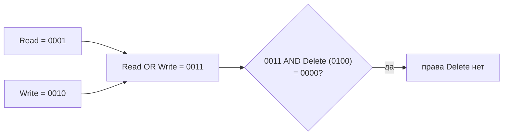
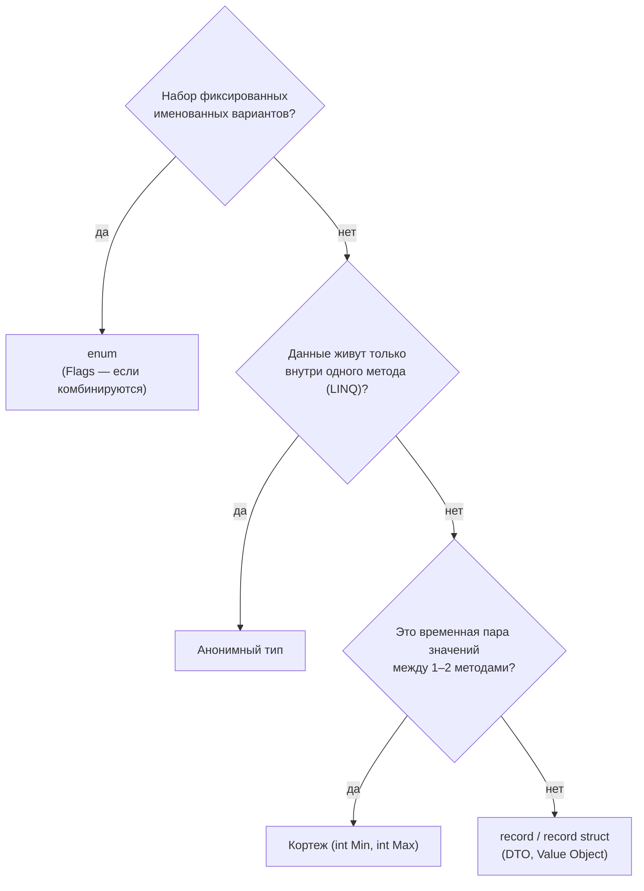

:::tldr
- **`enum`** — именованный набор целочисленных констант (`OrderStatus.Paid`). По умолчанию тип `int`, значения 0, 1, 2… Делает код читаемым и типобезопасным по сравнению с «магическими» числами и строками.
- **`[Flags]` enum** — значения-степени двойки, которые можно комбинировать побитово: `Permissions.Read | Permissions.Write`, проверка — `HasFlag` или `(p & Read) != 0`.
- **Кортежи** `(int Min, int Max)` (`ValueTuple`) — лёгкий способ вернуть несколько значений из метода без отдельного класса. **Деконструкция**: `var (min, max) = GetRange();`.
- **Анонимные типы** `new { Name, Total }` — для временных проекций внутри метода (LINQ), нельзя вернуть из метода с нормальным типом.
- **`record`** — тип для данных с равенством по значению, неизменяемостью и `with`-копированием. Правило: временная пара значений внутри одного-двух методов → кортеж; данные, у которых есть смысл и которые ходят по системе (DTO, Value Object) → `record`.
:::

## Enum

```csharp
public enum OrderStatus
{
    New = 0,
    Paid = 1,
    Shipped = 2,
    Delivered = 3,
    Cancelled = 10            // значения можно задавать явно
}

var status = OrderStatus.Paid;
if (status == OrderStatus.Paid) Ship();

string name = status.ToString();                         // "Paid"
int code = (int)status;                                  // 1
var parsed = Enum.Parse<OrderStatus>("Shipped");         // из строки
bool ok = Enum.TryParse<OrderStatus>("paid", ignoreCase: true, out var s2);
OrderStatus[] all = Enum.GetValues<OrderStatus>();
```

```csharp switch по enum
string Label(OrderStatus s) => s switch
{
    OrderStatus.New => "Новый",
    OrderStatus.Paid => "Оплачен",
    OrderStatus.Shipped => "Отправлен",
    OrderStatus.Delivered => "Доставлен",
    OrderStatus.Cancelled => "Отменён",
    _ => throw new ArgumentOutOfRangeException(nameof(s), s, null)
};
```

:::warning Enum не ограничивает значения
`(OrderStatus)42` компилируется и работает: переменная enum может содержать **любое** число базового типа. Проверяйте входные данные (`Enum.IsDefined`) и всегда обрабатывайте ветку `_` в `switch`. Ещё одна ловушка — значение по умолчанию `0`: сделайте его осмысленным (`None`/`Unknown`/`New`).
:::

## Flags

```csharp
[Flags]
public enum Permissions
{
    None   = 0,
    Read   = 1,        // 0001
    Write  = 2,        // 0010
    Delete = 4,        // 0100
    Admin  = 8,        // 1000
    Editor = Read | Write          // комбинации можно объявлять заранее
}

var p = Permissions.Read | Permissions.Write;     // 0011
bool canWrite = p.HasFlag(Permissions.Write);     // true
bool canDelete = (p & Permissions.Delete) != 0;   // false — побитовая проверка
p |= Permissions.Delete;                          // добавить право
p &= ~Permissions.Write;                          // убрать право
Console.WriteLine(p);                             // "Read, Delete" — благодаря [Flags]
```



## Кортежи

```csharp
(int Min, int Max) Range(int[] values) => (values.Min(), values.Max());

var r = Range([5, 1, 9]);
Console.WriteLine($"{r.Min}..{r.Max}");     // 1..9

var (min, max) = Range([5, 1, 9]);          // деконструкция
var (_, onlyMax) = Range([5, 1, 9]);        // discard ненужного

(a, b) = (b, a);                            // обмен значений без временной переменной

var dict = new Dictionary<(int Year, int Month), decimal>();   // составной ключ
dict[(2025, 9)] = 1_500_000m;
```

`ValueTuple` — значимый тип с полями `Item1`, `Item2`; имена (`Min`, `Max`) существуют только для компилятора. Кортежи сравниваются по значению (`==` с C# 7.3).

## Анонимные типы

```csharp
var summary = orders
    .GroupBy(o => o.CustomerId)
    .Select(g => new { CustomerId = g.Key, Count = g.Count(), Total = g.Sum(o => o.Total) })
    .OrderByDescending(x => x.Total)
    .ToList();

Console.WriteLine(summary[0].Total);     // свойства только для чтения, Equals по значению
```

Анонимный тип — класс, сгенерированный компилятором, с неизменяемыми свойствами. Используется в пределах метода; вернуть его можно только как `object` или `dynamic` — тогда лучше объявить `record`.

## Record

```csharp
public record ProductDto(Guid Id, string Name, decimal Price);    // позиционный record

var a = new ProductDto(id, "Чайник", 420_000m);
var b = a with { Price = 399_000m };       // копия с изменённым свойством
Console.WriteLine(a == b);                 // False — сравнение по значениям
Console.WriteLine(a);                      // ProductDto { Id = ..., Name = Чайник, Price = 420000 }
var (pid, pname, _) = a;                   // деконструкция
```

Подробнее о record — в разделе «C# и .NET углублённо».

## Что выбрать



| | `enum` | Кортеж | Анонимный тип | `record` |
|---|---|---|---|---|
| Назначение | Набор констант | Несколько значений | Временная проекция | Модель данных |
| Можно вернуть из метода | Да | Да | Нет (без потери типа) | Да |
| Равенство | По значению | По значению | По значению | По значению |
| Изменяемость | — | Изменяемые поля | Неизменяемый | Неизменяемый (позиционный) |
| Тип | Значимый | Значимый | Ссылочный | Ссылочный (`record struct` — значимый) |

## Вопросы на засыпку

:::qa Как хранить enum в базе данных — числом или строкой?
Число компактнее и быстрее, но при изменении порядка или удалении значений смысл старых записей меняется, а в БД непонятно, что значит `3`. Строка читаема и устойчива к перестановке, но больше места и опасна при переименовании. В EF Core: `HasConversion<string>()`. Если числом — задавайте значения явно и никогда их не меняйте.
:::

:::qa Почему у Flags-значений степени двойки?
Каждое значение должно занимать **отдельный бит**, чтобы комбинации не пересекались: 1, 2, 4, 8… Если бы `Write = 3`, комбинация `Read | Write` была бы неотличима от одного `Write`.
:::

:::qa Чем Tuple отличается от ValueTuple?
`System.Tuple<T1, T2>` (старый) — ссылочный, неизменяемый, свойства только `Item1`, `Item2`. `ValueTuple` (синтаксис `(int, string)`) — значимый, с изменяемыми полями, поддерживает имена элементов и деконструкцию. В современном коде используют `ValueTuple`.
:::

:::qa Когда кортеж — плохая идея?
Когда он попадает в публичный API или живёт долго: `(string, string, int)` ничего не говорит читателю, имена элементов теряются при сериализации и рефлексии, нельзя добавить проверку или метод. Тогда объявите `record` с понятным именем.
:::

## Итог

`enum` заменяет магические числа именованными константами (с `[Flags]` — комбинируемыми битами), кортежи удобны для возврата нескольких значений без отдельного класса, анонимные типы — для проекций внутри метода, а `record` — для полноценных моделей данных с равенством по значению. Выбирайте по тому, насколько далеко и долго данные путешествуют по коду.
