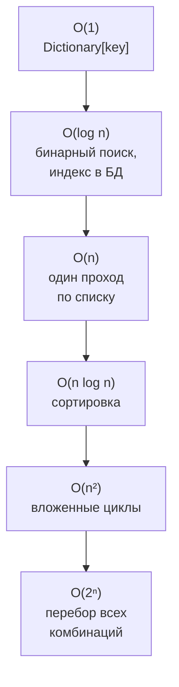
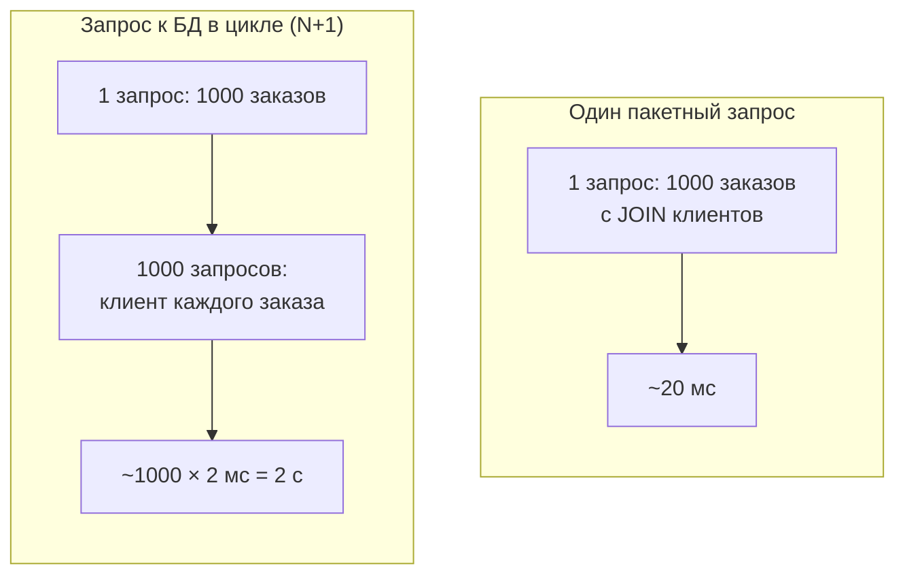

:::tldr
- **Big O** описывает, как растёт время (или память) алгоритма с ростом объёма данных **n**, отбрасывая константы: важна форма роста, а не точные миллисекунды.
- Основные классы: **O(1)** — константа (доступ по индексу, поиск в `Dictionary`), **O(log n)** — логарифм (бинарный поиск, индекс B-tree), **O(n)** — линейно (перебор списка), **O(n log n)** — хорошая сортировка, **O(n²)** — вложенный цикл по тем же данным, **O(2ⁿ)** — перебор всех подмножеств.
- На практике чаще всего встречается «случайный» **O(n²)**: `list.Contains` или `FirstOrDefault` внутри цикла, запрос к БД в цикле (N+1). Решение — `HashSet`/`Dictionary` или один пакетный запрос.
- Для 10 элементов разница незаметна; для 100 000 — это миллисекунды против минут.
- Учитывайте и **память** (лишние копии, `ToList()` на миллион строк) и то, что реальный «n» в бэкенде — это часто **число запросов к БД/сети**, которые на порядки дороже операций в памяти.
:::

## Как растут разные классы сложности

| n | O(1) | O(log n) | O(n) | O(n log n) | O(n²) |
|---|---|---|---|---|---|
| 10 | 1 | 3 | 10 | 33 | 100 |
| 1 000 | 1 | 10 | 1 000 | 10 000 | 1 000 000 |
| 100 000 | 1 | 17 | 100 000 | 1,7 млн | **10 млрд** |
| 1 000 000 | 1 | 20 | 1 млн | 20 млн | **10¹²** |



## Как оценить сложность кода

```csharp
int First(int[] a) => a[0];                                  // O(1)

bool Contains(int[] a, int x)                                // O(n) — в худшем случае весь массив
{
    foreach (var v in a) if (v == x) return true;
    return false;
}

bool HasDuplicates(int[] a)                                  // O(n²) — цикл в цикле
{
    for (int i = 0; i < a.Length; i++)
        for (int j = i + 1; j < a.Length; j++)
            if (a[i] == a[j]) return true;
    return false;
}

bool HasDuplicatesFast(int[] a)                              // O(n) по времени, O(n) по памяти
{
    var seen = new HashSet<int>();
    foreach (var v in a) if (!seen.Add(v)) return true;
    return false;
}
```

Правила подсчёта:
- Последовательные шаги **складываются**, и остаётся старший: O(n) + O(n²) = O(n²).
- Вложенные циклы **перемножаются**: цикл по n внутри цикла по m — O(n·m).
- Константы отбрасываются: два прохода по списку — всё равно O(n).
- Деление задачи пополам на каждом шаге даёт O(log n).

## Бинарный поиск: откуда log n

```mermaid Бинарный поиск числа 37 в отсортированном массиве из 16 элементов
flowchart TB
    A["16 элементов: середина 50 больше 37 → влево"] --> B["8 элементов: середина 25 меньше 37 → вправо"]
    B --> C["4 элемента: середина 40 больше 37 → влево"]
    C --> D["2 элемента: середина 37 — найдено"]:::good
    N["Каждый шаг делит область пополам:<br/>1 млн элементов — максимум 20 шагов"]:::accent
```

```csharp
int[] sorted = [3, 8, 15, 25, 37, 40, 50, 61];
int idx = Array.BinarySearch(sorted, 37);       // 4 — требует отсортированного массива
var list = sorted.ToList(); list.BinarySearch(37);
```

Индексы в базах данных (B-tree) работают по той же идее — поэтому поиск по индексу среди миллиардов строк занимает несколько чтений страниц, а без индекса — полный перебор таблицы.

## Типичные «скрытые» O(n²) в бизнес-коде

```csharp Плохо: Contains по списку внутри цикла
var activeIds = activeUsers.Select(u => u.Id).ToList();       // List
var result = orders.Where(o => activeIds.Contains(o.UserId));  // для каждого заказа — перебор списка → O(n·m)
```

```csharp Хорошо: HashSet
var activeIds = activeUsers.Select(u => u.Id).ToHashSet();    // O(m)
var result = orders.Where(o => activeIds.Contains(o.UserId));  // O(n), Contains — O(1)
```

```csharp Плохо: поиск в списке в цикле
foreach (var line in lines)
{
    var product = products.First(p => p.Id == line.ProductId);   // O(n) на каждой итерации
    total += product.Price * line.Qty;
}
```

```csharp Хорошо: словарь
var byId = products.ToDictionary(p => p.Id);
foreach (var line in lines)
    total += byId[line.ProductId].Price * line.Qty;               // O(1)
```



## Сложность популярных операций .NET

| Операция | Сложность |
|---|---|
| `list[i]`, `array[i]` | O(1) |
| `list.Add(x)` | O(1) амортизированно |
| `list.Insert(0, x)`, `list.Remove(x)`, `list.Contains(x)` | O(n) |
| `dict[key]`, `dict.ContainsKey`, `hashSet.Contains` | O(1) в среднем |
| `list.Sort()`, `OrderBy` | O(n log n) |
| `Array.BinarySearch` | O(log n) |
| `SortedDictionary` операции | O(log n) |
| `string + string` в цикле | O(n²) суммарно |
| LINQ `Distinct`, `GroupBy`, `ToDictionary` | O(n) (хэширование) |
| LINQ `Count()` на `IEnumerable` без `Count` | O(n) |

## Время против памяти

Часто можно ускорить алгоритм ценой памяти: `HashSet` для дубликатов — O(n) времени, но O(n) дополнительной памяти; кэш результатов (мемоизация) — быстрее повторные вызовы, но растёт потребление памяти. Выбор зависит от объёмов: для миллиарда элементов дополнительный `HashSet` может не поместиться в память.

## Вопросы на засыпку

:::qa Почему константы отбрасываются, если 2n медленнее n?
Big O описывает **масштабируемость** — как поведёт себя алгоритм при росте данных в 10, 1000 раз. Константа не меняет форму роста. На практике константы важны при сравнении алгоритмов одного класса, и это проверяется бенчмарками (BenchmarkDotNet).
:::

:::qa Что такое амортизированная сложность?
Средняя стоимость операции на длинной серии. `List.Add` иногда стоит O(n) (копирование при расширении массива), но расширение происходит удвоением, поэтому на n добавлений суммарная работа O(n), то есть O(1) в среднем на одно добавление.
:::

:::qa Какая сложность у сортировки в .NET?
`Array.Sort` / `List.Sort` используют introsort (комбинация quicksort, heapsort и сортировки вставками): O(n log n) в среднем и худшем случаях, сортировка нестабильная. `OrderBy` в LINQ — стабильная сортировка (сохраняет порядок равных элементов), тоже O(n log n).
:::

:::qa Нужно ли разработчику .NET решать алгоритмические задачи?
На собеседованиях в продуктовые компании — часто да, базовые (хэш-таблицы, два указателя, обход дерева). В повседневной работе важнее замечать O(n²) в коде, понимать сложность операций коллекций и индексов БД и не делать запросы к базе в цикле.
:::

## Итог

Big O показывает, как растёт стоимость алгоритма с объёмом данных. Знайте основные классы (O(1), O(log n), O(n), O(n log n), O(n²)), сложность операций стандартных коллекций и замечайте скрытые квадраты: `Contains` по списку и поиск в цикле заменяются на `HashSet` и `Dictionary`, а запросы к БД в цикле — одним пакетным запросом.
