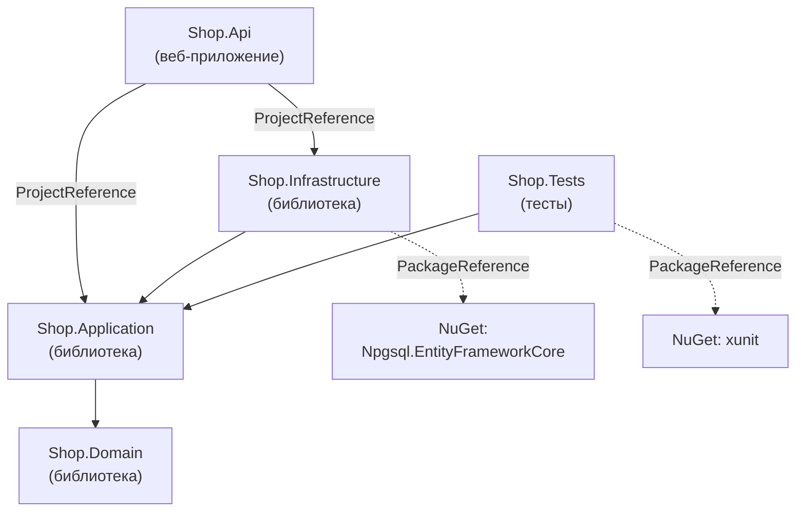
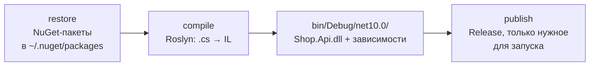

:::tldr
- **Solution** (`.sln` / `.slnx`) — контейнер для нескольких **проектов**. **Проект** (`.csproj`) — описание сборки на MSBuild: целевая платформа (`<TargetFramework>net10.0</TargetFramework>`), тип (библиотека, консоль, веб), зависимости. Результат сборки проекта — одна сборка `.dll`.
- Зависимости: **ProjectReference** (на другой проект решения) и **PackageReference** (на **NuGet**-пакет). `dotnet restore` скачивает пакеты (включая транзитивные) в локальный кэш.
- **dotnet CLI**: `new`, `restore`, `build`, `run`, `test`, `publish`, `add package`, `sln add`. Всё, что делает IDE, можно сделать из командной строки (и так работает CI).
- **Debug** — без оптимизаций, с отладочной информацией; **Release** — оптимизированный код для продакшена. Тестируйте производительность только в Release.
- Типичная структура: `src/` (Api, Application, Domain, Infrastructure), `tests/`, `Directory.Build.props` (общие настройки), `Directory.Packages.props` (централизованные версии пакетов), `global.json` (версия SDK).
:::

## Из чего состоит решение



```text Типичная структура папок
Shop/
├── Shop.sln
├── global.json                  # версия SDK
├── Directory.Build.props        # общие настройки всех проектов
├── Directory.Packages.props     # версии NuGet-пакетов в одном месте
├── .editorconfig                # стиль кода
├── src/
│   ├── Shop.Api/
│   ├── Shop.Application/
│   ├── Shop.Domain/
│   └── Shop.Infrastructure/
└── tests/
    ├── Shop.UnitTests/
    └── Shop.IntegrationTests/
```

## Файл проекта

```xml Shop.Api.csproj
<Project Sdk="Microsoft.NET.Sdk.Web">            <!-- SDK определяет тип проекта: Web, Worker, обычный -->

  <PropertyGroup>
    <TargetFramework>net10.0</TargetFramework>   <!-- под какую версию .NET собираем -->
    <Nullable>enable</Nullable>                  <!-- nullable reference types -->
    <ImplicitUsings>enable</ImplicitUsings>      <!-- автоматические using System, System.Linq... -->
    <TreatWarningsAsErrors>true</TreatWarningsAsErrors>
  </PropertyGroup>

  <ItemGroup>
    <PackageReference Include="Serilog.AspNetCore" Version="9.0.0" />
  </ItemGroup>

  <ItemGroup>
    <ProjectReference Include="..\Shop.Application\Shop.Application.csproj" />
    <ProjectReference Include="..\Shop.Infrastructure\Shop.Infrastructure.csproj" />
  </ItemGroup>

</Project>
```

Современный «SDK-style» формат короткий: файлы `.cs` из папки проекта включаются автоматически, их не нужно перечислять.

## dotnet CLI

```bash Создание решения с нуля
dotnet new sln -n Shop
dotnet new webapi -n Shop.Api -o src/Shop.Api
dotnet new classlib -n Shop.Domain -o src/Shop.Domain
dotnet new xunit -n Shop.Tests -o tests/Shop.Tests

dotnet sln add src/Shop.Api src/Shop.Domain tests/Shop.Tests
dotnet add src/Shop.Api reference src/Shop.Domain           # ProjectReference
dotnet add src/Shop.Api package Serilog.AspNetCore          # PackageReference
```

```bash Повседневные команды
dotnet restore                 # скачать NuGet-пакеты
dotnet build                   # собрать (Debug по умолчанию)
dotnet run --project src/Shop.Api
dotnet watch --project src/Shop.Api   # перезапуск при изменении файлов
dotnet test                    # запустить тесты
dotnet publish src/Shop.Api -c Release -o ./publish   # готовая к развёртыванию сборка
dotnet format                  # форматирование по .editorconfig
dotnet list package --outdated # устаревшие пакеты
dotnet --info                  # установленные SDK и runtime
```



## Debug и Release

| | Debug | Release |
|---|---|---|
| Оптимизации компилятора | Выключены | Включены |
| Отладка | Удобная: все переменные видны, шаги по строкам | Часть переменных оптимизирована |
| Символ `DEBUG` | Определён (`#if DEBUG` работает) | Нет |
| `Debug.Assert`, `Debug.WriteLine` | Работают | Удаляются |
| Где используется | Локальная разработка | Продакшен, тесты производительности |

```bash
dotnet build -c Release
dotnet run -c Release
```

## NuGet

- **nuget.org** — публичный репозиторий пакетов; компании держат приватные фиды (Azure Artifacts, GitHub Packages, Nexus).
- **Транзитивные зависимости**: пакет A зависит от B — B тоже попадёт в проект.
- **Семантическое версионирование**: `MAJOR.MINOR.PATCH` — мажорная версия ломает совместимость, минорная добавляет возможности, патч исправляет ошибки.
- **Central Package Management** (`Directory.Packages.props`) — версии пакетов в одном месте для всего решения.

## Общие настройки: Directory.Build.props и global.json

```xml Directory.Build.props — применяется ко всем проектам в папке и ниже
<Project>
  <PropertyGroup>
    <TargetFramework>net10.0</TargetFramework>
    <Nullable>enable</Nullable>
    <ImplicitUsings>enable</ImplicitUsings>
    <TreatWarningsAsErrors>true</TreatWarningsAsErrors>
    <AnalysisLevel>latest-recommended</AnalysisLevel>
  </PropertyGroup>
</Project>
```

```json global.json — фиксирует версию SDK для команды и CI
{
  "sdk": { "version": "10.0.100", "rollForward": "latestFeature" }
}
```

## Вопросы на засыпку

:::qa Чем ProjectReference отличается от PackageReference?
`ProjectReference` — ссылка на другой проект в исходниках: он собирается вместе с вашим, изменения видны сразу. `PackageReference` — ссылка на уже собранный пакет NuGet конкретной версии. Внутри одного решения — проекты, для переиспользования между командами и репозиториями — пакеты.
:::

:::qa Что такое TargetFramework и можно ли собрать под несколько?
Это версия .NET (и API), под которую компилируется проект: `net8.0`, `net10.0`, `netstandard2.0`. Библиотеки могут собираться под несколько сразу: `<TargetFrameworks>net8.0;net10.0</TargetFrameworks>` — получится сборка для каждой платформы.
:::

:::qa Почему в git не коммитят папки bin и obj?
Это результаты сборки и промежуточные файлы, которые воспроизводятся командой `dotnet build`. Они большие, зависят от машины и постоянно меняются. Стандартный `.gitignore` для .NET (`dotnet new gitignore`) их исключает.
:::

:::qa Что такое циклическая ссылка между проектами?
Ситуация, когда A ссылается на B, а B на A. MSBuild её запрещает. Обычно это признак нарушения архитектуры: общий код нужно вынести в третий проект или развернуть зависимость через интерфейс (принцип инверсии зависимостей).
:::

## Итог

Решение объединяет проекты, проект описывает одну сборку: целевую платформу, настройки и зависимости от других проектов и NuGet-пакетов. dotnet CLI покрывает весь цикл — создание, сборку, тесты и публикацию, что используется и в CI. Для продакшена собирайте в Release, общие настройки выносите в `Directory.Build.props`, версии пакетов — в `Directory.Packages.props`, а версию SDK фиксируйте в `global.json`.
