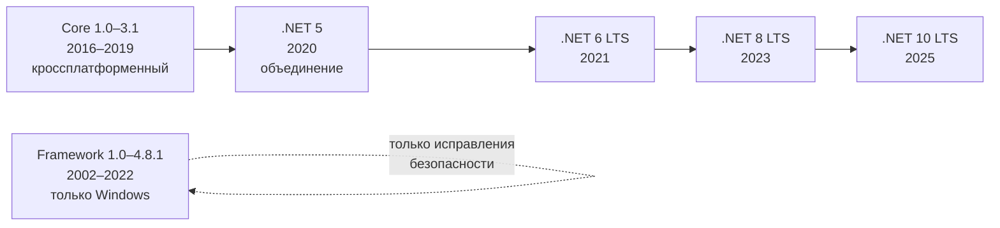
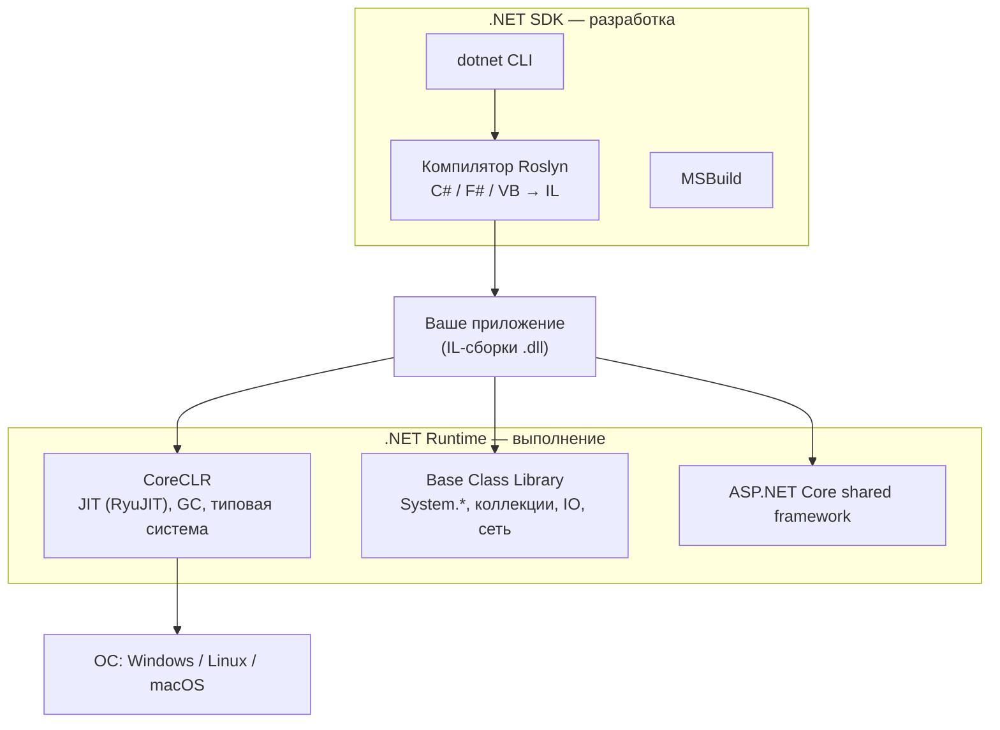

:::tldr
- **.NET Framework** (1.0–4.8.1) — только Windows, устанавливается в систему целиком, одна версия на машину, развивается лишь исправлениями безопасности.
- **.NET Core → .NET 5+** — кроссплатформенный (Windows, Linux, macOS), open source, модульный (пакеты NuGet), версии ставятся **рядом друг с другом** (side-by-side), возможен **self-contained** деплой без установленного рантайма.
- Существенно **быстрее**: Tiered JIT, PGO, `Span<T>`, оптимизированный Kestrel, System.Text.Json, NativeAOT.
- В новом .NET **нет** WebForms, WCF-сервера, Remoting, AppDomain-изоляции, Code Access Security.
- Релиз каждый ноябрь: чётные версии — **LTS** (3 года поддержки), нечётные — **STS** (18 мес — 2 года).
:::

## Историческая картина

.NET Framework появился в 2002 году как платформа для Windows. К середине 2010-х у него накопились проблемы: привязка к Windows, огромный монолитный рантайм, установленный в систему, невозможность быстро выпускать изменения без риска сломать тысячи приложений на машине.

В 2016 году Microsoft выпустила **.NET Core** — переписанную с нуля кроссплатформенную реализацию. В 2020 году ветки объединили под одним именем: после .NET Core 3.1 вышел **.NET 5** (цифру 4 пропустили, чтобы не путать с Framework 4.x), и слово «Core» из названия убрали.



:::note Что такое .NET Standard
Спецификация общего набора API, который реализуют и Framework, и Core. Библиотека под `netstandard2.0` работает и в .NET Framework 4.6.1+, и в .NET Core 2.0+. Сегодня новые библиотеки обычно таргетят `net8.0` напрямую, а `netstandard2.0` оставляют только для совместимости с Framework.
:::

## Ключевые различия

| Аспект | .NET Framework | .NET (Core) 5+ |
|---|---|---|
| **ОС** | Только Windows | Windows, Linux, macOS; x64, ARM64 |
| **Установка** | Системный компонент, одна версия 4.x на машину | Side-by-side: несколько версий рядом |
| **Деплой** | Требует установленный Framework | Framework-dependent, **self-contained**, single-file, NativeAOT |
| **Исходный код** | Закрыт (частично открыт для чтения) | Open source (MIT), github.com/dotnet |
| **Веб** | ASP.NET (System.Web, IIS) | ASP.NET Core (Kestrel, middleware) |
| **Производительность** | Базовая | Значительно выше (JIT, GC, BCL оптимизированы) |
| **Развитие** | Только поддержка | Новый релиз ежегодно |
| **CLI** | MSBuild, Visual Studio | `dotnet` CLI, SDK-style проекты |
| **Контейнеры** | Windows-контейнеры (тяжёлые) | Легковесные Linux-образы, chiseled images |

## Архитектура: что внутри



- **SDK** нужен для сборки (`dotnet build`), **Runtime** — только для запуска.
- **CoreCLR** — виртуальная машина: загружает сборки, JIT-компилирует IL в машинный код, управляет памятью (GC), потоками, исключениями.
- **Shared framework** — набор библиотек (`Microsoft.NETCore.App`, `Microsoft.AspNetCore.App`), которые устанавливаются вместе с рантаймом.

## Почему новый .NET быстрее

1. **Tiered compilation.** Метод сначала компилируется быстро и без оптимизаций (Tier 0), а если вызывается часто — перекомпилируется с полными оптимизациями (Tier 1). Старт быстрее, пиковая производительность выше.
2. **Dynamic PGO** (по умолчанию с .NET 8). JIT собирает статистику во время работы (какие типы реально приходят в виртуальные вызовы) и делает девиртуализацию и инлайнинг под реальную нагрузку.
3. **`Span<T>`, `Memory<T>`, `ArrayPool`** — вся BCL переписана на работу без лишних аллокаций.
4. **Kestrel** и `System.IO.Pipelines` — один из самых быстрых веб-серверов по TechEmpower.
5. **System.Text.Json** вместо Newtonsoft.Json — UTF-8 напрямую, source generators.

## Модели публикации

```bash
# Framework-dependent: маленький размер, нужен установленный runtime
dotnet publish -c Release

# Self-contained: рантайм внутри, запускается на «голой» машине
dotnet publish -c Release -r linux-x64 --self-contained true

# Single-file + обрезка неиспользуемого кода
dotnet publish -c Release -r linux-x64 --self-contained -p:PublishSingleFile=true -p:PublishTrimmed=true

# NativeAOT: нативный бинарник, мгновенный старт, без JIT
dotnet publish -c Release -r linux-x64 -p:PublishAot=true
```

## Что делать с legacy на Framework

:::example Миграция в реальном проекте
1. Прогнать **.NET Upgrade Assistant** (`upgrade-assistant`) — он анализирует проект и переводит `.csproj` в SDK-style.
2. Перевести библиотеки на `netstandard2.0` — их смогут использовать и старые, и новые проекты одновременно.
3. Заменить несовместимое: WCF-сервер → gRPC или CoreWCF, `System.Web` → ASP.NET Core, `AppDomain` → `AssemblyLoadContext`, `.config`-файлы → `appsettings.json`.
4. Мигрировать постепенно по паттерну **Strangler Fig**: новые эндпоинты — в новом сервисе, старые — проксируются.
:::

## Типичные ошибки

- Путать **.NET Standard** (спецификация API) и **.NET Core** (реализация).
- Считать, что «.NET 5 — это следующая версия Framework». Нет, это следующая версия **Core**.
- Выбирать STS-версию для долгоживущего продакшена без плана регулярных обновлений.
- Забывать, что `self-contained` публикация не получает исправления безопасности рантайма автоматически — нужно пересобирать и выкатывать.

## Вопросы на засыпку

:::qa Почему после .NET Core 3.1 сразу вышел .NET 5?
Чтобы избежать путаницы с .NET Framework 4.x и подчеркнуть, что это единая платформа будущего. Слово «Core» убрали, но ASP.NET Core и EF Core сохранили название, чтобы не путать с ASP.NET MVC 5 и EF 6.
:::

:::qa Можно ли в одном процессе запустить код .NET Framework и .NET 8?
Нет, это разные рантаймы. Общаться можно только через межпроцессное взаимодействие (HTTP, gRPC, очереди). Но библиотека под `netstandard2.0` может использоваться обоими.
:::

:::qa Что такое LTS и STS, какую версию брать в продакшен?
LTS (чётные: 6, 8, 10) поддерживаются 3 года, STS (нечётные: 7, 9) — 18–24 месяца. Для продакшена обычно берут LTS; STS — если команда готова обновляться каждый год ради новых возможностей.
:::

:::qa Есть ли в новом .NET AppDomain?
Тип существует для совместимости, но создать второй домен нельзя. Для изоляции и выгрузки плагинов используется `AssemblyLoadContext` (с `isCollectible: true`), для изоляции безопасности — отдельные процессы или контейнеры.
:::

## Итог

.NET Framework — завершённая Windows-платформа в режиме поддержки. Современный .NET — кроссплатформенный, быстрый, модульный и ежегодно обновляемый. Новые проекты — только на актуальной LTS-версии .NET.
