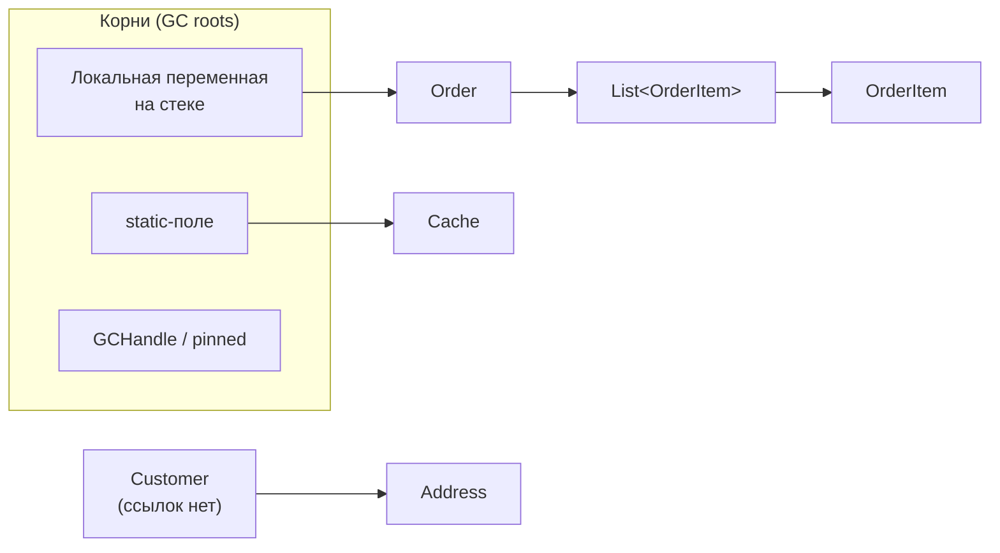
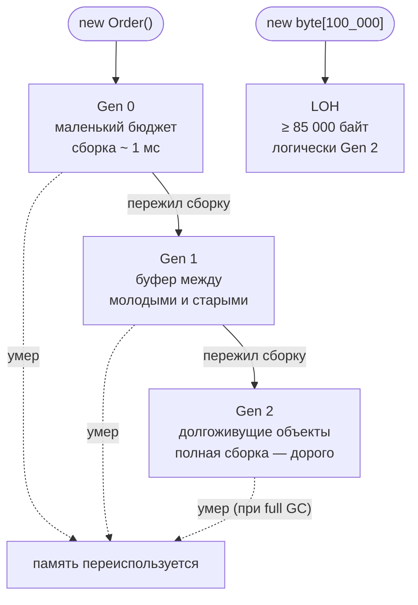
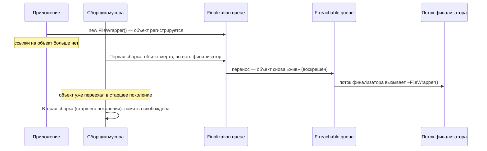

:::tldr
- GC — **трассирующий, поколенческий, компактирующий** сборщик: он находит живые объекты от корней (стек, статики, регистры, GC handles), всё остальное считается мусором.
- **Три поколения**: Gen 0 (новые объекты, сборка за ~1 мс), Gen 1 (буфер), Gen 2 (долгоживущие, самая дорогая сборка). Гипотеза: большинство объектов умирает молодыми.
- Объекты **≥ 85 000 байт** попадают в **LOH**, который собирается только вместе с Gen 2 и по умолчанию **не компактируется** → фрагментация.
- Объекты с **финализатором** переживают как минимум одну лишнюю сборку: сначала попадают в очередь f-reachable, финализатор выполняется в отдельном потоке, и лишь затем память освобождается. Поэтому — `IDisposable` + `using`, а не деструкторы.
- Режимы: **Workstation / Server**, **Concurrent / Background GC**; настраиваются в `.csproj` или `runtimeconfig.json`.
:::

## Зачем нужен GC и как он находит мусор

В C# вы пишете `new`, но никогда не пишете `delete`. Памятью управляет **сборщик мусора** — часть CLR. Он периодически останавливает (частично или полностью) управляемые потоки и определяет, какие объекты ещё нужны.

Алгоритм — **mark & compact**:

1. **Mark (пометка).** GC начинает с *корней* (roots) и обходит граф ссылок. Всё, до чего удалось дойти, — живое.
2. **Plan / Sweep.** Всё непомеченное — мусор. GC решает, выгоднее ли уплотнить кучу или просто запомнить свободные промежутки.
3. **Compact (уплотнение).** Живые объекты сдвигаются друг к другу, ссылки на них обновляются. Освобождённая память становится одним непрерывным блоком — поэтому следующая аллокация в .NET стоит почти как инкремент указателя.



:::note Что считается корнем
- локальные переменные и параметры методов, которые JIT считает «живыми» в текущей точке выполнения;
- статические поля;
- ссылки из регистров процессора;
- `GCHandle` (в т.ч. pinned-объекты, переданные в нативный код);
- очередь финализации (f-reachable queue).
:::

## Поколения: почему не собирать всю кучу сразу

Обходить весь граф объектов при каждой сборке дорого. Поэтому .NET опирается на **гипотезу поколений**: *большинство объектов умирает молодыми* (DTO запроса, строки, временные списки), а те, что выжили, скорее всего проживут долго (синглтоны, кэши).



| Поколение | Что там живёт | Когда собирается | Стоимость |
|---|---|---|---|
| **Gen 0** | Только что созданные объекты | Когда исчерпан бюджет Gen 0 (очень часто) | Очень дешёвая |
| **Gen 1** | Пережившие одну сборку | Вместе с Gen 0, когда заполнен Gen 1 | Дешёвая |
| **Gen 2** | Долгоживущие: кэши, синглтоны, статики | Редко, при нехватке памяти или по порогу | Дорогая (обходит всё) |
| **LOH** | Объекты ≥ 85 000 байт | Только вместе с Gen 2 | Дорогая + фрагментация |
| **POH** (.NET 5+) | Закреплённые (pinned) объекты | Вместе с Gen 2 | — |

Ключевое правило: **сборка поколения N собирает и все младшие поколения**. Gen 2 GC — это *full GC*.

### Как старшие поколения ссылаются на младшие

Если при сборке Gen 0 обходить только Gen 0, как узнать, что на молодой объект ссылается старый объект из Gen 2? Для этого есть **card table**: при каждой записи ссылки в поле объекта JIT вставляет *write barrier*, который помечает «карту» (участок памяти) как грязную. При сборке Gen 0 GC дополнительно просматривает только грязные карты старших поколений.

:::tip Практический вывод
Долгоживущий объект, который постоянно получает ссылки на новые объекты (например, растущий `List` в синглтоне), удорожает каждую сборку Gen 0 и продлевает жизнь этим объектам до Gen 2. Это классический путь к росту памяти.
:::

## Large Object Heap (LOH)

Объекты размером **85 000 байт и больше** (обычно массивы: `byte[]`, большие `string`, `List<T>` с большим внутренним массивом) размещаются в отдельной куче — LOH.

- LOH **собирается только при Gen 2 GC**.
- Копировать большие объекты дорого, поэтому по умолчанию LOH **не компактируется**, а управляется списком свободных блоков. Итог — **фрагментация**: свободной памяти много, но непрерывного куска нужного размера нет, и процесс растёт.
- Частые аллокации больших буферов (чтение файлов, сериализация, `MemoryStream.ToArray()`) → частые full GC.

```csharp Как бороться с LOH-аллокациями
// Плохо: каждый запрос создаёт новый буфер 1 МБ → LOH → частые Gen 2 GC
var buffer = new byte[1024 * 1024];

// Хорошо: берём буфер из пула и возвращаем после использования
var pooled = ArrayPool<byte>.Shared.Rent(1024 * 1024);
try
{
    int read = await stream.ReadAsync(pooled.AsMemory(0, 1024 * 1024), ct);
    Process(pooled.AsSpan(0, read));
}
finally
{
    ArrayPool<byte>.Shared.Return(pooled);
}

// Разовое уплотнение LOH при следующем full GC (применять осознанно)
GCSettings.LargeObjectHeapCompactionMode = GCLargeObjectHeapCompactionMode.CompactOnce;
GC.Collect();
```

Для потоков вместо `MemoryStream` используйте `RecyclableMemoryStream` (пакет Microsoft.IO.RecyclableMemoryStream) — он переиспользует блоки и не создаёт больших массивов.

## Финализация

Финализатор (`~MyClass()` в C#) — метод, который CLR вызывает перед освобождением памяти объекта. Он нужен как **страховка** для освобождения неуправляемых ресурсов, если разработчик забыл вызвать `Dispose()`.

Цена финализатора высока:



1. При создании объект регистрируется в *finalization queue* — аллокация уже дороже.
2. На первой сборке объект признан мёртвым, но вместо освобождения переносится в *f-reachable queue* и тем самым **воскрешается** вместе со всем, на что ссылается.
3. Единственный **поток финализатора** вызывает `Finalize()`. Порядок не гарантирован, время — тоже.
4. Только на **следующей** сборке (уже старшего поколения!) память освобождается.

Если финализатор зависнет или будет медленным — очередь растёт, память утекает.

```csharp Правильный паттерн: Dispose + SuppressFinalize
public sealed class NativeBuffer : IDisposable
{
    private IntPtr _ptr = Marshal.AllocHGlobal(4096);
    private bool _disposed;

    public void Dispose()
    {
        if (_disposed) return;
        Marshal.FreeHGlobal(_ptr);
        _disposed = true;
        GC.SuppressFinalize(this); // объект уходит из очереди финализации — без лишней сборки
    }

    ~NativeBuffer() // страховка, если Dispose забыли вызвать
    {
        if (!_disposed) Marshal.FreeHGlobal(_ptr);
    }
}
```

:::tip
В современном коде финализатор почти никогда не нужен: оберните дескриптор в `SafeHandle` — у него уже есть корректный критический финализатор.
:::

## Режимы работы GC

| Режим | Где используется | Особенности |
|---|---|---|
| **Workstation** | Десктоп, консоль (по умолчанию) | Одна куча, сборка в потоке, вызвавшем аллокацию |
| **Server** | ASP.NET Core (по умолчанию) | Куча и поток GC **на каждое ядро**, выше пропускная способность, больше памяти |
| **Background (Concurrent)** | Включён по умолчанию | Gen 2 собирается параллельно с работой приложения; Gen 0/1 всё равно с паузой |
| **DATAS** (.NET 8+, по умолчанию в .NET 9 для Server GC) | Контейнеры | Динамически подстраивает число куч под нагрузку, экономит память |

```xml Настройка в .csproj
<PropertyGroup>
  <ServerGarbageCollector>true</ServerGarbageCollector>
  <ConcurrentGarbageCollection>true</ConcurrentGarbageCollection>
  <!-- Ограничение кучи в контейнере: 70% от лимита памяти -->
  <GCHeapHardLimitPercent>0x46</GCHeapHardLimitPercent>
</PropertyGroup>
```

## Как посмотреть на GC вживую

```bash
dotnet-counters monitor -p <PID> --counters System.Runtime
# gc-heap-size, gen-0-gc-count, gen-2-gc-count, time-in-gc, loh-size ...

dotnet-gcdump collect -p <PID>   # снимок кучи → открыть в Visual Studio / PerfView
```

Тревожные признаки: `% time in GC` стабильно выше 10–20%, быстрый рост `gen-2-gc-count`, растущий `loh-size`.

## Типичные ошибки

:::warning Вызывать GC.Collect() «для надёжности»
Ручной вызов запускает full GC, продвигает живые объекты в старшие поколения и ломает эвристики сборщика. Оправдан только в редких сценариях (бенчмарки, после загрузки огромного разового набора данных).
:::

- **Большие буферы на каждый запрос** → LOH и частые Gen 2 сборки. Решение: `ArrayPool`, `RecyclableMemoryStream`, стриминг.
- **Финализатор без `GC.SuppressFinalize`** в `Dispose` — каждый объект переживает лишнюю сборку.
- **Статические коллекции и события**, которые удерживают объекты навсегда — «утечка» в управляемой памяти (GC не соберёт то, что достижимо).
- **Думать, что `Dispose` освобождает память.** Нет: `Dispose` освобождает *ресурсы*, память объекта освободит GC.

## Вопросы на засыпку

:::qa Почему граница LOH именно 85 000 байт, а не 85 КБ?
Это эмпирический порог, выбранный командой CLR: объекты такого размера и больше дороже копировать при уплотнении, чем терпеть фрагментацию. Порог можно изменить настройкой `GCLOHThreshold`. Обратите внимание: `new byte[85_000]` уже попадёт в LOH только если *полный размер объекта* (с заголовком) ≥ 85 000 байт.
:::

:::qa Что такое stop-the-world и можно ли его избежать?
На фазах пометки и уплотнения управляемые потоки приостанавливаются. Background GC выполняет большую часть сборки Gen 2 конкурентно, но Gen 0/1 сборки (эфемерные) всегда выполняются с паузой — они короткие. Полностью избежать пауз нельзя, но можно **уменьшить их частоту**, снижая аллокации.
:::

:::qa Чем Server GC отличается от Workstation и когда что выбрать?
Server GC создаёт отдельную кучу и выделенный поток сборки на каждое логическое ядро: выше пропускная способность, но больше потребление памяти. Подходит для веб-сервисов. Workstation — для десктопа и маленьких контейнеров с 1 ядром и жёстким лимитом памяти.
:::

:::qa Может ли в .NET быть утечка памяти, если есть GC?
Да. GC собирает только **недостижимые** объекты. Если объект достижим (подписка на событие статического объекта, растущий кэш без вытеснения, `static List<>`), он живёт вечно. Плюс утечки неуправляемой памяти, если не вызывается `Dispose`.
:::

:::qa Что такое POH и зачем он появился?
Pinned Object Heap (.NET 5+) — отдельная куча для объектов, которые закреплены в памяти (например, буферы для сокетов). Раньше pinned-объекты в Gen 0 мешали уплотнению — GC не мог их сдвинуть. `GC.AllocateArray<byte>(size, pinned: true)` размещает массив сразу в POH.
:::

## Итог

GC в .NET быстрый, если ему помогать: **меньше аллокаций** на горячих путях, **пулы** для больших буферов, **`Dispose`/`using`** вместо финализаторов, никаких бесконечно растущих статических коллекций. На собеседовании достаточно уверенно нарисовать путь объекта Gen 0 → Gen 1 → Gen 2, объяснить LOH и две сборки для объекта с финализатором.
