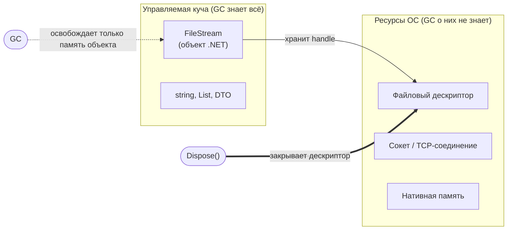
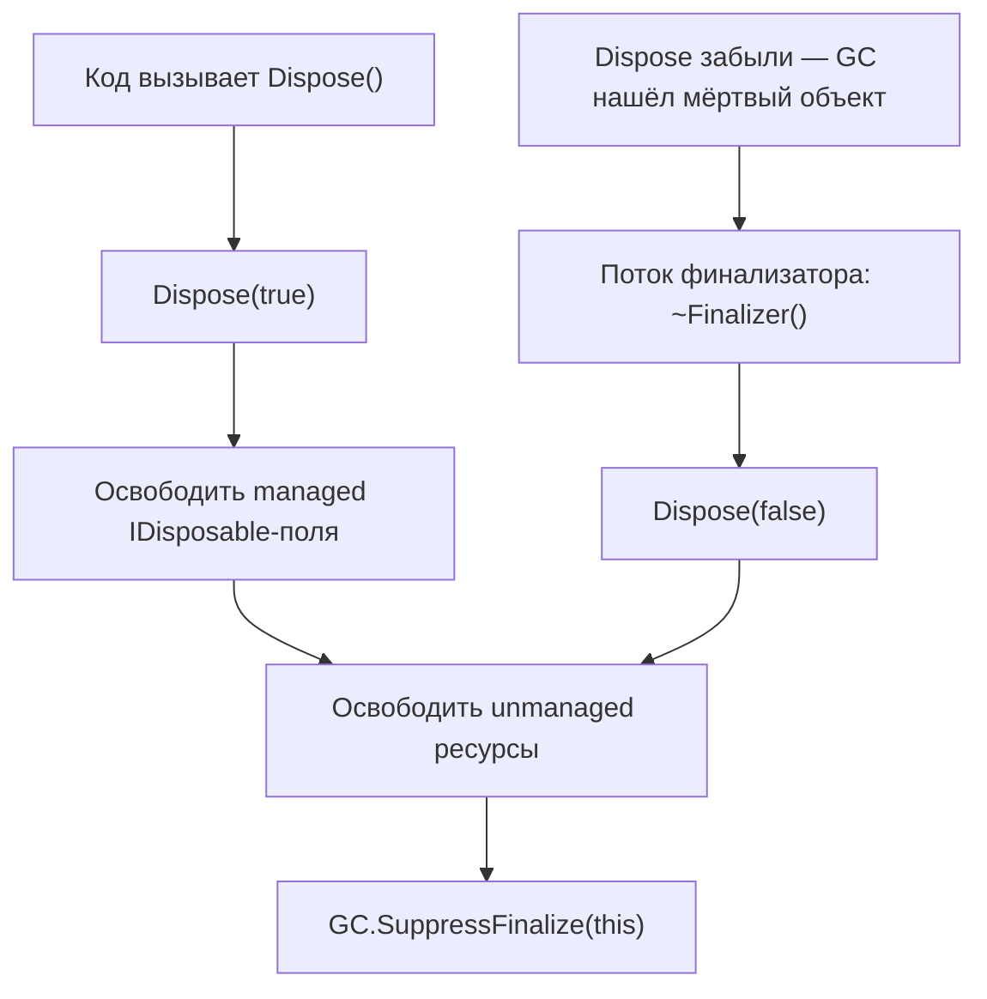

:::tldr
- **Managed** — объекты в управляемой куче CLR; их освобождает **GC** автоматически.
- **Unmanaged** — всё, о чём GC не знает: файловые дескрипторы, сокеты, соединения с БД, нативная память (`Marshal.AllocHGlobal`), GDI-хэндлы.
- `IDisposable.Dispose()` — **детерминированное** освобождение ресурсов «прямо сейчас», а не «когда-нибудь при сборке мусора».
- `using` / `using var` гарантирует вызов `Dispose()` даже при исключении (компилируется в `try/finally`).
- Правило: **если класс владеет полем-IDisposable — он сам должен быть IDisposable**. Для асинхронной очистки — `IAsyncDisposable` и `await using`.
:::

## Два мира памяти



Объект `FileStream` занимает в управляемой куче несколько десятков байт — для GC он «маленький и неважный». Но внутри него лежит **дескриптор файла** операционной системы. Пока объект не собран, файл открыт и, возможно, заблокирован для других процессов. GC запускается, когда **не хватает управляемой памяти**, а не когда кончаются дескрипторы, поэтому можно исчерпать лимит соединений или файлов задолго до ближайшей сборки.

| | Managed | Unmanaged |
|---|---|---|
| Кто выделяет | `new` → CLR | ОС / нативная библиотека |
| Кто освобождает | GC автоматически | Ваш код через `Dispose()` / финализатор |
| Когда | Недетерминированно | Детерминированно — когда вы решите |
| Примеры | `string`, `List<T>`, DTO | handle файла, сокет, `IntPtr` от `AllocHGlobal`, соединение с БД |

## Как работает `using`

```csharp
// C# 8+: using-объявление — Dispose в конце области видимости
using var connection = new SqlConnection(connectionString);
await connection.OpenAsync();

// То же самое компилятор разворачивает примерно так:
var connection2 = new SqlConnection(connectionString);
try
{
    await connection2.OpenAsync();
}
finally
{
    connection2?.Dispose(); // вызовется и при исключении
}
```

:::note SqlConnection и пул соединений
`Dispose()` у `SqlConnection` / `NpgsqlConnection` не разрывает TCP-соединение, а **возвращает его в пул**. Если не вызвать `Dispose`, соединение вернётся в пул только после финализации — и при нагрузке вы получите `Timeout expired. The timeout period elapsed prior to obtaining a connection from the pool`.
:::

## Полный паттерн Dispose

Для большинства классов достаточно простой реализации — **если у класса нет собственных неуправляемых ресурсов**, а только поля-IDisposable:

```csharp Простой случай: владеем другими IDisposable
public sealed class ReportExporter : IDisposable
{
    private readonly FileStream _file;
    private readonly HttpClient _http;
    private bool _disposed;

    public ReportExporter(string path)
    {
        _file = File.Create(path);
        _http = new HttpClient();
    }

    public void Dispose()
    {
        if (_disposed) return;      // Dispose должен быть идемпотентным
        _file.Dispose();
        _http.Dispose();
        _disposed = true;
    }
}
```

Классический паттерн с `Dispose(bool disposing)` нужен, если класс **не sealed** (наследники могут добавить ресурсы) или **напрямую владеет неуправляемым ресурсом**:

```csharp Полный паттерн для наследуемого класса
public class ResourceHolder : IDisposable
{
    private IntPtr _nativeBuffer = Marshal.AllocHGlobal(1024);
    private Stream? _stream = new MemoryStream();
    private bool _disposed;

    public void Dispose()
    {
        Dispose(disposing: true);
        GC.SuppressFinalize(this);   // финализатор больше не нужен
    }

    protected virtual void Dispose(bool disposing)
    {
        if (_disposed) return;
        if (disposing)
        {
            // вызван из Dispose(): можно трогать другие managed-объекты
            _stream?.Dispose();
        }
        // неуправляемые ресурсы освобождаем в любом случае
        Marshal.FreeHGlobal(_nativeBuffer);
        _nativeBuffer = IntPtr.Zero;
        _disposed = true;
    }

    ~ResourceHolder() => Dispose(disposing: false); // вызван GC: managed-поля могут быть уже финализированы
}
```



:::tip SafeHandle вместо финализатора
Вместо «сырого» `IntPtr` и собственного финализатора используйте наследника `SafeHandle` (`SafeFileHandle`, свой `SafeHandleZeroOrMinusOneIsInvalid`). У него уже есть надёжный критический финализатор, защита от гонок и от «переиспользования» дескриптора. Тогда вашему классу достаточно простого `Dispose()`.
:::

## IAsyncDisposable

Если очистка требует I/O (сбросить буфер в сеть, закрыть соединение корректно), используйте асинхронную версию:

```csharp
await using var writer = new StreamWriter(networkStream);
await writer.WriteLineAsync("hello");
// в конце вызовется await writer.DisposeAsync() — сброс буфера без блокировки потока

public sealed class Uploader : IAsyncDisposable
{
    private readonly Stream _stream;
    public Uploader(Stream s) => _stream = s;
    public async ValueTask DisposeAsync()
    {
        await _stream.FlushAsync();
        await _stream.DisposeAsync();
    }
}
```

## Кто вызывает Dispose в ASP.NET Core

DI-контейнер **сам вызывает `Dispose`** у созданных им сервисов:

- **Scoped / Transient** — в конце скоупа (конец HTTP-запроса);
- **Singleton** — при остановке приложения.

Поэтому не вызывайте `Dispose` у внедрённых зависимостей — вы им не владеете. Правило: **кто создал — тот и освобождает**.

:::warning Transient IDisposable из корневого провайдера
Если резолвить transient-сервис, реализующий `IDisposable`, из корневого `IServiceProvider` (например, в синглтоне), контейнер запомнит его для освобождения при остановке приложения — объекты будут копиться. Создавайте скоуп: `using var scope = provider.CreateScope();`.
:::

## Типичные ошибки

- Не вызвать `Dispose` у `SqlConnection`, `FileStream`, `CancellationTokenSource`, `Timer` → исчерпание пула, заблокированные файлы, утечки таймеров.
- `new HttpClient()` в `using` на каждый запрос → исчерпание сокетов (TIME_WAIT). Для `HttpClient` правило обратное — его нужно **переиспользовать** (`IHttpClientFactory`).
- Бросать исключение из `Dispose()` — он вызывается из `finally` и замаскирует исходное исключение.
- Использовать объект после `Dispose` — правильно бросать `ObjectDisposedException` (`ObjectDisposedException.ThrowIf(_disposed, this)`).

## Вопросы на засыпку

:::qa Освобождает ли Dispose память объекта?
Нет. `Dispose` освобождает **ресурсы**, которыми владеет объект. Память самого объекта в управляемой куче освободит GC, когда объект станет недостижим.
:::

:::qa Зачем GC.SuppressFinalize(this) в Dispose?
Объект с финализатором переживает лишнюю сборку мусора и проходит через поток финализатора. Если ресурсы уже освобождены, `SuppressFinalize` убирает объект из очереди финализации — память освободится при первой же сборке.
:::

:::qa Что будет, если дважды вызвать Dispose?
По контракту — ничего: `Dispose` должен быть идемпотентным. Поэтому в реализациях всегда есть флаг `_disposed`.
:::

:::qa Чем using-оператор отличается от using-объявления?
`using (var x = ...) { }` — явный блок, `Dispose` в конце блока. `using var x = ...;` (C# 8) — `Dispose` в конце охватывающей области (обычно метода). Результат одинаков, второй вариант короче, но ресурс живёт дольше.
:::

## Итог

GC управляет **памятью**, вы управляете **ресурсами**. Всё, что держит ресурс ОС, реализует `IDisposable`, и его нужно оборачивать в `using`. Свои классы делайте `IDisposable`, если они владеют такими полями, а для нативных дескрипторов используйте `SafeHandle`.
