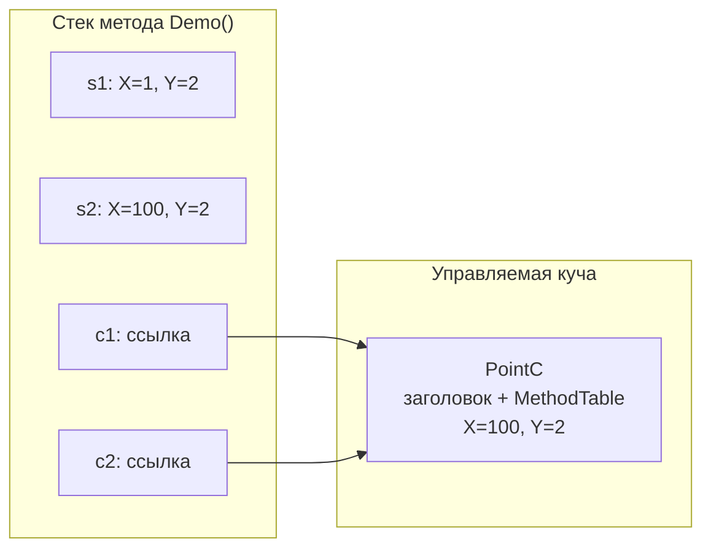
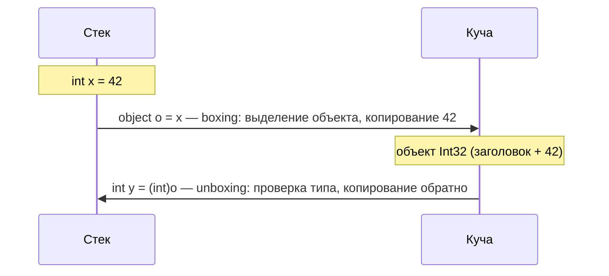
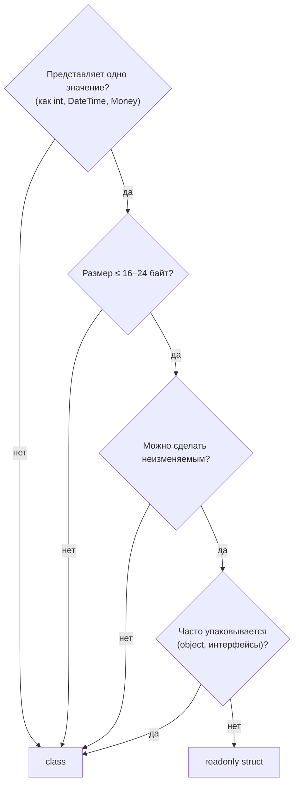

:::tldr
- **Value type** (`struct`, `int`, `DateTime`, `enum`) хранит **сами данные**; при присваивании и передаче в метод **копируется целиком**.
- **Reference type** (`class`, `string`, массивы, делегаты) — переменная хранит **ссылку** на объект в управляемой куче; копируется только ссылка.
- «Структуры на стеке, классы в куче» — упрощение: struct-поле класса живёт **в куче внутри объекта**, а локальная struct в `async`-методе или лямбде — в куче в сгенерированном классе.
- **Boxing** — упаковка значимого типа в объект в куче (`object o = 42`). Это **аллокация + копирование**; unboxing — проверка типа и копирование обратно.
- `struct` выбирают для **маленьких (≤ 16–24 байт), неизменяемых** значений с семантикой «значения»: координаты, деньги, идентификаторы.
:::

## Как это выглядит в памяти

```csharp
struct PointS { public int X, Y; }
class  PointC { public int X, Y; }

void Demo()
{
    PointS s1 = new PointS { X = 1, Y = 2 };
    PointS s2 = s1;   // копия данных
    s2.X = 100;       // s1.X по-прежнему 1

    PointC c1 = new PointC { X = 1, Y = 2 };
    PointC c2 = c1;   // копия ссылки — один объект
    c2.X = 100;       // c1.X тоже 100!
}
```



Каждый объект в куче содержит служебный **заголовок** (object header, sync block index) и указатель на **MethodTable** (информацию о типе) — это +16 байт на 64-битной системе. Значимый тип такого оверхеда не имеет.

## Где на самом деле живут данные

| Ситуация | Где хранится значение struct |
|---|---|
| Локальная переменная обычного метода | Стек (или регистры процессора) |
| Поле класса | Куча — внутри объекта-владельца |
| Элемент массива `PointS[]` | Куча — внутри массива, подряд, без отдельных объектов |
| Локальная переменная в `async`-методе или захваченная лямбдой | Куча — в поле сгенерированной state machine / closure-класса |
| После boxing (`object o = s`) | Куча — отдельный объект-«коробка» |

:::note Правильная формулировка для собеседования
«Значимые типы хранятся **там, где объявлены**: локальные — обычно на стеке, поля — внутри содержащего объекта. Ссылочные типы всегда в куче, а в переменной лежит ссылка». Эрик Липперт (из команды C#) называл «стек vs куча» деталью реализации — главное различие в **семантике копирования**.
:::

## Boxing и unboxing



Где boxing возникает незаметно:

```csharp
int n = 5;
object o = n;                          // явный boxing
string s = string.Format("{0}", n);    // params object[] → boxing
ArrayList list = new(); list.Add(n);   // не-generic коллекции → boxing
IComparable c = n;                     // приведение к интерфейсу → boxing
Console.WriteLine($"{n}");             // C# 10+: DefaultInterpolatedStringHandler — БЕЗ boxing
enumValue.HasFlag(Flags.A);            // до .NET Core 2.1 — boxing; сейчас JIT убирает

// Решение: generics сохраняют тип без упаковки
List<int> ints = new(); ints.Add(n);   // без boxing
void Print<T>(T value) where T : IFormattable => Console.Write(value.ToString(null, null)); // без boxing
```

:::warning Изменение упакованной структуры
```csharp
var p = new PointS { X = 1 };
object boxed = p;
((PointS)boxed).X = 5;        // ошибка компиляции: unboxing даёт временную копию
```
Unboxing всегда возвращает **копию**. Мутабельные структуры в сочетании с упаковкой, интерфейсами и `readonly`-полями дают крайне неочевидное поведение — поэтому структуры делают **неизменяемыми**.
:::

## struct или class: как выбирать



| | `struct` | `class` |
|---|---|---|
| Семантика | Значение, копируется | Ссылка, общий объект |
| Аллокация | Нет отдельной аллокации | Аллокация в куче + нагрузка на GC |
| `null` | Нет (только `Nullable<T>`) | Может быть `null` |
| Наследование | Нет (только интерфейсы) | Да |
| Конструктор по умолчанию | Всегда есть (обнуление) | Если не объявлен другой |
| Равенство по умолчанию | По значениям полей (через reflection — медленно!) | По ссылке |
| Цена передачи | Копирование всех полей | Копирование 8 байт |

```csharp Правильная структура
public readonly record struct Money(decimal Amount, string Currency)
{
    public Money Add(Money other) =>
        Currency == other.Currency
            ? this with { Amount = Amount + other.Amount }
            : throw new InvalidOperationException("Разные валюты");
}
```

`readonly struct` гарантирует неизменяемость и позволяет компилятору не делать **защитные копии** при вызове методов на `readonly`-полях и `in`-параметрах.

## Передача по ссылке: ref, in, out

Большую структуру дорого копировать. Её можно передавать по ссылке:

```csharp
void Update(ref LargeStruct s)  { s.Value = 1; }   // можно менять
double Length(in Vector3 v)      => Math.Sqrt(v.X*v.X + v.Y*v.Y + v.Z*v.Z); // только чтение, без копии
bool TryParse(string s, out int result) { ... }   // выходной параметр
```

## Типичные ошибки

- **Мутабельная структура в `List<T>`:** `list[0].X = 5` не компилируется, так как индексатор возвращает копию. С массивом (`arr[0].X = 5`) работает — массив отдаёт ссылку на элемент.
- **Структура без переопределения `Equals`/`GetHashCode`** в ключах словаря — используется медленное сравнение через reflection. Решение: `record struct` или `IEquatable<T>`.
- **Большие структуры** (> 64 байт), передаваемые по значению в горячем цикле.
- Считать `string` значимым типом, потому что он «ведёт себя как значение». Это **неизменяемый ссылочный тип**.

## Вопросы на засыпку

:::qa Почему string — ссылочный тип, но ведёт себя как значимый?
Он **неизменяемый**: любая «модификация» создаёт новую строку. Плюс `==` перегружен для сравнения содержимого. Переменная всё равно хранит ссылку, а строка лежит в куче (литералы — в intern pool).
:::

:::qa Может ли struct реализовать интерфейс? Будет ли boxing?
Может. При приведении к интерфейсу (`IComparable c = myStruct`) — будет boxing. При вызове через generic-ограничение (`void M<T>(T x) where T : IComparable<T>`) — boxing не будет: JIT генерирует отдельный код для каждого значимого типа.
:::

:::qa Что такое Nullable&lt;T&gt; и как он устроен?
`int?` — это `Nullable<int>`, структура из двух полей: `bool HasValue` и `T Value`. При упаковке `Nullable<T>` без значения превращается в `null`, а со значением — в упакованный `T`, а не в «упакованный Nullable».
:::

:::qa Что такое ref struct?
Структура, которая может жить **только на стеке**: её нельзя упаковать, положить в поле класса, захватить в лямбде или использовать в async-методе. Пример — `Span<T>`. Это позволяет ей безопасно ссылаться на стековую память.
:::

## Итог

Главное различие — **семантика копирования**: значение против ссылки. Где физически лежат данные, зависит от контекста. Используйте `readonly struct` для маленьких неизменяемых значений, `class` — для всего остального, и следите за скрытым boxing в горячих местах.
