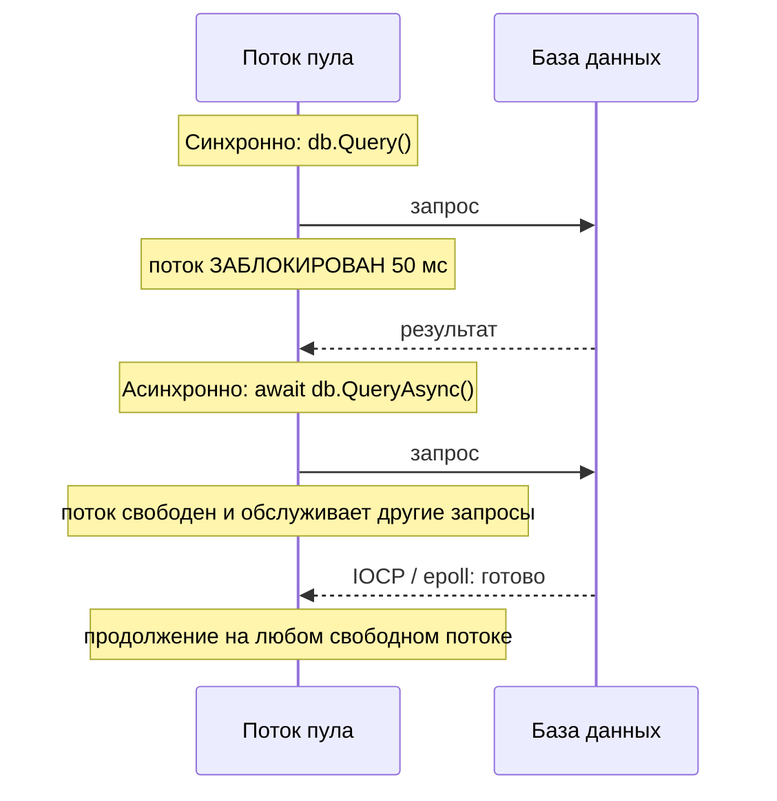
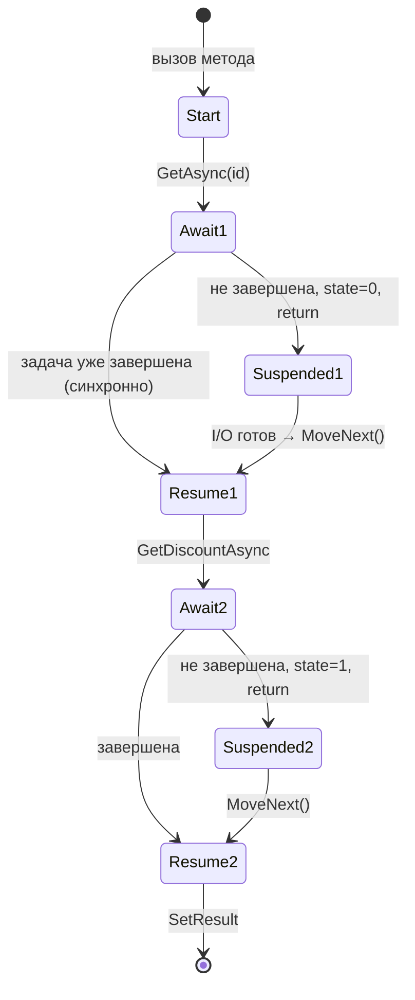
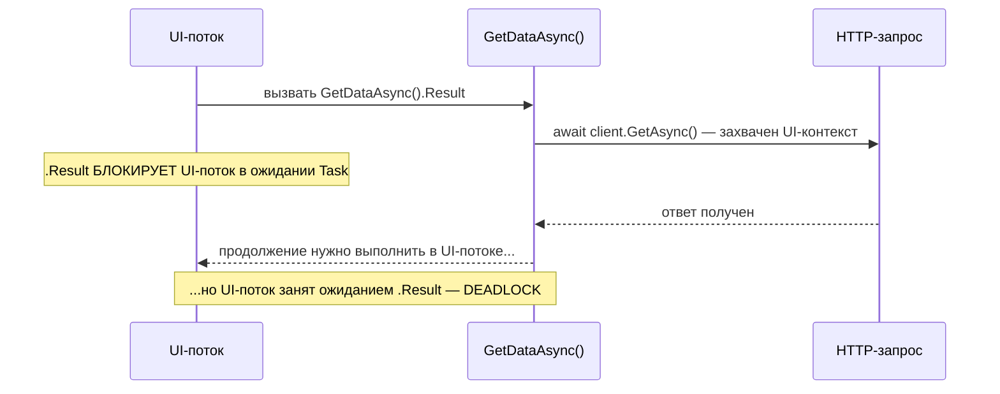

:::tldr
- Компилятор превращает `async`-метод в **конечный автомат** (state machine): код режется на части в точках `await`, локальные переменные становятся полями структуры.
- `await` проверяет, завершена ли задача. Если нет — **регистрирует продолжение** и **возвращает управление** вызывающему; поток освобождается и не блокируется.
- Когда операция (I/O) завершится, продолжение выполнится — по умолчанию в захваченном **SynchronizationContext** (UI-поток в WPF/WinForms) или в **пуле потоков**, если контекста нет (ASP.NET Core).
- `ConfigureAwait(false)` — не возвращаться в исходный контекст. Обязателен в **библиотеках**, в ASP.NET Core на поведение почти не влияет — там контекста нет.
- `.Result` / `.Wait()` на UI-потоке или в старом ASP.NET → классический **deadlock**. Правило: async «до самого верха».
:::

## Зачем вообще async

Большая часть времени веб-сервиса — это **ожидание**: ответа базы, HTTP-вызова, чтения файла. Синхронный код держит поток всё это время заблокированным. Поток — дорогой ресурс (≈1 МБ стека, переключение контекста), а пул потоков ограничен.

Асинхронный код во время ожидания I/O **не держит поток вообще**. Операционная система сама уведомит (через IOCP в Windows, epoll в Linux), что данные готовы, и тогда продолжение возьмёт любой свободный поток из пула.



## Во что компилятор превращает async-метод

```csharp Исходный код
public async Task<int> GetOrderTotalAsync(int id)
{
    var order = await _repo.GetAsync(id);          // точка ожидания 1
    var discount = await _pricing.GetDiscountAsync(order.CustomerId); // точка 2
    return order.Total - discount;
}
```

Компилятор генерирует структуру-автомат (упрощённо):

```csharp Что генерирует компилятор (упрощённо)
[CompilerGenerated]
private struct GetOrderTotalStateMachine : IAsyncStateMachine
{
    public int state;                                   // где мы остановились
    public AsyncTaskMethodBuilder<int> builder;         // создаёт и завершает Task
    public int id;                                      // параметры и локальные → поля
    private Order order;
    private TaskAwaiter<Order> awaiter1;
    private TaskAwaiter<decimal> awaiter2;

    public void MoveNext()
    {
        try
        {
            if (state == 0) goto Resume1;
            if (state == 1) goto Resume2;

            awaiter1 = _repo.GetAsync(id).GetAwaiter();
            if (!awaiter1.IsCompleted)                 // быстрый путь: уже готово?
            {
                state = 0;
                builder.AwaitUnsafeOnCompleted(ref awaiter1, ref this); // подписать MoveNext как продолжение
                return;                                // ОТДАЁМ поток
            }
        Resume1:
            order = awaiter1.GetResult();              // тут вылетит исключение, если задача упала

            awaiter2 = _pricing.GetDiscountAsync(order.CustomerId).GetAwaiter();
            if (!awaiter2.IsCompleted) { state = 1; builder.AwaitUnsafeOnCompleted(ref awaiter2, ref this); return; }
        Resume2:
            var discount = awaiter2.GetResult();
            builder.SetResult(order.Total - discount); // завершить Task<int>
        }
        catch (Exception ex)
        {
            builder.SetException(ex);                  // исключение уходит в Task
        }
    }
}
```



Ключевые наблюдения:

1. **До первого незавершённого `await` метод выполняется синхронно** в вызывающем потоке.
2. Если задача уже завершена (например, данные из кэша), `await` не переключает потоки и не аллоцирует — это «быстрый путь».
3. Автомат — **структура**; в кучу он копируется (boxing) только при первой реальной приостановке.
4. Исключения не «вылетают» из метода сразу, а сохраняются в `Task` и перебрасываются при `await`.

## SynchronizationContext: куда вернуться после await

`SynchronizationContext` — абстракция «**где выполнить продолжение**». `await` по умолчанию захватывает `SynchronizationContext.Current` (или текущий `TaskScheduler`) и отправляет туда продолжение.

| Среда | SynchronizationContext | Куда вернётся код после await |
|---|---|---|
| WPF / WinForms / MAUI | UI-контекст | В **UI-поток** (можно трогать контролы) |
| Старый ASP.NET (Framework) | `AspNetSynchronizationContext` | В контекст запроса (по одному потоку за раз) |
| **ASP.NET Core** | **нет (`null`)** | В **любой** поток пула |
| Консоль, Worker Service | нет | В любой поток пула |
| xUnit | собственный ограничивающий контекст | В контекст теста |

### ConfigureAwait(false)

```csharp
// В библиотеке: не нужно возвращаться в UI-поток вызывающего кода
var json = await httpClient.GetStringAsync(url).ConfigureAwait(false);
```

- Продолжение выполнится в пуле потоков, **без** переключения в захваченный контекст → меньше накладных расходов и нет риска deadlock-а.
- В коде **приложения** ASP.NET Core ставить не обязательно — контекста нет. В **библиотеках** (NuGet-пакетах) — ставить всегда: вы не знаете, из какого окружения вас вызовут.

## Классический deadlock



```csharp
// ПЛОХО (WPF, WinForms, старый ASP.NET):
public void Button_Click(object s, EventArgs e)
{
    var data = GetDataAsync().Result;   // deadlock
}

// ХОРОШО: async до самого верха
public async void Button_Click(object s, EventArgs e) // async void допустим только для обработчиков событий
{
    var data = await GetDataAsync();
}
```

:::warning Sync-over-async в ASP.NET Core
Deadlock-а в ASP.NET Core не будет (контекста нет), но `.Result` / `.Wait()` **блокирует поток пула**, пока другой поток пула выполняет работу. Под нагрузкой это ведёт к **thread pool starvation**: все потоки ждут, новые создаются медленно (≈1–2 в секунду), время ответа растёт до таймаутов.
:::

## ExecutionContext — не путать с SynchronizationContext

`ExecutionContext` **всегда** «течёт» через `await`: он переносит `AsyncLocal<T>` (например, `Activity.Current` для трассировки, культуру, `HttpContext` в `IHttpContextAccessor`). `ConfigureAwait(false)` на него **не влияет** — он управляет только `SynchronizationContext`.

## Правила хорошего async-кода

```csharp
// 1. Не блокировать: никаких .Result, .Wait(), .GetAwaiter().GetResult() в async-коде
// 2. Не использовать async void (кроме обработчиков событий) — исключение уронит процесс
// 3. Передавать CancellationToken по всей цепочке
public async Task<Order?> GetAsync(int id, CancellationToken ct) =>
    await _db.Orders.FirstOrDefaultAsync(o => o.Id == id, ct);

// 4. Параллелить независимые операции
var userTask = _users.GetAsync(id, ct);
var ordersTask = _orders.GetByUserAsync(id, ct);
await Task.WhenAll(userTask, ordersTask);

// 5. Можно опускать async/await, если просто пробрасываете задачу
//    (но тогда исключения и using ведут себя иначе — осторожно)
public Task<int> CountAsync(CancellationToken ct) => _db.Orders.CountAsync(ct);

// 6. Task.Run — только для CPU-bound работы, не для оборачивания I/O
```

## Вопросы на засыпку

:::qa Создаёт ли await новый поток?
Нет. `await` вообще не создаёт потоков. Для I/O во время ожидания **никакой поток не занят**. Продолжение выполнится на потоке из пула (или в захваченном контексте).
:::

:::qa Что будет с исключением в async void методе?
Его нельзя поймать снаружи — нет `Task`, в котором оно могло бы храниться. Исключение выбрасывается в `SynchronizationContext` или пул потоков и обычно **роняет процесс**.
:::

:::qa Почему в async-методе нельзя использовать lock с await внутри?
`lock` (Monitor) привязан к потоку: освободить блокировку должен тот же поток, который её взял. После `await` код может продолжиться на другом потоке. Компилятор запрещает `await` внутри `lock`. Используйте `SemaphoreSlim.WaitAsync()`.
:::

:::qa Что быстрее: return await task или return task?
`return task` (без async) экономит создание автомата. Но при этом исключения, брошенные синхронно, не попадут в `Task`, а `using`/`try` вокруг вызова завершится раньше, чем задача. Если есть `using` или `try/catch` — используйте `return await`.
:::

## Итог

`async/await` — это синтаксический сахар над конечным автоматом и продолжениями. Он не создаёт потоков, а **освобождает** их на время ожидания I/O. `SynchronizationContext` определяет, где продолжится код; в ASP.NET Core его нет, в UI — есть. Никогда не блокируйтесь на асинхронном коде.
