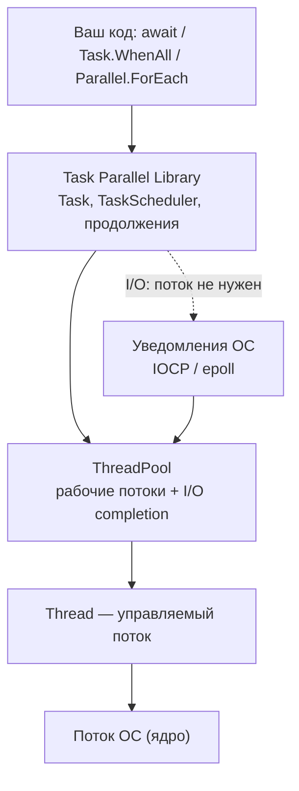
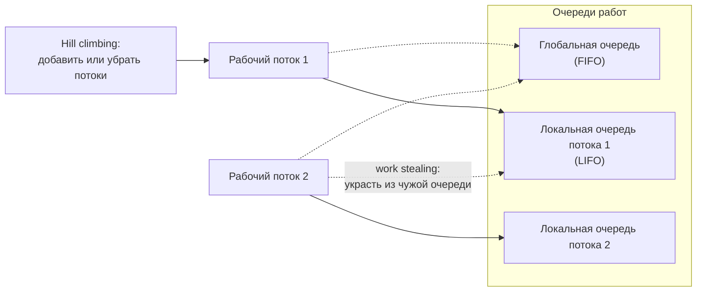
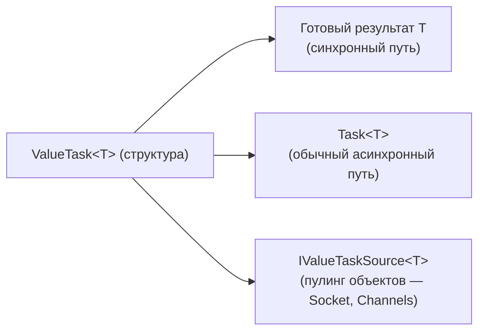

:::tldr
- **Thread** — настоящий поток ОС: свой стек (~1 МБ), дорогое создание. Нужен редко — для долгой выделенной работы с особыми требованиями (приоритет, STA, foreground).
- **ThreadPool** — пул переиспользуемых потоков, управляемый CLR; число потоков подстраивается алгоритмом hill climbing.
- **Task** — *обещание результата*, а не поток. Может выполняться в пуле (`Task.Run`) или вообще не занимать поток (асинхронный I/O). Поддерживает продолжения, отмену, исключения, композицию (`WhenAll`).
- **ValueTask** — структура, избегающая аллокации `Task`, когда результат часто готов **синхронно** (кэш, буфер). Ограничение: `await`-ить **только один раз**.
- По умолчанию возвращайте `Task`; `ValueTask` — для горячих путей после замера.
:::

## Иерархия абстракций



## Thread — «сырой» поток

```csharp
var thread = new Thread(() =>
{
    while (!_stop) ProcessHardwareSignal();
})
{
    IsBackground = true,           // не держит процесс при завершении
    Name = "HardwareListener",
    Priority = ThreadPriority.AboveNormal
};
thread.Start();
```

- Создание и уничтожение — дорого (выделение стека, системные вызовы).
- Нет встроенного механизма возврата результата, исключения в потоке **роняют процесс**.
- Оправдан, если нужна **долгая выделенная работа** на всё время жизни процесса, STA-поток для COM, или особые настройки. Для долгих задач в пуле используют `TaskCreationOptions.LongRunning` — это фактически создаёт отдельный поток.

## ThreadPool

Пул держит набор потоков и очередь работ. Когда вы делаете `Task.Run` или продолжение `await` должно выполниться — работа попадает в очередь пула.



- **Минимум потоков** = числу ядер. До этого значения потоки создаются мгновенно.
- **Выше минимума** новые потоки добавляются медленно (≈1 раз в 0,5–1 с) — это защита от взрывного роста. Отсюда **thread starvation** при блокирующем коде.
- **Локальные очереди + work stealing** уменьшают конкуренцию за глобальную очередь.

## Task — абстракция операции

`Task` — это объект, представляющий операцию, которая **когда-нибудь завершится**: успешно, с ошибкой или отменой.

```csharp
// CPU-bound: реально занимает поток пула
Task<long> cpu = Task.Run(() => CalculatePrimes(1_000_000));

// I/O-bound: поток НЕ занят во время ожидания
Task<string> io = httpClient.GetStringAsync("https://api.example.com");

// Композиция
await Task.WhenAll(cpu, io);             // дождаться всех
var first = await Task.WhenAny(t1, t2);  // первую завершившуюся

// Задача, завершаемая вручную (мост от callback-API)
var tcs = new TaskCompletionSource<int>(TaskCreationOptions.RunContinuationsAsynchronously);
legacyApi.OnDone += result => tcs.SetResult(result);
int value = await tcs.Task;
```

| Состояние Task | Значение |
|---|---|
| `Created` / `WaitingForActivation` | Ещё не началась / ждёт завершения асинхронной операции |
| `Running` | Выполняется (для делегатных задач) |
| `RanToCompletion` | Успех, есть `Result` |
| `Faulted` | Ошибка, `Exception` содержит `AggregateException` |
| `Canceled` | Отменена через `CancellationToken` |

## ValueTask — когда Task слишком дорог

`Task<T>` — класс, значит каждая асинхронная операция = аллокация в куче (~70+ байт). Если метод в 99% случаев возвращает результат **синхронно** (попадание в кэш, данные уже в буфере), эта аллокация — чистые потери.

```csharp
public ValueTask<Product> GetProductAsync(int id)
{
    if (_cache.TryGetValue(id, out var product))
        return new ValueTask<Product>(product);        // без аллокации

    return new ValueTask<Product>(LoadAndCacheAsync(id)); // медленный путь — обычный Task
}
```



:::warning Ограничения ValueTask
- `await` **только один раз**. Повторный `await` или одновременный доступ — неопределённое поведение (объект-источник уже мог быть переиспользован пулом).
- Нельзя вызывать `.Result`, пока операция не завершена.
- Нужны `WhenAll` или многократное ожидание — сначала `.AsTask()`.
```csharp
var vt = GetProductAsync(1);
var p1 = await vt;
var p2 = await vt;   // ОШИБКА: второй await
```
:::

## Сравнение

| | Thread | ThreadPool | Task | ValueTask |
|---|---|---|---|---|
| Что это | Поток ОС | Пул потоков | Обещание результата | Структура-обёртка |
| Стоимость создания | Высокая | Низкая (переиспользование) | Аллокация объекта | Без аллокации на синхронном пути |
| Результат / исключения | Вручную | Вручную | Встроено | Встроено |
| Отмена | Вручную | Вручную | `CancellationToken` | `CancellationToken` |
| Многократный await | — | — | Да | **Нет** |
| Когда | Выделенный долгий поток | Низкоуровневые сценарии | По умолчанию | Горячие пути, часто синхронный результат |

## Типичные ошибки

- `Task.Run(() => httpClient.GetAsync(...))` — оборачивать I/O в `Task.Run` бессмысленно: занимается поток пула, который просто запускает асинхронную операцию.
- `Task.Run` внутри ASP.NET Core-контроллера «для асинхронности» — запрос и так обрабатывается в пуле; вы лишь добавляете переключение потоков.
- `new Thread` для каждой короткой задачи — дорого, используйте пул.
- Возвращать `ValueTask` «на всякий случай» из всех методов — усложнение без выгоды; к тому же `ValueTask` больше по размеру и медленнее, если путь всегда асинхронный.
- «Fire-and-forget» `_ = DoWorkAsync();` — исключения теряются, работа обрывается при остановке. Используйте `BackgroundService` или очередь.

## Вопросы на засыпку

:::qa Что такое Task.Run и чем он отличается от Task.Factory.StartNew?
`Task.Run` — упрощённая обёртка: планирует в пул по умолчанию, с `DenyChildAttach` и корректно «разворачивает» async-лямбды. `StartNew` с async-лямбдой вернёт `Task<Task>` — частая ошибка. В 99% случаев нужен `Task.Run`.
:::

:::qa Как поднять минимальное число потоков в пуле и нужно ли это?
`ThreadPool.SetMinThreads(workers, io)`. Это временная мера для систем с неустранимым блокирующим кодом: потоки будут создаваться сразу, без задержки hill climbing. Правильное решение — убрать блокировки.
:::

:::qa Что такое TaskCompletionSource и зачем RunContinuationsAsynchronously?
TCS позволяет создать Task и завершить его вручную. Без флага `RunContinuationsAsynchronously` продолжения выполняются **синхронно** в потоке, вызвавшем `SetResult`, что может привести к неожиданной реентерабельности и deadlock-ам.
:::

:::qa Когда ValueTask реально даёт выигрыш?
Когда метод вызывается очень часто и **обычно** завершается синхронно: чтение из буферизованного потока, кэш, `Channel.ReadAsync` при наличии данных. BCL использует `ValueTask` в `Stream.ReadAsync(Memory<byte>)`, `Socket`, `Channels`, `IAsyncEnumerator.MoveNextAsync`.
:::

## Итог

Поток — это исполнитель, пул — склад исполнителей, `Task` — описание работы и её результата, `ValueTask` — оптимизация `Task` для синхронного пути. В прикладном коде работайте с `Task` и `async/await`, потоки создавайте вручную только в исключительных случаях.
