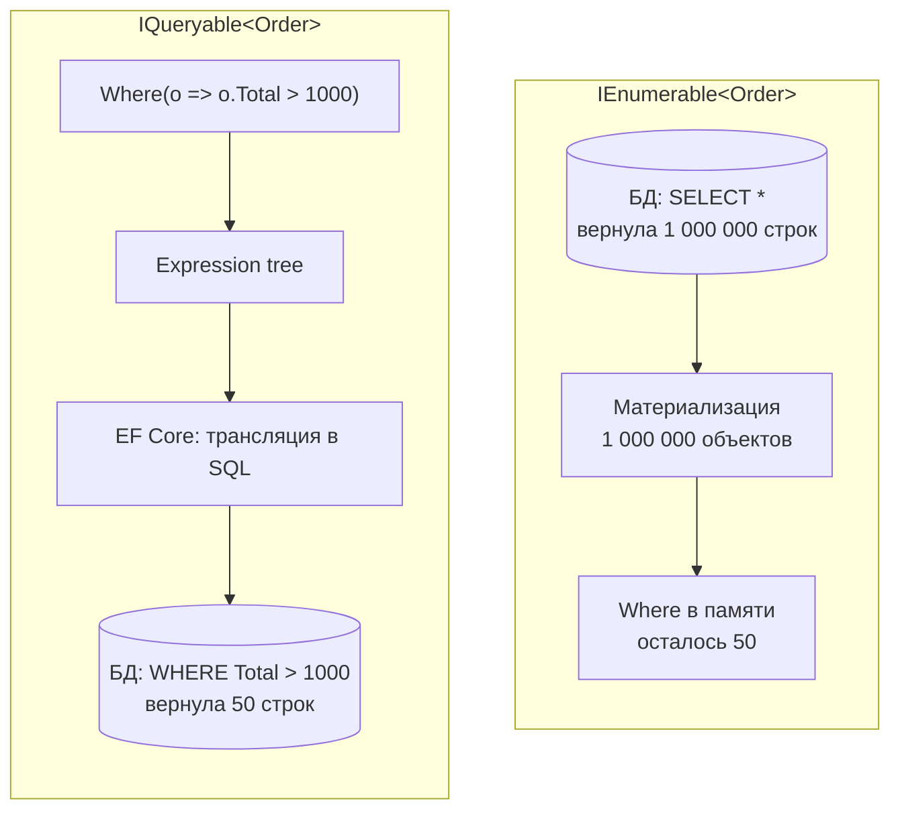
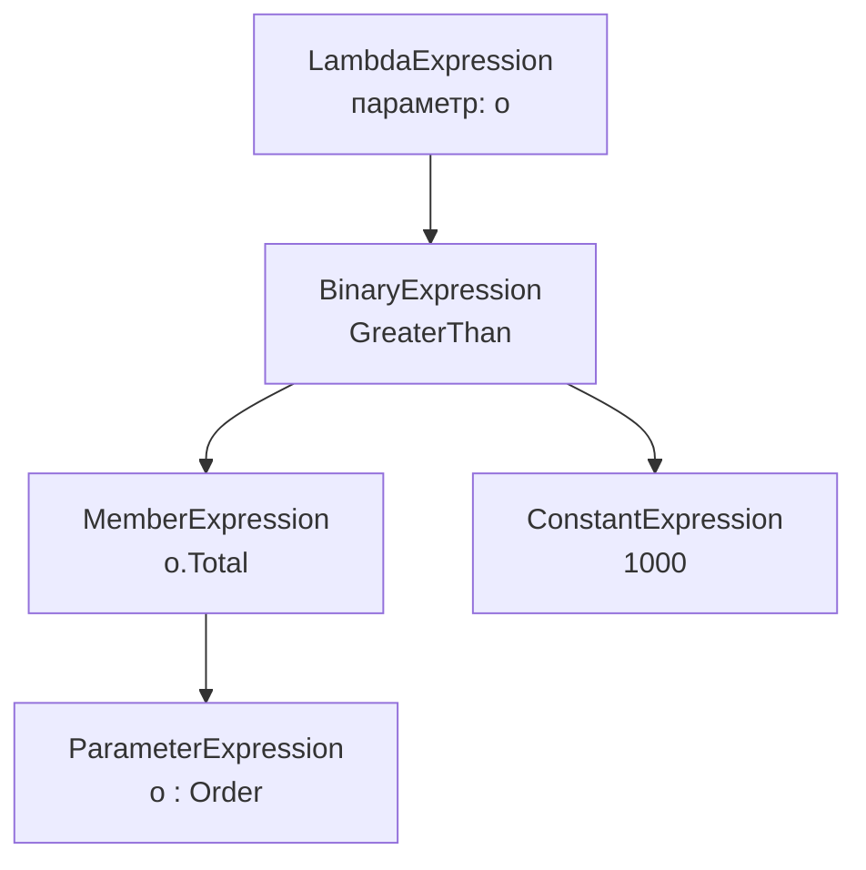

:::tldr
- **`IEnumerable<T>`** — последовательность в памяти. LINQ-методы принимают **делегаты** (`Func<T,bool>`) и выполняются **в вашем процессе** (LINQ to Objects).
- **`IQueryable<T>`** — *описание запроса*. Методы принимают **деревья выражений** (`Expression<Func<T,bool>>`), которые **провайдер** (EF Core) транслирует в SQL и выполняет **на стороне БД**.
- Оба ленивые: запрос выполняется при перечислении (`foreach`, `ToList`, `Count`, `First`).
- Главная ловушка: превратить `IQueryable` в `IEnumerable` **раньше времени** (через `AsEnumerable`, `ToList` или параметр метода типа `IEnumerable`) → вся таблица загружается в память и фильтруется там.
- Возвращайте `IQueryable` только внутри слоя доступа к данным; наружу — материализованные данные.
:::

## Одинаковый код — разное выполнение

```csharp
// IQueryable: фильтр уйдёт в SQL
IQueryable<Order> q = db.Orders.Where(o => o.Total > 1000);
var list1 = q.ToList();
// SQL: SELECT ... FROM Orders WHERE Total > 1000

// IEnumerable: вся таблица загрузится в память, фильтр — в C#
IEnumerable<Order> e = db.Orders.AsEnumerable().Where(o => o.Total > 1000);
var list2 = e.ToList();
// SQL: SELECT ... FROM Orders   (без WHERE!)
```



## Как устроены интерфейсы

```csharp
public interface IEnumerable<out T> : IEnumerable
{
    IEnumerator<T> GetEnumerator();          // только «дай следующий элемент»
}

public interface IQueryable<out T> : IEnumerable<T>, IQueryable
{
    Type ElementType { get; }
    Expression Expression { get; }           // дерево выражений — «что хотим получить»
    IQueryProvider Provider { get; }         // кто умеет его выполнить (EF Core, OData...)
}
```

Методы-расширения различаются сигнатурами:

```csharp
// System.Linq.Enumerable — для IEnumerable
public static IEnumerable<T> Where<T>(this IEnumerable<T> source, Func<T, bool> predicate);

// System.Linq.Queryable — для IQueryable
public static IQueryable<T> Where<T>(this IQueryable<T> source, Expression<Func<T, bool>> predicate);
```

Лямбда `o => o.Total > 1000` компилируется **по-разному** в зависимости от типа параметра:

- в `Func<Order,bool>` — в обычный IL-код, который можно только вызвать;
- в `Expression<Func<Order,bool>>` — в **объектную модель** выражения (узлы `BinaryExpression`, `MemberExpression`, `ConstantExpression`), которую можно проанализировать и перевести в SQL.



## Сравнение

| | `IEnumerable<T>` | `IQueryable<T>` |
|---|---|---|
| Пространство имён методов | `System.Linq.Enumerable` | `System.Linq.Queryable` |
| Аргументы | `Func<>` — делегаты | `Expression<Func<>>` — деревья выражений |
| Где выполняется | В памяти процесса | В источнике данных (БД, API) |
| Какие методы можно вызвать в лямбде | Любые C#-методы | Только те, что провайдер умеет транслировать |
| Типичный источник | `List`, массивы, `yield return` | `DbSet<T>`, OData, MongoDB LINQ |
| Отложенное выполнение | Да | Да |

## Граница между мирами

Когда LINQ-цепочка переходит из `IQueryable` в `IEnumerable`, всё, что после перехода, выполняется в памяти:

```csharp
var result = db.Orders
    .Where(o => o.CreatedAt >= from)          // SQL
    .OrderByDescending(o => o.Total)          // SQL
    .Select(o => new { o.Id, o.Total, o.Note }) // SQL: только нужные столбцы
    .AsEnumerable()                            // ← граница
    .Where(o => MyComplexCheck(o.Note))        // C#: метод, который нельзя перевести в SQL
    .Take(10)                                  // C#
    .ToList();
```

:::warning Незаметная потеря IQueryable через сигнатуру метода
```csharp
// Параметр IEnumerable — вызывается Enumerable.Where, а не Queryable.Where
public List<Order> FilterExpensive(IEnumerable<Order> orders) =>
    orders.Where(o => o.Total > 1000).ToList();

FilterExpensive(db.Orders);   // SELECT * FROM Orders — вся таблица в память!
```
Компилятор выбирает метод-расширение по **статическому** типу переменной.
:::

## Где что использовать

- **Репозиторий / запрос к БД** — строим `IQueryable`, добавляем фильтры, пагинацию, проекцию, и материализуем (`ToListAsync`) **внутри** слоя данных.
- **Наружу из репозитория** — `List<T>`, `IReadOnlyList<T>` или DTO. Возврат `IQueryable` из репозитория — спорная практика: вызывающий код может сгенерировать неэффективный запрос или обратиться к БД после закрытия контекста.
- **Коллекции в памяти, генераторы (`yield`)** — `IEnumerable<T>`.
- **Динамические фильтры** (поиск по опциональным полям) — удобно наращивать `IQueryable`:

```csharp
IQueryable<Product> query = db.Products.AsNoTracking();
if (filter.MinPrice is not null) query = query.Where(p => p.Price >= filter.MinPrice);
if (!string.IsNullOrEmpty(filter.Name)) query = query.Where(p => p.Name.Contains(filter.Name));
var page = await query.OrderBy(p => p.Id).Skip(skip).Take(take).ToListAsync(ct);
```

## Вопросы на засыпку

:::qa Что будет, если в Where для IQueryable вызвать собственный C#-метод?
EF Core не сможет его перевести. С EF Core 3.0 это **исключение** `InvalidOperationException: The LINQ expression could not be translated` (до 3.0 был тихий client evaluation). Исключение: метод в финальном `Select` — там EF Core может выполнить его на клиенте.
:::

:::qa Чем опасен многократный перебор IEnumerable?
Каждый `foreach`/`Count()` заново выполняет всю цепочку — для `IQueryable` это новый SQL-запрос, для генератора — повторное вычисление. Материализуйте один раз через `ToList()`. Анализаторы подсвечивают это как «Possible multiple enumeration».
:::

:::qa IQueryable наследуется от IEnumerable — значит, можно везде передавать как IEnumerable?
Можно, но выполнение переключится на LINQ to Objects с момента, когда статический тип стал `IEnumerable`. Все последующие операторы выполняются в памяти.
:::

:::qa Что такое IAsyncEnumerable и связь с EF Core?
`AsAsyncEnumerable()` позволяет получать строки из БД по одной через `await foreach`, не загружая всё в список. Это полезно для стриминга больших выборок.
:::

## Итог

`IEnumerable` — «перебери в памяти», `IQueryable` — «опиши запрос, который выполнит кто-то другой». Держите запрос в `IQueryable` как можно дольше, чтобы фильтрация, сортировка, пагинация и проекция ушли в базу, и материализуйте результат один раз.
