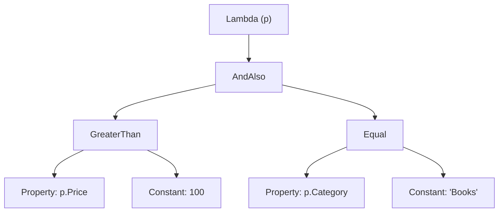

:::tldr
- LINQ-операторы вроде `Where`, `Select`, `OrderBy` **не выполняются сразу** — они строят цепочку итераторов (или дерево выражений для `IQueryable`).
- Выполнение происходит при **перечислении**: `foreach`, `ToList()`, `ToArray()`, `Count()`, `First()`, `Sum()` и т.п.
- Итераторы работают **потоково** (streaming): элемент проходит всю цепочку, прежде чем взять следующий. Исключения — буферизующие операторы: `OrderBy`, `GroupBy`, `Reverse`, `Distinct` (частично).
- Ловушки: **повторное перечисление** выполняет запрос заново; **замыкание** захватывает переменную, а не значение.
- **Деревья выражений** (`Expression<Func<...>>`) — код как данные: их можно анализировать, модифицировать, транслировать (в SQL) или скомпилировать в делегат (`Compile()`).
:::

## Отложенное выполнение на примере

```csharp
var numbers = new List<int> { 1, 2, 3, 4, 5 };

var query = numbers
    .Where(n => { Console.WriteLine($"Where {n}"); return n % 2 == 1; })
    .Select(n => { Console.WriteLine($"Select {n}"); return n * 10; });

Console.WriteLine("Запрос построен, ничего не выполнено");
numbers.Add(7);                         // изменим источник ДО перечисления

foreach (var x in query) Console.WriteLine($"Результат {x}");
```

```text Вывод
Запрос построен, ничего не выполнено
Where 1
Select 1
Результат 10
Where 2
Where 3
Select 3
Результат 30
Where 4
Where 5
Select 5
Результат 50
Where 7
Select 7
Результат 70
```

Видно два важных свойства:

1. Элементы проходят цепочку **по одному** — нет промежуточных списков.
2. Добавленный после построения запроса элемент `7` **попал** в результат: запрос выполняется над источником в момент перечисления.

```mermaid Потоковая обработка: каждый элемент «протягивается» через цепочку
sequenceDiagram
    participant F as foreach
    participant S as SelectIterator
    participant W as WhereIterator
    participant L as List
    F->>S: MoveNext()
    S->>W: MoveNext()
    W->>L: взять 1
    L-->>W: 1 (нечётное — подходит)
    W-->>S: Current = 1
    S-->>F: Current = 10
    F->>S: MoveNext()
    S->>W: MoveNext()
    W->>L: взять 2
    L-->>W: 2 (чётное — пропустить)
    W->>L: взять 3
    L-->>W: 3
    W-->>S: Current = 3
    S-->>F: Current = 30
```

## Как это устроено: yield return

Простейшая реализация `Where`:

```csharp
public static IEnumerable<T> MyWhere<T>(this IEnumerable<T> source, Func<T, bool> predicate)
{
    foreach (var item in source)
        if (predicate(item))
            yield return item;   // «отдать» элемент и приостановиться до следующего MoveNext()
}
```

Как и `async`, `yield return` компилятор превращает в **конечный автомат** — класс, реализующий `IEnumerable<T>` и `IEnumerator<T>`. Код метода не выполняется до первого вызова `MoveNext()`.

:::warning Валидация аргументов в итераторе
```csharp
public static IEnumerable<T> Bad<T>(IEnumerable<T> source)
{
    if (source is null) throw new ArgumentNullException(nameof(source)); // сработает только при перечислении!
    foreach (var x in source) yield return x;
}
```
Исключение вылетит не при вызове метода, а при первом `MoveNext()` — возможно, в совсем другом месте программы. Решение — обёртка без `yield` + локальная функция-итератор (так сделано в BCL).
:::

## Какие операторы что делают

| Категория | Операторы | Поведение |
|---|---|---|
| Отложенные потоковые | `Where`, `Select`, `SelectMany`, `Take`, `Skip`, `Concat`, `Zip`, `Cast`, `OfType` | Обрабатывают по одному элементу |
| Отложенные буферизующие | `OrderBy`, `ThenBy`, `GroupBy`, `Reverse`, `Join` (внутренняя сторона), `Distinct` | При первом `MoveNext()` читают весь источник (или его часть) |
| Немедленные: агрегаты | `Count`, `Sum`, `Min`, `Max`, `Average`, `Aggregate`, `Any`, `All`, `Contains` | Выполняют запрос сразу, возвращают значение |
| Немедленные: элемент | `First`, `Single`, `Last`, `ElementAt` (+ `OrDefault`) | Выполняют до нахождения элемента |
| Материализация | `ToList`, `ToArray`, `ToDictionary`, `ToHashSet`, `ToLookup` | Выполняют и сохраняют результат |

## Ловушки отложенного выполнения

### 1. Повторное перечисление

```csharp
IEnumerable<User> active = users.Where(u => IsActive(u));   // IsActive — дорогой вызов

if (active.Any())                        // перечисление №1
    Console.WriteLine(active.Count());   // перечисление №2
foreach (var u in active) { }            // перечисление №3 — IsActive вызван трижды для каждого!

var activeList = users.Where(u => IsActive(u)).ToList();  // решение: материализовать один раз
```

С `IQueryable` каждое перечисление — **отдельный SQL-запрос**.

### 2. Замыкание захватывает переменную

```csharp
int minAge = 18;
var adults = people.Where(p => p.Age >= minAge);
minAge = 65;                        // изменили ПОСЛЕ построения
var result = adults.ToList();       // фильтр по 65, а не по 18!
```

### 3. Выход за время жизни ресурса

```csharp
IEnumerable<Order> GetOrders()
{
    using var db = new AppDbContext();
    return db.Orders.Where(o => o.IsPaid);   // запрос не выполнен...
}                                             // ...а контекст уже уничтожен
GetOrders().ToList();                          // ObjectDisposedException
```

## Деревья выражений

Если лямбда присваивается типу `Expression<TDelegate>`, компилятор генерирует не IL, а **код, строящий объектную модель** выражения:

```csharp
Expression<Func<Product, bool>> expr = p => p.Price > 100 && p.Category == "Books";

// Компилятор генерирует примерно это:
var p = Expression.Parameter(typeof(Product), "p");
var body = Expression.AndAlso(
    Expression.GreaterThan(Expression.Property(p, "Price"), Expression.Constant(100m)),
    Expression.Equal(Expression.Property(p, "Category"), Expression.Constant("Books")));
var lambda = Expression.Lambda<Func<Product, bool>>(body, p);
```



Что можно сделать с деревом:

- **Транслировать** — EF Core обходит дерево визитором (`ExpressionVisitor`) и строит SQL: `WHERE Price > 100 AND Category = 'Books'`.
- **Скомпилировать** — `expr.Compile()` создаёт делегат (дорогая операция, результат стоит кэшировать).
- **Анализировать** — получить имя свойства из `x => x.Name` (так работают `nameof`-подобные API, FluentValidation, AutoMapper).
- **Строить динамически** — например, фильтры из UI:

```csharp Динамический фильтр по имени свойства
static Expression<Func<T, bool>> PropertyEquals<T>(string propertyName, object value)
{
    var param = Expression.Parameter(typeof(T), "x");
    var property = Expression.Property(param, propertyName);
    var constant = Expression.Constant(Convert.ChangeType(value, property.Type));
    return Expression.Lambda<Func<T, bool>>(Expression.Equal(property, constant), param);
}

var filter = PropertyEquals<Product>("Category", "Books");
var books = await db.Products.Where(filter).ToListAsync();   // уйдёт в SQL
```

:::tip Для комбинирования условий
Библиотека **LinqKit** (`PredicateBuilder`) позволяет удобно объединять выражения через `And`/`Or`, не собирая дерево вручную.
:::

## Вопросы на засыпку

:::qa Почему OrderBy не может работать потоково?
Чтобы отдать первый элемент отсортированной последовательности, нужно увидеть **все** элементы. Поэтому `OrderBy` при первом `MoveNext()` читает весь источник в буфер и сортирует. Бесконечную последовательность отсортировать нельзя.
:::

:::qa Чем First отличается от Single?
`First` возвращает первый подходящий и прекращает перебор. `Single` проверяет, что элемент **ровно один**, — ему нужно убедиться, что второго нет, поэтому он читает дальше. В SQL: `First` → `TOP 1`, `Single` → `TOP 2` с проверкой.
:::

:::qa Можно ли выполнить Expression без EF Core?
Да: `expr.Compile()` превращает дерево в делегат через генерацию IL. В .NET это относительно дорого (микросекунды–миллисекунды), поэтому скомпилированные делегаты кэшируют. В NativeAOT используется интерпретатор выражений.
:::

:::qa Что такое ToLookup и чем отличается от GroupBy?
`GroupBy` — отложенный, `ToLookup` — немедленный и возвращает структуру «ключ → набор значений», доступную по индексатору (`lookup[key]`), причём для отсутствующего ключа — пустая последовательность, а не исключение.
:::

## Итог

LINQ — это ленивые цепочки итераторов (для объектов) или деревья выражений (для провайдеров). Понимать, **когда** выполняется запрос и **сколько раз**, критически важно для корректности и производительности. Материализуйте результат один раз, помните о замыканиях и времени жизни источника.
