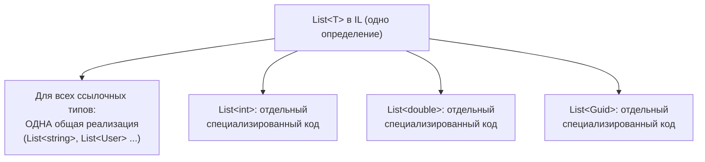
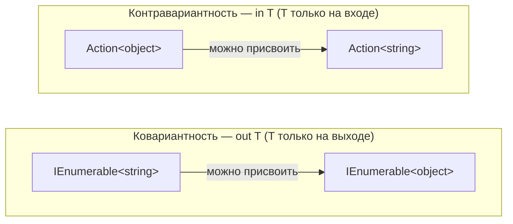

:::tldr
- **Generics** — параметризованные типы и методы: типобезопасность на этапе компиляции, без приведения типов и без boxing для значимых типов.
- **Ограничения** (`where T : ...`) сообщают компилятору, что умеет `T`: `class`, `struct`, `new()`, `notnull`, `unmanaged`, базовый класс, интерфейс, `T : U`.
- **Ковариантность** (`out T`) — можно подставить **более конкретный** тип: `IEnumerable<string>` → `IEnumerable<object>`. Разрешена, если `T` только **возвращается**.
- **Контравариантность** (`in T`) — можно подставить **более общий** тип: `Action<object>` → `Action<string>`. Разрешена, если `T` только **принимается**.
- Вариантность работает только для **интерфейсов и делегатов** и только для **ссылочных** типов-аргументов.
:::

## Зачем нужны дженерики

```csharp
// Без дженериков: object → приведения, boxing, ошибки в рантайме
ArrayList list = new();
list.Add(42);            // boxing
list.Add("oops");        // компилятор не возражает
int x = (int)list[1];    // InvalidCastException в рантайме

// С дженериками: ошибка на этапе компиляции, без boxing
List<int> ints = new();
ints.Add(42);
// ints.Add("oops");     // ошибка компиляции
```

### Как дженерики работают в рантайме

В отличие от Java (type erasure), в .NET дженерики **реифицированы**: информация о типе-аргументе сохраняется в рантайме (`typeof(T)` работает).



- Для **значимых** типов JIT генерирует отдельную версию кода → нет boxing, максимальная скорость.
- Для **ссылочных** типов код общий (все ссылки одного размера) → экономия памяти.

## Ограничения (constraints)

```csharp
public class Repository<TEntity, TKey>
    where TEntity : class, IEntity<TKey>, new()   // ссылочный тип, реализует интерфейс, есть конструктор без параметров
    where TKey : struct, IEquatable<TKey>          // значимый тип с быстрым сравнением
{
    public TEntity Create(TKey id) => new TEntity { Id = id };   // благодаря new()
}
```

| Ограничение | Что разрешает |
|---|---|
| `where T : class` | Только ссылочные типы; можно сравнивать с `null` и использовать `as` |
| `where T : class?` | Ссылочные, допускающие null (NRT) |
| `where T : struct` | Только значимые, не-nullable типы |
| `where T : notnull` | Любые типы, кроме nullable |
| `where T : unmanaged` | Значимые типы без ссылок внутри — можно брать указатели, `sizeof(T)`, `stackalloc T[]` |
| `where T : new()` | Есть публичный конструктор без параметров |
| `where T : BaseClass` | Наследник класса — доступны его члены |
| `where T : IComparable<T>` | Реализует интерфейс — можно вызывать его методы без boxing |
| `where T : U` | `T` — наследник другого параметра-типа |
| `where T : allows ref struct` (C# 13) | Можно подставить `Span<T>` и другие ref struct |

### Static abstract члены интерфейсов (C# 11) — generic math

```csharp
public static T Sum<T>(IEnumerable<T> values) where T : INumber<T>
{
    T total = T.Zero;                 // статический член интерфейса
    foreach (var v in values) total += v;   // оператор из интерфейса
    return total;
}

Sum(new[] { 1, 2, 3 });        // int
Sum(new[] { 1.5m, 2.5m });     // decimal
```

## Вариантность: in и out

Начнём с интуиции. `string` — наследник `object`. Можно ли использовать `List<string>` там, где ожидается `List<object>`?

```csharp
List<string> strings = new() { "a" };
List<object> objects = strings;   // ошибка компиляции — и правильно!
objects.Add(42);                  // иначе в список строк попало бы число
```

`List<T>` **инвариантен**: он и принимает `T` (`Add`), и отдаёт (`this[]`). А вот интерфейс, который **только отдаёт** `T`, можно безопасно «расширить»:

```csharp
IEnumerable<string> strings = new List<string> { "a" };
IEnumerable<object> objects = strings;   // OK: IEnumerable<out T> — ковариантен
```



- **Ковариантность (`out`)**: производитель строк — это тоже производитель объектов. Направление совпадает с наследованием.
- **Контравариантность (`in`)**: если обработчик умеет обрабатывать **любой** объект, он справится и со строкой. Направление **противоположно** наследованию.

```csharp Объявление собственных вариантных интерфейсов
public interface IProducer<out T>     // T только возвращается
{
    T Produce();
    // void Consume(T item);          // ошибка компиляции: T в позиции входа
}

public interface IConsumer<in T>      // T только принимается
{
    void Consume(T item);
}

public interface IValidator<in T> { bool IsValid(T item); }

IValidator<object> notNull = new NotNullValidator();
IValidator<Order> orderValidator = notNull;          // контравариантность — OK
```

### Примеры из BCL

| Тип | Вариантность |
|---|---|
| `IEnumerable<out T>`, `IEnumerator<out T>`, `IReadOnlyList<out T>`, `IQueryable<out T>` | Ковариантны |
| `IComparer<in T>`, `IEqualityComparer<in T>`, `IComparable<in T>` | Контравариантны |
| `Func<in T, out TResult>` | Вход контравариантен, выход ковариантен |
| `Action<in T>` | Контравариантен |
| `List<T>`, `IList<T>`, `Dictionary<K,V>` | Инвариантны |

:::warning Ограничения вариантности
- Только **интерфейсы и делегаты** — у классов (`List<T>`) вариантности нет.
- Только для **ссылочных** типов-аргументов: `IEnumerable<int>` **нельзя** привести к `IEnumerable<object>` — потребовался бы boxing каждого элемента.
- **Ковариантность массивов** (`object[] arr = new string[1]`) — историческая ошибка дизайна: `arr[0] = 42` компилируется, но падает с `ArrayTypeMismatchException` в рантайме.
:::

## Типичные ошибки

- Использовать `where T : class` там, где нужно просто сравнение с `default` — ограничивает применение без причины.
- `typeof(T) == typeof(int)` ветвления внутри дженерика вместо нормального полиморфизма (хотя для значимых типов JIT такие ветки устраняет — иногда это осознанная оптимизация).
- Статические поля в дженерик-классе: у `Cache<User>` и `Cache<Order>` **разные** статические поля — это фича (можно использовать как типизированный кэш), но иногда сюрприз.

## Вопросы на засыпку

:::qa Почему Func&lt;object, string&gt; можно присвоить Func&lt;string, object&gt;?
`Func<in T, out TResult>`: вход контравариантен (функция, принимающая любой `object`, примет и `string`), выход ковариантен (возвращаемая `string` является `object`). Обе подстановки безопасны.
:::

:::qa Что такое default(T) и default literal?
`default(T)` — значение по умолчанию: `null` для ссылочных, «все нули» для значимых. С C# 7.1 можно писать просто `default`, если тип выводится из контекста.
:::

:::qa Можно ли перегрузить методы только по ограничениям?
Нет. Ограничения не являются частью сигнатуры метода. `void M<T>(T x) where T : class` и `void M<T>(T x) where T : struct` — конфликт.
:::

:::qa Чем открытый generic-тип отличается от закрытого?
Открытый — `List<>` (параметры не указаны), используется в reflection и регистрации DI: `services.AddScoped(typeof(IRepository<>), typeof(Repository<>))`. Закрытый — `List<int>`, экземпляры можно создавать только от закрытых.
:::

## Итог

Дженерики дают типобезопасность и производительность без boxing. Ограничения открывают возможности типа-параметра, а `in`/`out` позволяют интерфейсам и делегатам естественно работать с иерархией наследования: `out` — «только отдаю», `in` — «только принимаю».
