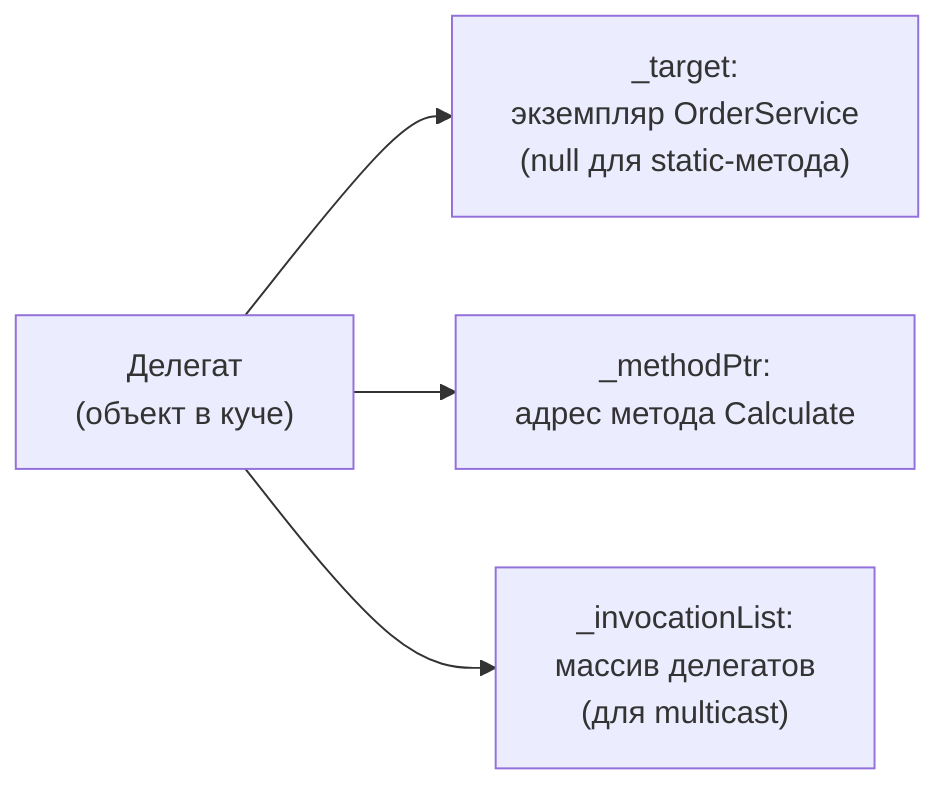
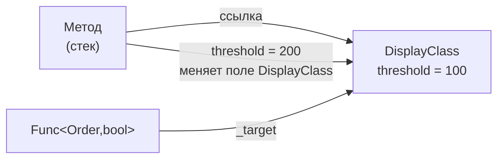

:::tldr
- **Делегат** — типобезопасная ссылка на метод (или несколько методов). Под капотом — класс, наследник `MulticastDelegate`, хранящий объект-цель (`Target`) и указатель на метод.
- **`Action<...>`** — делегат без возвращаемого значения (0–16 параметров).
- **`Func<..., TResult>`** — делегат с возвращаемым значением (последний параметр-тип — результат).
- **`Predicate<T>`** — `bool (T)`; исторический тип, эквивалент `Func<T, bool>`, используется в `List<T>.Find`, `Array.FindAll`.
- Собственный делегат объявляют, когда нужны **понятное имя**, `ref`/`out`/`in`-параметры или документация сигнатуры. **Лямбды** захватывают переменные через **замыкание** (closure) — это аллокация.
:::

## Что такое делегат

```csharp
// Объявление типа делегата
public delegate decimal DiscountStrategy(decimal price, int quantity);

// Методы с подходящей сигнатурой
static decimal NoDiscount(decimal p, int q) => p * q;
static decimal BulkDiscount(decimal p, int q) => q >= 10 ? p * q * 0.9m : p * q;

// Использование
DiscountStrategy strategy = BulkDiscount;
decimal total = strategy(100m, 12);        // 1080
decimal total2 = strategy.Invoke(100m, 12); // то же самое
```

Компилятор генерирует для `DiscountStrategy` класс:

```csharp
public sealed class DiscountStrategy : MulticastDelegate
{
    public DiscountStrategy(object target, IntPtr method);
    public virtual decimal Invoke(decimal price, int quantity);
    public virtual IAsyncResult BeginInvoke(...);   // не поддерживается в .NET Core
    public virtual decimal EndInvoke(...);
}
```



## Встроенные делегаты

| Тип | Сигнатура | Пример применения |
|---|---|---|
| `Action` | `void ()` | `Task.Run(Action)`, колбэки |
| `Action<T1..T16>` | `void (T1, …)` | `List<T>.ForEach`, `Parallel.For` |
| `Func<TResult>` | `TResult ()` | Ленивые фабрики: `Lazy<T>(Func<T>)` |
| `Func<T1..T16, TResult>` | `TResult (T1, …)` | LINQ: `Select(Func<T,R>)` |
| `Predicate<T>` | `bool (T)` | `List<T>.Find`, `RemoveAll` |
| `Comparison<T>` | `int (T, T)` | `List<T>.Sort(Comparison<T>)` |
| `EventHandler<TArgs>` | `void (object?, TArgs)` | События |

```csharp
Action<string> log = msg => Console.WriteLine($"[{DateTime.Now:T}] {msg}");
Func<int, int, int> add = (a, b) => a + b;
Func<Order, bool> isExpensive = o => o.Total > 1000;
Predicate<Order> isExpensive2 = o => o.Total > 1000;

// Func и Predicate с одинаковой сигнатурой — НЕ взаимозаменяемы:
// isExpensive2 = isExpensive;   // ошибка компиляции — разные типы
isExpensive2 = new Predicate<Order>(isExpensive);   // можно обернуть
```

## Где делегаты используются на практике

```csharp
// 1. Стратегия без отдельных классов
public class PriceCalculator(Func<decimal, decimal> taxPolicy)
{
    public decimal Total(decimal net) => net + taxPolicy(net);
}

// 2. Колбэки и конфигурация (паттерн Options в ASP.NET Core)
builder.Services.AddCors(options => options.AddPolicy("web", p => p.WithOrigins("https://app.example.com")));

// 3. Минимальные API: делегат — это обработчик эндпоинта
app.MapGet("/orders/{id}", (int id, IOrderService s) => s.GetAsync(id));

// 4. Ленивые вычисления
var config = new Lazy<Config>(() => LoadConfigFromDisk());

// 5. Фабрики в DI
builder.Services.AddSingleton<IClock>(sp => new SystemClock(sp.GetRequiredService<TimeProvider>()));
```

## Лямбды и замыкания

Когда лямбда использует **внешнюю локальную переменную**, компилятор создаёт класс-замыкание («display class») и переносит переменную в его поле:

```csharp
int threshold = 100;
Func<Order, bool> filter = o => o.Total > threshold;

// Компилятор генерирует примерно:
sealed class DisplayClass
{
    public int threshold;
    public bool Lambda(Order o) => o.Total > threshold;
}
var closure = new DisplayClass { threshold = 100 };      // аллокация
Func<Order, bool> filter2 = closure.Lambda;              // ещё аллокация (делегат)
```



:::warning Захват переменной цикла
```csharp
var actions = new List<Action>();
for (int i = 0; i < 3; i++)
    actions.Add(() => Console.Write(i));
actions.ForEach(a => a());   // 333 — все лямбды видят одну переменную i

foreach (var j in new[] { 0, 1, 2 })
    actions.Add(() => Console.Write(j));   // 012 — с C# 5 у foreach новая переменная на каждой итерации
```
Для `for` сделайте локальную копию: `int copy = i; actions.Add(() => Console.Write(copy));`.
:::

### static-лямбды (C# 9)

```csharp
// Гарантия, что лямбда ничего не захватывает → делегат кэшируется компилятором, без аллокаций
cache.GetOrAdd(key, static (k, arg) => CreateValue(k, arg), argument);
```

## Производительность

- Вызов делегата чуть дороже прямого вызова метода (косвенный вызов, обычно не инлайнится; Dynamic PGO частично это исправляет).
- Лямбда **без захвата** кэшируется в статическом поле — аллокация один раз.
- Лямбда **с захватом** — аллокация замыкания и делегата при каждом выполнении кода, где она создаётся. В горячих путях используйте `static`-лямбды с передачей состояния через параметр.

## Вопросы на засыпку

:::qa Чем делегат отличается от интерфейса с одним методом?
Делегат проще для одиночной операции и поддерживает лямбды и multicast. Интерфейс лучше, если операций несколько, нужна именованная абстракция в DI, состояние или расширяемость. В C# делегат — «лёгкая стратегия».
:::

:::qa Что такое multicast delegate?
Делегат, содержащий список методов. `a += b` создаёт **новый** делегат с объединённым списком (делегаты неизменяемы). При вызове методы выполняются по порядку; возвращается результат **последнего**. Если один бросит исключение — последующие не вызовутся.
:::

:::qa Что такое Expression&lt;Func&lt;T&gt;&gt; и чем отличается от Func&lt;T&gt;?
`Func<T>` — исполняемый код. `Expression<Func<T>>` — описание кода в виде дерева, которое можно проанализировать (EF Core переводит его в SQL) или скомпилировать в `Func<T>`.
:::

:::qa Можно ли вызвать делегат асинхронно через BeginInvoke?
В .NET Core/.NET 5+ — нет, `BeginInvoke` бросает `PlatformNotSupportedException`. Используйте `Task.Run(() => del())`.
:::

## Итог

Делегаты — «указатели на функции» с типобезопасностью. `Action` — без результата, `Func` — с результатом, `Predicate` — наследие для `bool(T)`. Помните, что лямбды с захватом переменных создают замыкания: это и мощный инструмент, и источник аллокаций и неожиданных ошибок.
