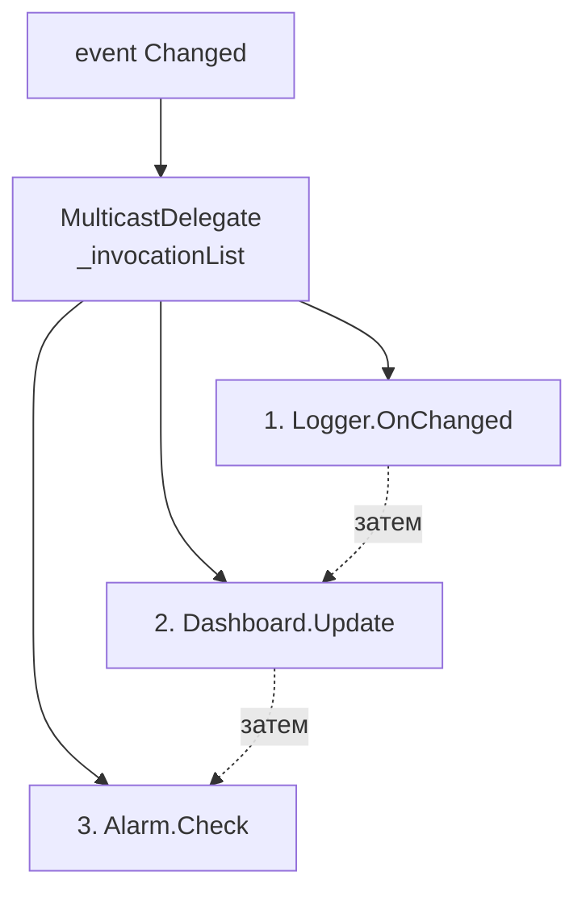
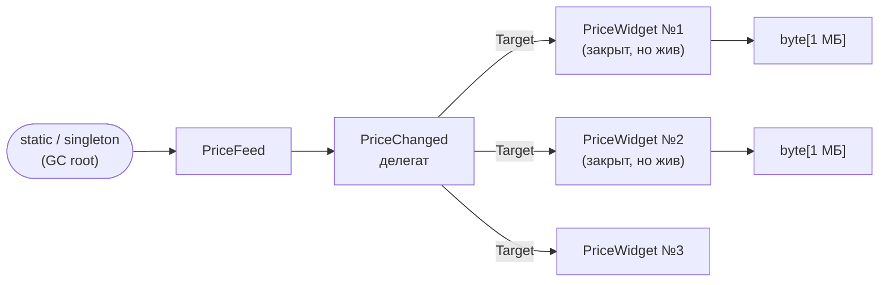

:::tldr
- **`event`** — обёртка над полем-делегатом, которая снаружи разрешает только `+=` и `-=`. Вызвать событие или перезаписать список подписчиков может только класс-владелец.
- Делегат события — **multicast**: хранит список обработчиков, вызываемых по очереди.
- **Утечка памяти**: издатель хранит ссылку на подписчика (через `Target` делегата). Если издатель живёт дольше (синглтон, статический объект), подписчик **никогда не будет собран**, пока не отпишется.
- Решения: **отписываться** (`-=`, `IDisposable`), слабые события (`WeakEventManager`, `WeakReference`), или вместо событий использовать `IObservable`/сообщения с явным управлением подпиской.
- Вызов события: `Changed?.Invoke(this, args)` — потокобезопасная проверка на `null`.
:::

## event против публичного делегата

```csharp
public class Thermometer
{
    public Action<double>? OnChangedField;           // публичное поле-делегат — опасно
    public event EventHandler<TemperatureEventArgs>? Changed;  // событие

    private double _value;
    public double Value
    {
        get => _value;
        set
        {
            _value = value;
            Changed?.Invoke(this, new TemperatureEventArgs(value));  // вызвать может только владелец
        }
    }
}

public sealed record TemperatureEventArgs(double Value);

var t = new Thermometer();
t.OnChangedField = null;          // кто угодно сотрёт всех подписчиков
t.OnChangedField?.Invoke(-273);   // кто угодно вызовет «событие»

t.Changed += (s, e) => Console.WriteLine(e.Value);   // OK
// t.Changed = null;              // ошибка компиляции
// t.Changed(t, args);            // ошибка компиляции
```

Ключевое слово `event` генерирует приватное поле и два метода-аксессора `add` / `remove` (с потокобезопасным `Interlocked.CompareExchange`).

## Multicast delegate



- Делегаты **неизменяемы**: `+=` создаёт новый делегат с расширенным списком. Поэтому копия, взятая в `?.Invoke`, безопасна при одновременной отписке.
- Обработчики вызываются **синхронно и последовательно** в потоке, вызвавшем событие.
- Если обработчик бросит исключение — остальные **не вызовутся**. Для надёжности можно вызывать вручную:

```csharp
foreach (EventHandler<TemperatureEventArgs> handler in Changed?.GetInvocationList() ?? [])
{
    try { handler(this, args); }
    catch (Exception ex) { _logger.LogError(ex, "Подписчик упал"); }
}
```

## Как возникает утечка памяти

```csharp
public class PriceFeed                          // синглтон — живёт всё время работы приложения
{
    public event EventHandler<decimal>? PriceChanged;
}

public class PriceWidget                        // создаётся и «закрывается» много раз
{
    private readonly byte[] _bigCache = new byte[1_000_000];

    public PriceWidget(PriceFeed feed)
    {
        feed.PriceChanged += OnPriceChanged;    // подписались...
    }

    private void OnPriceChanged(object? s, decimal p) { /* обновить UI */ }
    // ...и никогда не отписались
}
```



Направление ссылки важно: **издатель → подписчик**. Поэтому:

- долгоживущий издатель + короткоживущий подписчик = **утечка** (подписчики копятся);
- короткоживущий издатель + долгоживущий подписчик = **нет утечки** (издатель соберётся вместе со своим списком).

Помимо памяти, «мёртвые» подписчики продолжают **получать события и выполнять код** — это ещё и баги, и лишняя нагрузка на CPU.

## Как избежать утечек

### 1. Явная отписка через IDisposable

```csharp
public sealed class PriceWidget : IDisposable
{
    private readonly PriceFeed _feed;
    public PriceWidget(PriceFeed feed)
    {
        _feed = feed;
        _feed.PriceChanged += OnPriceChanged;
    }
    private void OnPriceChanged(object? s, decimal p) { }
    public void Dispose() => _feed.PriceChanged -= OnPriceChanged;
}
```

:::warning Анонимную лямбду нельзя отписать
```csharp
feed.PriceChanged += (s, p) => Update(p);
feed.PriceChanged -= (s, p) => Update(p);   // НЕ сработает: это другой экземпляр делегата
```
Сохраняйте обработчик в поле или используйте метод.
:::

### 2. Слабые события

`WeakReference` не мешает GC собрать объект. В WPF есть `WeakEventManager<TSource, TArgs>`; в своих библиотеках можно реализовать хранение подписчиков через `WeakReference<T>` или `ConditionalWeakTable`.

```csharp
WeakEventManager<PriceFeed, decimal>.AddHandler(feed, nameof(PriceFeed.PriceChanged), OnPriceChanged);
```

### 3. Альтернативы событиям

- `IObservable<T>` / Rx: `Subscribe` возвращает `IDisposable` — естественно управлять временем жизни.
- `Channel<T>` или внутренняя шина сообщений (MediatR notifications) — нет прямых ссылок издателя на подписчика.
- В ASP.NET Core `IOptionsMonitor.OnChange` возвращает `IDisposable` — его обязательно нужно освобождать.

## Как найти такую утечку

1. `dotnet-counters` показывает стабильный рост `gc-heap-size` и Gen 2.
2. Снять два дампа (`dotnet-gcdump collect`) с интервалом и сравнить: растёт число экземпляров `PriceWidget`.
3. В инструменте (Visual Studio, dotMemory, PerfView) посмотреть **путь до корня** (GC root path): `static PriceFeed → PriceChanged → PriceWidget`.

## Стандартный паттерн событий в .NET

```csharp
public class OrderService
{
    public event EventHandler<OrderPlacedEventArgs>? OrderPlaced;

    protected virtual void OnOrderPlaced(OrderPlacedEventArgs e) =>
        OrderPlaced?.Invoke(this, e);   // virtual — наследник может переопределить поведение

    public void Place(Order order)
    {
        // ... сохранение
        OnOrderPlaced(new OrderPlacedEventArgs(order.Id));
    }
}

public sealed class OrderPlacedEventArgs(int orderId) : EventArgs
{
    public int OrderId { get; } = orderId;
}
```

## Вопросы на засыпку

:::qa Почему раньше писали var handler = Changed; if (handler != null) handler(...)?
Между проверкой `Changed != null` и вызовом другой поток мог отписать последний обработчик → `NullReferenceException`. Копия в локальную переменную решала проблему. Оператор `?.Invoke` делает то же самое компактно.
:::

:::qa Могут ли события быть асинхронными?
Обработчик может быть `async void`, но вызывающий не узнает о его завершении и не поймает исключения. Для асинхронных уведомлений лучше свой делегат `Func<T, Task>` и вызов всех обработчиков с `await` (или `Task.WhenAll`).
:::

:::qa Что вернёт вызов multicast-делегата Func&lt;int&gt;?
Результат **последнего** обработчика в списке, остальные результаты теряются. Чтобы собрать все — перебирать `GetInvocationList()`.
:::

:::qa Утекает ли память, если подписать метод статического класса на событие экземпляра?
Нет: у статического метода `Target == null`, издатель не удерживает никаких экземпляров. Утечка возникает, когда долгоживущий объект держит ссылки на короткоживущие.
:::

## Итог

`event` — безопасная обёртка над multicast-делегатом по паттерну Observer. Издатель хранит **сильные ссылки** на подписчиков, поэтому подписка на долгоживущий объект без отписки — одна из самых частых причин утечек памяти в .NET.
