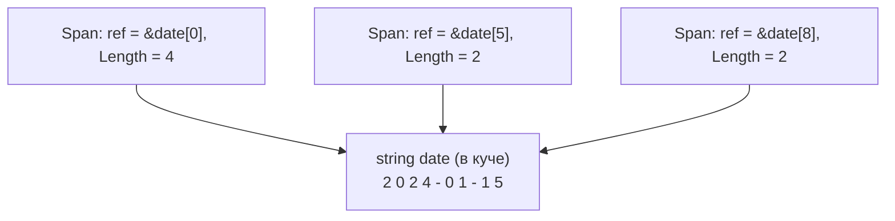
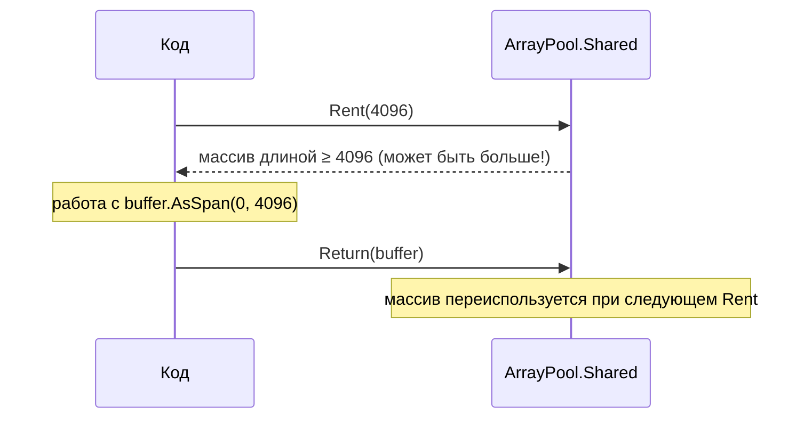

:::tldr
- **`Span<T>`** — `ref struct`, «окно» в непрерывную память (массив, стек через `stackalloc`, нативная память) **без копирования и аллокаций**. Живёт только на стеке: нельзя в поле класса, в `async`-методе, в лямбде.
- **`ReadOnlySpan<T>`** — то же только для чтения; `string.AsSpan()` позволяет разбирать строки без `Substring`.
- **`Memory<T>`** — обычная структура-аналог, которую **можно хранить** в полях и передавать через `await`; получить `Span` — через `.Span`.
- **`ArrayPool<T>.Shared`** — пул переиспользуемых массивов: `Rent`/`Return` вместо `new T[]`, особенно для буферов ≥ 85 КБ (LOH).
- Используются в горячих путях: парсинг, сериализация, сетевые протоколы, обработка бинарных данных.
:::

## Проблема: лишние аллокации

```csharp
// Разобрать "2024-01-15" на части
string date = "2024-01-15";
int year  = int.Parse(date.Substring(0, 4));   // новая строка "2024"
int month = int.Parse(date.Substring(5, 2));   // новая строка "01"
int day   = int.Parse(date.Substring(8, 2));   // новая строка "15"
// 3 аллокации ради временных строк, которые сразу станут мусором
```

С `Span`:

```csharp
ReadOnlySpan<char> span = date.AsSpan();
int year  = int.Parse(span[..4]);      // срез — никаких аллокаций
int month = int.Parse(span[5..7]);
int day   = int.Parse(span[8..10]);
```



## Что такое Span&lt;T&gt; внутри

```csharp
public readonly ref struct Span<T>
{
    internal readonly ref T _reference;   // управляемый указатель на первый элемент (ref-поле, C# 11)
    private readonly int _length;
}
```

Всего 16 байт: ссылка + длина. Может указывать на:

```csharp
Span<byte> fromArray = new byte[100];                      // управляемый массив
Span<byte> onStack   = stackalloc byte[256];               // стек — вообще без кучи
Span<byte> native    = new Span<byte>((void*)ptr, 1024);   // нативная память (unsafe)
Span<int>  slice     = array.AsSpan(10, 5);                // часть массива
```

Единый API для любого вида памяти — один метод парсинга работает и со стеком, и с массивом, и с нативным буфером.

### Почему ref struct и зачем ограничения

`Span` может ссылаться на **стековую** память. Если бы его можно было сохранить в поле объекта в куче, после выхода из метода он указывал бы на уже «мёртвый» стек. Поэтому компилятор запрещает:

| Нельзя | Почему |
|---|---|
| Поле класса или обычной структуры | Объект может пережить стековый кадр |
| Boxing, приведение к `object` / интерфейсу | Попадёт в кучу |
| Локальная переменная в `async`-методе через `await` | Переменные async-метода хранятся в куче (state machine) |
| Захват в лямбде | Замыкание — объект в куче |
| Элемент массива, generic-аргумент (до C# 13) | — |

## Memory&lt;T&gt; — для асинхронного кода

```csharp
public async Task<int> ReadMessageAsync(Stream stream, Memory<byte> buffer, CancellationToken ct)
{
    int read = await stream.ReadAsync(buffer, ct);   // Memory переживает await
    return Parse(buffer.Span[..read]);               // в синхронной части берём Span
}

static int Parse(ReadOnlySpan<byte> data) { /* ... */ return data.Length; }
```

| | `Span<T>` | `Memory<T>` |
|---|---|---|
| Тип | `ref struct` | `struct` |
| Можно хранить в поле | Нет | Да |
| Можно через `await` | Нет | Да |
| Может указывать на стек | Да | Нет |
| Скорость доступа | Максимальная | Чуть медленнее (получение `.Span`) |
| Типичное использование | Синхронная обработка | Асинхронный I/O, хранение буфера |

## ArrayPool&lt;T&gt;



```csharp
byte[] buffer = ArrayPool<byte>.Shared.Rent(minimumLength: 64 * 1024);
try
{
    int read;
    while ((read = await source.ReadAsync(buffer.AsMemory(0, 64 * 1024), ct)) > 0)
        await destination.WriteAsync(buffer.AsMemory(0, read), ct);
}
finally
{
    ArrayPool<byte>.Shared.Return(buffer, clearArray: false); // clearArray: true — если были секреты
}
```

:::warning Правила работы с пулом
- `Rent(n)` возвращает массив **длиной не меньше n** — используйте запрошенный размер, а не `buffer.Length`.
- Массив может содержать **старые данные** предыдущего пользователя.
- После `Return` массив **нельзя использовать** — он уже может принадлежать другому коду.
- Не возвращайте массив дважды и не возвращайте массивы, которые не брали из пула.
:::

## Где это уже используется за вас

- `System.Text.Json` — парсинг UTF-8 через `Utf8JsonReader` (ref struct).
- Kestrel и `System.IO.Pipelines` — сетевые буферы из пула.
- `int.Parse(ReadOnlySpan<char>)`, `Encoding.UTF8.GetBytes(span, span)`, `string.Create`.
- `StringBuilder`, `string.Join`, интерполяция строк — внутри используют пулы и `Span`.

```csharp Создание строки без промежуточных аллокаций
string masked = string.Create(card.Length, card, static (dst, src) =>
{
    src.AsSpan(^4).CopyTo(dst[^4..]);   // последние 4 цифры
    dst[..^4].Fill('*');                // остальное звёздочками
});
```

## Когда применять

- **Да**: горячие пути с измеренными проблемами — парсеры, сериализаторы, middleware с высокой нагрузкой, обработка бинарных протоколов, больших файлов.
- **Нет**: обычная бизнес-логика, CRUD. Выигрыш в наносекундах не окупит усложнение кода. Сначала профилирование (BenchmarkDotNet с `[MemoryDiagnoser]`).

## Вопросы на засыпку

:::qa Почему Span нельзя использовать в async-методе?
Локальные переменные async-метода, живущие через `await`, становятся полями state machine, которая при приостановке переезжает в кучу. `Span` в куче запрещён. Решение — `Memory<T>` или вынести работу со `Span` в отдельный синхронный метод.
:::

:::qa Чем stackalloc опасен?
Размер стека ограничен (~1 МБ). Большой или зависящий от пользовательского ввода `stackalloc` вызовет `StackOverflowException`, который нельзя перехватить. Паттерн: `Span<byte> buf = n <= 256 ? stackalloc byte[256] : new byte[n];`.
:::

:::qa Что такое MemoryPool и IMemoryOwner?
`MemoryPool<T>.Shared.Rent()` возвращает `IMemoryOwner<T>` — владельца памяти, который реализует `IDisposable`. Удобно, когда буфер передаётся между компонентами: освобождает тот, кто владеет. Используется в Pipelines.
:::

:::qa Что такое RecyclableMemoryStream?
Пакет Microsoft.IO.RecyclableMemoryStream: `MemoryStream`, который берёт блоки из пула и не создаёт огромных массивов в LOH. Стандартная замена `MemoryStream` в высоконагруженных сервисах.
:::

## Итог

`Span<T>` и `Memory<T>` дают единый безопасный способ работать со срезами памяти без копирования, а `ArrayPool` — переиспользовать буферы вместо постоянных аллокаций. Это инструменты для горячих путей: применяйте их там, где профилировщик показал давление на GC.
