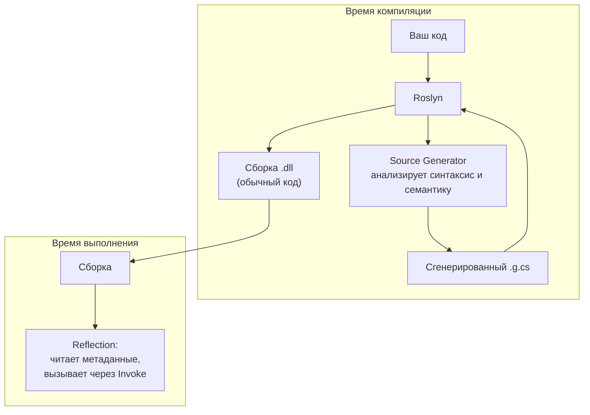
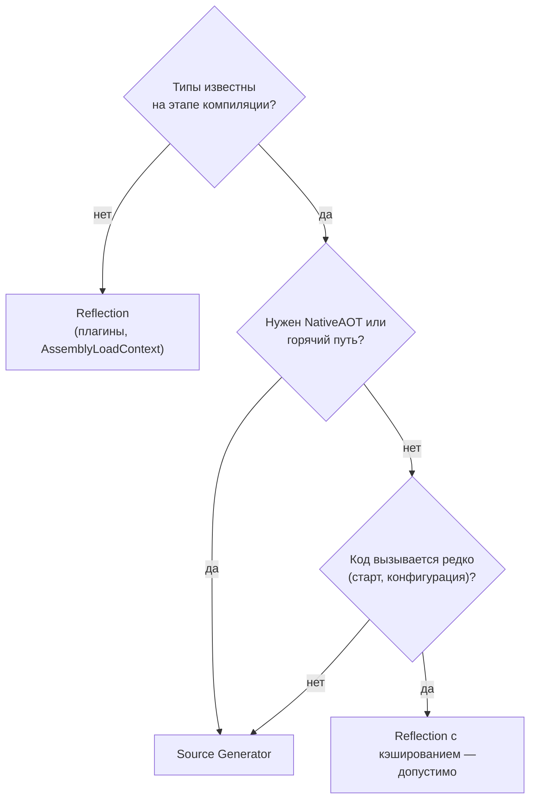

:::tldr
- **Reflection** — анализ и вызов типов **во время выполнения**: `GetType()`, `GetProperties()`, `MethodInfo.Invoke`, `Activator.CreateInstance`. Гибко, но **медленно** (проверки, boxing, нет инлайнинга) и **несовместимо с trimming/NativeAOT**.
- **Source Generators** — плагины компилятора Roslyn, генерирующие C#-код **во время компиляции** на основе вашего кода. Результат — обычный быстрый код без рефлексии.
- Примеры генераторов в .NET: `System.Text.Json` (`JsonSerializerContext`), `[LoggerMessage]`, `[GeneratedRegex]`, `[LibraryImport]`, Minimal API (Request Delegate Generator), конфигурация (binding generator).
- Reflection нужна, когда типы **неизвестны на этапе компиляции** (плагины, динамическая загрузка). Для горячих путей рефлексию кэшируют или компилируют в делегаты.
:::

## Reflection: как это выглядит

```csharp
Type type = typeof(Order);

foreach (PropertyInfo prop in type.GetProperties(BindingFlags.Public | BindingFlags.Instance))
{
    object? value = prop.GetValue(order);          // boxing для значимых типов
    Console.WriteLine($"{prop.Name} = {value}");
}

object instance = Activator.CreateInstance(type)!;       // создание по типу
MethodInfo method = type.GetMethod("Recalculate")!;
method.Invoke(instance, new object[] { 0.2m });           // позднее связывание
```

Почему медленно:

1. **Поиск метаданных** — `GetProperties`, `GetMethod` обходят таблицы метаданных (кэшируйте результат!).
2. **Проверки при каждом вызове** — типы аргументов, права доступа.
3. **Boxing** аргументов и результата, массив `object[]` на каждый вызов.
4. **Нет инлайнинга** и оптимизаций JIT.



## Порядки скорости

| Способ вызова метода | Относительная скорость |
|---|---|
| Прямой вызов | 1× |
| Скомпилированный делегат (`CreateDelegate`, `Expression.Compile`) | ~1–2× |
| `MethodInfo.Invoke` (.NET 8+, после оптимизаций через IL emit) | ~5–20× |
| `MethodInfo.Invoke` (.NET Framework) | ~50–100× |
| `dynamic` (первый вызов / последующие) | медленно / ~2–5× (кэш call site) |

### Как ускорить рефлексию

```csharp
// Кэшировать PropertyInfo и превратить в делегат
static readonly Func<Order, decimal> GetTotal =
    (Func<Order, decimal>)Delegate.CreateDelegate(
        typeof(Func<Order, decimal>),
        typeof(Order).GetProperty(nameof(Order.Total))!.GetMethod!);

decimal total = GetTotal(order);   // почти как прямой вызов

// .NET 8: UnsafeAccessor — доступ к приватному члену без рефлексии, AOT-совместимо
[UnsafeAccessor(UnsafeAccessorKind.Field, Name = "_secret")]
static extern ref string GetSecret(Order order);
```

## Source Generators: как это выглядит

Разработчик пишет декларацию, генератор дописывает реализацию:

```csharp Высокопроизводительное логирование
public static partial class Log
{
    [LoggerMessage(EventId = 1001, Level = LogLevel.Information,
                   Message = "Order {OrderId} placed for {Total}")]
    public static partial void OrderPlaced(ILogger logger, int orderId, decimal total);
}

// Генератор создаёт реализацию: проверка IsEnabled, без boxing, без парсинга шаблона в рантайме
Log.OrderPlaced(_logger, order.Id, order.Total);
```

```csharp JSON без рефлексии (обязательно для NativeAOT)
[JsonSerializable(typeof(Order))]
[JsonSerializable(typeof(List<Order>))]
internal partial class AppJsonContext : JsonSerializerContext { }

string json = JsonSerializer.Serialize(order, AppJsonContext.Default.Order);
```

```csharp Регулярное выражение, скомпилированное на этапе сборки
public static partial class Validators
{
    [GeneratedRegex(@"^\+?[1-9]\d{7,14}$", RegexOptions.CultureInvariant)]
    public static partial Regex Phone();
}

bool ok = Validators.Phone().IsMatch("+998901234567");
```

Сгенерированный код можно посмотреть: в Visual Studio / Rider — Dependencies → Analyzers → генератор, или включить `<EmitCompilerGeneratedFiles>true</EmitCompilerGeneratedFiles>`.

### Как написать свой генератор (в общих чертах)

```csharp
[Generator]
public sealed class ToStringGenerator : IIncrementalGenerator
{
    public void Initialize(IncrementalGeneratorInitializationContext context)
    {
        var classes = context.SyntaxProvider.ForAttributeWithMetadataName(
            "MyLib.AutoToStringAttribute",
            predicate: static (node, _) => node is ClassDeclarationSyntax,
            transform: static (ctx, _) => (INamedTypeSymbol)ctx.TargetSymbol);

        context.RegisterSourceOutput(classes, static (spc, symbol) =>
        {
            var props = symbol.GetMembers().OfType<IPropertySymbol>().Select(p => $"{p.Name}={{{p.Name}}}");
            spc.AddSource($"{symbol.Name}.g.cs", $$"""
                namespace {{symbol.ContainingNamespace}};
                partial class {{symbol.Name}}
                {
                    public override string ToString() => $"{{string.Join(", ", props)}}";
                }
                """);
        });
    }
}
```

Генератор — это отдельный проект `netstandard2.0`, подключаемый как анализатор. **Инкрементальные** генераторы (`IIncrementalGenerator`) кэшируют промежуточные результаты — IDE не тормозит.

## Сравнение

| | Reflection | Source Generators |
|---|---|---|
| Когда работает | Runtime | Compile time |
| Производительность | Низкая, нужен кэш | Как у рукописного кода |
| Trimming / NativeAOT | Проблемы (код может быть вырезан) | Полная совместимость |
| Ошибки | В рантайме | При компиляции |
| Отладка | Сложно | Сгенерированный код можно открыть и отладить |
| Может ли изменять ваш код | — | Нет, только **добавлять** новые файлы (partial) |
| Работает с неизвестными заранее типами | Да | Нет — только то, что видно при компиляции |

## Когда что выбирать



## Вопросы на засыпку

:::qa Почему рефлексия ломается при trimming?
Trimmer удаляет код, на который нет статических ссылок. Если тип используется только через `Type.GetType("MyApp.Plugin")`, trimmer о нём не знает и вырежет. Нужны атрибуты `[DynamicallyAccessedMembers]` или отказ от рефлексии.
:::

:::qa Чем Source Generator отличается от T4-шаблонов и IL Weaving (Fody)?
T4 генерирует код до компиляции, но не видит семантическую модель проекта. IL Weaving модифицирует уже скомпилированный IL — мощно, но непрозрачно и хрупко. Source Generators работают внутри компилятора, видят семантику и дают читаемый C#-код.
:::

:::qa Где рефлексия используется в ASP.NET Core?
Обнаружение контроллеров и их действий, model binding, DI (поиск конструкторов), EF Core (построение модели). Результаты кэшируются при старте. Новые генераторы (RDG для Minimal API, генератор конфигурации) постепенно заменяют рефлексию для поддержки AOT.
:::

:::qa Что такое Reflection.Emit?
Генерация IL-кода в рантайме (`DynamicMethod`, `TypeBuilder`). Так работали быстрые сериализаторы и прокси (Castle DynamicProxy для Moq). Не поддерживается в NativeAOT.
:::

## Итог

Reflection — гибкость в рантайме ценой скорости и AOT-совместимости. Source Generators переносят метапрограммирование на этап компиляции: быстрый, проверяемый и AOT-дружественный код. Современный .NET последовательно заменяет рефлексию генераторами.
