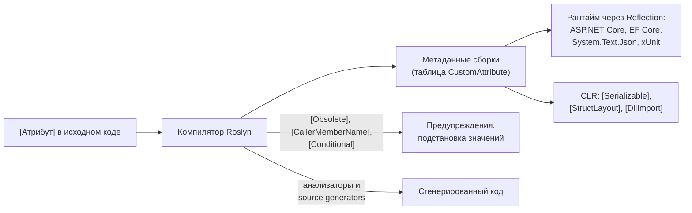

:::tldr
- **Атрибут** — декларативные **метаданные**, прикреплённые к сборке, типу, методу, свойству, параметру. Сам по себе атрибут **ничего не делает** — его читает кто-то другой: компилятор, рантайм, фреймворк, анализатор или генератор кода.
- Свой атрибут — класс-наследник `System.Attribute` с `[AttributeUsage]` (где разрешён, можно ли повторять, наследуется ли).
- Чтение: `type.GetCustomAttribute<T>()`, `prop.GetCustomAttributes()` — через рефлексию; результат стоит **кэшировать**.
- Аргументы атрибутов — только **константы времени компиляции**: примитивы, строки, `typeof`, enum, массивы из них.
- Бывают «псевдоатрибуты» и атрибуты для компилятора (`[Obsolete]`, `[CallerMemberName]`, `[MethodImpl]`), которые влияют на компиляцию и IL, а не читаются рефлексией.
:::

## Как атрибуты используются в .NET

```csharp
[ApiController]                                        // ASP.NET Core: поведение контроллера
[Route("api/[controller]")]
public class OrdersController : ControllerBase
{
    [HttpPost]                                         // маршрутизация
    [Authorize(Policy = "CanCreateOrders")]            // авторизация
    [ProducesResponseType(typeof(OrderDto), 201)]      // OpenAPI
    public IActionResult Create([FromBody] CreateOrderRequest request) => ...;
}

public class CreateOrderRequest
{
    [Required, StringLength(100)]                      // валидация
    public string CustomerName { get; init; } = "";

    [JsonPropertyName("total_amount")]                 // сериализация
    public decimal Total { get; init; }
}

[Table("orders")]                                      // EF Core: маппинг
public class Order { [Key] public int Id { get; set; } }

[Obsolete("Используйте CreateV2", error: false)]       // компилятор: предупреждение
public void Create() { }
```



## Создание своего атрибута

```csharp
[AttributeUsage(
    AttributeTargets.Class | AttributeTargets.Method,  // где можно применять
    AllowMultiple = false,                             // можно ли указать несколько раз
    Inherited = true)]                                 // видят ли наследники
public sealed class AuditAttribute : Attribute
{
    public AuditAttribute(string action) => Action = action;   // позиционный параметр

    public string Action { get; }
    public bool IncludePayload { get; set; }                   // именованный параметр
}

[Audit("order.create", IncludePayload = true)]
public class CreateOrderHandler { }
```

Соглашения:

- Имя класса заканчивается на `Attribute`, при использовании суффикс можно опустить.
- Класс атрибута делают `sealed` — рефлексия ищет атрибуты быстрее.
- Параметры конструктора — **обязательные** (позиционные), публичные свойства — **необязательные** (именованные).

:::note Ограничения на аргументы
Значения атрибутов сериализуются в метаданные сборки, поэтому допустимы только: примитивные типы, `string`, `Type` (`typeof(X)`), `enum`, `object` (с одним из перечисленных значений) и одномерные массивы из них. `decimal`, `DateTime`, `Guid` — **нельзя**.
:::

### Generic-атрибуты (C# 11)

```csharp
public sealed class ValidatorAttribute<TValidator> : Attribute where TValidator : IValidator { }

[Validator<CreateOrderValidator>]      // вместо [Validator(typeof(CreateOrderValidator))]
public record CreateOrderCommand(int CustomerId);
```

## Чтение через Reflection

```csharp
// Один атрибут
var audit = typeof(CreateOrderHandler).GetCustomAttribute<AuditAttribute>();
if (audit is not null)
    Console.WriteLine($"{audit.Action}, payload: {audit.IncludePayload}");

// Проверка наличия (быстрее — объект атрибута не создаётся)
bool isAudited = typeof(CreateOrderHandler).IsDefined(typeof(AuditAttribute), inherit: true);

// Все свойства, помеченные атрибутом
var sensitive = typeof(User).GetProperties()
    .Where(p => p.IsDefined(typeof(SensitiveDataAttribute)))
    .Select(p => p.Name)
    .ToArray();
```

:::warning Каждый вызов GetCustomAttribute создаёт новый экземпляр
Атрибуты хранятся в метаданных как сериализованные данные конструктора. При каждом `GetCustomAttribute` рантайм **заново создаёт объект**, вызывая конструктор. В горячем коде (middleware, сериализация) кэшируйте результат:

```csharp
private static readonly ConcurrentDictionary<Type, AuditAttribute?> Cache = new();
AuditAttribute? GetAudit(Type t) => Cache.GetOrAdd(t, static x => x.GetCustomAttribute<AuditAttribute>());
```
:::

## Практический пример: маскирование данных в логах

```csharp
[AttributeUsage(AttributeTargets.Property)]
public sealed class SensitiveAttribute : Attribute { }

public record LoginRequest(string Email, [property: Sensitive] string Password);

public static class Masker
{
    private static readonly ConcurrentDictionary<Type, PropertyInfo[]> Props = new();

    public static Dictionary<string, object?> ToSafeDictionary(object obj)
    {
        var props = Props.GetOrAdd(obj.GetType(), t => t.GetProperties());
        return props.ToDictionary(
            p => p.Name,
            p => p.IsDefined(typeof(SensitiveAttribute)) ? "***" : p.GetValue(obj));
    }
}
```

Обратите внимание на `[property: Sensitive]` — у positional record атрибут по умолчанию применяется к **параметру конструктора**, а не к свойству. Цель задают явно: `property:`, `field:`, `param:`, `return:`, `assembly:`.

## Атрибуты для компилятора

| Атрибут | Что делает |
|---|---|
| `[Obsolete]` | Предупреждение или ошибка при использовании |
| `[CallerMemberName]`, `[CallerFilePath]`, `[CallerLineNumber]` | Компилятор подставляет имя вызывающего метода, путь, строку |
| `[CallerArgumentExpression]` (C# 10) | Подставляет текст выражения-аргумента — для `ArgumentNullException.ThrowIfNull` |
| `[Conditional("DEBUG")]` | Вызовы метода удаляются из сборки без символа `DEBUG` |
| `[MethodImpl(MethodImplOptions.AggressiveInlining)]` | Подсказка JIT |
| `[NotNull]`, `[MaybeNullWhen(false)]` | Подсказки анализу nullable |
| `[ModuleInitializer]` | Метод вызывается при загрузке сборки |
| `[SetsRequiredMembers]` | Конструктор инициализирует все `required`-члены |

```csharp
public static void NotNull(object? value, [CallerArgumentExpression(nameof(value))] string? expr = null)
{
    if (value is null) throw new ArgumentNullException(expr);
}

NotNull(request.Customer);   // ArgumentNullException: request.Customer
```

## Атрибуты и Source Generators

Современный подход: атрибут служит **маркером для генератора**, а логика появляется на этапе компиляции — без рефлексии в рантайме. Примеры: `[LoggerMessage]`, `[GeneratedRegex]`, `[JsonSerializable]`, `[LibraryImport]`, сторонние — `[AutoConstructor]`, Mapperly `[Mapper]`.

## Вопросы на засыпку

:::qa Может ли атрибут содержать логику?
Может содержать методы, но вызывает их тот, кто читает атрибут. Например, `ValidationAttribute.IsValid` вызывает валидатор, `ActionFilterAttribute.OnActionExecuting` — конвейер MVC. Сам по себе атрибут пассивен.
:::

:::qa Почему в атрибут нельзя передать decimal или DateTime?
Аргументы хранятся в метаданных сборки в специальном бинарном формате, который поддерживает только примитивы, строки, `Type`, enum и массивы из них. `decimal` и `DateTime` — обычные структуры, для них формата нет. Обходной путь — передать строку и распарсить.
:::

:::qa Чем атрибуты отличаются от маркерных интерфейсов?
Интерфейс участвует в системе типов: можно ограничить дженерик `where T : IMarker`, проверить `is IMarker` быстро и без рефлексии. Атрибут может нести параметры и применяться к методам, свойствам, параметрам — не только к типам.
:::

:::qa Как фильтр-атрибут в ASP.NET Core получает зависимости из DI?
Конструктор атрибута не может принимать сервисы. Используют `[ServiceFilter(typeof(MyFilter))]` или `[TypeFilter(typeof(MyFilter))]` — фильтр создаётся через DI, а атрибут лишь указывает тип.
:::

## Итог

Атрибуты — метаданные, которые читают компилятор, рантайм и фреймворки. Создавайте свои через наследование от `Attribute` с `[AttributeUsage]`, читайте через рефлексию с кэшированием, а для производительного кода используйте атрибуты как маркеры для source generators.
