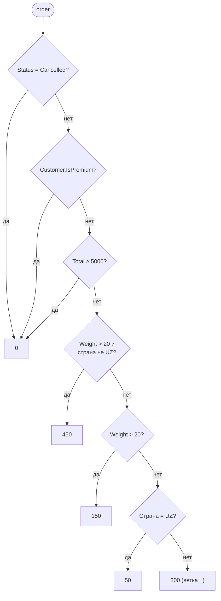

:::tldr
- **Pattern matching** — проверка «имеет ли значение определённую форму» с одновременным извлечением данных: `if (obj is Order { Total: > 1000 } o)`.
- **Switch expression** (C# 8) — `switch` как **выражение**, возвращающее значение; компилятор предупреждает о **неполном покрытии** случаев.
- Виды паттернов: **типовой** (`is Order o`), **константный** (`null`, `42`), **реляционный** (`> 0`, `<= 100`), **логический** (`and`, `or`, `not`), **свойств** (`{ Status: Paid }`), **позиционный** (`(0, 0)`), **списков** (`[first, .., last]`, C# 11), `var` и отбрасывание `_`.
- **`when`-guard** — дополнительное произвольное условие к ветке.
- Порядок веток важен: выигрывает **первая** подходящая, компилятор ругается на недостижимые ветки.
:::

## Эволюция: от if-цепочек к выражениям

```csharp
// Раньше
string Describe(object shape)
{
    if (shape is Circle)
    {
        var c = (Circle)shape;
        return $"Круг R={c.Radius}";
    }
    else if (shape is Rectangle)
    {
        var r = (Rectangle)shape;
        if (r.Width == r.Height) return $"Квадрат {r.Width}";
        return $"Прямоугольник {r.Width}x{r.Height}";
    }
    return "Неизвестно";
}

// Сейчас
string Describe(object shape) => shape switch
{
    Circle { Radius: var r }                          => $"Круг R={r}",
    Rectangle { Width: var w, Height: var h } when w == h => $"Квадрат {w}",
    Rectangle(var w, var h)                           => $"Прямоугольник {w}x{h}",
    null                                              => "null",
    _                                                 => "Неизвестно"
};
```

## Каталог паттернов

| Паттерн | Пример | Смысл |
|---|---|---|
| Типовой / объявления | `x is string s` | Тип совпадает — переменная `s` уже приведена |
| Константный | `x is null`, `status is OrderStatus.Paid` | Равенство константе (`is null` не использует перегруженный `==`) |
| Реляционный (C# 9) | `age is >= 18` | Сравнение с константой |
| Логический (C# 9) | `x is > 0 and < 100`, `c is 'a' or 'b'`, `x is not null` | Комбинация паттернов |
| Свойств | `order is { Status: Paid, Total: > 0 }` | Проверка свойств, вложенная |
| Расширенный свойств (C# 10) | `{ Customer.Address.City: "Tashkent" }` | Доступ по цепочке |
| Позиционный | `point is (0, 0)` | Через `Deconstruct` |
| Списков (C# 11) | `args is [var first, .., var last]` | Форма массива/списка |
| `var` | `x is var v` | Всегда совпадает, захватывает значение |
| Отбрасывание | `_` | Всё остальное |

## Switch expression в бизнес-логике

```csharp
public enum OrderStatus { New, Paid, Shipped, Delivered, Cancelled }

public decimal CalculateShipping(Order order) => order switch
{
    { Status: OrderStatus.Cancelled }                      => 0m,
    { Customer.IsPremium: true }                           => 0m,
    { Total: >= 5000 }                                     => 0m,
    { Weight: > 20, Destination.Country: not "UZ" }        => 450m,
    { Weight: > 20 }                                       => 150m,
    { Destination.Country: "UZ" }                          => 50m,
    _                                                      => 200m
};
```



:::warning Порядок имеет значение
Ветки проверяются **сверху вниз**. Если поставить `{ Weight: > 20 }` перед `{ Weight: > 20, Destination.Country: not "UZ" }`, вторая станет недостижимой — компилятор выдаст ошибку CS8510. Более конкретные случаи — выше.
:::

## Проверка полноты (exhaustiveness)

```csharp
string Label(OrderStatus s) => s switch
{
    OrderStatus.New     => "Новый",
    OrderStatus.Paid    => "Оплачен",
    OrderStatus.Shipped => "Отправлен",
};
// warning CS8509: The switch expression does not handle all possible values
// в рантайме для Delivered: SwitchExpressionException
```

Совет: включите `<WarningsAsErrors>CS8509</WarningsAsErrors>` — при добавлении нового значения enum компилятор покажет все места, которые нужно обновить.

## When guards

`when` добавляет условие, которое нельзя выразить паттерном — например, сравнение двух переменных или вызов метода:

```csharp
var result = request switch
{
    { Amount: <= 0 }                                        => Result.Fail("Сумма должна быть положительной"),
    { Currency: var c } when !_supported.Contains(c)        => Result.Fail($"Валюта {c} не поддерживается"),
    { From: var from, To: var to } when from == to          => Result.Fail("Счета совпадают"),
    _                                                       => Result.Ok()
};
```

## Позиционные и списковые паттерны

```csharp
// Позиционный: через Deconstruct (есть у record и кортежей)
string Quadrant(Point p) => p switch
{
    (0, 0)            => "Начало координат",
    (> 0, > 0)        => "I",
    (< 0, > 0)        => "II",
    (< 0, < 0)        => "III",
    (> 0, < 0)        => "IV",
    _                 => "На оси"
};

// Кортежи: машина состояний без вложенных if
State Next(State current, Command cmd) => (current, cmd) switch
{
    (State.Draft,    Command.Submit)  => State.Review,
    (State.Review,   Command.Approve) => State.Published,
    (State.Review,   Command.Reject)  => State.Draft,
    (_,              Command.Archive) => State.Archived,
    _ => throw new InvalidOperationException($"Нельзя {cmd} из {current}")
};

// Списковые (C# 11)
string Parse(string[] args) => args switch
{
    []                         => "Нет аргументов",
    ["--help" or "-h"]         => "Справка",
    ["run", var file]          => $"Запуск {file}",
    ["run", var file, .. var rest] => $"Запуск {file} с {rest.Length} опциями",
    _                          => "Неизвестная команда"
};
```

## Под капотом

Компилятор строит из паттернов **дерево решений** и оптимизирует его: не проверяет тип дважды, объединяет общие проверки, для констант генерирует `switch` IL-инструкцию (jump table). Поэтому switch expression обычно не медленнее ручных `if`.

## Вопросы на засыпку

:::qa Чем x is null отличается от x == null?
`x == null` может вызвать **перегруженный** оператор `==` класса, который может работать неожиданно. `x is null` всегда проверяет ссылку на null напрямую. Аналогично `is not null`.
:::

:::qa Можно ли использовать pattern matching вместо полиморфизма?
Можно, но это разные инструменты. Полиморфизм хорош, когда набор операций фиксирован, а типы расширяются. Pattern matching — когда набор типов фиксирован (закрытая иерархия, discriminated union), а операции добавляются. Для открытых иерархий с бизнес-логикой — виртуальные методы.
:::

:::qa Что будет, если ни одна ветка switch expression не подошла?
Бросится `SwitchExpressionException` (или `InvalidOperationException` в старых версиях). Поэтому либо покрывают все случаи, либо добавляют `_ =>` с осмысленным исключением.
:::

:::qa Как работает паттерн свойств с null?
`{ }` — паттерн «не null»: `x is { }` эквивалентно `x is not null`. Паттерн свойств никогда не совпадает с `null`, поэтому в `{ Customer.Name: "A" }` null в цепочке просто даёт «не совпало», без исключения.
:::

## Итог

Pattern matching превращает ветвления по форме данных в декларативные, проверяемые компилятором выражения. Switch expressions с паттернами свойств, реляционными и логическими паттернами заменяют длинные цепочки `if/else`, а проверка полноты защищает от забытых случаев.
