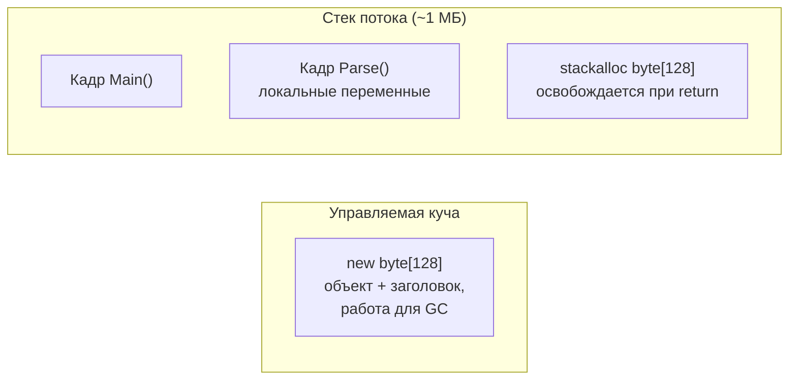
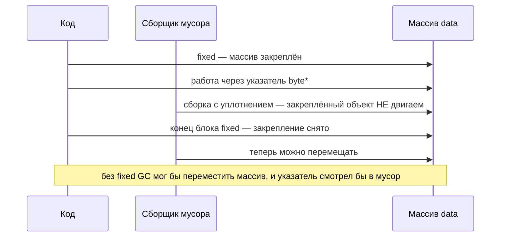

:::tldr
- **`unsafe`** разрешает указатели (`int*`), адресную арифметику, `fixed`, `sizeof` для любых unmanaged-типов. Требует `<AllowUnsafeBlocks>true</AllowUnsafeBlocks>`. Проверки границ и типобезопасность **отключены** — ошибка = порча памяти.
- **`stackalloc`** выделяет память **на стеке** текущего метода: сверхбыстро, без GC, освобождается автоматически при выходе. С C# 7.2 работает **без unsafe** через `Span<T>`.
- **`fixed`** закрепляет (pin) управляемый объект, чтобы GC его не сдвинул, пока на него указывает указатель.
- Оправдано: **interop** с нативными библиотеками, **критичные горячие пути** (парсинг, криптография, SIMD), маленькие временные буферы. В бизнес-коде — нет.
- Правило для `stackalloc`: **маленький и ограниченный** размер (обычно ≤ 256–1024 байт), иначе — `ArrayPool`.
:::

## stackalloc: память на стеке

```csharp
// Безопасный вариант (C# 7.2+): без unsafe, с проверкой границ
Span<byte> buffer = stackalloc byte[128];
int written = Encoding.UTF8.GetBytes("hello", buffer);
Process(buffer[..written]);

// Паттерн: стек для маленьких данных, пул для больших
const int StackLimit = 256;
byte[]? rented = null;
Span<byte> buf = length <= StackLimit
    ? stackalloc byte[StackLimit]
    : (rented = ArrayPool<byte>.Shared.Rent(length));
try
{
    // работа с buf[..length]
}
finally
{
    if (rented is not null) ArrayPool<byte>.Shared.Return(rented);
}
```



| | `stackalloc` | `new byte[]` | `ArrayPool.Rent` |
|---|---|---|---|
| Стоимость выделения | Сдвиг указателя стека | Аллокация в куче | Взять из пула |
| Нагрузка на GC | Нет | Да | Нет (почти) |
| Освобождение | Автоматически при выходе из метода | GC | Вручную `Return` |
| Размер | Маленький (стек ограничен) | Любой | Любой |
| Можно вернуть из метода | Нет | Да | Да |

:::warning StackOverflowException нельзя перехватить
Стек потока ограничен (по умолчанию ~1 МБ, у потоков пула может быть меньше). `stackalloc` размером, зависящим от пользовательского ввода, — уязвимость: злоумышленник уронит процесс целиком. Всегда ограничивайте размер константой. И не делайте `stackalloc` внутри цикла — память освободится только при выходе из метода.
:::

## unsafe-код и указатели

```csharp
// <AllowUnsafeBlocks>true</AllowUnsafeBlocks> в .csproj
public static unsafe int SumBytes(byte[] data)
{
    int sum = 0;
    fixed (byte* start = data)             // pin: GC не сдвинет массив внутри блока
    {
        byte* p = start;
        byte* end = start + data.Length;
        while (p < end) sum += *p++;       // без проверки границ
    }
    return sum;
}
```



Закреплённые объекты мешают уплотнению кучи (фрагментация), поэтому `fixed` должен быть **коротким**. Для долгоживущих закреплённых буферов — `GC.AllocateArray<byte>(n, pinned: true)` (попадает в Pinned Object Heap).

### Возможности unsafe

| Конструкция | Назначение |
|---|---|
| `T*`, `&x`, `*p`, `p->Field` | Указатели, взятие адреса, разыменование |
| `fixed` | Закрепление управляемого объекта |
| `fixed byte buffer[16]` в struct | Встроенный массив фиксированного размера (для interop) |
| `sizeof(T)` | Размер unmanaged-типа |
| `delegate* unmanaged<int, int>` | Указатели на функции (C# 9) — быстрый interop |
| `Unsafe.As`, `Unsafe.Add`, `MemoryMarshal` | «Безопасный unsafe» — без ключевого слова, но без проверок |

## Когда это оправдано

### 1. Взаимодействие с нативным кодом

```csharp
public static partial class Native
{
    [LibraryImport("libsodium", EntryPoint = "randombytes_buf")]
    public static unsafe partial void RandomBytes(byte* buffer, nuint size);
}

Span<byte> key = stackalloc byte[32];
unsafe
{
    fixed (byte* p = key) Native.RandomBytes(p, (nuint)key.Length);
}
```

### 2. Горячие пути, где проверки границ заметны

Парсеры бинарных форматов, хэш-функции, обработка изображений, векторизация (`Vector128<T>`, `Vector256<T>`). Но сначала — бенчмарк: JIT часто сам убирает проверки границ в простых циклах `for (i = 0; i < arr.Length; i++)`.

### 3. Маленькие временные буферы

Форматирование чисел, кодирование, преобразование GUID — `stackalloc` + `Span` без `unsafe`.

## Когда не нужно

- Бизнес-логика, CRUD, веб-контроллеры — никакого выигрыша, только риск.
- «Для скорости» без профилирования. Современный JIT и `Span<T>` дают почти ту же производительность безопасно.
- Когда есть готовый API: `MemoryMarshal.Cast`, `BinaryPrimitives.ReadInt32LittleEndian`, `BitConverter.TryWriteBytes`.

## Вопросы на засыпку

:::qa Можно ли использовать stackalloc в async-методе?
Можно в синхронной части, но `Span`, указывающий на него, нельзя держать через `await`. Обычно работу с `stackalloc` выносят в отдельный синхронный метод.
:::

:::qa Почему unsafe-код опасен для безопасности приложения?
Нет проверки границ: запись за пределы буфера портит соседние данные (buffer overflow), чтение — может раскрыть чужие данные. Ошибки проявляются непредсказуемо и далеко от места возникновения.
:::

:::qa Что такое SkipLocalsInit?
Атрибут `[SkipLocalsInit]` отключает обнуление локальных переменных и памяти `stackalloc`. Даёт выигрыш для больших буферов, но память будет содержать мусор — нужно всегда записывать перед чтением. Требует `AllowUnsafeBlocks`.
:::

:::qa Чем Unsafe.As отличается от обычного приведения?
Обычное приведение проверяет тип в рантайме. `Unsafe.As<T>(obj)` просто переинтерпретирует ссылку без проверки — быстро, но неверный тип приведёт к порче памяти.
:::

## Итог

`stackalloc` через `Span<T>` — безопасный и полезный инструмент для маленьких временных буферов. `unsafe` и указатели — для interop и редких горячих путей после профилирования. В обоих случаях размер и время жизни памяти должны быть строго контролируемы.
