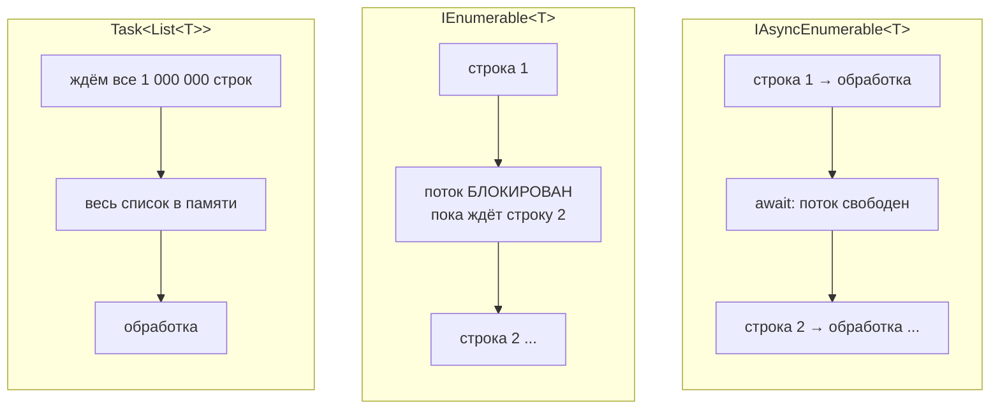
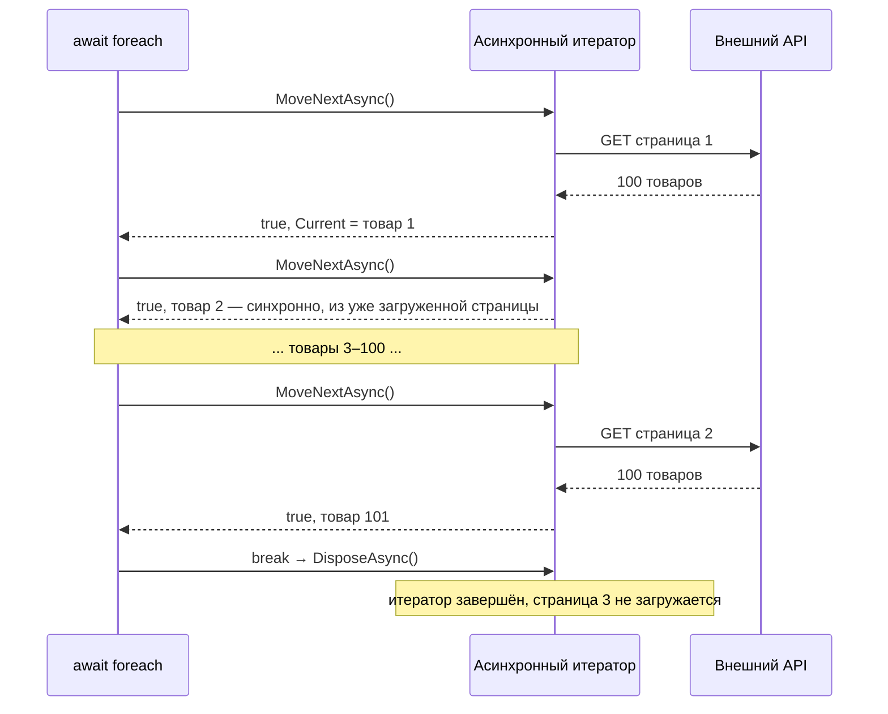

:::tldr
- **`IAsyncEnumerable<T>`** (C# 8) — асинхронная последовательность: элементы приходят **по одному по мере готовности**, а ожидание каждого не блокирует поток.
- Потребление: **`await foreach`**. Производство: метод `async IAsyncEnumerable<T>` с **`yield return`** — компилятор генерирует асинхронный итератор.
- Внутри: `MoveNextAsync()` возвращает `ValueTask<bool>`, освобождение — `DisposeAsync()`.
- Отмена: параметр с атрибутом **`[EnumeratorCancellation]`** или `.WithCancellation(ct)` у потребителя.
- Применение: чтение больших выборок из БД (`AsAsyncEnumerable`), стриминг ответов API, gRPC server streaming, SignalR, постраничный обход внешних API, чтение файлов/очередей.
:::

## Проблема: выбор между памятью и асинхронностью

```csharp
// Вариант 1: асинхронно, но всё в памяти — ждём ВСЕ строки
Task<List<Order>> GetAllAsync();

// Вариант 2: потоково, но синхронно — поток блокируется на каждой строке
IEnumerable<Order> GetAll();

// Вариант 3: и потоково, и асинхронно
IAsyncEnumerable<Order> GetAllAsync();
```



## Интерфейсы

```csharp
public interface IAsyncEnumerable<out T>
{
    IAsyncEnumerator<T> GetAsyncEnumerator(CancellationToken cancellationToken = default);
}

public interface IAsyncEnumerator<out T> : IAsyncDisposable
{
    T Current { get; }
    ValueTask<bool> MoveNextAsync();     // ValueTask — часто элемент уже готов (буфер), без аллокаций
}
```

## Производитель: асинхронный итератор

```csharp
public async IAsyncEnumerable<Product> GetAllProductsAsync(
    [EnumeratorCancellation] CancellationToken ct = default)
{
    string? cursor = null;
    do
    {
        // постраничный обход внешнего API
        var page = await _http.GetFromJsonAsync<Page<Product>>($"/products?cursor={cursor}", ct);
        foreach (var product in page!.Items)
            yield return product;                     // отдать элемент потребителю
        cursor = page.NextCursor;
    }
    while (cursor is not null);
}
```

## Потребитель: await foreach

```csharp
await foreach (var product in _catalog.GetAllProductsAsync(ct))
{
    await _index.UpsertAsync(product, ct);
    if (product.IsDiscontinued) break;   // break → DisposeAsync → итератор прекращает загрузку страниц
}
```

Что разворачивает компилятор:

```csharp
var enumerator = source.GetAsyncEnumerator(ct);
try
{
    while (await enumerator.MoveNextAsync())
    {
        var product = enumerator.Current;
        // тело цикла
    }
}
finally
{
    await enumerator.DisposeAsync();
}
```



## Отмена

Два пути передачи токена — и они объединяются:

```csharp
// 1. Прямой вызов метода с токеном
await foreach (var x in GetAllProductsAsync(ct)) { }

// 2. Токен у потребителя, когда последовательность пришла «готовой»
IAsyncEnumerable<Product> products = GetAllProductsAsync();
await foreach (var x in products.WithCancellation(ct)) { }
```

Атрибут `[EnumeratorCancellation]` говорит компилятору: токен, переданный в `GetAsyncEnumerator(ct)` (через `WithCancellation`), нужно подставить в этот параметр. Без атрибута второй способ **не отменит** итератор.

## Практика в ASP.NET Core и EF Core

```csharp
// EF Core: строки читаются из DbDataReader по одной, без ToList()
app.MapGet("/export", (AppDbContext db) =>
    db.Orders.AsNoTracking().Where(o => o.Year == 2025).AsAsyncEnumerable());
// System.Text.Json сериализует IAsyncEnumerable потоково: клиент получает JSON-массив по мере чтения

// Обработка большой выборки без загрузки в память
await foreach (var order in db.Orders.AsNoTracking().AsAsyncEnumerable().WithCancellation(ct))
{
    await writer.WriteLineAsync(ToCsv(order));
}
```

:::warning Не держите DbContext слишком долго
При стриминге соединение с БД открыто всё время перечисления. Если обработка каждого элемента медленная (HTTP-вызовы), соединение и транзакция будут удерживаться минутами. Иногда лучше читать пачками (`Skip/Take` по ключу — keyset pagination).
:::

## LINQ для асинхронных последовательностей

В .NET 10 LINQ-операторы для `IAsyncEnumerable` (`Where`, `Select`, `Take`, `ToListAsync`...) встроены в BCL (`System.Linq.AsyncEnumerable`); в более ранних версиях — пакет **System.Linq.Async**.

```csharp
var names = await GetAllProductsAsync(ct)
    .Where(p => p.Price > 100)
    .Select(p => p.Name)
    .Take(50)
    .ToListAsync(ct);
```

## Вопросы на засыпку

:::qa Чем IAsyncEnumerable отличается от IObservable?
`IAsyncEnumerable` — **pull**-модель: потребитель сам запрашивает следующий элемент и контролирует темп (естественный backpressure). `IObservable` (Rx) — **push**: производитель отправляет элементы, когда хочет, и потребителю нужно успевать.
:::

:::qa Чем IAsyncEnumerable отличается от Channel&lt;T&gt;?
`Channel` — буфер между независимыми производителями и потребителями, работающими параллельно. `IAsyncEnumerable` — ленивая последовательность: производитель выполняется только когда потребитель просит элемент. `ChannelReader.ReadAllAsync()` превращает канал в `IAsyncEnumerable`.
:::

:::qa Можно ли перечислить IAsyncEnumerable дважды?
Технически да — каждый `await foreach` вызывает `GetAsyncEnumerator` и запускает итератор заново (новые запросы к API/БД). Как и с `IEnumerable`, это часто нежелательно.
:::

:::qa Что будет, если внутри await foreach бросить исключение?
Выполнится `finally` с `DisposeAsync()`, итератор выполнит свои `finally`-блоки (например, закроет соединение), исключение пойдёт дальше.
:::

## Итог

`IAsyncEnumerable<T>` объединяет ленивость `IEnumerable` и неблокирующее ожидание `async`: элементы обрабатываются по мере поступления, память не растёт, поток не блокируется. Не забывайте про `[EnumeratorCancellation]` и про время жизни ресурсов, открытых во время стриминга.
