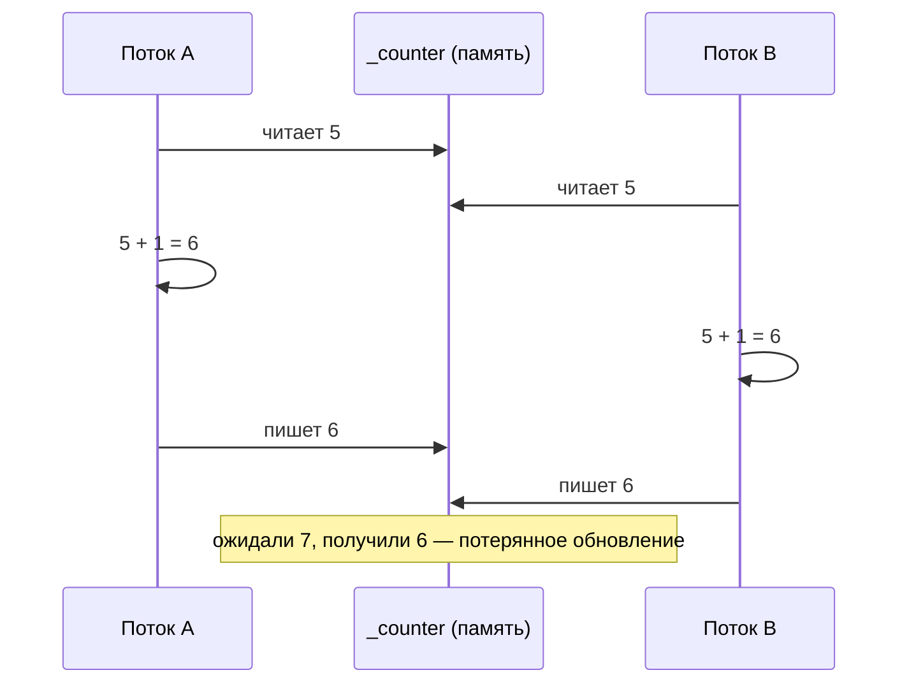
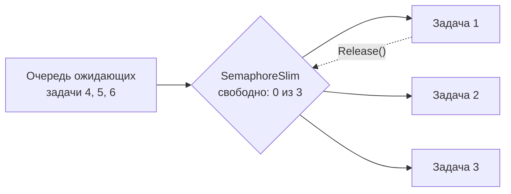
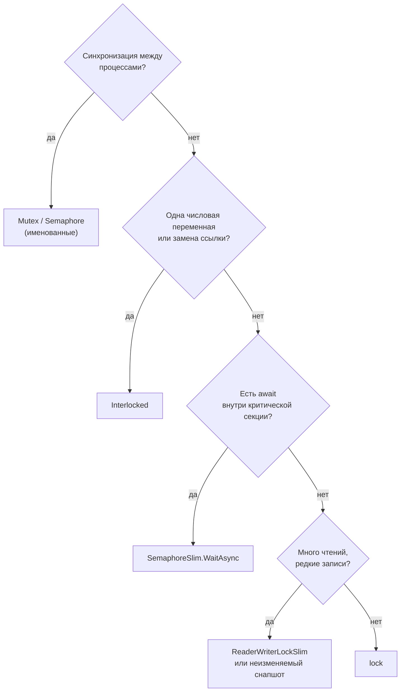

:::tldr
- **`lock`** (= `Monitor.Enter/Exit` в `try/finally`) — взаимное исключение внутри процесса; быстрый (спин + ожидание), реентерабельный. **Нельзя `await` внутри.** В .NET 9 появился тип `System.Threading.Lock`.
- **`Mutex`** — объект ядра ОС; может быть **именованным** и работать **между процессами**. Медленный (системный вызов).
- **`SemaphoreSlim`** — ограничивает **N одновременных** участников; поддерживает **`WaitAsync`** — основной примитив для асинхронного кода.
- **`ReaderWriterLockSlim`** — много читателей одновременно ИЛИ один писатель. Выгоден при частом чтении и редкой записи. Не async.
- **`Interlocked`** — атомарные операции над одной переменной (`Increment`, `CompareExchange`) без блокировок — самые быстрые.
:::

## Зачем синхронизация

```csharp
private int _counter;
public void Increment() => _counter++;   // НЕ атомарно!
```

`_counter++` — это три операции: прочитать, прибавить, записать. Два потока могут прочитать одно и то же значение:



## Обзор примитивов

| Примитив | Область | Участников | async | Реентерабельный | Стоимость |
|---|---|---|---|---|---|
| `Interlocked` | Одна переменная | — | — | — | Минимальная (1 инструкция CPU) |
| `lock` / `Monitor` / `Lock` | Процесс | 1 | Нет | Да | Низкая |
| `SpinLock` | Процесс | 1 | Нет | Нет | Очень низкая для микросекундных участков |
| `SemaphoreSlim` | Процесс | N | **Да** | Нет | Низкая |
| `ReaderWriterLockSlim` | Процесс | N читателей / 1 писатель | Нет | Опционально | Средняя |
| `Mutex` | **Межпроцессный** | 1 | Нет | Да | Высокая (ядро ОС) |
| `Semaphore` | **Межпроцессный** | N | Нет | Нет | Высокая |

## lock и Monitor

```csharp
private readonly object _sync = new();           // приватный объект для блокировки
private readonly Dictionary<string, int> _stock = new();

public bool TryReserve(string sku, int qty)
{
    lock (_sync)                                  // только один поток внутри
    {
        if (_stock.GetValueOrDefault(sku) < qty) return false;
        _stock[sku] -= qty;
        return true;
    }
}

// Компилятор разворачивает lock в:
bool taken = false;
try { Monitor.Enter(_sync, ref taken); /* тело */ }
finally { if (taken) Monitor.Exit(_sync); }
```

```csharp .NET 9+: выделенный тип Lock — быстрее и нагляднее
private readonly Lock _lock = new();
lock (_lock) { /* ... */ }                        // компилятор использует Lock.EnterScope()
```

:::warning Правила lock
- Блокируйте **приватный** объект. Не `lock(this)`, не `lock(typeof(X))`, не строку — к ним имеет доступ чужой код → внезапные deadlock-и.
- Держите блокировку **как можно короче**: никакого I/O, HTTP, БД внутри.
- **Нельзя `await` внутри `lock`** — компилятор запрещает: освободить Monitor должен тот же поток, а после `await` код может продолжиться на другом.
- Захватывайте несколько блокировок **всегда в одном порядке** — иначе deadlock.
:::

`Monitor` также умеет `Wait`/`Pulse` (условные переменные) и `TryEnter` с таймаутом — но в новом коде для этих сценариев обычно удобнее `Channel<T>` или `SemaphoreSlim`.

## SemaphoreSlim — для async-кода

```csharp
// 1. Асинхронный «lock» (N = 1)
private readonly SemaphoreSlim _mutex = new(1, 1);

public async Task<Token> GetTokenAsync(CancellationToken ct)
{
    await _mutex.WaitAsync(ct);
    try
    {
        if (_cached is { IsExpired: false }) return _cached;
        _cached = await _auth.RequestTokenAsync(ct);   // await внутри — допустимо
        return _cached;
    }
    finally
    {
        _mutex.Release();
    }
}

// 2. Ограничение параллелизма (N = 5)
private readonly SemaphoreSlim _throttle = new(5);

public async Task DownloadAllAsync(IEnumerable<Uri> urls, CancellationToken ct)
{
    var tasks = urls.Select(async url =>
    {
        await _throttle.WaitAsync(ct);
        try { await DownloadAsync(url, ct); }
        finally { _throttle.Release(); }
    });
    await Task.WhenAll(tasks);
}
// Альтернатива в .NET 6+: Parallel.ForEachAsync(urls, new ParallelOptions { MaxDegreeOfParallelism = 5 }, ...)
```



## ReaderWriterLockSlim

```csharp
private readonly ReaderWriterLockSlim _rw = new();
private Dictionary<string, Rate> _rates = new();

public Rate? Get(string currency)
{
    _rw.EnterReadLock();                 // читатели не блокируют друг друга
    try { return _rates.GetValueOrDefault(currency); }
    finally { _rw.ExitReadLock(); }
}

public void Update(Dictionary<string, Rate> newRates)
{
    _rw.EnterWriteLock();                // ждёт выхода всех читателей, блокирует новых
    try { _rates = newRates; }
    finally { _rw.ExitWriteLock(); }
}
```

:::tip Часто можно без блокировок
Для сценария «редко заменить целиком — часто читать» проще и быстрее **неизменяемый снапшот**: `private volatile FrozenDictionary<...> _rates;` — читатели читают ссылку, писатель атомарно подменяет её новым объектом. Или `ImmutableDictionary` / `ConcurrentDictionary`.
:::

## Mutex — между процессами

```csharp
// Запретить запуск второго экземпляра приложения
using var mutex = new Mutex(initiallyOwned: true, name: @"Global\MyApp.SingleInstance", out bool createdNew);
if (!createdNew)
{
    Console.WriteLine("Приложение уже запущено");
    return;
}
```

Для синхронизации между **серверами** Mutex не поможет — нужны распределённые блокировки (Redis `SET NX PX`, advisory locks PostgreSQL `pg_advisory_lock`, библиотека DistributedLock).

## Interlocked — атомарные операции

```csharp
private long _requests;
public void OnRequest() => Interlocked.Increment(ref _requests);   // атомарно, без блокировки

// CompareExchange: «записать новое значение, только если текущее равно ожидаемому»
private int _state; // 0 = idle, 1 = running
public bool TryStart() => Interlocked.CompareExchange(ref _state, 1, 0) == 0;

// Lock-free обновление по шаблону CAS-цикла
public void AddToTotal(decimal amount)
{
    TotalSnapshot current, updated;
    do
    {
        current = _total;
        updated = current with { Sum = current.Sum + amount, Count = current.Count + 1 };
    }
    while (Interlocked.CompareExchange(ref _total, updated, current) != current);
}
```

## Как выбрать



## Вопросы на засыпку

:::qa Что такое реентерабельность и почему SemaphoreSlim её не поддерживает?
Реентерабельность — поток, уже владеющий блокировкой, может захватить её повторно (рекурсия). `Monitor` запоминает поток-владельца. `SemaphoreSlim` — просто счётчик и не знает, кто его занял; повторный `WaitAsync` из того же потока при N=1 приведёт к deadlock.
:::

:::qa Как происходит deadlock с двумя lock?
Поток A захватил `lock1` и ждёт `lock2`, поток B захватил `lock2` и ждёт `lock1`. Решение — единый порядок захвата, `Monitor.TryEnter` с таймаутом, минимизация вложенных блокировок.
:::

:::qa Почему lock «быстрый»?
`Monitor` сначала пытается захватить блокировку атомарной операцией (thin lock в заголовке объекта), затем немного крутится (spin-wait) и только потом переводит поток в ожидание через событие ядра. При низкой конкуренции это десятки наносекунд.
:::

:::qa Что такое SpinLock и когда он полезен?
Блокировка, которая активно крутится в цикле вместо засыпания. Полезна для **очень** коротких секций при низкой конкуренции (переключение контекста дороже ожидания). Структура — нельзя копировать; нереентерабельна. В прикладном коде почти не нужна.
:::

## Итог

`Interlocked` — для одной переменной, `lock` — для короткой синхронной критической секции, `SemaphoreSlim` — для async-кода и ограничения параллелизма, `ReaderWriterLockSlim` — для частого чтения, `Mutex` — между процессами. А лучшая синхронизация — отсутствие общего изменяемого состояния: неизменяемые данные и конкурентные коллекции.
