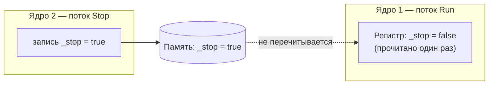
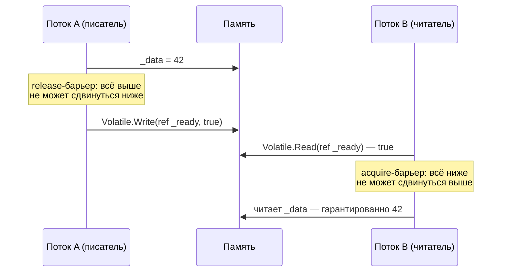
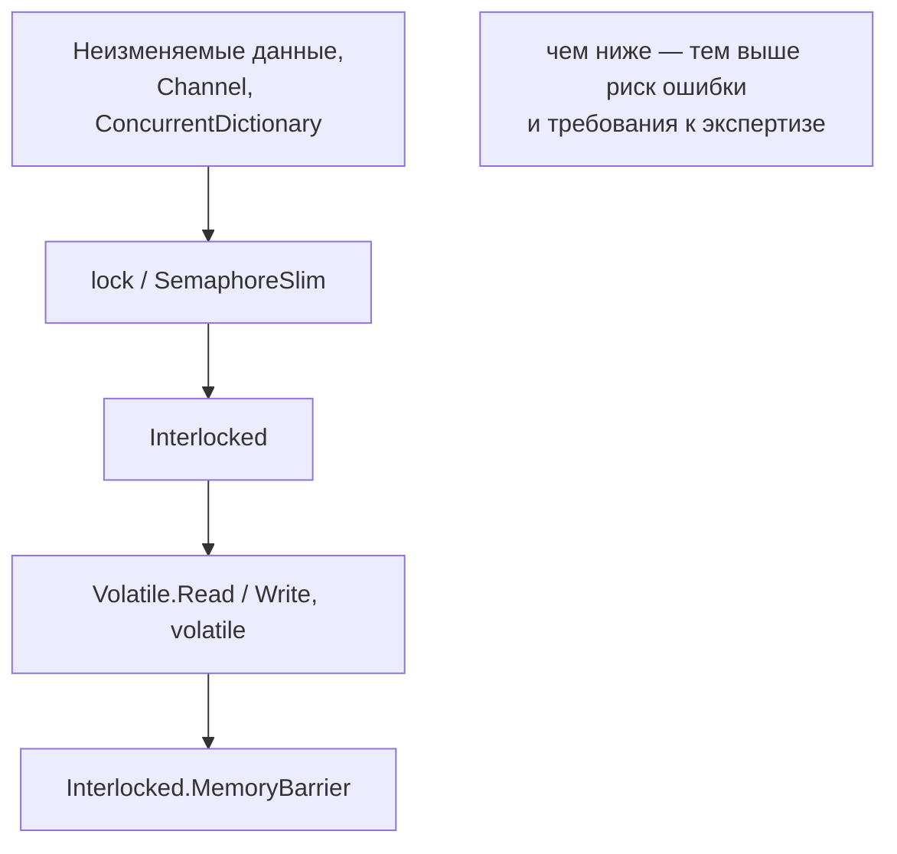

:::tldr
- Компилятор, JIT и **процессор** могут **переупорядочивать** операции чтения/записи и **кэшировать** значения в регистрах — в однопоточном коде это незаметно, в многопоточном ломает логику.
- **`volatile`** гарантирует: чтение не кэшируется (каждый раз из памяти) и имеет семантику **acquire**, запись — **release**. Это **не делает** составные операции атомарными (`volatile int x; x++` — всё ещё гонка).
- **`Interlocked`** — атомарные операции (read-modify-write) + **полный барьер памяти**.
- **Memory barrier** (`Interlocked.MemoryBarrier()`, `Volatile.Read/Write`) — запрет переупорядочивания операций через «забор».
- В прикладном коде почти всегда хватает `lock`, `Interlocked` и конкурентных коллекций — они уже содержат нужные барьеры. `volatile` нужен для простых флагов и lock-free кода.
:::

## Проблема 1: кэширование в регистре

```csharp
class Worker
{
    private bool _stop;                          // без volatile

    public void Run()
    {
        while (!_stop) { /* работа без вызовов методов */ }
        Console.WriteLine("Остановлен");
    }

    public void Stop() => _stop = true;
}

var w = new Worker();
var t = new Thread(w.Run); t.Start();
Thread.Sleep(100);
w.Stop();                                        // в Release-сборке цикл может никогда не завершиться!
```

JIT видит, что внутри цикла `_stop` не меняется, и **выносит чтение из цикла** — читает поле один раз в регистр. Поток никогда не увидит изменение.



Решение: `private volatile bool _stop;` — каждое чтение идёт в память. А лучше — `CancellationToken`, который реализует это правильно.

## Проблема 2: переупорядочивание

```csharp
private int _data;
private bool _ready;

// Поток A
_data = 42;
_ready = true;

// Поток B
if (_ready)
    Console.WriteLine(_data);   // может ли вывести 0?
```

Теоретически — да: запись `_ready` может стать видимой другому ядру **раньше**, чем запись `_data` (переупорядочивание компилятором или процессором со слабой моделью памяти, например ARM). На x86/x64 модель памяти сильнее (записи не переупорядочиваются между собой), но JIT всё равно может переставить операции. Код, «работающий» на x64, может сломаться на ARM64 (Apple Silicon, AWS Graviton).

### Барьеры acquire и release



```csharp
// Правильно
_data = 42;
Volatile.Write(ref _ready, true);            // release

if (Volatile.Read(ref _ready))               // acquire
    Console.WriteLine(_data);                // гарантированно 42
```

Поле с модификатором `volatile` делает то же самое автоматически для всех обращений.

## volatile — что гарантирует и что нет

| Гарантирует | Не гарантирует |
|---|---|
| Чтение каждый раз из памяти | Атомарность `x++`, `x += 5` |
| Acquire при чтении, release при записи | Порядок «запись → последующее чтение» (store-load) |
| Работает для `bool`, `int`, ссылок, `enum` и т.п. | Работу с `long`/`double` на 32-битных платформах (нельзя объявить volatile) |

```csharp
private volatile int _count;
public void Inc() => _count++;               // ВСЁ ЕЩЁ ГОНКА: чтение и запись атомарны по отдельности, но не вместе
public void IncCorrect() => Interlocked.Increment(ref _count);  // так правильно
```

## Interlocked

Все методы `Interlocked` — атомарные операции процессора (`lock xadd`, `lock cmpxchg` на x86) с **полным барьером**:

```csharp
Interlocked.Increment(ref _counter);
Interlocked.Add(ref _total, amount);
Interlocked.Exchange(ref _current, newValue);                 // вернуть старое, записать новое
Interlocked.CompareExchange(ref _field, newValue, expected);   // CAS
Interlocked.Read(ref _long64);                                // атомарное чтение long на 32-битных системах
Interlocked.Or(ref _flags, 0b0100);                           // .NET 5+
```

### Ленивая инициализация без блокировки

```csharp
private ExpensiveObject? _instance;

public ExpensiveObject Instance
{
    get
    {
        var current = Volatile.Read(ref _instance);
        if (current is not null) return current;

        var created = new ExpensiveObject();
        // установить, только если всё ещё null; вернёт то, что лежит в поле
        return Interlocked.CompareExchange(ref _instance, created, null) ?? created;
    }
}
// Готовые варианты: Lazy<T> (потокобезопасен по умолчанию), LazyInitializer.EnsureInitialized
```

## Полный барьер: Interlocked.MemoryBarrier

Запрещает переупорядочивание **любых** операций через барьер, включая store-load (чего не дают acquire/release). Нужен в редких lock-free алгоритмах (например, алгоритм Деккера). `lock`, `Interlocked.*`, `Task`, `Thread.Start/Join` уже содержат полные барьеры.

## Что использовать в реальном коде



- **Флаг остановки** — `CancellationToken` (или `volatile bool`).
- **Счётчики, статистика** — `Interlocked`.
- **Однократная инициализация** — `Lazy<T>`.
- **Публикация неизменяемого снапшота** — `Volatile.Write` / `Interlocked.Exchange` ссылки.
- **Всё сложнее** — `lock`. Lock-free алгоритмы писать самому — только при доказанной необходимости.

## Вопросы на засыпку

:::qa Нужен ли volatile, если поле читается и пишется только внутри lock?
Нет. `Monitor.Enter` имеет семантику acquire, `Monitor.Exit` — release. Все изменения, сделанные внутри `lock`, видны следующему потоку, захватившему ту же блокировку.
:::

:::qa Почему double-checked locking без volatile считается ошибкой?
Без барьера другой поток может увидеть ссылку на объект **до** того, как станут видимы записи его полей из конструктора, — получить «недоинициализированный» объект. В .NET на x86 это почти не проявляется, но по спецификации ECMA возможно. Правильно — `volatile` поле или `Lazy<T>`.
:::

:::qa Атомарно ли присваивание long на 64-битной системе?
Чтение и запись выровненных 64-битных значений атомарны на 64-битных процессорах. На 32-битных — нет (запись двумя половинами), поэтому существует `Interlocked.Read`. Спецификация C# гарантирует атомарность только для типов ≤ размера указателя.
:::

:::qa Что такое ABA-проблема?
В CAS-цикле поток читает значение A, другой меняет его на B и обратно на A, и CAS первого потока проходит, хотя состояние менялось. В .NET со сборщиком мусора для ссылок проблема смягчена (объект не может быть переиспользован, пока на него есть ссылка), но для числовых значений актуальна.
:::

## Итог

Без синхронизации потоки могут не видеть изменений друг друга и наблюдать операции в неожиданном порядке. `volatile` решает видимость и порядок для простых флагов, `Interlocked` — атомарность одной переменной, барьеры — порядок в lock-free коде. В большинстве задач правильный выбор — высокоуровневые примитивы, которые уже содержат все нужные барьеры.
