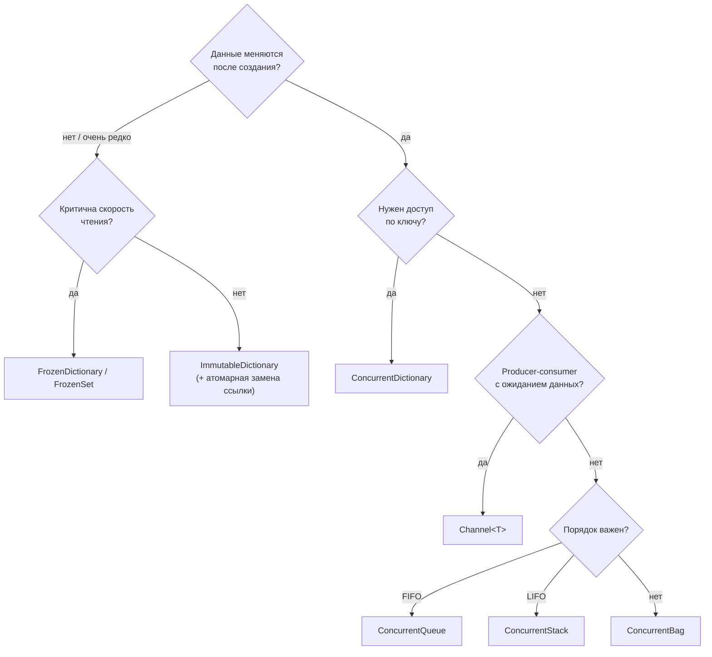
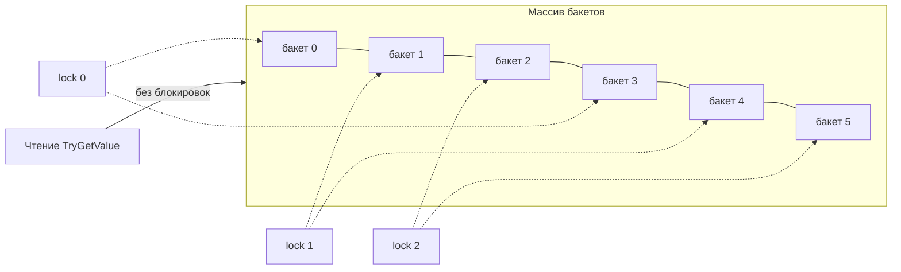
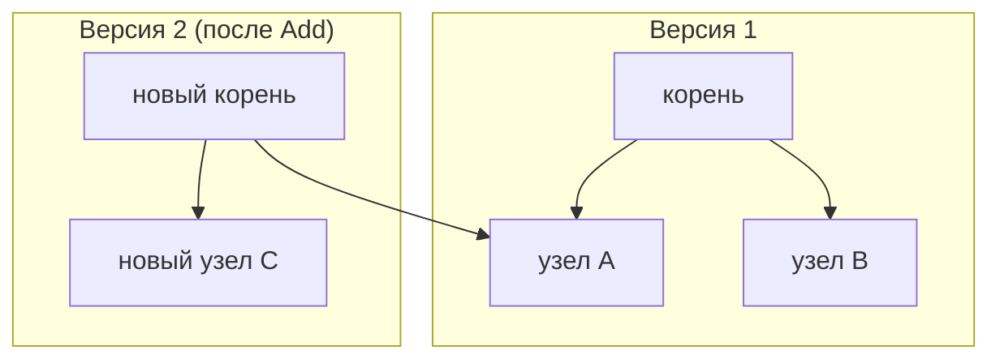

:::tldr
- **`ConcurrentDictionary<K,V>`** — потокобезопасный словарь: чтение **без блокировок**, запись блокирует только один **сегмент** (stripe). Атомарные `GetOrAdd`, `AddOrUpdate`, `TryUpdate`. Ловушка: фабрика в `GetOrAdd` может выполниться **несколько раз**.
- **`ConcurrentQueue<T>` / `ConcurrentStack<T>`** — lock-free FIFO/LIFO для producer-consumer. Для асинхронного ожидания данных лучше **`Channel<T>`**.
- **`ConcurrentBag<T>`** — неупорядоченный набор, оптимизирован, когда один поток и добавляет, и забирает.
- **`ImmutableDictionary`/`ImmutableList`** — неизменяемы; каждое изменение возвращает **новую** коллекцию (структурное разделение). Абсолютно потокобезопасны, но медленнее на чтение и запись.
- **`FrozenDictionary`/`FrozenSet`** (.NET 8) — неизменяемы и оптимизированы под **максимально быстрое чтение**; дорогое создание. Идеальны для справочников «создал при старте — читаю всегда».
:::

## Почему обычные коллекции небезопасны

`Dictionary<K,V>` при одновременной записи из нескольких потоков может не просто потерять данные, а **испортить внутреннюю структуру**: во время перестроения (resize) другой поток видит частично перенесённые бакеты. Известный симптом — **бесконечный цикл** в `FindEntry` и 100% загрузка CPU.



## ConcurrentDictionary

### Как устроен



- Каждый замок защищает группу бакетов; число замков по умолчанию ≈ числу ядер.
- Запись в разные сегменты идёт **параллельно**.
- Чтение (`TryGetValue`, индексатор) вообще **не берёт блокировок**.
- Операции над **всем** словарём (`Count`, `Keys`, `Values`, `ToArray`, resize) захватывают **все** замки — они дорогие. Не вызывайте `Count` в горячем цикле.

### Атомарные операции

```csharp
var cache = new ConcurrentDictionary<int, Product>();

// Получить или добавить
Product p = cache.GetOrAdd(id, key => LoadProduct(key));

// Добавить или обновить
var hits = new ConcurrentDictionary<string, int>();
hits.AddOrUpdate(url, addValue: 1, updateValueFactory: (key, old) => old + 1);

// Условное обновление (CAS)
cache.TryUpdate(id, newValue: updated, comparisonValue: current);

// Удалить только если значение совпадает (.NET 5+)
cache.TryRemove(new KeyValuePair<int, Product>(id, stale));
```

:::warning Фабрика может выполниться несколько раз
```csharp
var result = cache.GetOrAdd(key, k => ExpensiveHttpCall(k));
```
Фабрика вызывается **вне блокировки** (чтобы не держать замок во время долгой операции). Если два потока одновременно не нашли ключ — оба вызовут `ExpensiveHttpCall`, но в словарь попадёт только одно значение. Если фабрика дорогая или имеет побочные эффекты — оборачивайте в `Lazy<T>`:

```csharp
var lazyCache = new ConcurrentDictionary<string, Lazy<Task<Data>>>();
Data data = await lazyCache.GetOrAdd(key,
    k => new Lazy<Task<Data>>(() => LoadAsync(k))).Value;   // LoadAsync выполнится ровно один раз
```
:::

:::warning Составные операции не атомарны
```csharp
if (!dict.ContainsKey(key))      // проверка...
    dict[key] = Create();        // ...и запись — между ними другой поток мог добавить ключ
```
Используйте `GetOrAdd` / `TryAdd` — одна атомарная операция.
:::

Передача состояния без замыканий (без аллокаций на каждый вызов):

```csharp
cache.GetOrAdd(key, static (k, repo) => repo.Load(k), _repository);
```

## ConcurrentQueue и Channel

```csharp
var queue = new ConcurrentQueue<Job>();
queue.Enqueue(job);                           // производитель
if (queue.TryDequeue(out var next)) Run(next); // потребитель: нужно опрашивать в цикле
```

Проблема: потребителю нечего делать, когда очередь пуста — приходится крутиться в цикле или спать. `Channel<T>` решает это асинхронным ожиданием и поддерживает ограничение размера (backpressure):

```csharp
var channel = Channel.CreateBounded<Job>(capacity: 1000);
await channel.Writer.WriteAsync(job, ct);                  // ждёт, если канал полон
await foreach (var j in channel.Reader.ReadAllAsync(ct))   // ждёт без блокировки, если пуст
    await RunAsync(j);
```

## Immutable-коллекции

```csharp
ImmutableList<string> v1 = ImmutableList.Create("a", "b");
ImmutableList<string> v2 = v1.Add("c");      // v1 не изменился: ["a","b"], v2: ["a","b","c"]
```



- Внутри — сбалансированные деревья (AVL), поэтому чтение `O(log n)`, а не `O(1)`.
- Поток, получивший ссылку на коллекцию, работает со **стабильным снапшотом** — никаких «collection was modified».
- Для массовых изменений используйте **Builder**: `var b = list.ToBuilder(); ... ; list = b.ToImmutable();`.
- `ImmutableArray<T>` — обёртка над массивом: быстрое чтение, но каждое изменение копирует весь массив.

### Типичный паттерн: атомарная замена снапшота

```csharp
private ImmutableDictionary<string, Route> _routes = ImmutableDictionary<string, Route>.Empty;

public Route? Find(string path) => _routes.GetValueOrDefault(path);    // читатели без блокировок

public void AddRoute(string path, Route route) =>
    ImmutableInterlocked.AddOrUpdate(ref _routes, path, route, (_, _) => route);  // CAS-цикл внутри
```

## FrozenDictionary (.NET 8+)

```csharp
private static readonly FrozenDictionary<string, CountryInfo> Countries =
    LoadCountries().ToFrozenDictionary(StringComparer.OrdinalIgnoreCase);

var uz = Countries["UZ"];   // быстрее Dictionary: структура оптимизирована под конкретный набор ключей
```

При создании анализирует ключи и выбирает оптимальную стратегию хэширования (например, по длине строк или подстроке). Создание дорогое — только для данных, которые строятся один раз.

## Сравнение

| Коллекция | Чтение | Запись | Потокобезопасность | Когда |
|---|---|---|---|---|
| `Dictionary` | O(1), самое быстрое | O(1) | Нет (только чтение из многих потоков безопасно) | Однопоточный код, локальные данные |
| `ConcurrentDictionary` | O(1), без блокировок | O(1), блокировка сегмента | Да | Общий изменяемый кэш, счётчики |
| `ImmutableDictionary` | O(log n) | O(log n), новая версия | Да (неизменяем) | Снапшоты, частое чтение с редкими изменениями |
| `FrozenDictionary` | O(1), быстрее `Dictionary` | Невозможна | Да (неизменяем) | Справочники на весь срок жизни процесса |
| `ConcurrentQueue` | — | Lock-free | Да | Простая очередь без ожидания |
| `Channel<T>` | — | Async, bounded | Да | Producer-consumer с ожиданием и backpressure |

## Вопросы на засыпку

:::qa Безопасно ли перечислять ConcurrentDictionary, пока другие потоки пишут?
Да, исключения «collection was modified» не будет. Но перечисление — **не снапшот**: вы можете увидеть часть изменений, сделанных во время обхода. Для согласованного снимка — `ToArray()` (захватывает все замки).
:::

:::qa Можно ли использовать обычный Dictionary для чтения из нескольких потоков?
Да, если **никто не пишет** после публикации (словарь заполнен до того, как стал доступен другим потокам). Любая одновременная запись — неопределённое поведение.
:::

:::qa Чем IMemoryCache отличается от ConcurrentDictionary?
`IMemoryCache` добавляет вытеснение: TTL, sliding expiration, лимит размера, реакцию на нехватку памяти, callbacks. `ConcurrentDictionary` растёт бесконечно — самодельный кэш на нём без ограничения размера это утечка памяти.
:::

:::qa Почему ConcurrentBag не подходит как обычная очередь?
Он хранит элементы в thread-local списках: поток сначала забирает свои элементы, и только потом «ворует» у других. Порядок не гарантирован, а при паттерне «одни пишут, другие читают» воровство делает его медленнее `ConcurrentQueue`.
:::

## Итог

Изменяемые общие данные по ключу — `ConcurrentDictionary` (помните про многократный вызов фабрики и неатомарность составных операций). Очереди с ожиданием — `Channel<T>`. Редко меняющиеся данные — неизменяемые снапшоты (`Immutable*`), а справочники «на всю жизнь» — `FrozenDictionary`.
