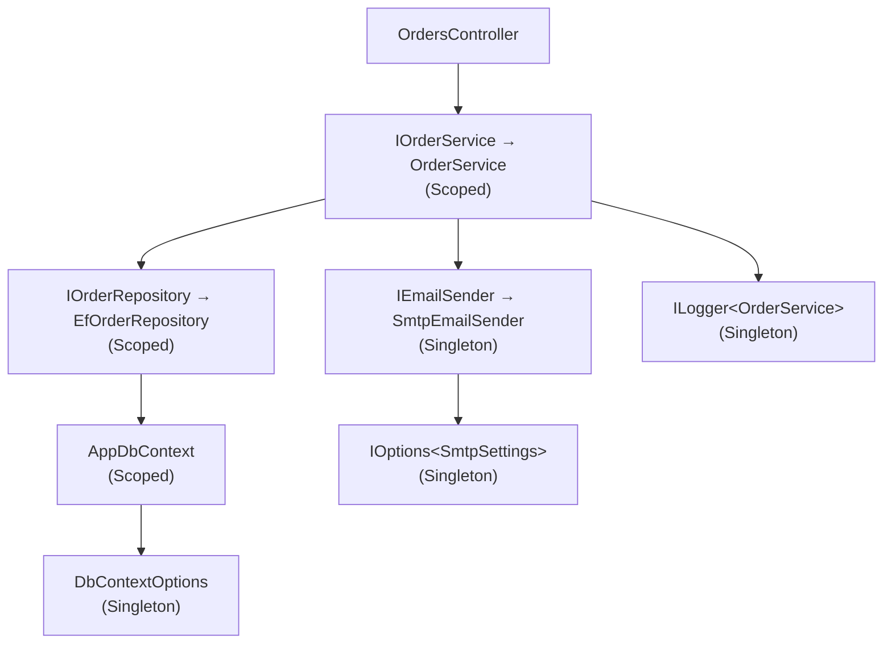
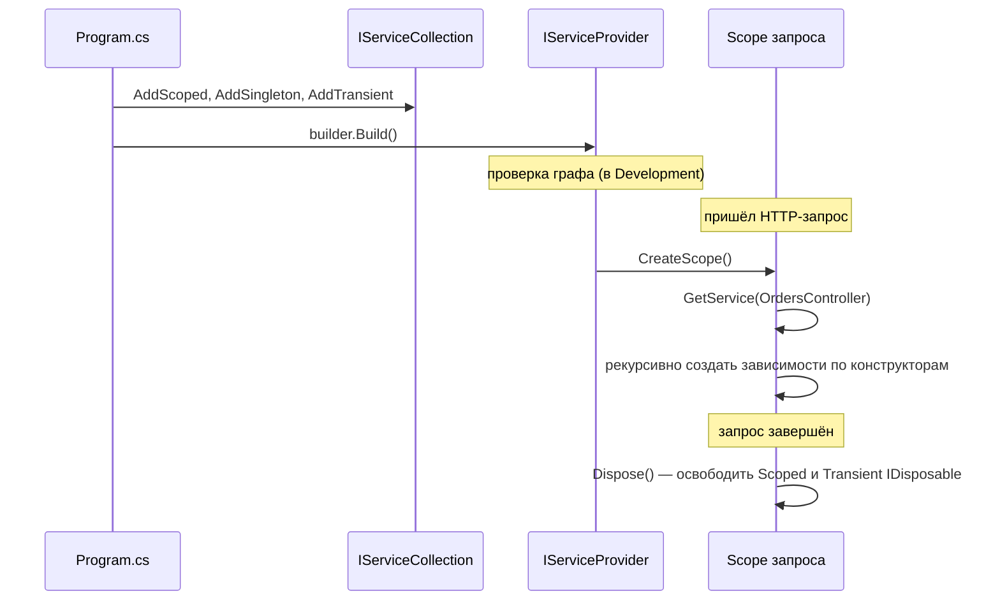

:::tldr
- **DI** — зависимости передаются объекту **снаружи** (обычно через конструктор), а не создаются внутри через `new`. Это даёт слабую связанность, тестируемость и управление временем жизни.
- Двухфазная модель: на старте регистрируем сервисы в **`IServiceCollection`** (`AddScoped<IOrderService, OrderService>()`), затем `Build()` создаёт **`IServiceProvider`**, который их создаёт и внедряет.
- Контейнер строит **граф зависимостей** рекурсивно: смотрит на конструктор, резолвит его параметры, их параметры и т.д.
- Три времени жизни: **Singleton**, **Scoped** (на HTTP-запрос), **Transient**. Контейнер сам вызывает `Dispose` у созданных им объектов.
- Возможности: регистрация по фабрике, open generics, `IEnumerable<T>` для нескольких реализаций, **keyed services** (.NET 8), проверка графа при старте (`ValidateOnBuild`, `ValidateScopes`).
:::

## Без DI и с DI

```csharp
// Без DI: класс сам создаёт зависимости — жёсткая связь, нельзя подменить в тестах
public class OrderService
{
    private readonly SqlOrderRepository _repo = new SqlOrderRepository("Server=...");
    private readonly SmtpEmailSender _email = new SmtpEmailSender();
}

// С DI: класс объявляет, что ему нужно, а кто и как это создаёт — не его забота
public class OrderService(IOrderRepository repo, IEmailSender email, ILogger<OrderService> log)
{
    public async Task PlaceAsync(Order order, CancellationToken ct)
    {
        await repo.AddAsync(order, ct);
        await email.SendAsync(order.CustomerEmail, "Заказ принят", ct);
        log.LogInformation("Order {Id} placed", order.Id);
    }
}
```

## Как контейнер строит граф





## Регистрация

```csharp
var builder = WebApplication.CreateBuilder(args);

// Базовые варианты
builder.Services.AddScoped<IOrderService, OrderService>();
builder.Services.AddSingleton<IClock, SystemClock>();
builder.Services.AddTransient<IPasswordHasher, BcryptHasher>();

// Фабрика — когда нужна логика создания
builder.Services.AddSingleton<IStorage>(sp =>
{
    var cfg = sp.GetRequiredService<IOptions<StorageOptions>>().Value;
    return cfg.UseS3 ? new S3Storage(cfg) : new LocalStorage(cfg.Path);
});

// Готовый экземпляр
builder.Services.AddSingleton(TimeProvider.System);

// Open generics: IRepository<User> → Repository<User> и т.д.
builder.Services.AddScoped(typeof(IRepository<>), typeof(Repository<>));

// Несколько реализаций одного интерфейса
builder.Services.AddScoped<INotifier, EmailNotifier>();
builder.Services.AddScoped<INotifier, SmsNotifier>();
// IEnumerable<INotifier> получит обе; INotifier — последнюю зарегистрированную

// TryAdd — не регистрировать, если уже есть (для библиотек)
builder.Services.TryAddSingleton<IClock, SystemClock>();

// Keyed services (.NET 8)
builder.Services.AddKeyedSingleton<IPaymentGateway, PaymeGateway>("payme");
builder.Services.AddKeyedSingleton<IPaymentGateway, ClickGateway>("click");

public class CheckoutService([FromKeyedServices("payme")] IPaymentGateway gateway) { }
```

## Способы получения зависимостей

| Способ | Где | Комментарий |
|---|---|---|
| Конструктор | Везде | **Основной** способ, зависимости явные |
| Параметр действия `[FromServices]` | Контроллер | Если сервис нужен только одному действию |
| Параметр обработчика Minimal API | Minimal API | Резолвится автоматически |
| Параметр `InvokeAsync` | Middleware | Для scoped-сервисов в middleware |
| `IServiceProvider.GetRequiredService` | Фабрики, инфраструктура | **Service Locator** — избегать в бизнес-коде |
| `IServiceScopeFactory.CreateScope()` | Singleton, BackgroundService | Для работы со scoped-сервисами вне запроса |

```csharp Scoped-сервис из фоновой службы
public class CleanupWorker(IServiceScopeFactory scopes) : BackgroundService
{
    protected override async Task ExecuteAsync(CancellationToken ct)
    {
        while (!ct.IsCancellationRequested)
        {
            using (var scope = scopes.CreateScope())
            {
                var db = scope.ServiceProvider.GetRequiredService<AppDbContext>();
                await db.Sessions.Where(s => s.ExpiresAt < DateTime.UtcNow).ExecuteDeleteAsync(ct);
            }
            await Task.Delay(TimeSpan.FromMinutes(10), ct);
        }
    }
}
```

## Выбор конструктора и проверки

- Контейнер выбирает конструктор с **наибольшим числом параметров, которые он может разрешить**. Неоднозначность → исключение. Лучше иметь один публичный конструктор.
- `ValidateScopes` (включено в Development) — ошибка при внедрении Scoped в Singleton.
- `ValidateOnBuild` — проверка, что все зарегистрированные сервисы можно создать, **при старте**, а не при первом запросе.

```csharp
builder.Host.UseDefaultServiceProvider(o =>
{
    o.ValidateScopes = true;
    o.ValidateOnBuild = true;
});
```

## Ограничения встроенного контейнера

Встроенный `Microsoft.Extensions.DependencyInjection` намеренно простой. Нет: **внедрения в свойства**, **декораторов** «из коробки», **перехватчиков** (AOP), регистрации по соглашениям (сканирования сборок), дочерних контейнеров.

Решения:
- **Scrutor** — сканирование сборок (`services.Scan(...)`) и декораторы (`services.Decorate<IOrderService, CachedOrderService>()`).
- Сторонние контейнеры (Autofac, DryIoc) через `UseServiceProviderFactory`.

```csharp Декоратор вручную
builder.Services.AddScoped<OrderService>();
builder.Services.AddScoped<IOrderService>(sp =>
    new LoggingOrderService(sp.GetRequiredService<OrderService>(), sp.GetRequiredService<ILogger<LoggingOrderService>>()));
```

## Анти-паттерны

:::warning Service Locator
```csharp
public class OrderService(IServiceProvider sp)
{
    public void Place() => sp.GetRequiredService<IEmailSender>().Send(...);  // зависимость скрыта
}
```
Зависимости не видны из сигнатуры, тесты сложнее, ошибки — в рантайме. Допустимо только в инфраструктурном коде (фабрики, middleware, фоновые службы со скоупами).
:::

- **Слишком много зависимостей** в конструкторе (7+) — сигнал нарушения SRP; класс делает слишком много.
- **Captive dependency** — Scoped/Transient внутри Singleton «застревает» навсегда (подробно в следующем вопросе).
- **Регистрация конкретных классов вместо абстракций** там, где нужна подмена — затрудняет тестирование.
- **Логика в конструкторе** (I/O, запросы к БД) — замедляет разрешение графа и превращает ошибки конфигурации в ошибки DI.

## Вопросы на засыпку

:::qa Чем IoC отличается от DI?
Inversion of Control — общий принцип: не ваш код управляет потоком/созданием объектов, а фреймворк. DI — конкретная техника реализации IoC для зависимостей: объекты получают зависимости извне. Service Locator — другая реализация IoC.
:::

:::qa Что будет, если зарегистрировать один интерфейс дважды?
При внедрении `IService` получите **последнюю** регистрацию. При внедрении `IEnumerable<IService>` — все в порядке регистрации. `TryAdd*` не добавит, если сервис уже есть; `TryAddEnumerable` не добавит дубликат той же реализации.
:::

:::qa Вызывает ли контейнер Dispose у объектов, которые вы передали экземпляром?
Нет. `AddSingleton(new MyService())` — контейнер не создавал объект и не владеет им, поэтому не освобождает. Объекты, созданные контейнером (в том числе через фабрику), освобождаются.
:::

:::qa Как работает внедрение в Minimal API без атрибутов?
Генератор (или рефлексия при старте) определяет источник каждого параметра: маршрут, query, тело, заголовки, специальные типы (`HttpContext`, `CancellationToken`) или DI — если тип зарегистрирован в контейнере (`IServiceProviderIsService`).
:::

## Итог

Встроенный DI в ASP.NET Core — простой и быстрый контейнер: регистрируем в `IServiceCollection`, получаем через конструктор, контейнер строит граф и управляет временем жизни и освобождением. Держите зависимости явными, конструкторы — лёгкими, а проверку графа — включённой.
