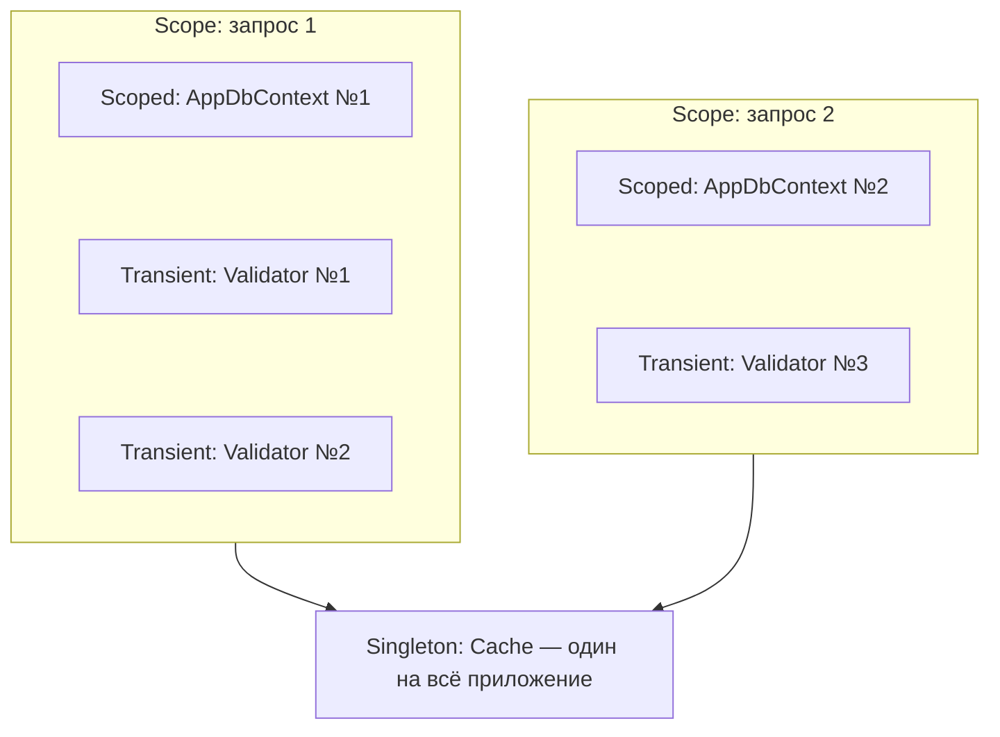
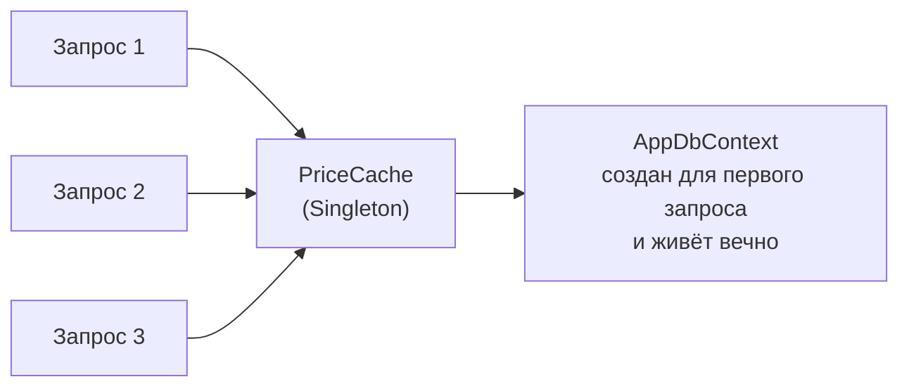
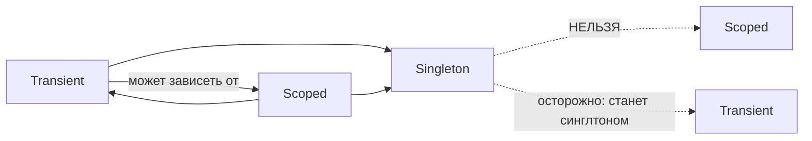

:::tldr
- **Singleton** — один экземпляр на всё приложение. Должен быть **потокобезопасным**. Для: кэшей, клиентов (`HttpClient` через фабрику), конфигурации, `TimeProvider`.
- **Scoped** — один экземпляр на **скоуп** (в ASP.NET Core — на HTTP-запрос). Для: `DbContext`, Unit of Work, данных текущего пользователя.
- **Transient** — новый экземпляр при **каждом** запросе из контейнера. Для: лёгких stateless-сервисов.
- Главное правило: сервис **не может зависеть от сервиса с более коротким временем жизни**. Scoped внутри Singleton = **captive dependency**: `DbContext` застревает навсегда, общий для всех запросов → гонки, утечки, устаревшие данные.
- Для доступа к Scoped из Singleton — `IServiceScopeFactory.CreateScope()`.
:::

## Наглядно

```csharp
public class OperationId { public Guid Id { get; } = Guid.NewGuid(); }

builder.Services.AddSingleton<SingletonOp>();
builder.Services.AddScoped<ScopedOp>();
builder.Services.AddTransient<TransientOp>();

app.MapGet("/ids", (SingletonOp s1, SingletonOp s2, ScopedOp sc1, ScopedOp sc2, TransientOp t1, TransientOp t2) =>
    new { singleton = s1.Id == s2.Id, scoped = sc1.Id == sc2.Id, transient = t1.Id == t2.Id });
```

| | Внутри одного запроса | Между запросами |
|---|---|---|
| Singleton | Тот же | Тот же |
| Scoped | **Тот же** | **Разный** |
| Transient | Разный | Разный |



## Когда какое время жизни

| Время жизни | Подходит для | Требования |
|---|---|---|
| **Singleton** | Кэши, конфигурация, пулы, `IHttpClientFactory`, клиенты Redis/Kafka, stateless-сервисы без scoped-зависимостей | Потокобезопасность, отсутствие состояния запроса |
| **Scoped** | `DbContext`, репозитории и Unit of Work, `ICurrentUser`, сервисы бизнес-логики с доступом к БД | Не использовать из нескольких потоков параллельно |
| **Transient** | Лёгкие stateless-сервисы, валидаторы, мапперы, стратегии | Дёшево создавать |

## Ловушка 1: Captive dependency

```csharp
builder.Services.AddSingleton<PriceCache>();       // синглтон
builder.Services.AddScoped<AppDbContext>();        // scoped

public class PriceCache(AppDbContext db)           // ← DbContext «пойман» синглтоном
{
    public decimal Get(int id) => db.Products.Find(id)!.Price;
}
```



Последствия:
- **Один `DbContext` на все потоки** → `InvalidOperationException: A second operation was started on this context instance before a previous operation completed`.
- Change Tracker **растёт бесконечно** → утечка памяти.
- Данные в кэше контекста **устаревают** — вы видите состояние на момент первой загрузки.
- Соединение с БД удерживается.

В Development `ValidateScopes` бросит исключение при старте: `Cannot consume scoped service 'AppDbContext' from singleton 'PriceCache'`. В Production эта проверка **выключена** по умолчанию — поэтому ошибки находят в Development или включают `ValidateOnBuild` везде.

### Решение

```csharp
public class PriceCache(IServiceScopeFactory scopeFactory, IMemoryCache cache)
{
    public async Task<decimal> GetAsync(int id, CancellationToken ct)
    {
        return await cache.GetOrCreateAsync(id, async entry =>
        {
            entry.AbsoluteExpirationRelativeToNow = TimeSpan.FromMinutes(5);
            await using var scope = scopeFactory.CreateAsyncScope();     // короткий скоуп
            var db = scope.ServiceProvider.GetRequiredService<AppDbContext>();
            return await db.Products.Where(p => p.Id == id).Select(p => p.Price).FirstAsync(ct);
        });
    }
}
```

Или просто сделать `PriceCache` Scoped, если в нём нет общего состояния.

:::note Transient в Singleton — тоже пленник
Transient-сервис, внедрённый в Singleton, создаётся **один раз** и живёт как Singleton. Проверка `ValidateScopes` это не ловит. Если transient-сервис не потокобезопасен — проблема.
:::

## Ловушка 2: Transient IDisposable

Контейнер **запоминает** каждый созданный им `IDisposable` transient-объект, чтобы вызвать `Dispose` в конце скоупа. Если резолвить такие объекты из **корневого** провайдера (например, внутри синглтона через `IServiceProvider`), они копятся до остановки приложения — утечка.

## Ловушка 3: Состояние в Singleton

```csharp
public class ReportService   // Singleton
{
    private string? _currentUser;                    // общее для всех запросов!
    public void Generate(string user)
    {
        _currentUser = user;
        // ... другой поток перезаписал _currentUser ...
        Save(_currentUser);                          // отчёт уйдёт не тому пользователю
    }
}
```

Singleton должен быть stateless либо хранить только потокобезопасное **общее** состояние (кэш, счётчики через `Interlocked`).

## Ловушка 4: Scoped вне HTTP-запроса

В `BackgroundService`, `IHostedService`, обработчиках сообщений, `Task.Run` после завершения запроса **нет HTTP-скоупа**. Создавайте свой: `using var scope = scopeFactory.CreateScope();` — на каждую единицу работы (сообщение, итерацию).

## Правило совместимости



## Вопросы на засыпку

:::qa Почему DbContext регистрируется как Scoped?
`DbContext` — Unit of Work запроса: отслеживает изменения и сохраняет их одной транзакцией. Он не потокобезопасен и должен жить недолго. Scoped даёт один контекст на запрос: все репозитории запроса работают в одной единице работы, а между запросами изоляция.
:::

:::qa Как получить scoped-сервис в middleware?
Через параметр метода `InvokeAsync(HttpContext ctx, AppDbContext db)` — он резолвится из скоупа запроса при каждом вызове. В конструктор middleware (синглтон) — нельзя. Либо реализовать `IMiddleware` и зарегистрировать middleware как Scoped.
:::

:::qa Что такое AddDbContextPool?
Пулинг экземпляров `DbContext`: после запроса контекст сбрасывается и возвращается в пул вместо уничтожения. Снижает накладные расходы на создание. Ограничение: в контексте не должно быть собственного состояния, кроме того, что сбрасывает EF.
:::

:::qa Как в тестах проверить время жизни?
Создать `ServiceProvider` с `ValidateScopes = true` и `ValidateOnBuild = true` и попытаться разрешить все сервисы — это простой интеграционный тест, который ловит captive dependency до продакшена.
:::

## Итог

Singleton — один на приложение и обязательно потокобезопасный; Scoped — один на запрос; Transient — каждый раз новый. Никогда не внедряйте короткоживущие сервисы в долгоживущие напрямую: используйте `IServiceScopeFactory` и держите проверку скоупов включённой.
