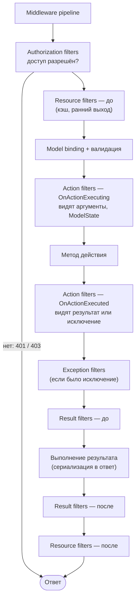
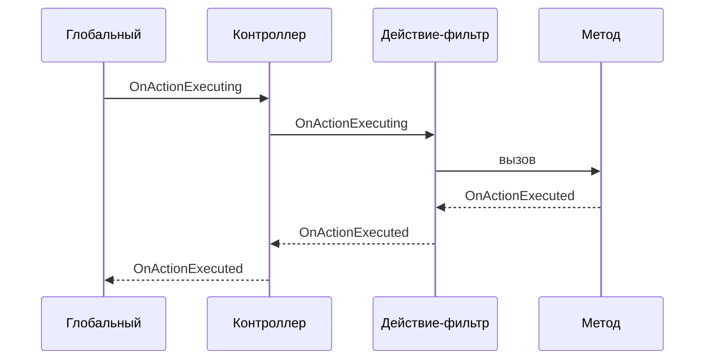

:::tldr
- **Фильтры** — точки расширения **внутри MVC**, вокруг выполнения действия контроллера. В отличие от middleware, они знают о контроллере, действии, аргументах, `ModelState` и результате.
- Порядок типов: **Authorization → Resource → (model binding) → Action → (действие) → Exception → Result**.
- **Authorization** — первыми, могут замкнуть конвейер (401/403). **Resource** — вокруг почти всего (кэширование). **Action** — до/после метода, видят аргументы. **Exception** — необработанные исключения из действия. **Result** — вокруг выполнения результата.
- Области: **глобальные** → **контроллер** → **действие**; «до» выполняется снаружи внутрь, «после» — изнутри наружу. Порядок можно переопределить свойством `Order`.
- Фильтр с зависимостями из DI подключают через `[ServiceFilter]`/`[TypeFilter]`. В Minimal API аналог — `IEndpointFilter`.
:::

## Конвейер фильтров



| Тип | Интерфейс | Когда | Типичное применение |
|---|---|---|---|
| Authorization | `IAuthorizationFilter`, `IAsyncAuthorizationFilter` | Первым | `[Authorize]`, проверка API-ключа |
| Resource | `IResourceFilter`, `IAsyncResourceFilter` | До и после всего остального | Кэширование ответа, отключение model binding для загрузки файлов |
| Action | `IActionFilter`, `IAsyncActionFilter` | Вокруг метода действия | Валидация, логирование аргументов, аудит, транзакции |
| Exception | `IExceptionFilter`, `IAsyncExceptionFilter` | При исключении в действии/фильтрах действия | Преобразование исключений в ответы (но лучше — middleware) |
| Result | `IResultFilter`, `IAsyncResultFilter` | Вокруг выполнения результата | Добавление заголовков, обёртка ответа |
| Always run result | `IAlwaysRunResultFilter` | Всегда, даже при коротком замыкании | Заголовки, которые нужны в любом ответе |

## Пример: Action-фильтр

```csharp
public sealed class AuditFilter(IAuditLog audit, ICurrentUser user) : IAsyncActionFilter
{
    public async Task OnActionExecutionAsync(ActionExecutingContext context, ActionExecutionDelegate next)
    {
        // до действия
        var action = context.ActionDescriptor.DisplayName;
        var args = context.ActionArguments;

        var executed = await next();                        // выполнить действие (и внутренние фильтры)

        // после действия
        var success = executed.Exception is null || executed.ExceptionHandled;
        await audit.WriteAsync(user.Id, action!, args, success);
    }
}

// Регистрация
builder.Services.AddScoped<AuditFilter>();

[ServiceFilter(typeof(AuditFilter))]          // берётся из DI со своим временем жизни
public class PaymentsController : ControllerBase { }
```

### Короткое замыкание

```csharp
public sealed class RequireIdempotencyKeyAttribute : ActionFilterAttribute
{
    public override void OnActionExecuting(ActionExecutingContext context)
    {
        if (!context.HttpContext.Request.Headers.ContainsKey("Idempotency-Key"))
        {
            context.Result = new BadRequestObjectResult("Нужен заголовок Idempotency-Key");
            // установка Result = действие НЕ выполнится, дальше пойдут result-фильтры
        }
    }
}
```

## Области и порядок

```csharp
builder.Services.AddControllers(o => o.Filters.Add<GlobalLogFilter>());   // глобальный

[TypeFilter(typeof(ControllerFilter))]                                   // контроллер
public class OrdersController : ControllerBase
{
    [ActionLogFilter]                                                    // действие
    public IActionResult Get() => Ok();
}
```



Свойство `Order` (у атрибутов и `IOrderedFilter`) меняет порядок: меньше — раньше (снаружи). Сам контроллер тоже является action-фильтром: его методы `OnActionExecuting`/`OnActionExecuted` выполняются внутри всех остальных фильтров.

## Способы подключить фильтр с зависимостями

| Способ | Как создаётся | Зависимости |
|---|---|---|
| Атрибут-наследник `ActionFilterAttribute` | Экземпляр атрибута — **один на действие** (кэшируется) | Нет DI в конструкторе |
| `[ServiceFilter(typeof(T))]` | Из DI (нужно зарегистрировать T) | Да, с временем жизни из регистрации |
| `[TypeFilter(typeof(T))]` | Через `ActivatorUtilities` (регистрация не нужна) | Да + можно передать аргументы |
| `IFilterFactory` | Своя логика создания | Полный контроль |
| Глобально `options.Filters.Add<T>()` | Через DI-активатор | Да |

:::warning Атрибуты-фильтры кэшируются
Экземпляр атрибута создаётся один раз и используется для всех запросов. Не храните в полях атрибута состояние запроса — это гонка данных. Состояние — в `HttpContext.Items`.
:::

## Фильтр исключений или middleware?

```csharp
public sealed class DomainExceptionFilter : IExceptionFilter
{
    public void OnException(ExceptionContext context)
    {
        if (context.Exception is DomainException ex)
        {
            context.Result = new UnprocessableEntityObjectResult(new ProblemDetails
            {
                Title = "Бизнес-правило нарушено",
                Detail = ex.Message,
                Status = 422
            });
            context.ExceptionHandled = true;
        }
    }
}
```

Exception-фильтр ловит только исключения из **действия и action-фильтров**, но не из result-фильтров, middleware, model binding (частично) или сериализации ответа. Поэтому **глобальную** обработку ошибок делают через `UseExceptionHandler` + `IExceptionHandler`, а фильтры — для MVC-специфичных случаев.

## Фильтры в Minimal API

```csharp
app.MapPost("/orders", CreateOrder)
   .AddEndpointFilter(async (ctx, next) =>
   {
       var sw = Stopwatch.StartNew();
       var result = await next(ctx);                 // вызвать обработчик
       ctx.HttpContext.Response.Headers["X-Elapsed-Ms"] = sw.ElapsedMilliseconds.ToString();
       return result;
   });
```

`IEndpointFilter` — один тип фильтра вокруг обработчика с доступом к аргументам (`ctx.Arguments`). Фильтры группы (`MapGroup(...).AddEndpointFilter`) применяются ко всем эндпоинтам группы.

## Вопросы на засыпку

:::qa Где лучше делать валидацию — в фильтре или в сервисе?
Формальную валидацию запроса (формат, обязательные поля) — на границе: `[ApiController]` + DataAnnotations или фильтр с FluentValidation. Бизнес-правила (достаточно ли средств, уникальность) — в доменной/прикладной логике, потому что они не зависят от HTTP.
:::

:::qa Чем Resource-фильтр полезен при загрузке файлов?
Он выполняется **до** model binding. В нём можно отключить value providers форм (`FormValueProviderFactory`), чтобы большие multipart-запросы не буферизовались в память, и стримить файл напрямую.
:::

:::qa Выполняются ли Result-фильтры, если Authorization-фильтр вернул 401?
Обычные `IResultFilter` — нет (конвейер замкнут на раннем этапе). `IAlwaysRunResultFilter` — да, именно для таких случаев.
:::

:::qa Можно ли применить фильтр ко всем действиям с определённым атрибутом?
Да: глобальный фильтр проверяет метаданные — `context.ActionDescriptor.EndpointMetadata.OfType<MyAttribute>().Any()` — и действует только при наличии атрибута. Так реализуют, например, `[Transactional]`.
:::

## Итог

Фильтры — «middleware внутри MVC» с доступом к контексту действия. Запомните порядок: Authorization → Resource → Action → Exception → Result, вложенность глобальный → контроллер → действие, и подключайте фильтры с зависимостями через `ServiceFilter`/`TypeFilter`. Глобальные HTTP-задачи и обработку ошибок оставляйте middleware.
