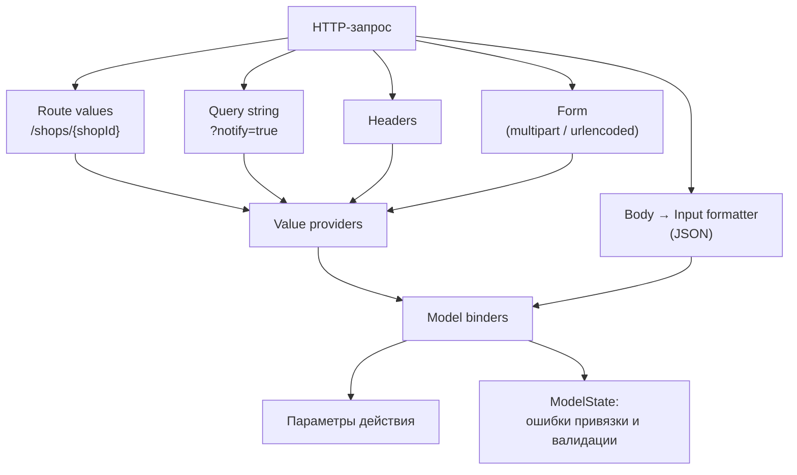

:::tldr
- **Model binding** превращает данные HTTP-запроса (маршрут, query, заголовки, форма, JSON-тело) в параметры действия. Источник задаётся атрибутами `[FromRoute]`, `[FromQuery]`, `[FromBody]`, `[FromHeader]`, `[FromForm]`, `[FromServices]` или выводится по соглашениям.
- **DataAnnotations** (`[Required]`, `[Range]`, `[StringLength]`, `[EmailAddress]`, `IValidatableObject`) — встроенная валидация, результат в **`ModelState`**; `[ApiController]` автоматически вернёт **400 `ValidationProblemDetails`**.
- **FluentValidation** — правила в отдельном классе-валидаторе: условные правила, асинхронные проверки, переиспользование, тестируемость. Подключается через фильтр / вызов вручную (автоматическая интеграция в MVC устарела).
- Разделяйте: **валидация входных данных** — на границе (API), **бизнес-инварианты** — в домене.
:::

## Откуда берутся данные

```http
POST /api/shops/42/orders?notify=true HTTP/1.1
X-Request-Id: 7f3a
Content-Type: application/json

{ "customerEmail": "ann@example.uz", "items": [ { "sku": "A-1", "qty": 2 } ] }
```

```csharp
[HttpPost("api/shops/{shopId:int}/orders")]
public IActionResult Create(
    [FromRoute] int shopId,                         // 42 — из маршрута
    [FromQuery] bool notify,                        // true — из строки запроса
    [FromHeader(Name = "X-Request-Id")] string? requestId,
    [FromBody] CreateOrderRequest body,             // JSON-тело (System.Text.Json)
    [FromServices] IOrderService orders)            // из DI
    => Ok();
```



### Правила вывода источника с `[ApiController]`

| Тип параметра | Источник по умолчанию |
|---|---|
| Сложный тип (класс, record) | `[FromBody]` (только один параметр может быть из тела) |
| `IFormFile`, `IFormFileCollection` | `[FromForm]` |
| Имя совпадает с параметром маршрута | `[FromRoute]` |
| Простые типы (`int`, `string`, `Guid`, enum...) | `[FromQuery]` |
| Зарегистрирован в DI | `[FromServices]` (с .NET 7) |

Для группировки многих query-параметров: `[FromQuery] OrderFilter filter` (сложный тип из query) или `[AsParameters]` в Minimal API.

## DataAnnotations

```csharp
public sealed class CreateOrderRequest : IValidatableObject
{
    [Required, EmailAddress, StringLength(254)]
    public string CustomerEmail { get; init; } = "";

    [Required, MinLength(1, ErrorMessage = "Заказ должен содержать хотя бы одну позицию")]
    public List<OrderItemDto> Items { get; init; } = [];

    [Range(0, 100)]
    public int DiscountPercent { get; init; }

    public DateOnly? DeliveryDate { get; init; }

    // Перекрёстная проверка нескольких полей
    public IEnumerable<ValidationResult> Validate(ValidationContext ctx)
    {
        if (DeliveryDate is { } d && d < DateOnly.FromDateTime(DateTime.UtcNow))
            yield return new ValidationResult("Дата доставки в прошлом", [nameof(DeliveryDate)]);
    }
}

public sealed record OrderItemDto([Required] string Sku, [Range(1, 1000)] int Qty);
```

При невалидной модели `[ApiController]` вернёт:

```json
{
  "type": "https://tools.ietf.org/html/rfc9110#section-15.5.1",
  "title": "One or more validation errors occurred.",
  "status": 400,
  "errors": {
    "CustomerEmail": ["The CustomerEmail field is not a valid e-mail address."],
    "Items[0].Qty": ["The field Qty must be between 1 and 1000."]
  },
  "traceId": "00-7f3a..."
}
```

Без `[ApiController]` нужно проверять вручную: `if (!ModelState.IsValid) return ValidationProblem(ModelState);`.

## FluentValidation

```csharp
public sealed class CreateOrderValidator : AbstractValidator<CreateOrderRequest>
{
    public CreateOrderValidator(ICustomerRepository customers)
    {
        RuleFor(x => x.CustomerEmail)
            .NotEmpty().EmailAddress().MaximumLength(254)
            .MustAsync(async (email, ct) => !await customers.IsBlockedAsync(email, ct))
            .WithMessage("Покупатель заблокирован");

        RuleFor(x => x.Items).NotEmpty();
        RuleForEach(x => x.Items).ChildRules(item =>
        {
            item.RuleFor(i => i.Sku).NotEmpty().Matches("^[A-Z]-\\d+$");
            item.RuleFor(i => i.Qty).InclusiveBetween(1, 1000);
        });

        RuleFor(x => x.DeliveryDate)
            .GreaterThanOrEqualTo(DateOnly.FromDateTime(DateTime.UtcNow))
            .When(x => x.DeliveryDate.HasValue);
    }
}

// Регистрация всех валидаторов сборки
builder.Services.AddValidatorsFromAssemblyContaining<CreateOrderValidator>();
```

```csharp Вызов через фильтр эндпоинта или вручную
app.MapPost("/orders", async (CreateOrderRequest req, IValidator<CreateOrderRequest> validator, IOrderService svc, CancellationToken ct) =>
{
    var result = await validator.ValidateAsync(req, ct);
    if (!result.IsValid) return Results.ValidationProblem(result.ToDictionary());
    return Results.Ok(await svc.CreateAsync(req, ct));
});
```

## Сравнение

| | DataAnnotations | FluentValidation |
|---|---|---|
| Где правила | Атрибуты на модели | Отдельный класс |
| Условные правила | Сложно (`IValidatableObject`) | `When`, `Unless`, `DependentRules` |
| Асинхронные проверки (БД) | Нет | `MustAsync` |
| DI в правилах | Неудобно | Через конструктор валидатора |
| Тестирование | Через `Validator.TryValidateObject` | `validator.TestValidate(model)` — удобные ассерты |
| Интеграция | Встроена, автоматически | Вручную / фильтр / пакет SharpGrip |
| Подходит для | Простые DTO, быстрый старт | Сложные правила, большие проекты |

:::warning Не валидируйте бизнес-правила на границе
«Достаточно ли товара на складе», «не превышен ли кредитный лимит» — это **инварианты домена**, их нужно проверять в сущности/агрегате или обработчике команды, внутри транзакции. Проверка в валидаторе запроса может устареть к моменту сохранения (гонка) и не защитит, если тот же код вызовут из фоновой задачи или другого эндпоинта.
:::

## Пользовательский model binder

```csharp
// Привязать "1,2,3" из query к int[]
public sealed class CsvIntArrayBinder : IModelBinder
{
    public Task BindModelAsync(ModelBindingContext ctx)
    {
        var raw = ctx.ValueProvider.GetValue(ctx.ModelName).FirstValue;
        if (string.IsNullOrEmpty(raw)) return Task.CompletedTask;
        try { ctx.Result = ModelBindingResult.Success(raw.Split(',').Select(int.Parse).ToArray()); }
        catch (FormatException) { ctx.ModelState.TryAddModelError(ctx.ModelName, "Ожидается список чисел через запятую"); }
        return Task.CompletedTask;
    }
}

public IActionResult Get([ModelBinder(typeof(CsvIntArrayBinder))] int[] ids) => Ok(ids);
```

В Minimal API для этого достаточно статического метода `TryParse` или `BindAsync` у типа параметра.

## Типичные ошибки

- **Over-posting**: привязка запроса прямо к сущности EF. Клиент добавит в JSON `"isAdmin": true` — и поле обновится. Всегда используйте отдельные DTO запросов.
- Проверять `ModelState.IsValid` при включённом `[ApiController]` — лишнее, до действия невалидная модель не дойдёт.
- Ожидать, что `[Required]` сработает для `int` — у значимого типа всегда есть значение (0). Используйте `int?` + `[Required]` или `[Range]`.
- Забыть `CancellationToken` в асинхронных валидаторах.

## Вопросы на засыпку

:::qa Почему только один параметр может быть [FromBody]?
Тело запроса — поток, который читается один раз и целиком десериализуется в один объект. Если нужно несколько объектов — оберните их в один DTO.
:::

:::qa Как отключить автоматический 400 от [ApiController]?
`builder.Services.Configure<ApiBehaviorOptions>(o => o.SuppressModelStateInvalidFilter = true);` — тогда проверяете `ModelState` сами. Можно и настроить формат ответа через `InvalidModelStateResponseFactory`.
:::

:::qa Валидируются ли вложенные объекты и коллекции?
DataAnnotations в MVC — да, рекурсивно (свойства вложенных объектов и элементы коллекций). В чистом `Validator.TryValidateObject` — нет, только верхний уровень. FluentValidation — через `SetValidator` / `RuleForEach` / `ChildRules`.
:::

:::qa Что будет, если JSON невалиден синтаксически?
Input formatter не сможет десериализовать тело, добавит ошибку в `ModelState` (ключ — путь, например `$.items[0].qty`), и `[ApiController]` вернёт 400. Параметр будет `null`.
:::

## Итог

Model binding собирает параметры из разных частей запроса, валидация проверяет их до выполнения логики. DataAnnotations — быстро и встроено, FluentValidation — гибко и тестируемо. Используйте отдельные DTO, валидируйте форму данных на границе, а бизнес-правила — в домене.
