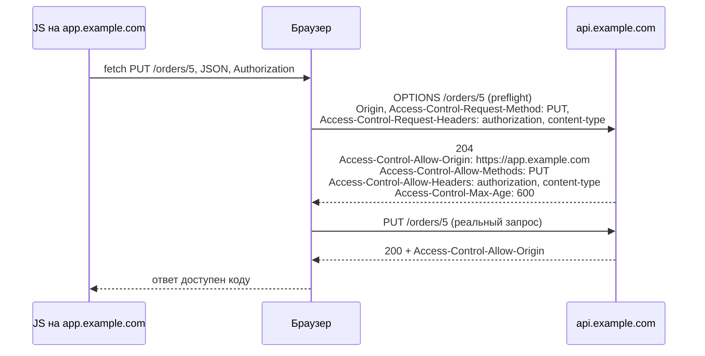

:::tldr
- **Same-Origin Policy** — правило браузера: JavaScript со страницы `https://app.example.com` не может **читать ответы** запросов к другому origin (схема + хост + порт), например `https://api.example.com`.
- **CORS** (Cross-Origin Resource Sharing) — механизм, которым **сервер** разрешает браузеру такие запросы через заголовки `Access-Control-Allow-*`.
- «Непростые» запросы (JSON, `PUT/DELETE`, свои заголовки, `Authorization`) браузер предваряет **preflight**-запросом `OPTIONS`.
- В ASP.NET Core: `AddCors` с **именованной политикой** + `UseCors` в правильном месте конвейера (после `UseRouting`, до `UseAuthentication/UseAuthorization`).
- CORS **не защищает API** от curl, Postman или другого сервера — это защита пользователей браузера. Нельзя сочетать `AllowAnyOrigin()` с `AllowCredentials()`.
:::

## Что такое origin и зачем ограничения

Origin = **схема + хост + порт**. Разные origin:

| URL страницы | URL запроса | Тот же origin? |
|---|---|---|
| `https://app.example.com` | `https://app.example.com/api` | Да |
| `https://app.example.com` | `https://api.example.com` | **Нет** — другой хост |
| `https://app.example.com` | `http://app.example.com` | **Нет** — другая схема |
| `http://localhost:3000` | `http://localhost:5000` | **Нет** — другой порт |

Без Same-Origin Policy любой сайт, открытый у пользователя, мог бы из JavaScript сделать запрос к его интернет-банку (браузер автоматически приложит cookies) и **прочитать ответ** — выписку, персональные данные.

:::note CORS ослабляет защиту, а не усиливает
Same-Origin Policy запрещает по умолчанию. CORS — способ **разрешить** конкретным origin то, что иначе было бы запрещено. Поэтому настраивать его нужно как можно строже.
:::

## Простые запросы и preflight

**Простой запрос**: метод `GET`, `HEAD` или `POST`; только «безопасные» заголовки; `Content-Type` — `text/plain`, `multipart/form-data` или `application/x-www-form-urlencoded`. Браузер отправляет его сразу и проверяет `Access-Control-Allow-Origin` в ответе.

Всё остальное (`application/json`, `PUT`, `DELETE`, заголовок `Authorization`) — **непростой запрос**: браузер сначала спрашивает разрешение.



Если сервер не вернул нужные заголовки — браузер **блокирует чтение ответа** (а при непрошедшем preflight вообще не отправит основной запрос). В консоли появится ошибка CORS, а в JavaScript — `TypeError: Failed to fetch` без деталей.

:::warning Сервер при этом мог выполнить запрос
Для **простых** запросов (например, `POST` формы) браузер отправляет запрос, сервер его выполняет, и только чтение ответа блокируется. Поэтому CORS **не защищает от CSRF** — для этого нужны антифоргери-токены и `SameSite`-cookies.
:::

## Настройка в ASP.NET Core

```csharp
var builder = WebApplication.CreateBuilder(args);

var allowedOrigins = builder.Configuration.GetSection("Cors:Origins").Get<string[]>() ?? [];

builder.Services.AddCors(options =>
{
    options.AddPolicy("Frontend", policy => policy
        .WithOrigins(allowedOrigins)                       // ["https://app.example.com"]
        .WithMethods("GET", "POST", "PUT", "DELETE")
        .WithHeaders("Content-Type", "Authorization", "X-Request-Id")
        .WithExposedHeaders("X-Total-Count", "Location")   // какие заголовки ответа доступны JS
        .AllowCredentials()                                // разрешить cookies
        .SetPreflightMaxAge(TimeSpan.FromMinutes(10)));    // кэш preflight в браузере

    options.AddPolicy("PublicReadOnly", policy => policy
        .AllowAnyOrigin()
        .WithMethods("GET"));
});

var app = builder.Build();

app.UseRouting();
app.UseCors();                  // после UseRouting, ДО аутентификации и авторизации
app.UseAuthentication();
app.UseAuthorization();

// Политика на уровне эндпоинтов
app.MapGet("/api/catalog", GetCatalog).RequireCors("PublicReadOnly");
app.MapControllers().RequireCors("Frontend");
```

```csharp Для контроллеров — атрибутами
[EnableCors("Frontend")]
public class OrdersController : ControllerBase
{
    [DisableCors]
    [HttpPost("internal-callback")]
    public IActionResult Callback() => Ok();
}
```

Можно задать политику по умолчанию: `options.AddDefaultPolicy(...)` + `app.UseCors()` применит её ко всем эндпоинтам.

## Заголовки CORS

| Заголовок | Кто отправляет | Значение |
|---|---|---|
| `Origin` | Браузер | Откуда запрос |
| `Access-Control-Request-Method` / `-Headers` | Браузер (preflight) | Что планируется |
| `Access-Control-Allow-Origin` | Сервер | Разрешённый origin (конкретный или `*`) |
| `Access-Control-Allow-Methods` / `-Headers` | Сервер | Разрешённые методы и заголовки |
| `Access-Control-Allow-Credentials` | Сервер | `true` — можно отправлять cookies / читать ответ с ними |
| `Access-Control-Expose-Headers` | Сервер | Какие заголовки ответа видит JS |
| `Access-Control-Max-Age` | Сервер | Сколько секунд кэшировать preflight |

## Типичные ошибки

- **`AllowAnyOrigin()` + `AllowCredentials()`** — запрещено спецификацией, ASP.NET Core выбросит исключение. «Обход» через `SetIsOriginAllowed(_ => true)` с credentials — **дыра**: любой сайт сможет от имени пользователя читать его данные.
- **`UseCors` не на своём месте** — после `UseAuthorization` preflight без токена получает 401, и браузер блокирует запрос.
- **Ошибки в origin**: слеш в конце (`https://app.example.com/`), не тот порт, `http` вместо `https`. Сравнение точное.
- **«Чиним» CORS на клиенте** — CORS настраивается только на сервере; прокси dev-сервера (Vite, Angular CLI) — решение для разработки, не для продакшена.
- Считать CORS механизмом авторизации API — запросы без браузера CORS не видят вообще.
- Ошибка 500 без CORS-заголовков: при необработанном исключении middleware ошибок может сформировать ответ без заголовков CORS, и браузер покажет «CORS error» вместо реальной ошибки сервера.

## Альтернатива: избежать cross-origin

Если фронтенд и API обслуживаются через **один origin** (reverse proxy: `app.example.com/` → SPA, `app.example.com/api` → API; или BFF-паттерн), CORS не нужен вовсе — меньше конфигурации и preflight-запросов.

## Вопросы на засыпку

:::qa Почему в Postman запрос работает, а в браузере — ошибка CORS?
CORS — механизм **браузера**. Postman, curl, серверный код не применяют Same-Origin Policy и не проверяют заголовки `Access-Control-*`. Сервер отвечает одинаково, но только браузер отказывается отдать ответ JavaScript.
:::

:::qa Как разрешить все поддомены?
`policy.SetIsOriginAllowedToAllowWildcardSubdomains().WithOrigins("https://*.example.com")`. Будьте уверены, что все поддомены под вашим контролем (захват поддомена = доступ к API).
:::

:::qa Зачем Access-Control-Max-Age?
Без него браузер может отправлять preflight перед каждым непростым запросом — лишний round-trip. `Max-Age` позволяет кэшировать разрешение (браузеры ограничивают максимум: Chrome — 2 часа).
:::

:::qa Нужен ли CORS для мобильного приложения?
Нет, нативные приложения не применяют Same-Origin Policy. CORS нужен только для кода, выполняющегося в браузере (включая WebView в некоторых сценариях).
:::

## Итог

CORS — способ сервера сказать браузеру «этому origin можно читать мои ответы». Настраивайте явный список origin, методов и заголовков, ставьте `UseCors` перед аутентификацией и помните: это защита пользователей браузера, а не API.
