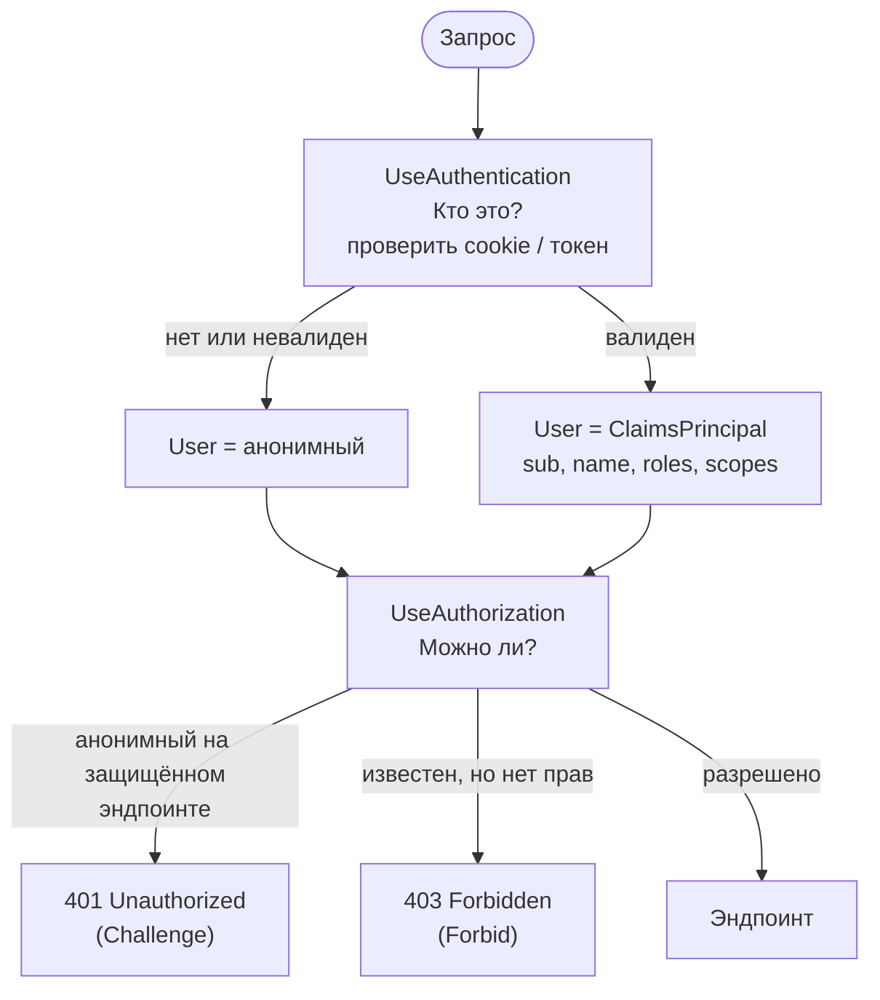
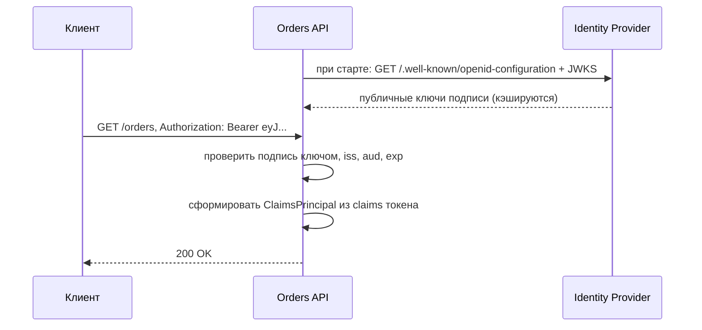
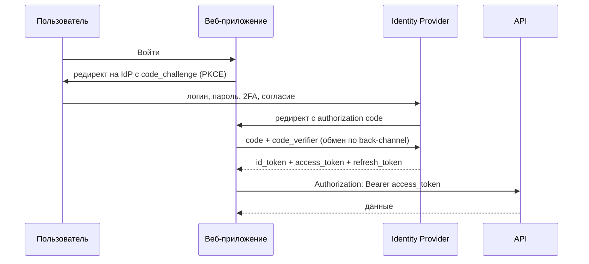

:::tldr
- **Аутентификация** — «**кто ты?**»: проверка учётных данных/токена и формирование `ClaimsPrincipal` (`HttpContext.User`). Ошибка — **401 Unauthorized**.
- **Авторизация** — «**что тебе можно?**»: проверка прав на ресурс/действие по claims, ролям, политикам. Ошибка — **403 Forbidden**.
- **Cookie-аутентификация** — сервер хранит сессию/тикет в зашифрованной cookie; естественно для браузерных MVC/Razor-приложений и BFF.
- **JWT Bearer** — самодостаточный подписанный токен в заголовке `Authorization: Bearer ...`; stateless, удобно для API, мобильных клиентов, микросервисов.
- **OAuth2** — протокол **делегирования доступа** (выдача access token), **OpenID Connect** — слой **аутентификации** поверх OAuth2 (id_token, userinfo). Токены выдаёт Identity Provider (Keycloak, Entra ID, Duende IdentityServer, Auth0).
:::

## Разница на примере



| | Аутентификация | Авторизация |
|---|---|---|
| Вопрос | Кто ты? | Что тебе можно? |
| Результат | `ClaimsPrincipal` | Разрешено / запрещено |
| Middleware | `UseAuthentication` | `UseAuthorization` |
| Ошибка | 401 (challenge) | 403 (forbid) |
| Конфигурация | Схемы: Cookie, JwtBearer, OIDC... | `[Authorize]`, роли, политики |

## Cookie-аутентификация

```csharp
builder.Services.AddAuthentication(CookieAuthenticationDefaults.AuthenticationScheme)
    .AddCookie(o =>
    {
        o.Cookie.HttpOnly = true;                           // недоступна из JS (защита от XSS)
        o.Cookie.SecurePolicy = CookieSecurePolicy.Always;  // только HTTPS
        o.Cookie.SameSite = SameSiteMode.Lax;               // защита от CSRF
        o.ExpireTimeSpan = TimeSpan.FromHours(8);
        o.SlidingExpiration = true;
        o.LoginPath = "/account/login";
    });

// Вход после проверки пароля
var claims = new List<Claim> { new(ClaimTypes.NameIdentifier, user.Id.ToString()), new(ClaimTypes.Name, user.Email), new(ClaimTypes.Role, "Manager") };
var principal = new ClaimsPrincipal(new ClaimsIdentity(claims, CookieAuthenticationDefaults.AuthenticationScheme));
await HttpContext.SignInAsync(principal);
```

Содержимое cookie — **зашифрованный и подписанный** тикет (Data Protection API). При нескольких экземплярах приложения ключи Data Protection нужно хранить в общем месте (Redis, БД, Blob) — иначе cookie, выданная одним экземпляром, не расшифруется другим.

## JWT Bearer

```csharp
builder.Services.AddAuthentication(JwtBearerDefaults.AuthenticationScheme)
    .AddJwtBearer(o =>
    {
        o.Authority = "https://auth.example.com/realms/shop";   // IdP: ключи подписи берутся из /.well-known/openid-configuration
        o.Audience = "orders-api";
        o.TokenValidationParameters = new TokenValidationParameters
        {
            ValidateIssuer = true,
            ValidateAudience = true,
            ValidateLifetime = true,
            ClockSkew = TimeSpan.FromSeconds(30),
            NameClaimType = "preferred_username",
            RoleClaimType = "roles"
        };
    });
```



## Cookie или JWT

| Критерий | Cookie | JWT Bearer |
|---|---|---|
| Клиенты | Браузер (тот же сайт) | SPA, мобильные, сервис-сервис |
| Состояние на сервере | Тикет в cookie (или сессия) | Stateless |
| Отзыв | Легко (удалить сессию, сменить security stamp) | Сложно до истечения `exp` |
| XSS | `HttpOnly` — токен недоступен JS | Если хранить в localStorage — украдут при XSS |
| CSRF | Нужна защита (SameSite, antiforgery) | Не подвержен (заголовок не шлётся автоматически) |
| Размер | Небольшой | Растёт с числом claims |

:::tip Современная рекомендация для SPA — BFF
**Backend-for-Frontend**: SPA общается со своим бэкендом через `HttpOnly`-cookie, а бэкенд хранит токены OAuth2 на сервере и проксирует запросы к API, подставляя access token. Токены не попадают в браузер вообще.
:::

## OAuth2 и OpenID Connect

- **OAuth2** решает задачу: «приложение хочет получить доступ к ресурсу **от имени** пользователя, не зная его пароля». Результат — **access token** для API.
- **OIDC** добавляет стандартный способ узнать, **кто** пользователь: **id_token** (JWT с `sub`, `name`, `email`), эндпоинт `userinfo`, discovery-документ.



```csharp Веб-приложение с входом через OIDC
builder.Services.AddAuthentication(o =>
{
    o.DefaultScheme = CookieAuthenticationDefaults.AuthenticationScheme;
    o.DefaultChallengeScheme = OpenIdConnectDefaults.AuthenticationScheme;
})
.AddCookie()
.AddOpenIdConnect(o =>
{
    o.Authority = "https://auth.example.com/realms/shop";
    o.ClientId = "shop-web";
    o.ClientSecret = builder.Configuration["Oidc:ClientSecret"];
    o.ResponseType = "code";                 // Authorization Code flow (+ PKCE по умолчанию)
    o.Scope.Add("orders.read");
    o.SaveTokens = true;                     // сохранить токены в cookie-тикете для вызова API
});
```

## Авторизация

```csharp
[Authorize]                                   // любой аутентифицированный
[Authorize(Roles = "Admin,Manager")]          // одна из ролей
[Authorize(Policy = "CanRefund")]             // политика
[AllowAnonymous]                              // исключение

// Minimal API
app.MapDelete("/orders/{id}", Delete).RequireAuthorization("CanRefund");

// Требовать аутентификацию везде по умолчанию (безопасный дефолт)
builder.Services.AddAuthorizationBuilder()
    .SetFallbackPolicy(new AuthorizationPolicyBuilder().RequireAuthenticatedUser().Build())
    .AddPolicy("CanRefund", p => p.RequireClaim("permission", "orders.refund"));
```

Подробнее о ролях, политиках и claims — в следующем вопросе.

## Несколько схем

```csharp
builder.Services.AddAuthentication()
    .AddJwtBearer("Internal", o => { /* токены от внутреннего IdP */ })
    .AddJwtBearer("Partners", o => { /* токены партнёров */ });

[Authorize(AuthenticationSchemes = "Partners")]
public class PartnerWebhooksController : ControllerBase { }
```

## Вопросы на засыпку

:::qa Почему 401 называется Unauthorized, если это ошибка аутентификации?
Историческая неточность в HTTP-спецификации. По смыслу 401 — «не аутентифицирован» (нужно представиться, сервер отправляет `WWW-Authenticate`), 403 — «аутентифицирован, но доступ запрещён».
:::

:::qa Что такое Challenge и Forbid?
Действия схемы аутентификации при отказе. `Challenge` — для анонимного пользователя: cookie-схема редиректит на страницу логина, JWT-схема возвращает 401 с `WWW-Authenticate: Bearer`. `Forbid` — для аутентифицированного: 403 или редирект на AccessDenied.
:::

:::qa Где хранить JWT в SPA?
Лучше — нигде в браузере (BFF). Если нельзя: access token в памяти JS (короткое время жизни), refresh token — в `HttpOnly`-cookie. localStorage уязвим для XSS: любой внедрённый скрипт прочитает токен.
:::

:::qa Чем OAuth2 Client Credentials отличается от Authorization Code?
Client Credentials — для **сервис-сервис** взаимодействия без пользователя: сервис предъявляет свой client_id/secret (или сертификат) и получает токен от своего имени. Authorization Code — когда действует **пользователь** через браузер.
:::

## Итог

Аутентификация устанавливает личность и заполняет `HttpContext.User`, авторизация решает, что этой личности разрешено. Cookie — для браузерных приложений и BFF, JWT — для API и сервисов. OAuth2 выдаёт токены доступа, OpenID Connect добавляет стандартизированную аутентификацию, а выдавать токены должен специализированный Identity Provider.
