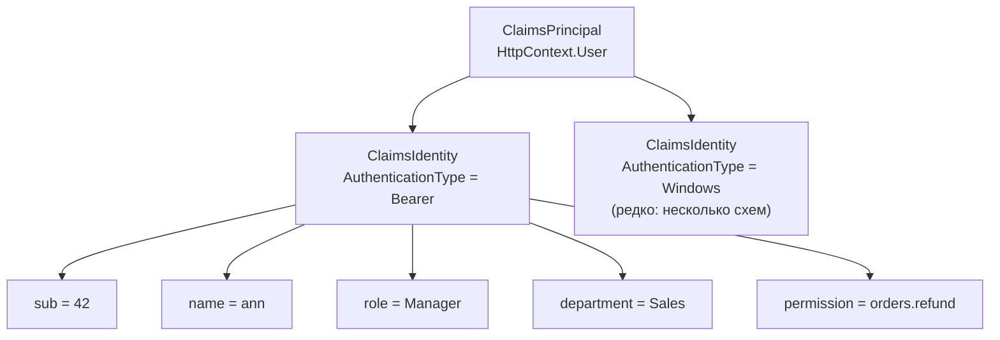
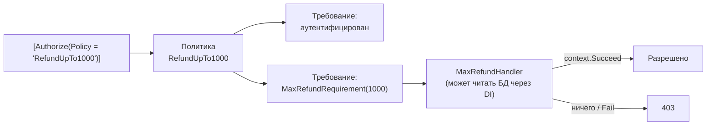

:::tldr
- **Claim** — утверждение о субъекте в виде «тип — значение»: `sub=42`, `email=ann@x.uz`, `role=Manager`, `department=Sales`.
- **`ClaimsIdentity`** — набор claims, выданный **одним** источником (cookie, JWT, Windows). **`ClaimsPrincipal`** — пользователь, может иметь **несколько** identity. Доступен как `HttpContext.User`.
- **Роли** — простая проверка членства (`[Authorize(Roles = "Admin")]`). Быстро, но жёстко: правила «размазаны» по коду, сложные условия не выразить.
- **Политики** — именованные наборы **требований** (`IAuthorizationRequirement`) с обработчиками (`AuthorizationHandler`). Логика авторизации централизована, может использовать DI, БД, время, ресурс.
- **Resource-based** авторизация — решение зависит от конкретного объекта («редактировать может только автор документа»): `IAuthorizationService.AuthorizeAsync(User, document, "EditPolicy")`.
:::

## Модель claims



```csharp Чтение claims
ClaimsPrincipal user = HttpContext.User;

bool isAuthenticated = user.Identity?.IsAuthenticated == true;
string? userId = user.FindFirstValue(ClaimTypes.NameIdentifier);   // или "sub" — зависит от маппинга
string? email = user.FindFirstValue(ClaimTypes.Email);
bool isManager = user.IsInRole("Manager");
IEnumerable<string> permissions = user.FindAll("permission").Select(c => c.Value);
```

:::note Маппинг типов claims
Обработчик JWT исторически переименовывает короткие имена в длинные URI (`sub` → `http://schemas.xmlsoap.org/.../nameidentifier`). В .NET 8+ `JsonWebTokenHandler` по умолчанию сохраняет исходные имена (`MapInboundClaims = false`). Если `FindFirstValue("sub")` возвращает null — проверьте маппинг.
:::

Удобно спрятать работу с claims за абстракцией:

```csharp
public interface ICurrentUser { Guid Id { get; } bool HasPermission(string p); }

public sealed class HttpCurrentUser(IHttpContextAccessor accessor) : ICurrentUser
{
    private ClaimsPrincipal User => accessor.HttpContext?.User ?? new ClaimsPrincipal();
    public Guid Id => Guid.Parse(User.FindFirstValue("sub") ?? throw new UnauthorizedAccessException());
    public bool HasPermission(string p) => User.HasClaim("permission", p);
}
```

## Роли

```csharp
[Authorize(Roles = "Admin")]                         // только Admin
[Authorize(Roles = "Admin,Manager")]                 // Admin ИЛИ Manager
[Authorize(Roles = "Admin")] [Authorize(Roles = "Auditor")]   // Admin И Auditor
public class ReportsController : ControllerBase { }
```

Проблемы ролевой модели в растущем проекте:

- Проверки `if (User.IsInRole("Admin") || User.IsInRole("Manager") && ...)` расползаются по коду.
- Появление новой роли («Старший менеджер») требует правок во многих местах.
- Нельзя выразить «менеджер своего филиала», «рабочее время», «сумма возврата до 1000».

## Политики



```csharp Объявление политик
builder.Services.AddAuthorizationBuilder()
    .AddPolicy("AdultsOnly", p => p.RequireAssertion(ctx =>
        int.TryParse(ctx.User.FindFirstValue("age"), out var age) && age >= 18))
    .AddPolicy("SalesDepartment", p => p.RequireClaim("department", "Sales"))
    .AddPolicy("CanRefund", p => p
        .RequireAuthenticatedUser()
        .RequireClaim("permission", "orders.refund")
        .AddRequirements(new WorkingHoursRequirement(9, 18)));

builder.Services.AddSingleton<IAuthorizationHandler, WorkingHoursHandler>();
```

```csharp Своё требование и обработчик
public sealed record WorkingHoursRequirement(int From, int To) : IAuthorizationRequirement;

public sealed class WorkingHoursHandler(TimeProvider clock) : AuthorizationHandler<WorkingHoursRequirement>
{
    protected override Task HandleRequirementAsync(AuthorizationHandlerContext ctx, WorkingHoursRequirement req)
    {
        var hour = clock.GetLocalNow().Hour;
        if (hour >= req.From && hour < req.To)
            ctx.Succeed(req);                  // требование выполнено
        return Task.CompletedTask;             // не вызвали Succeed — требование не выполнено
    }
}
```

Семантика: политика пройдена, если **все** требования выполнены. Одно требование может иметь **несколько** обработчиков — достаточно, чтобы **один** вызвал `Succeed` (логическое ИЛИ), если никто не вызвал `Fail`.

## Resource-based авторизация

Атрибут выполняется **до** загрузки данных, поэтому не может проверить, что документ принадлежит пользователю. Для этого — императивная проверка:

```csharp
public sealed class DocumentOwnerHandler : AuthorizationHandler<OperationAuthorizationRequirement, Document>
{
    protected override Task HandleRequirementAsync(AuthorizationHandlerContext ctx,
        OperationAuthorizationRequirement op, Document doc)
    {
        var userId = ctx.User.FindFirstValue("sub");
        if (op.Name == "Edit" && doc.AuthorId.ToString() == userId) ctx.Succeed(op);
        if (ctx.User.IsInRole("Admin")) ctx.Succeed(op);
        return Task.CompletedTask;
    }
}

// В обработчике запроса
app.MapPut("/documents/{id}", async (Guid id, UpdateDoc body, IAuthorizationService auth, ClaimsPrincipal user, AppDbContext db) =>
{
    var doc = await db.Documents.FindAsync(id);
    if (doc is null) return Results.NotFound();

    var result = await auth.AuthorizeAsync(user, doc, new OperationAuthorizationRequirement { Name = "Edit" });
    if (!result.Succeeded) return Results.Forbid();

    doc.Update(body.Title, body.Content);
    await db.SaveChangesAsync();
    return Results.NoContent();
});
```

## Роли vs политики vs permissions

| Подход | Плюсы | Минусы | Когда |
|---|---|---|---|
| Роли | Просто, встроено в IdP | Жёстко, взрыв ролей | Небольшие системы, грубое разделение |
| Политики на claims | Централизованно, тестируемо, DI | Нужно проектировать | Большинство API |
| Permissions (права как claims) | Гибко: роль = набор прав, код проверяет права | Токен растёт, нужен механизм выдачи | Сложные доменные права |
| Resource-based | Учитывает конкретный объект | Проверка в коде обработчика | Владение, мультиарендность |

:::tip Проверяйте права, а не роли
Код проверяет **право** (`orders.refund`), а соответствие «роль → набор прав» хранится в конфигурации или IdP. Появилась новая роль — меняется маппинг, а не код.
:::

## Claims transformation

```csharp
// Обогатить пользователя правами из своей БД после аутентификации
public sealed class PermissionsTransformation(IPermissionStore store) : IClaimsTransformation
{
    public async Task<ClaimsPrincipal> TransformAsync(ClaimsPrincipal principal)
    {
        if (principal.HasClaim(c => c.Type == "permission")) return principal;   // может вызываться несколько раз
        var id = principal.FindFirstValue("sub");
        if (id is null) return principal;
        var identity = new ClaimsIdentity();
        foreach (var p in await store.GetPermissionsAsync(id))
            identity.AddClaim(new Claim("permission", p));
        principal.AddIdentity(identity);
        return principal;
    }
}
```

Результат стоит кэшировать — трансформация вызывается на каждый запрос.

## Вопросы на засыпку

:::qa Что такое ASP.NET Core Identity и как оно связано с ClaimsPrincipal?
Identity — библиотека **управления пользователями**: хранение в БД (EF Core), хэширование паролей, подтверждение email, 2FA, блокировка, роли. При входе она создаёт `ClaimsPrincipal` и выдаёт cookie (или токен). Claims-модель — общая инфраструктура, Identity — одна из реализаций хранилища пользователей.
:::

:::qa Где проверять авторизацию: в контроллере или в домене?
Грубую (роль, право на эндпоинт) — атрибутами/политиками на эндпоинте. Resource-based — в прикладном слое (обработчике команды), после загрузки ресурса. Домен остаётся независимым от `ClaimsPrincipal`: ему передают идентификатор пользователя как данные.
:::

:::qa Как протестировать политику авторизации?
Создать `AuthorizationHandlerContext` с нужным `ClaimsPrincipal` и требованиями, вызвать `handler.HandleAsync(ctx)` и проверить `ctx.HasSucceeded`. Или интеграционно через `WebApplicationFactory` с тестовой схемой аутентификации, подставляющей нужные claims.
:::

:::qa Что делает FallbackPolicy?
Применяется к эндпоинтам **без** атрибутов `[Authorize]`/`[AllowAnonymous]`. Установив `RequireAuthenticatedUser()`, вы делаете всё закрытым по умолчанию — забытый атрибут не откроет эндпоинт наружу.
:::

## Итог

Пользователь в ASP.NET Core — это `ClaimsPrincipal` с набором claims. Роли подходят для простых случаев, политики с требованиями и обработчиками — для централизованных и тестируемых правил, resource-based авторизация — когда решение зависит от конкретного объекта. Проверяйте права, а не названия ролей.
