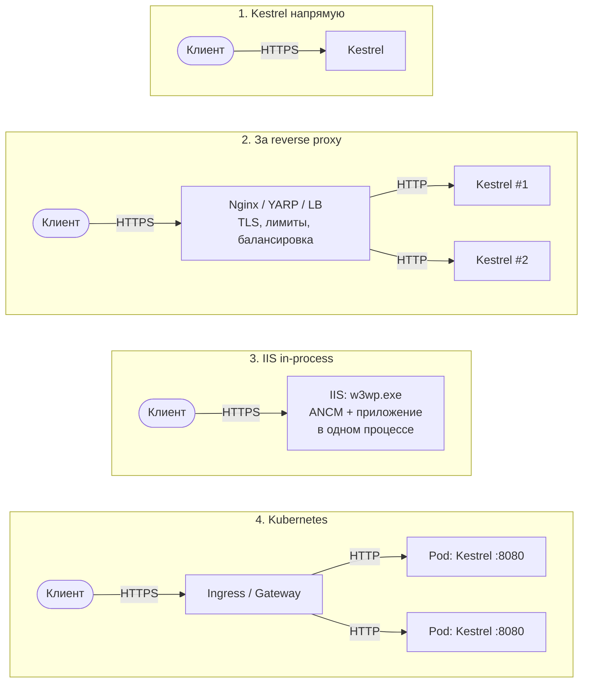
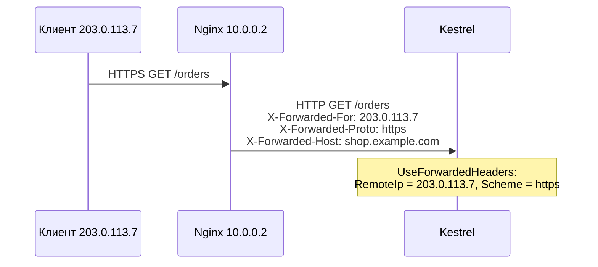

:::tldr
- **Kestrel** — встроенный в ASP.NET Core кроссплатформенный веб-сервер. Он есть **всегда** (кроме in-process режима IIS, где используется `IISHttpServer`). Быстрый, поддерживает HTTP/1.1, HTTP/2, HTTP/3, TLS.
- **IIS** — веб-сервер Windows. С ASP.NET Core работает через **ASP.NET Core Module (ANCM)** в двух режимах: **in-process** (приложение внутри `w3wp.exe`, быстрее) и **out-of-process** (IIS проксирует на Kestrel).
- В продакшене Kestrel часто ставят **за reverse proxy** (Nginx, IIS, YARP, облачный балансировщик, Ingress в Kubernetes): TLS-терминация, балансировка, лимиты, статика, защита.
- За прокси обязательно настроить **Forwarded Headers** (`X-Forwarded-For`, `X-Forwarded-Proto`), иначе приложение не узнает реальный IP клиента и схему (HTTPS).
- В контейнерах/Kubernetes типично: Kestrel слушает HTTP на порту 8080, TLS и маршрутизация — на Ingress/балансировщике.
:::

## Варианты размещения



## Kestrel

```csharp Настройка Kestrel
builder.WebHost.ConfigureKestrel(k =>
{
    k.Limits.MaxRequestBodySize = 10 * 1024 * 1024;           // 10 МБ
    k.Limits.MaxConcurrentConnections = 10_000;
    k.Limits.KeepAliveTimeout = TimeSpan.FromMinutes(2);
    k.Limits.RequestHeadersTimeout = TimeSpan.FromSeconds(30);  // защита от Slowloris
    k.AddServerHeader = false;                                  // не раскрывать "Server: Kestrel"

    k.ListenAnyIP(8080);                                        // HTTP
    k.ListenAnyIP(8443, o =>
    {
        o.UseHttps("cert.pfx", builder.Configuration["CertPassword"]);
        o.Protocols = HttpProtocols.Http1AndHttp2AndHttp3;
    });
});
```

```json То же через appsettings.json
{
  "Kestrel": {
    "Endpoints": {
      "Http":  { "Url": "http://0.0.0.0:8080" },
      "Https": { "Url": "https://0.0.0.0:8443", "Certificate": { "Path": "cert.pfx", "Password": "..." } }
    },
    "Limits": { "MaxRequestBodySize": 10485760 }
  }
}
```

Адрес также задаётся переменными `ASPNETCORE_URLS` / `ASPNETCORE_HTTP_PORTS` (в официальных Docker-образах .NET 8+ по умолчанию порт **8080**).

## IIS

| | In-process (по умолчанию) | Out-of-process |
|---|---|---|
| Где выполняется приложение | Внутри рабочего процесса IIS `w3wp.exe` | Отдельный процесс `dotnet.exe` с Kestrel |
| Сервер | `IISHttpServer` (не Kestrel) | Kestrel |
| Производительность | Выше — нет лишнего сетевого перехода | Ниже — IIS проксирует по localhost |
| Приложений на пул | Одно | Несколько |
| Настройка | `<AspNetCoreHostingModel>InProcess</...>` в `.csproj` / `web.config` | `OutOfProcess` |

IIS даёт Windows-специфичные возможности: Windows Authentication, управление пулами приложений, автоматический перезапуск, централизованное управление сертификатами, кэш статики на уровне ядра.

## Reverse proxy: зачем и что настроить

Причины поставить прокси перед Kestrel:

- **TLS-терминация** и управление сертификатами в одном месте (Let's Encrypt, cert-manager).
- **Балансировка** между экземплярами, health checks, zero-downtime деплой.
- **Защита**: WAF, лимиты соединений, фильтрация, скрытие внутренней топологии.
- Раздача статики, сжатие, кэширование, несколько приложений на одном IP/порту 443.

### Forwarded Headers

За прокси Kestrel видит соединение **от прокси**: `RemoteIpAddress` = IP прокси, `Scheme` = `http`. Последствия — неправильные ссылки редиректа (`http://`), `UseHttpsRedirection` зацикливается, rate limiting и логи работают по IP прокси.



```csharp
builder.Services.Configure<ForwardedHeadersOptions>(o =>
{
    o.ForwardedHeaders = ForwardedHeaders.XForwardedFor | ForwardedHeaders.XForwardedProto | ForwardedHeaders.XForwardedHost;
    o.KnownProxies.Add(IPAddress.Parse("10.0.0.2"));      // доверять только своему прокси!
    // или o.KnownNetworks.Add(new IPNetwork(IPAddress.Parse("10.0.0.0"), 8));
});

var app = builder.Build();
app.UseForwardedHeaders();     // одним из первых в конвейере
```

:::warning Не доверяйте X-Forwarded-For от всех
Если принимать заголовок от кого угодно, клиент подставит любой IP и обойдёт ограничения по IP и rate limiting. Указывайте `KnownProxies`/`KnownNetworks`. (В Azure App Service и IIS ANCM обработка заголовков настраивается автоматически.)
:::

### Пример Nginx

```ini nginx.conf
server {
    listen 443 ssl http2;
    server_name shop.example.com;
    ssl_certificate     /etc/ssl/shop.crt;
    ssl_certificate_key /etc/ssl/shop.key;

    location / {
        proxy_pass         http://127.0.0.1:8080;
        proxy_http_version 1.1;
        proxy_set_header   Upgrade $http_upgrade;          # для WebSocket / SignalR
        proxy_set_header   Connection $connection_upgrade;
        proxy_set_header   Host $host;
        proxy_set_header   X-Forwarded-For $proxy_add_x_forwarded_for;
        proxy_set_header   X-Forwarded-Proto $scheme;
    }
}
```

## YARP — reverse proxy на .NET

**YARP** (Yet Another Reverse Proxy) — библиотека Microsoft для построения прокси и API-шлюзов на ASP.NET Core: маршрутизация из конфигурации, балансировка, health checks, трансформации запросов, аутентификация на шлюзе.

```csharp
builder.Services.AddReverseProxy().LoadFromConfig(builder.Configuration.GetSection("ReverseProxy"));
app.MapReverseProxy();
```

## Hosting: как запускается приложение

`WebApplication.CreateBuilder` создаёт **Generic Host** (`IHost`): конфигурация, логирование, DI, **hosted services** (Kestrel сам — один из них), обработка сигналов ОС (SIGTERM → graceful shutdown).

- **Graceful shutdown**: при остановке Kestrel перестаёт принимать новые соединения, ждёт завершения текущих запросов (`HostOptions.ShutdownTimeout`, по умолчанию 30 с), вызывает `StopAsync` у hosted services.
- Как служба: `builder.Host.UseWindowsService()` / `UseSystemd()`.

## Вопросы на засыпку

:::qa Можно ли выставлять Kestrel напрямую в интернет?
Да, с ASP.NET Core 2.1 Kestrel считается достаточно защищённым для edge-сервера. Но прокси всё равно часто используют ради TLS-управления, балансировки, WAF и нескольких сайтов на одном IP.
:::

:::qa Почему in-process в IIS быстрее?
Нет второго HTTP-перехода: запрос обрабатывается в том же процессе без сериализации в HTTP и передачи по loopback. Разница заметна на большом количестве мелких запросов.
:::

:::qa Что такое HTTP.sys?
Альтернативный серверу Kestrel веб-сервер только для Windows, основанный на драйвере ядра `http.sys`. Поддерживает Windows Authentication, port sharing, кэш ответов в ядре. Используется, когда нужен edge-сервер на Windows без IIS.
:::

:::qa Как работает graceful shutdown в Kubernetes?
Kubernetes отправляет SIGTERM и одновременно убирает pod из Endpoints. Из-за задержки распространения несколько запросов ещё могут прийти — поэтому добавляют `preStop`-хук с небольшой паузой, а `terminationGracePeriodSeconds` делают больше `ShutdownTimeout`.
:::

## Итог

Kestrel — сердце ASP.NET Core, IIS и Nginx — возможные «фасады» перед ним. В контейнерах Kestrel слушает HTTP за Ingress-ом, на Windows-серверах — in-process в IIS. Главное при работе за прокси — правильно настроенные Forwarded Headers с доверием только своим прокси.
