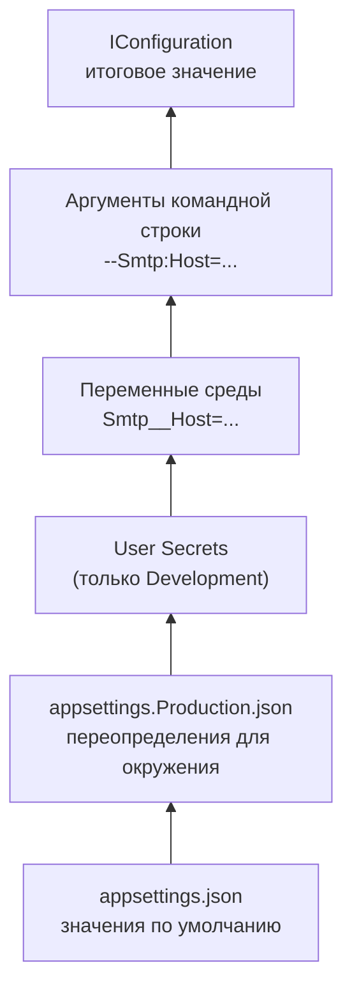
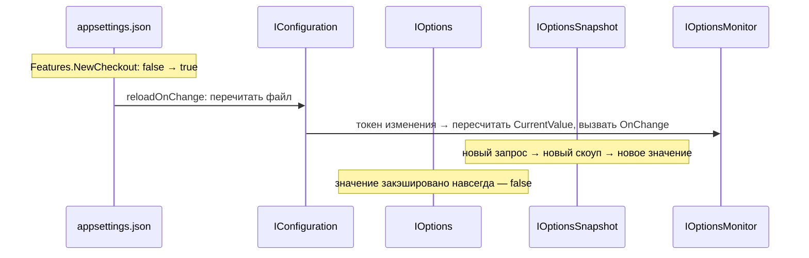

:::tldr
- Конфигурация — набор **провайдеров**, объединённых в одно дерево «ключ → значение». Порядок по умолчанию: `appsettings.json` → `appsettings.{Environment}.json` → **User Secrets** (Development) → **переменные среды** → **аргументы командной строки**. **Последний выигрывает**.
- Иерархия ключей через `:` (`Smtp:Host`), в переменных среды — через `__` (`Smtp__Host`).
- **Options pattern**: секция привязывается к классу, внедряется как `IOptions<T>` (синглтон, читается один раз), `IOptionsSnapshot<T>` (Scoped, пересчитывается на запрос), `IOptionsMonitor<T>` (синглтон с уведомлениями об изменениях).
- Валидация: `ValidateDataAnnotations()`, `Validate(...)`, **`ValidateOnStart()`** — упасть при старте, а не при первом использовании.
- Секреты — не в `appsettings.json` и не в git: **User Secrets** локально, **Key Vault / Vault / Kubernetes Secrets** в продакшене.
:::

## Слои конфигурации



```json appsettings.json
{
  "ConnectionStrings": { "Default": "Host=localhost;Database=shop;Username=app" },
  "Smtp": { "Host": "localhost", "Port": 25, "From": "noreply@example.uz", "EnableSsl": false },
  "Features": { "NewCheckout": false },
  "Logging": { "LogLevel": { "Default": "Information" } }
}
```

```bash Переопределение в контейнере
export ConnectionStrings__Default="Host=db;Database=shop;Username=app;Password=***"
export Smtp__Host="smtp.sendgrid.net"
export Smtp__Port=587
export ASPNETCORE_ENVIRONMENT=Production
```

Окружение задаётся переменной `ASPNETCORE_ENVIRONMENT` (или `DOTNET_ENVIRONMENT`): `Development`, `Staging`, `Production` (по умолчанию).

## Чтение напрямую

```csharp
string? conn = builder.Configuration.GetConnectionString("Default");
int port = builder.Configuration.GetValue<int>("Smtp:Port", defaultValue: 25);
IConfigurationSection smtp = builder.Configuration.GetSection("Smtp");
```

Подходит для `Program.cs`, но в сервисах лучше **строго типизированные** настройки.

## Options pattern

```csharp
public sealed class SmtpOptions
{
    public const string Section = "Smtp";

    [Required] public string Host { get; init; } = "";
    [Range(1, 65535)] public int Port { get; init; } = 25;
    [Required, EmailAddress] public string From { get; init; } = "";
    public bool EnableSsl { get; init; }
}

builder.Services.AddOptions<SmtpOptions>()
    .BindConfiguration(SmtpOptions.Section)
    .ValidateDataAnnotations()
    .Validate(o => !o.EnableSsl || o.Port != 25, "SSL на порту 25 не поддерживается")
    .ValidateOnStart();                                  // ошибка конфигурации = приложение не стартует

public sealed class EmailSender(IOptions<SmtpOptions> options)
{
    private readonly SmtpOptions _smtp = options.Value;
}
```

### IOptions, IOptionsSnapshot, IOptionsMonitor

| | `IOptions<T>` | `IOptionsSnapshot<T>` | `IOptionsMonitor<T>` |
|---|---|---|---|
| Время жизни | Singleton | **Scoped** | Singleton |
| Когда вычисляется | Один раз, при первом обращении | На каждый запрос (скоуп) | Кэш + пересчёт при изменении |
| Видит изменения файла | Нет | Да (со следующего запроса) | Да (сразу, `CurrentValue`) |
| Уведомления | Нет | Нет | `OnChange(...)` |
| Можно внедрить в Singleton | Да | **Нет** (captive dependency) | Да |
| Именованные опции | Нет | `Get(name)` | `Get(name)` |



```csharp IOptionsMonitor в синглтоне
public sealed class FeatureFlags(IOptionsMonitor<FeaturesOptions> monitor) : IDisposable
{
    private readonly IDisposable? _sub = monitor.OnChange(o => Console.WriteLine($"NewCheckout = {o.NewCheckout}"));
    public bool NewCheckout => monitor.CurrentValue.NewCheckout;
    public void Dispose() => _sub?.Dispose();            // отписаться, иначе утечка
}
```

### Именованные опции

```csharp
builder.Services.Configure<StorageOptions>("images", builder.Configuration.GetSection("Storage:Images"));
builder.Services.Configure<StorageOptions>("documents", builder.Configuration.GetSection("Storage:Documents"));

public class FileService(IOptionsMonitor<StorageOptions> opts)
{
    private readonly StorageOptions _images = opts.Get("images");
}
```

## Секреты

```bash User Secrets — локальная разработка
dotnet user-secrets init
dotnet user-secrets set "Smtp:Password" "local-dev-password"
# хранится в профиле пользователя (%APPDATA%\Microsoft\UserSecrets\<id>\secrets.json), не в репозитории
```

:::warning User Secrets — не для продакшена
Они не шифруются и подключаются только в окружении Development. В продакшене — внешнее хранилище секретов, из которого значения попадают в конфигурацию.
:::

```csharp Azure Key Vault как провайдер конфигурации
builder.Configuration.AddAzureKeyVault(
    new Uri("https://shop-kv.vault.azure.net/"),
    new DefaultAzureCredential());       // Managed Identity — без паролей в коде
// Секрет с именем "Smtp--Password" станет ключом "Smtp:Password"
```

В Kubernetes секреты обычно монтируются как **переменные среды** или **файлы** (`AddKeyPerFile("/run/secrets")`).

## Свой провайдер конфигурации

Можно читать настройки из БД, Consul, etcd: реализовать `IConfigurationSource` + `ConfigurationProvider` (метод `Load`, `OnReload()` для обновления). Для централизованной конфигурации часто используют Azure App Configuration или Consul.

## Типичные ошибки

- Секреты в `appsettings.json` в git — даже после удаления они остаются в истории. Ротация обязательна.
- `:` в имени переменной среды на Linux не работает — используйте `__`.
- Внедрение `IOptionsSnapshot` в синглтон — ошибка скоупа.
- Отсутствие `ValidateOnStart` — неверная строка подключения обнаружится только при первом запросе к БД, возможно, через часы после деплоя.
- Массивы в переменных среды: элементы по индексам `Cors__Origins__0`, `Cors__Origins__1`.
- Использовать `IConfiguration` во всех сервисах напрямую — магические строки, нет валидации и типизации.

## Вопросы на засыпку

:::qa Почему переменные среды имеют приоритет над appsettings?
Так устроен принцип 12-factor: один и тот же артефакт (образ) разворачивается в разных окружениях, а отличия задаются окружением. Файлы — значения по умолчанию, окружение — конкретика развёртывания.
:::

:::qa Как посмотреть, откуда пришло итоговое значение?
`((IConfigurationRoot)builder.Configuration).GetDebugView()` — выводит все ключи и провайдер, из которого взято каждое значение. Не выводите это в логи продакшена — там секреты.
:::

:::qa Что такое PostConfigure?
Действие, выполняемое после всех `Configure` — для значений по умолчанию, вычисляемых полей или нормализации (например, добавить завершающий слеш к URL). Выполняется при каждом создании экземпляра опций.
:::

:::qa Как тестировать код, зависящий от IOptions?
`Options.Create(new SmtpOptions { Host = "test" })` создаёт `IOptions<T>` без контейнера. Для интеграционных тестов — `WebApplicationFactory` с `ConfigureAppConfiguration` и in-memory провайдером.
:::

## Итог

Конфигурация в .NET — слои провайдеров, где окружение переопределяет файлы. Привязывайте секции к классам через Options pattern, валидируйте при старте, выбирайте `IOptions`/`IOptionsSnapshot`/`IOptionsMonitor` по нужде в обновлениях, а секреты держите во внешнем хранилище.
