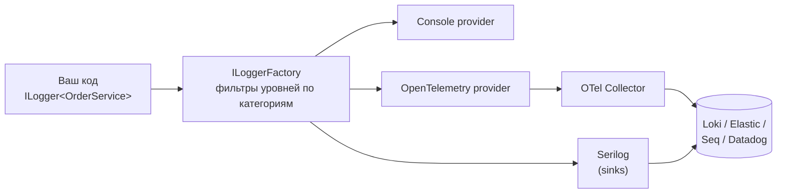
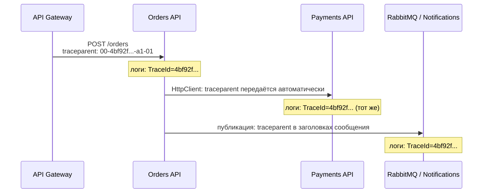

:::tldr
- **`ILogger<T>`** — абстракция логирования .NET; реализации (провайдеры) подключаются отдельно: Console, Debug, EventSource, OpenTelemetry, Serilog, NLog.
- **Структурное логирование**: шаблон сообщения с **именованными параметрами** `"Order {OrderId} placed"` — параметры сохраняются как **поля**, по которым можно искать и агрегировать (Seq, Elasticsearch, Loki). **Не используйте интерполяцию** `$"..."` в логах.
- **Уровни**: Trace, Debug, Information, Warning, Error, Critical; фильтрация по категориям в конфигурации.
- **Scopes** (`BeginScope`) добавляют контекст ко всем записям внутри: `CorrelationId`, `UserId`, `OrderId`.
- **Correlation ID / TraceId** связывает все логи одного запроса — внутри сервиса и между сервисами (W3C Trace Context `traceparent`). В .NET источник — `Activity.Current`.
- Для горячих путей — **`[LoggerMessage]`** source generator: без boxing и парсинга шаблона.
:::

## Структурное логирование

```csharp
// ПЛОХО: интерполяция — в хранилище попадёт просто строка
_logger.LogInformation($"Order {order.Id} placed by {user.Id} for {order.Total}");

// ХОРОШО: шаблон + параметры
_logger.LogInformation("Order {OrderId} placed by {UserId} for {Total}", order.Id, user.Id, order.Total);
```

```json Во что превращается запись (JSON-вывод)
{
  "@t": "2025-09-30T10:15:22.123Z",
  "@l": "Information",
  "@mt": "Order {OrderId} placed by {UserId} for {Total}",
  "OrderId": 1042,
  "UserId": "7f3a",
  "Total": 259000.0,
  "SourceContext": "Shop.Orders.OrderService",
  "TraceId": "4bf92f3577b34da6a3ce929d0e0e4736",
  "SpanId": "00f067aa0ba902b7"
}
```

Теперь можно найти все заказы пользователя (`UserId = "7f3a"`), построить график сумм или сгруппировать ошибки по шаблону `@mt` — независимо от конкретных значений.

:::warning Почему интерполяция вредна
1. Теряются поля — остаётся только текст, поиск только полнотекстовый.
2. Каждое сообщение уникально — нельзя сгруппировать «одинаковые» события.
3. Строка формируется **всегда**, даже если уровень Debug выключен — лишние аллокации.
:::

## Архитектура логирования в .NET



```json Фильтрация по категориям
{
  "Logging": {
    "LogLevel": {
      "Default": "Information",
      "Microsoft.AspNetCore": "Warning",
      "Microsoft.EntityFrameworkCore.Database.Command": "Information",
      "Shop.Payments": "Debug"
    }
  }
}
```

Категория = полное имя типа из `ILogger<T>`; правило для самого длинного совпадающего префикса выигрывает.

## Уровни

| Уровень | Когда использовать | В продакшене |
|---|---|---|
| Trace | Максимальные детали, данные | Выключен |
| Debug | Диагностика при разработке | Выключен (включать точечно) |
| **Information** | Бизнес-события: заказ создан, пользователь вошёл | Включён |
| **Warning** | Нештатно, но обработано: ретрай, деградация, валидация | Включён |
| **Error** | Операция не выполнена: исключение, отказ зависимости | Включён + алерты |
| Critical | Приложение не может работать: нет БД, нехватка диска | Алерт немедленно |

## Serilog

```csharp
builder.Host.UseSerilog((ctx, services, cfg) => cfg
    .ReadFrom.Configuration(ctx.Configuration)
    .ReadFrom.Services(services)
    .Enrich.FromLogContext()                        // свойства из BeginScope / LogContext
    .Enrich.WithProperty("Service", "orders-api")
    .Enrich.WithMachineName()
    .WriteTo.Console(new CompactJsonFormatter())    // JSON в stdout — стандарт для контейнеров
    .WriteTo.Seq("http://seq:5341"));

app.UseSerilogRequestLogging();   // одна сводная запись на запрос вместо нескольких от ASP.NET Core
```

Serilog даёт богатую экосистему **sinks** (Seq, Elasticsearch, Loki, файлы), **enrichers**, деструктуризацию объектов (`{@Order}` — объект целиком как структура, `{$Order}` — как строка).

## Scopes и Correlation ID

```csharp
using (_logger.BeginScope(new Dictionary<string, object> { ["OrderId"] = order.Id, ["CustomerId"] = order.CustomerId }))
{
    _logger.LogInformation("Резервирование товара");
    await _stock.ReserveAsync(order, ct);
    _logger.LogInformation("Оплата");            // обе записи содержат OrderId и CustomerId
    await _payments.ChargeAsync(order, ct);
}
```

### Как связать логи между сервисами



В современном .NET отдельный «CorrelationId» часто не нужен: ASP.NET Core создаёт `Activity` для каждого запроса по стандарту **W3C Trace Context**, `HttpClient` передаёт заголовок `traceparent` дальше, а провайдеры логирования добавляют `TraceId`/`SpanId` к записям. Остаётся только отдать `TraceId` клиенту — например, в `ProblemDetails.Extensions["traceId"]` — чтобы по обращению в поддержку найти все логи.

## Высокопроизводительное логирование

```csharp
public static partial class OrderLog
{
    [LoggerMessage(EventId = 1001, Level = LogLevel.Information, Message = "Order {OrderId} placed for {Total}")]
    public static partial void OrderPlaced(this ILogger logger, int orderId, decimal total);

    [LoggerMessage(EventId = 1002, Level = LogLevel.Warning, Message = "Payment retry {Attempt} for order {OrderId}")]
    public static partial void PaymentRetry(this ILogger logger, int attempt, int orderId);
}

_logger.OrderPlaced(order.Id, order.Total);
```

Генератор создаёт код с проверкой `IsEnabled`, без `params object[]` и boxing значимых типов, с заранее разобранным шаблоном.

## Что нельзя логировать

- Пароли, токены, ключи API, полные номера карт, CVV.
- Персональные данные сверх необходимого (паспорт, телефоны, адреса) — требования законов о персональных данных.
- Целиком тела запросов/ответов в продакшене.

Используйте маскирование (атрибуты + enricher/redaction — пакет `Microsoft.Extensions.Compliance.Redaction`), логируйте идентификаторы вместо объектов.

## Типичные ошибки

- `catch (Exception ex) { _logger.LogError(ex.Message); }` — теряется стек и тип. Правильно: `_logger.LogError(ex, "Не удалось оплатить заказ {OrderId}", id);`.
- Логировать и пробрасывать одно и то же исключение на каждом уровне — одна ошибка превращается в 5 записей.
- Логирование в цикле на уровне Information по каждому элементу — миллионы записей и счёт за хранилище.
- Синхронная запись в файл/сеть в горячем пути — используйте асинхронные/буферизованные sinks.

## Вопросы на засыпку

:::qa Чем Serilog лучше встроенного логирования?
Встроенный `ILogger` — абстракция; Serilog — реализация с богатыми возможностями: множество sinks, enrichers, деструктуризация объектов, гибкая конфигурация. Код приложения по-прежнему пишет в `ILogger<T>`, Serilog подключается как провайдер. В cloud-native сценариях многие выбирают OpenTelemetry-провайдер и Collector.
:::

:::qa Что такое {@Object} в шаблоне Serilog?
Оператор деструктуризации: объект сохраняется как структура с полями, а не как результат `ToString()`. Осторожно — может попасть лишнее (пароли) и большие графы объектов.
:::

:::qa Как менять уровень логирования без перезапуска?
`appsettings.json` с `reloadOnChange` (по умолчанию) — встроенное логирование подхватит изменения. В Serilog — `LoggingLevelSwitch` или `ReadFrom.Configuration` с перезагрузкой. В Kubernetes — через обновление ConfigMap, смонтированного как файл.
:::

:::qa Почему логи в контейнере пишут в stdout?
Принцип 12-factor: приложение не управляет маршрутизацией логов. Среда выполнения (Docker, Kubernetes) собирает stdout, агенты (Fluent Bit, Promtail, OTel Collector) отправляют в хранилище. Нет проблем с ротацией файлов и дисками контейнеров.
:::

## Итог

Логи — это данные, а не текст: пишите структурно через шаблоны, обогащайте контекстом через scopes, связывайте запросы через TraceId и не логируйте секреты. `ILogger<T>` в коде, Serilog или OpenTelemetry — как реализация, `[LoggerMessage]` — для горячих путей.
