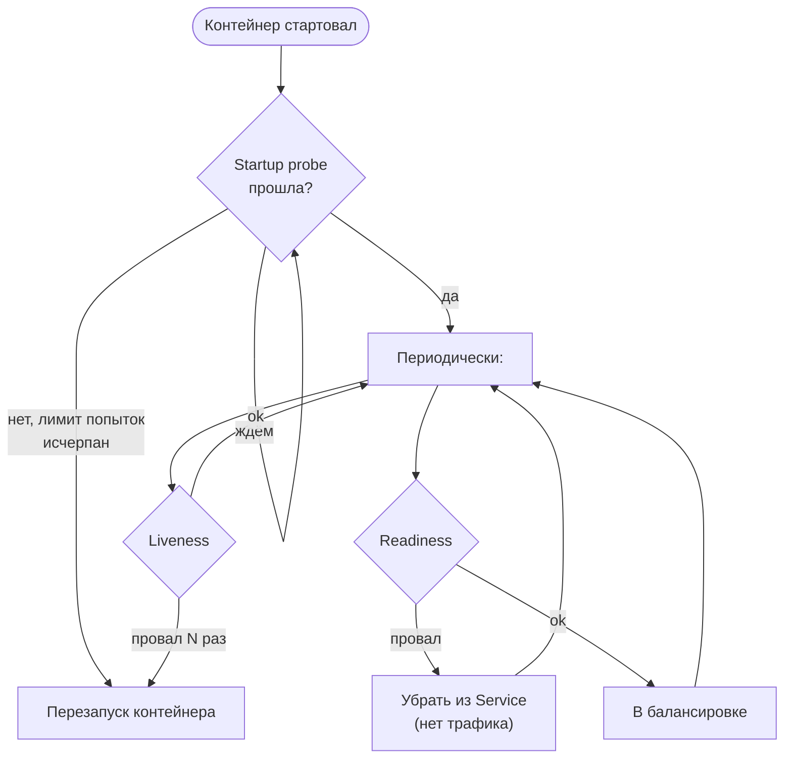
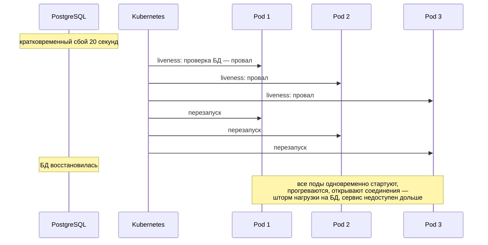

:::tldr
- **Health checks** — эндпоинты, по которым оркестратор, балансировщик или мониторинг узнают состояние сервиса. В ASP.NET Core: `AddHealthChecks()` + `MapHealthChecks("/health")`, статусы **Healthy / Degraded / Unhealthy**.
- **Liveness** — «процесс жив и не завис?». Провал → Kubernetes **перезапускает** контейнер. Проверка должна быть **лёгкой** и **не зависеть от внешних систем**.
- **Readiness** — «готов принимать трафик?». Провал → pod **убирается из балансировки**, но не перезапускается. Здесь проверяют БД, кэш, прогрев.
- **Startup probe** — для медленного старта: пока не пройдена, liveness/readiness не выполняются.
- Главная ошибка: проверять БД в liveness — при сбое БД Kubernetes перезапустит **все** поды, превратив частичный отказ в полный.
:::

## Три вида проб



| Проба | Вопрос | Реакция на провал | Что проверять |
|---|---|---|---|
| **Startup** | Приложение закончило запуск? | Перезапуск после `failureThreshold` | Прогрев, миграции, загрузка кэша |
| **Liveness** | Процесс не завис? | **Перезапуск** контейнера | Только сам процесс: отвечает ли, нет ли deadlock |
| **Readiness** | Можно слать трафик? | Исключение из балансировки | Зависимости, без которых запросы точно упадут; перегрузка; shutdown |

## Настройка в ASP.NET Core

```csharp
builder.Services.AddHealthChecks()
    // liveness: только «я жив»
    .AddCheck("self", () => HealthCheckResult.Healthy(), tags: ["live"])
    // readiness: зависимости (пакеты AspNetCore.HealthChecks.*)
    .AddNpgSql(builder.Configuration.GetConnectionString("Default")!, name: "postgres", tags: ["ready"], timeout: TimeSpan.FromSeconds(3))
    .AddRedis(builder.Configuration["Redis:Connection"]!, name: "redis", tags: ["ready"], failureStatus: HealthStatus.Degraded)
    .AddCheck<CacheWarmupHealthCheck>("warmup", tags: ["ready", "startup"]);

var app = builder.Build();

app.MapHealthChecks("/health/live",  new HealthCheckOptions { Predicate = c => c.Tags.Contains("live") });
app.MapHealthChecks("/health/ready", new HealthCheckOptions
{
    Predicate = c => c.Tags.Contains("ready"),
    ResponseWriter = UIResponseWriter.WriteHealthCheckUIResponse     // подробный JSON (пакет HealthChecks.UI.Client)
});
app.MapHealthChecks("/health/startup", new HealthCheckOptions { Predicate = c => c.Tags.Contains("startup") });
```

```csharp Собственная проверка
public sealed class CacheWarmupHealthCheck(CatalogCache cache) : IHealthCheck
{
    public Task<HealthCheckResult> CheckHealthAsync(HealthCheckContext context, CancellationToken ct = default) =>
        Task.FromResult(cache.IsWarmedUp
            ? HealthCheckResult.Healthy("Кэш каталога загружен")
            : HealthCheckResult.Unhealthy("Кэш каталога ещё загружается"));
}
```

Статусы: `Healthy` → HTTP 200, `Degraded` → 200 (по умолчанию), `Unhealthy` → 503. `failureStatus: Degraded` для некритичной зависимости (Redis-кэш): сервис работает медленнее, но работает.

## Конфигурация Kubernetes

```yaml deployment.yaml (фрагмент)
containers:
  - name: orders-api
    image: registry.example.com/orders-api:1.4.2
    ports: [{ containerPort: 8080 }]
    startupProbe:
      httpGet: { path: /health/startup, port: 8080 }
      periodSeconds: 5
      failureThreshold: 30          # до 150 секунд на старт
    livenessProbe:
      httpGet: { path: /health/live, port: 8080 }
      periodSeconds: 10
      timeoutSeconds: 2
      failureThreshold: 3           # перезапуск после ~30 секунд зависания
    readinessProbe:
      httpGet: { path: /health/ready, port: 8080 }
      periodSeconds: 5
      timeoutSeconds: 3
      failureThreshold: 2
```

## Почему нельзя проверять БД в liveness



Перезапуск контейнера **не лечит** недоступную базу. Правильно: БД — в readiness (или вообще не в пробах, если сервис умеет частично работать без неё), liveness — только признаки зависания самого процесса.

:::tip Readiness при graceful shutdown
При получении SIGTERM приложение может перевести readiness в Unhealthy, чтобы балансировщик перестал слать новые запросы, пока текущие завершаются. `IHostApplicationLifetime.ApplicationStopping` — удобная точка для этого.
:::

## Защита и производительность

- Health-эндпоинты не должны раскрывать внутренности наружу: детальный ответ — только для внутренней сети (`RequireHost("*:8081")`, отдельный порт) или с авторизацией.
- Проверки должны быть **быстрыми** и с **таймаутом** — проба с таймаутом 2 с, а проверка БД висит 30 с → ложные провалы.
- Дорогие проверки можно кэшировать (`HealthCheckPublisherOptions`, собственный кэш результата) — пробы вызываются часто и со всех узлов.
- **Health Check Publisher** (`IHealthCheckPublisher`) периодически публикует результаты в мониторинг (Prometheus, Application Insights).

## Вопросы на засыпку

:::qa Чем readiness отличается от startup probe?
Startup выполняется только до первого успеха и защищает медленно стартующее приложение от преждевременных liveness-перезапусков. Readiness выполняется всё время жизни и может многократно переключаться между «готов» и «не готов».
:::

:::qa Что вернуть в readiness, если одна из трёх зависимостей недоступна?
Зависит от того, может ли сервис обслуживать запросы. Если без неё не работает ничего — Unhealthy. Если страдает только часть функций — Degraded/Healthy, а отказ обрабатывается в коде (Circuit Breaker, fallback). Readiness = «слать ли сюда трафик вообще».
:::

:::qa Нужны ли health checks вне Kubernetes?
Да: балансировщики (Nginx, HAProxy, облачные LB), Docker (`HEALTHCHECK`), мониторинг (uptime-проверки), Azure App Service — все используют их для маршрутизации и алертов.
:::

:::qa Как проверить, что процесс «завис», если он отвечает на HTTP?
Например, проверять, что фоновый обработчик очереди делал итерацию недавно (heartbeat-метка времени), или что пул потоков не голодает. Ответ на HTTP — минимальная liveness; зависшие фоновые компоненты требуют собственных проверок.
:::

## Итог

Liveness отвечает «жив ли процесс» и должна быть максимально простой, readiness — «можно ли слать трафик» и проверяет критичные зависимости, startup — защищает медленный старт. Разделяйте их через теги и отдельные эндпоинты и никогда не завязывайте liveness на внешние системы.
