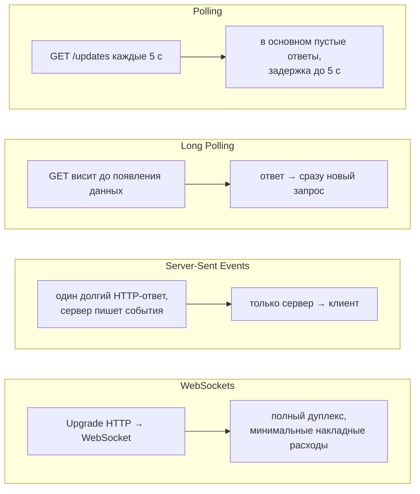
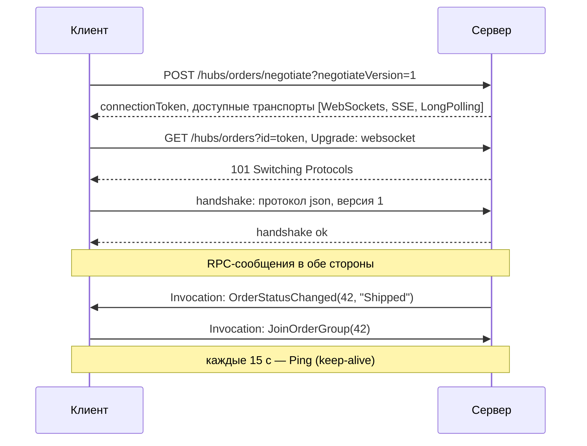
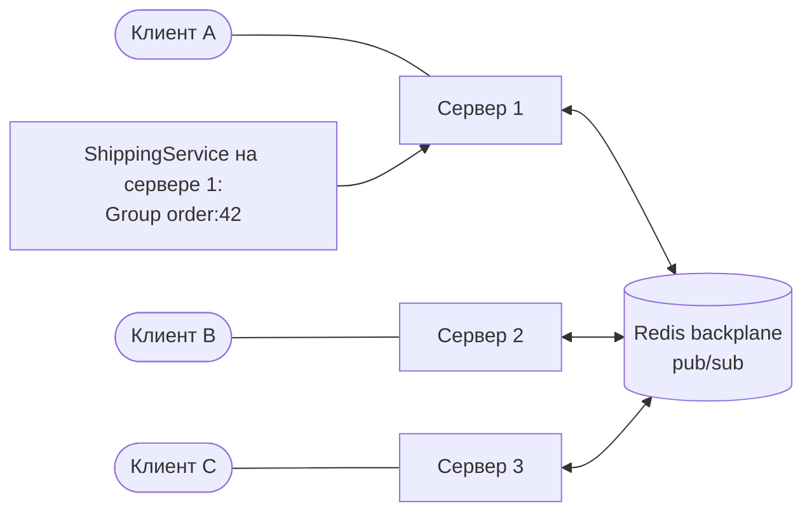

:::tldr
- **SignalR** — библиотека для **двусторонней связи в реальном времени** между сервером и клиентами (браузер, .NET, Java, Swift). Абстрагирует транспорт и даёт RPC-модель: сервер вызывает методы клиента, клиент — методы **хаба**.
- **Транспорты** (выбираются автоматически, по убыванию предпочтения): **WebSockets** (полноценный дуплекс) → **Server-Sent Events** (сервер → клиент по HTTP, клиент → сервер отдельными запросами) → **Long Polling** (клиент держит запрос, сервер отвечает при появлении данных).
- Подключение начинается с **negotiate**-запроса, затем устанавливается транспорт. Протоколы сообщений: JSON или MessagePack.
- Адресация: `Clients.All`, `Clients.User(id)`, `Clients.Group(name)`, `Clients.Caller/Others`.
- При нескольких серверах нужен **backplane** (Redis) или **Azure SignalR Service**, иначе сообщение дойдёт только клиентам своего экземпляра. Без backplane также нужны **sticky sessions** (кроме чистого WebSockets с пропуском negotiate).
:::

## Зачем нужен SignalR

HTTP построен на модели «запрос → ответ»: сервер не может сам отправить данные клиенту. Для чатов, уведомлений, дашбордов, совместного редактирования, статусов заказов нужен **push** от сервера.



| Транспорт | Направление | Накладные расходы | Поддержка |
|---|---|---|---|
| WebSockets | Двустороннее | Минимальные (фреймы по 2–14 байт заголовка) | Все современные браузеры; прокси должен поддерживать Upgrade |
| Server-Sent Events | Сервер → клиент | Низкие | Все браузеры (кроме старых IE) |
| Long Polling | Имитация двустороннего | Высокие (новый HTTP-запрос на каждую порцию) | Везде |

## Как устанавливается соединение



Если WebSocket не удался (прокси режет Upgrade, корпоративный firewall), клиент автоматически пробует SSE, затем Long Polling.

## Сервер: хаб

```csharp
public interface IOrderClient                       // строго типизированный клиент
{
    Task OrderStatusChanged(int orderId, string status);
    Task Notification(string message);
}

[Authorize]
public sealed class OrdersHub(IOrderService orders) : Hub<IOrderClient>
{
    public override async Task OnConnectedAsync()
    {
        var userId = Context.UserIdentifier;        // из claim NameIdentifier
        await Groups.AddToGroupAsync(Context.ConnectionId, $"user:{userId}");
        await base.OnConnectedAsync();
    }

    public async Task SubscribeToOrder(int orderId)             // клиент вызывает этот метод
    {
        if (!await orders.BelongsToUserAsync(orderId, Context.UserIdentifier!))
            throw new HubException("Нет доступа к заказу");
        await Groups.AddToGroupAsync(Context.ConnectionId, $"order:{orderId}");
    }
}

builder.Services.AddSignalR().AddMessagePackProtocol();
app.MapHub<OrdersHub>("/hubs/orders");
```

### Отправка из любого места приложения

```csharp
public sealed class ShippingService(IHubContext<OrdersHub, IOrderClient> hub)
{
    public async Task MarkShippedAsync(int orderId, CancellationToken ct)
    {
        // ... изменение в БД
        await hub.Clients.Group($"order:{orderId}").OrderStatusChanged(orderId, "Shipped");
    }
}
```

:::warning Хаб — transient
Экземпляр хаба создаётся **на каждый вызов метода** и сразу уничтожается. Не храните в полях хаба состояние между вызовами. Для отправки сообщений вне вызова (фоновые задачи, сервисы) используйте `IHubContext<THub>`.
:::

## Клиент (JavaScript)

```javascript
import * as signalR from "@microsoft/signalr";

const connection = new signalR.HubConnectionBuilder()
  .withUrl("/hubs/orders", { accessTokenFactory: () => getAccessToken() })
  .withAutomaticReconnect([0, 2000, 10000, 30000])   // задержки переподключения
  .build();

connection.on("OrderStatusChanged", (orderId, status) => updateUi(orderId, status));
connection.onreconnected(() => connection.invoke("SubscribeToOrder", currentOrderId)); // группы теряются!

await connection.start();
await connection.invoke("SubscribeToOrder", 42);
```

WebSocket API браузера не позволяет установить заголовок `Authorization`, поэтому токен передаётся в query-параметре `access_token`; на сервере его нужно забрать в `JwtBearerEvents.OnMessageReceived` для путей хаба.

## Масштабирование



- Соединение живёт на **одном** сервере. Без backplane `Clients.Group("order:42")` на сервере 1 не достанет клиента на сервере 2.
- **Redis backplane**: `AddSignalR().AddStackExchangeRedis(conn)` — все серверы обмениваются сообщениями через pub/sub.
- **Azure SignalR Service**: управляемый сервис держит все клиентские соединения сам, серверы приложения лишь отправляют ему сообщения — масштабирование до сотен тысяч соединений.
- **Sticky sessions**: при negotiate + SSE/Long Polling последующие запросы должны попадать на тот же сервер. С WebSockets и `skipNegotiation: true` не нужны.

## Практические советы

- Не отправляйте большие объекты — передавайте событие + ID, клиент подгрузит данные через обычный API.
- Группы **не сохраняются** при переподключении — клиент должен снова подписаться.
- Доставка **не гарантирована**: во время разрыва сообщения теряются. Для критичных данных — хранить состояние на сервере и синхронизировать после переподключения.
- Длинные соединения потребляют ресурсы: следите за числом соединений, `MaximumReceiveMessageSize`, таймаутами.
- Стриминг: метод хаба может возвращать `IAsyncEnumerable<T>` или `ChannelReader<T>` — клиент получает поток значений.

## Вопросы на засыпку

:::qa Чем SignalR отличается от «голых» WebSockets?
WebSocket — транспорт: поток фреймов без структуры. SignalR добавляет RPC-протокол, автоматический выбор транспорта и fallback, переподключение, группы и адресацию пользователей, аутентификацию, масштабирование через backplane. Цена — собственный протокол (нужен клиент SignalR).
:::

:::qa Когда хватит Server-Sent Events без SignalR?
Когда нужен только поток событий от сервера к клиенту (уведомления, прогресс, ленты), а клиент отправляет редкие обычные HTTP-запросы. В .NET 10 есть `TypedResults.ServerSentEvents(IAsyncEnumerable<T>)`. SSE работает поверх обычного HTTP, проще проходит через прокси.
:::

:::qa Как отправить сообщение конкретному пользователю на всех его устройствах?
`Clients.User(userId)` — SignalR сопоставляет пользователя со всеми его соединениями через `IUserIdProvider` (по умолчанию claim `NameIdentifier`).
:::

:::qa Что будет, если клиент не отвечает?
Сервер отправляет ping каждые `KeepAliveInterval` (15 с); если от клиента нет сообщений в течение `ClientTimeoutInterval` (30 с), соединение считается разорванным и вызывается `OnDisconnectedAsync`.
:::

## Итог

SignalR даёт push-коммуникацию в реальном времени с автоматическим выбором транспорта (WebSockets → SSE → Long Polling), RPC-моделью хабов, группами и адресацией пользователей. При горизонтальном масштабировании обязательно нужен backplane или Azure SignalR Service, а доставку критичных данных нужно подстраховывать синхронизацией состояния.
